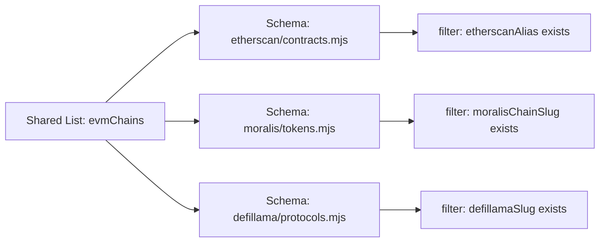
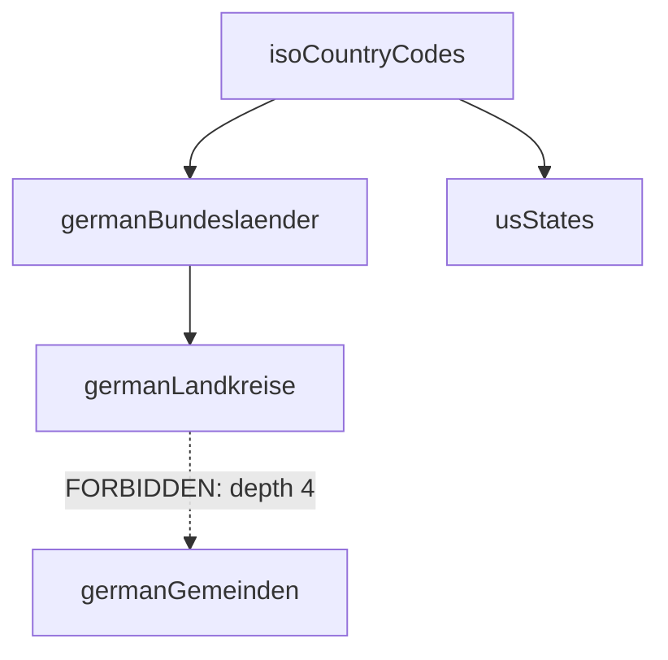
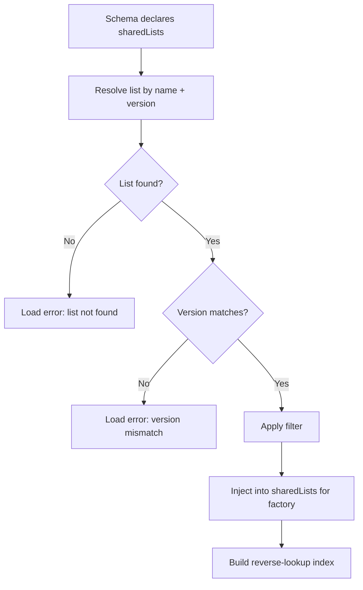

> Normative language (MUST/SHOULD/MAY) follows the conventions defined in [Conformance Language](/specification/overview/#conformance-language).

Shared lists eliminate duplication of common value sets across schemas. Instead of every Etherscan schema maintaining its own chain list, they reference a single `evmChains` shared list. This document defines the list format, field definitions, dependency model, schema referencing, runtime injection, and validation rules.

---

## Purpose

Many schemas across different providers need the same sets of values — EVM chain identifiers, fiat currency codes, token standards, country codes. Without shared lists, each schema duplicates these values inline, leading to:

- **Inconsistency** — one schema uses `'eth'`, another uses `'ETH'`, a third uses `'ethereum'`
- **Maintenance burden** — adding a new chain means updating dozens of schemas
- **No single source of truth** — no way to verify which values are canonical

Shared lists solve this by providing versioned, validated, centrally maintained value sets that schemas reference by name.



The diagram shows how a single shared list feeds multiple schemas, each applying its own filter to extract only the entries relevant to that provider.

---

## List Definition Format

A shared list is a `.mjs` file that exports a `list` object with two top-level keys: `meta` and `entries`.

```javascript
export const list = {
    meta: {
        name: 'evmChains',
        version: '1.0.0',
        description: 'Unified EVM chain registry with provider-specific aliases',
        fields: [
            { key: 'alias', type: 'string', description: 'Canonical chain alias' },
            { key: 'chainId', type: 'number', description: 'EVM chain ID' },
            { key: 'etherscanAlias', type: 'string', optional: true, description: 'Etherscan API chain parameter' },
            { key: 'moralisChainSlug', type: 'string', optional: true, description: 'Moralis chain slug' },
            { key: 'defillamaSlug', type: 'string', optional: true, description: 'DeFi Llama chain identifier' }
        ],
        dependsOn: []
    },
    entries: [
        {
            alias: 'ETHEREUM_MAINNET',
            chainId: 1,
            etherscanAlias: 'ETH',
            moralisChainSlug: 'eth',
            defillamaSlug: 'Ethereum'
        },
        {
            alias: 'POLYGON_MAINNET',
            chainId: 137,
            etherscanAlias: 'POLYGON',
            moralisChainSlug: 'polygon',
            defillamaSlug: 'Polygon'
        }
    ]
}
```

The file MUST export exactly one `list` constant. No other exports are permitted. The file MUST NOT contain imports, function definitions, or dynamic expressions.

---

## Meta Block

The `meta` block describes the list identity and structure.

| Field | Type | Required | Description |
|-------|------|----------|-------------|
| `name` | `string` | Yes | Unique list identifier (camelCase) |
| `version` | `string` | Yes | Semver version |
| `description` | `string` | Yes | What this list contains |
| `fields` | `array` | Yes | Field definitions for entries |
| `dependsOn` | `array` | No | Dependencies on other lists |

### Naming Convention

List names use camelCase and MUST be globally unique across the entire list registry. The name SHOULD describe the collection, not a single entry:

- `evmChains` (not `evmChain`)
- `fiatCurrencies` (not `fiatCurrency`)
- `isoCountryCodes` (not `countryCode`)

### Versioning

Lists follow strict semver. A version bump is required when:

- **Patch** (`1.0.1`) — correcting a typo in an existing entry, fixing a wrong `chainId`
- **Minor** (`1.1.0`) — adding new entries, adding new optional fields
- **Major** (`2.0.0`) — removing entries, removing fields, renaming fields, changing field types

Schemas pin to a specific version. If a list bumps its major version, all referencing schemas MUST update their `version` field in the `sharedLists` reference.

---

## Field Definition

Each entry in `meta.fields` describes one field that entries can or MUST contain.

| Field | Type | Required | Description |
|-------|------|----------|-------------|
| `key` | `string` | Yes | Field name |
| `type` | `string` | Yes | `string`, `number`, `boolean` |
| `description` | `string` | Yes | What this field represents |
| `optional` | `boolean` | No | If `true`, entries MAY omit this field |

### Type Constraints

Only three primitive types are supported:

| Type | JavaScript equivalent | Example values |
|------|----------------------|----------------|
| `string` | `typeof x === 'string'` | `'ETH'`, `'Ethereum'`, `'0x1'` |
| `number` | `typeof x === 'number'` | `1`, `137`, `42161` |
| `boolean` | `typeof x === 'boolean'` | `true`, `false` |

Complex types (objects, arrays, nested structures) are not supported in shared list entries. Lists are flat by design — each entry is a single-level key-value map.

### Required vs Optional Fields

Fields without `optional: true` are required. Every entry MUST include all required fields. Optional fields MAY be omitted entirely or set to `null`. This distinction is what enables provider-specific columns — `etherscanAlias` is optional because not every chain has an Etherscan explorer.

---

## Dependencies Between Lists

Lists can declare dependencies on other lists using `meta.dependsOn`. This enables hierarchical data sets where child lists reference parent lists.

```javascript
export const list = {
    meta: {
        name: 'germanBundeslaender',
        version: '1.0.0',
        description: 'German federal states',
        fields: [
            { key: 'name', type: 'string', description: 'State name' },
            { key: 'code', type: 'string', description: 'State code' },
            { key: 'countryRef', type: 'string', description: 'Reference to parent country' }
        ],
        dependsOn: [
            {
                ref: 'isoCountryCodes',
                version: '1.0.0',
                condition: { field: 'alpha2', value: 'DE' }
            }
        ]
    },
    entries: [
        { name: 'Bayern', code: 'BY', countryRef: 'DE' },
        { name: 'Berlin', code: 'BE', countryRef: 'DE' },
        { name: 'Hamburg', code: 'HH', countryRef: 'DE' }
    ]
}
```

### Dependency Object

| Field | Type | Required | Description |
|-------|------|----------|-------------|
| `ref` | `string` | Yes | Name of the parent list |
| `version` | `string` | Yes | Required version of the parent list |
| `condition` | `object` | No | Filter condition on the parent list |

### Dependency Rules

1. **`ref` must resolve** — the referenced list name MUST exist in the list registry
2. **Version pinning** — `version` pins the dependency to a specific semver version; the runtime rejects mismatches
3. **`condition` is optional** — when present, it filters the parent list to a subset; when absent, the full parent list is available
4. **No circular dependencies** — if list A depends on list B, then list B MUST NOT depend on list A (directly or transitively)
5. **Maximum depth: 3 levels** — a list can depend on a list that depends on another list, but no deeper; this prevents resolution complexity and keeps the dependency graph shallow



The diagram shows valid dependency chains up to depth 3, and a forbidden depth-4 dependency.

### Condition Format

The `condition` object supports a single equality check:

| Field | Type | Description |
|-------|------|-------------|
| `field` | `string` | Field name in the parent list to check |
| `value` | `string` or `number` or `boolean` | Expected value |

The condition acts as a semantic assertion: "this child list only makes sense when the parent list contains an entry matching this condition." The runtime verifies the condition at load-time — if the parent list has no entry where `field === value`, the dependency is unresolvable and the load fails.

---

## Referencing from Schemas

Schemas reference shared lists in the `main.sharedLists` array. This declares which lists the schema needs at runtime.

```javascript
main: {
    sharedLists: [
        {
            ref: 'evmChains',
            version: '1.0.0',
            filter: {
                key: 'etherscanAlias',
                exists: true
            }
        }
    ]
}
```

### Reference Fields

| Field | Type | Required | Description |
|-------|------|----------|-------------|
| `ref` | `string` | Yes | List name to reference |
| `version` | `string` | Yes | Required list version |
| `filter` | `object` | No | Filter entries before injection |

A schema MAY reference multiple shared lists. Each reference is resolved independently.

### Filter Types

Filters reduce the list to only the entries relevant to the schema. Three filter types are supported:

| Filter | Description | Example |
|--------|-------------|---------|
| `{ key, exists: true }` | Only entries where field exists and is not `null` | `{ key: 'etherscanAlias', exists: true }` |
| `{ key, value }` | Only entries where field equals value | `{ key: 'mainnet', value: true }` |
| `{ key, in: [...] }` | Only entries where field is in the provided list | `{ key: 'chainId', in: [1, 137, 42161] }` |

#### Exists Filter

The `exists` filter selects entries where the specified field is present and not `null`. This is the most common filter type — it selects all entries that have a provider-specific alias.

```javascript
filter: { key: 'etherscanAlias', exists: true }
// Selects: { alias: 'ETHEREUM_MAINNET', etherscanAlias: 'ETH', ... }
// Rejects: { alias: 'SOLANA_MAINNET', etherscanAlias: null, ... }
```

#### Value Filter

The `value` filter selects entries where the specified field equals an exact value.

```javascript
filter: { key: 'mainnet', value: true }
// Selects: { alias: 'ETHEREUM_MAINNET', mainnet: true, ... }
// Rejects: { alias: 'GOERLI_TESTNET', mainnet: false, ... }
```

#### In Filter

The `in` filter selects entries where the specified field matches any value in the provided array.

```javascript
filter: { key: 'chainId', in: [1, 137, 42161] }
// Selects: entries with chainId 1, 137, or 42161
// Rejects: all other chainIds
```

### No Filter

When `filter` is omitted, all entries from the list are injected. This is appropriate when the schema needs the complete list.

---

## Runtime Injection

At load-time, the core runtime resolves shared list references and injects them into the `handlers` factory function as the `sharedLists` parameter.

### Resolution Lifecycle



The diagram shows the resolution pipeline from schema declaration through list lookup, version verification, filtering, and injection.

### Step 1: Resolve

The runtime looks up each `ref` in the list registry. If the list does not exist, the schema fails to load with an error.

### Step 2: Version Check

The runtime verifies that the registry version matches the schema's declared `version`. A mismatch is a hard error — the schema MUST be updated to reference the correct version.

### Step 3: Filter

If a `filter` is declared, the runtime applies it to the list's `entries` array, producing a subset. If no filter is declared, all entries are passed through.

### Step 4: Inject

The filtered entries are collected and passed to the `handlers` factory function as `sharedLists`:

```javascript
// The runtime calls the factory with resolved lists
export const handlers = ( { sharedLists, libraries } ) => ({
    getGasOracle: {
        preRequest: async ( { struct, payload } ) => {
            // sharedLists.evmChains is available via closure
            const chain = sharedLists.evmChains
                .find( ( entry ) => {
                    const match = entry.etherscanAlias === payload.chainName

                    return match
                } )
            // ...
            return { struct, payload }
        }
    }
})
```

### Parameter Interpolation

Shared lists can be interpolated into parameter enum values using the `{{listName:fieldName}}` syntax:

```javascript
parameters: [
    {
        name: 'chain',
        type: 'string',
        description: 'Target blockchain',
        enum: '{{evmChains:etherscanAlias}}'
    }
]
```

At load-time, the runtime replaces `'{{evmChains:etherscanAlias}}'` with the array of `etherscanAlias` values from the filtered `evmChains` list — for example `['ETH', 'POLYGON', 'ARBITRUM']`. This ensures the parameter's enum values always match the shared list without manual synchronization.

---

## Alias-Mapping Pattern

Shared Lists connect two worlds:
- **User side**: readable aliases (e.g., `ethereum`, `polygon`, `bsc`)
- **Provider side**: API-specific field values (e.g., `eth`, `0x89`, `56`)

Schemas use Shared Lists not just for validation, but as a mapping layer:

```javascript
// Schema parameter (user side):
{ name: 'chain', type: 'string', enum: '{{evmChains:alias}}' }

// Handler (provider side):
preRequest: ({ struct, payload }) => {
    const chain = payload.userParams.chain
    const moralisSlug = struct.sharedLists.evmChains.find(e => e.alias === chain)?.moralisChainSlug

    return { ...payload, builtPayload: { chain: moralisSlug } }
}
```

**Important:** Schemas that hardcode enums instead of using Shared Lists with handler mapping fail at VAL107 (Error). The Alias-Mapping Pattern is the correct implementation.

### Why This Pattern Matters

Without Alias-Mapping, every provider maintains its own chain list with provider-specific values. An LLM using multiple providers MUST know that `ethereum` for CoinGecko means `eth` for Moralis, `ETH` for Etherscan, and `Ethereum` for DeFi Llama. This knowledge cannot be embedded reliably in tool descriptions.

With Alias-Mapping, every provider exposes the same canonical user-side alias (`ethereum`). The handler maps it to the provider-specific value at call time. The LLM only needs to know one alias per chain.

### Canonical Alias Convention

The `alias` field in a Shared List entry is the **canonical user-side value**. It is:

- Lowercase
- Human-readable (not a chain ID number)
- Stable across Shared List versions (never renamed without a major version bump)

All schemas in the community catalog MUST use the `alias` field as the user-facing enum value when referencing EVM chains.

---

## Reverse-Lookup Index

The core runtime builds a reverse index that maps each list and field combination to the schemas that reference it. This enables impact analysis when a list is updated.

### Index Structure

```
evmChains:etherscanAlias -> [
    'etherscan/contracts.mjs::getContractAbi',
    'etherscan/gas.mjs::getGasOracle'
]

evmChains:moralisChainSlug -> [
    'moralis/tokens.mjs::getTokenBalance',
    'moralis/nft.mjs::getNftsByWallet'
]

isoCountryCodes:alpha2 -> [
    'compliance/kyc.mjs::verifyIdentity'
]
```

### CLI Access

The reverse index is queryable via the CLI:

```bash
flowmcp list-refs evmChains
```

Output:

```
evmChains (v1.0.0) — 15 entries, 4 fields

Referenced by:
  etherscan/contracts.mjs::getContractAbi   (filter: etherscanAlias exists)
  etherscan/gas.mjs::getGasOracle           (filter: etherscanAlias exists)
  moralis/tokens.mjs::getTokenBalance       (filter: moralisChainSlug exists)
  defillama/protocols.mjs::getProtocolTvl   (filter: defillamaSlug exists)
```

This allows schema authors to understand the blast radius of a list change before publishing an update.

---

## List Registry

All shared lists are tracked in `_lists/_registry.json`. This file is auto-generated by the CLI and MUST NOT be edited manually.

```json
{
    "specVersion": "2.0.0",
    "lists": [
        {
            "name": "evmChains",
            "version": "1.0.0",
            "file": "_lists/evm-chains.mjs",
            "entryCount": 15,
            "hash": "sha256:def456..."
        }
    ]
}
```

### Registry Fields

| Field | Type | Description |
|-------|------|-------------|
| `specVersion` | `string` | FlowMCP specification version |
| `lists[].name` | `string` | List name (must match `meta.name` in the file) |
| `lists[].version` | `string` | List version (must match `meta.version` in the file) |
| `lists[].file` | `string` | Relative path to the `.mjs` file |
| `lists[].entryCount` | `number` | Number of entries (for quick reference) |
| `lists[].hash` | `string` | SHA-256 hash of the serialized list for integrity verification |

### Registry Invariants

- Every `.mjs` file in the `_lists/` directory MUST have a corresponding entry in `_registry.json`
- Every entry in `_registry.json` must point to an existing `.mjs` file
- The `hash` must match the current file content; a mismatch indicates an unregistered change
- The CLI command `flowmcp validate-lists` verifies all three invariants

---

## Validation Rules

The following rules are enforced when loading shared lists:

### 1. Unique Names

`meta.name` must be unique across all lists in the registry. Two lists with the same name but different versions are a version conflict error, not two separate lists.

### 2. Required Field Completeness

Every entry in `entries` must include all fields from `meta.fields` that do not have `optional: true`. Missing required fields are a validation error.

### 3. Optional Field Handling

Fields with `optional: true` may be omitted from an entry entirely, or MAY be set to `null`. Both representations are equivalent at runtime.

### 4. Type Matching

The value of each field in an entry MUST match the `type` declared in `meta.fields`. A `chainId` declared as `number` must be a number in every entry — string values like `'1'` are rejected.

### 5. Dependency Resolution

All entries in `meta.dependsOn` must resolve to existing lists with matching versions. The runtime validates dependencies before the list is made available.

### 6. No Version Conflicts

If two schemas reference the same list with different versions, this is a hard error. The schema author MUST reconcile the versions. The runtime does not support loading multiple versions of the same list simultaneously.

### 7. Security Scan Compliance

The list file MUST pass the security scan defined in `05-security.md`. Specifically:

- No `import` or `require` statements
- No function definitions or function expressions
- No dynamic expressions (`eval`, template literals with expressions, computed properties)
- No references to `process`, `fs`, `fetch`, or other runtime APIs
- The file MUST contain only static data: strings, numbers, booleans, arrays, and plain objects

---

## File Conventions

### Directory Structure

```
_lists/
    _registry.json
    evm-chains.mjs
    fiat-currencies.mjs
    iso-country-codes.mjs
    token-standards.mjs
```

### Naming

- File names use kebab-case: `evm-chains.mjs`
- List names use camelCase: `evmChains`
- The file name SHOULD be the kebab-case equivalent of the list name

### One List Per File

Each `.mjs` file contains exactly one shared list. Combining multiple lists in a single file is not supported.

## Related

- **Depends on:** [00-overview.md](/specification/overview/), [01-schema-format.md](/specification/schema-format/), [02-parameters.md](/specification/parameters/)
- **Related:** [15-catalog.md](/specification/catalog/), [16-id-schema.md](/specification/id-schema/), [09-validation-rules.md](/specification/validation-rules/)

