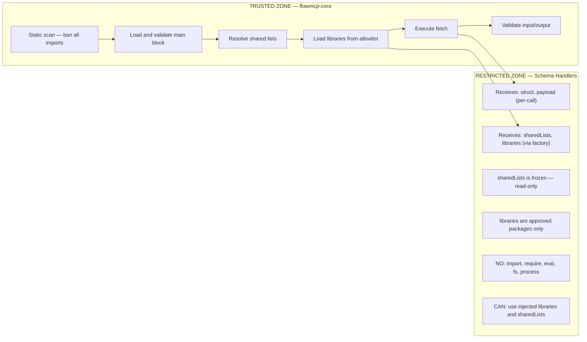
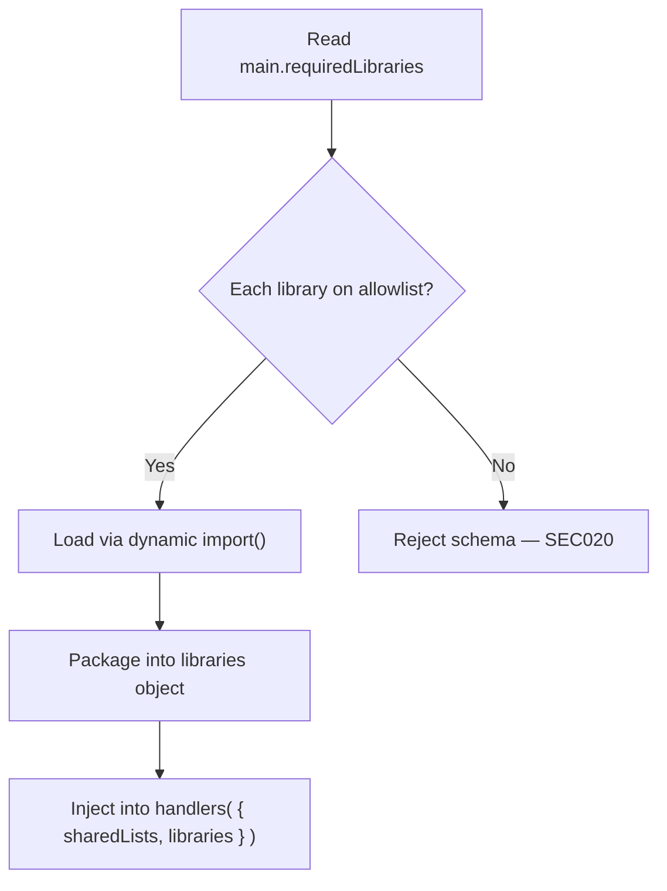
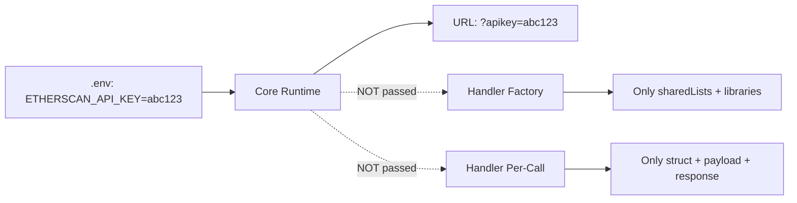

FlowMCP enforces a layered security model that prevents schema files from accessing the network, filesystem, or process environment. All potentially dangerous operations are restricted to the trusted core runtime. Dependencies are injected through a factory function pattern, and external libraries are gated by an allowlist.

---

## Trust Boundary

FlowMCP enforces a strict trust boundary between the core runtime and schema handlers:



**Trusted Zone (flowmcp-core):**
- Reads schema file as raw string and runs static security scan
- Loads and validates the `main` export (JSON-serializable, required fields, constraints)
- Resolves shared list references and deep-freezes the data
- Loads libraries from the allowlist and injects them into the factory function
- Executes HTTP fetch (handlers never fetch directly)
- Validates input parameters and output schema

**Restricted Zone (schema handlers):**
- Receives `sharedLists` and `libraries` through the factory function (once at load time)
- Receives `struct`, `payload`, and `response` per-call through handler parameters
- Transforms data (restructure, filter, compute)
- Returns modified data
- Cannot access network, filesystem, process, or global scope
- Cannot import or require any module

---

## Static Security Scan

Before a schema is loaded, the **raw file content** (as a string) is scanned for forbidden patterns. This happens before `import()` to prevent code execution.

Since all dependencies are injected through the factory function, schema files SHOULD have **zero import statements**. This makes the scan simpler and more restrictive than in previous versions.

### Forbidden Patterns (Entire File)

| Pattern | Reason |
|---------|--------|
| `import ` | No imports — all dependencies are injected |
| `require(` | No CommonJS imports |
| `eval(` | Code injection |
| `Function(` | Code injection |
| `new Function` | Code injection |
| `fs.` | Filesystem access |
| `node:fs` | Filesystem access |
| `fs/promises` | Filesystem access |
| `process.` | Process access |
| `child_process` | Shell execution |
| `globalThis.` | Global scope access |
| `global.` | Global scope access |
| `__dirname` | Path leaking |
| `__filename` | Path leaking |
| `setTimeout` | Async side effects |
| `setInterval` | Async side effects |

### Scan Implementation

The scan runs in four sequential steps before the schema file is dynamically imported:

```
1. Read file as raw string (before import)
2. Scan entire file for all forbidden patterns
3. If any pattern matches -> reject file with error message(s)
4. If clean -> proceed with dynamic import()
```

Because schema files have zero import statements and all dependencies are injected, there is no need to distinguish between "main block region" and "handler block region". The entire file is scanned uniformly against the same forbidden pattern list.

---

## Library Allowlist

The runtime maintains an allowlist of approved npm packages. Only packages on this list can be declared in `main.requiredLibraries` and injected into the `handlers()` factory function.

### Default Allowlist

The following packages are built into `flowmcp-core` as approved:

```javascript
const DEFAULT_ALLOWLIST = [
    'ethers',
    'moment',
    'indicatorts',
    '@erc725/erc725.js',
    'ccxt',
    'axios'
]
```

### User-Extended Allowlist

Users can extend the allowlist in their `.flowmcp/config.json`:

```json
{
    "security": {
        "allowedLibraries": [ "custom-lib", "another-lib" ]
    }
}
```

The effective allowlist is the union of the default allowlist and the user-extended allowlist.

### Library Loading Sequence

The runtime loads libraries through a strict sequence:



**Step-by-step:**

1. **Read `main.requiredLibraries`** — extract the list of declared packages.
2. **Check each against the allowlist** — every entry MUST appear in the default or user-extended allowlist.
3. **Reject unapproved libraries** — if any library is not on the allowlist, the schema is rejected with error code SEC020.
4. **Load approved libraries** — each approved library is loaded via dynamic `import()`.
5. **Package into `libraries` object** — loaded modules are keyed by package name.
6. **Inject into factory function** — the `libraries` object is passed to `handlers( { sharedLists, libraries } )`.

### Why an Allowlist

- **Prevents arbitrary code execution.** Without an allowlist, a schema could declare any npm package and execute arbitrary code through it.
- **Auditable.** The list of approved packages is explicit and reviewable.
- **Extensible.** Users can add packages they trust to their local configuration.
- **Fail-closed.** Unknown packages are rejected by default.

---

## Forbidden Patterns in Shared List Files

Shared list files have an **even stricter** scan. They must only export a plain data object:

| Allowed | Forbidden |
|---------|-----------|
| `export const list = { meta: {...}, entries: [...] }` | Any function definition |
| String/number/boolean/null values | `async`, `await`, `function`, `=>` |
| Arrays and objects | Any of the schema forbidden patterns |
| Comments (`//`, `/* */`) | Template literals with expressions |

Shared lists are pure data. They contain no logic, no transformations, and no computed values. The static scan enforces this by rejecting any file that contains function syntax or arrow expressions.

---

## Handler Security Constraints

Even after passing the static scan, handlers are constrained at runtime:

1. **No `fetch` access**: Handlers cannot call `fetch()`. The runtime executes fetch and passes the response to `postRequest`.
2. **No side effects**: Handlers receive data and return data. No logging, no file writes, no timers.
3. **`sharedLists` is read-only**: Shared list data is deep-frozen via `Object.freeze()`. Mutations throw a `TypeError`.
4. **`libraries` contains only allowlisted packages**: Even if a handler tries to access a non-injected package, it is not available in scope.
5. **Return value required**: Handlers MUST return the expected shape or the runtime throws.

### Handler Function Signatures

Handlers receive exactly the parameters they need. Per-call parameters are passed directly — no `userParams` or `context` wrapper:

```javascript
// preRequest — modify the request before fetch
preRequest: async ( { struct, payload } ) => {
    // struct: the request structure (url, headers, body)
    // payload: resolved route parameters
    // sharedLists + libraries: available via factory closure
    return { struct, payload }
}

// postRequest — transform the response after fetch
postRequest: async ( { response, struct, payload } ) => {
    // response: parsed JSON from the API
    // struct + payload: same as preRequest
    // sharedLists + libraries: available via factory closure
    return { response }
}
```

Handlers cannot:
- Call `fetch()` or any network function
- Access `process`, `global`, or `globalThis`
- Import or require other modules
- Create timers or async side effects
- Modify `sharedLists` (frozen)
- Access server parameters / API keys (injected by runtime into URL/headers only)

---

## API Key Protection

API keys are never exposed to handler code:



- `requiredServerParams` values are injected into URL/headers by the runtime
- The `handlers()` factory function receives `sharedLists` and `libraries` only — no server parameters
- Per-call handler parameters contain `struct`, `payload`, and `response` only — no server parameters
- Actual key values are substituted by the runtime during URL construction

### Key Injection Flow

```
1. Schema declares requiredServerParams: [ 'ETHERSCAN_API_KEY' ]
2. Runtime reads ETHERSCAN_API_KEY from .env
3. Parameter template: '{{SERVER_PARAM:ETHERSCAN_API_KEY}}'
4. Runtime substitutes into URL: 'https://api.etherscan.io/api?apikey=abc123'
5. Handler receives response — never sees the key value
6. Factory function receives sharedLists + libraries — never sees the key value
```

This ensures that even a compromised handler (one that somehow bypasses the static scan) cannot extract API keys from the execution context.

---

## Threat Model

| Threat | Mitigation |
|--------|------------|
| Schema imports a module | Static scan blocks `import`/`require` — schema files have zero imports |
| Schema requests unapproved library | Blocked by allowlist — SEC020 error, schema rejected |
| Schema reads filesystem | Static scan blocks `fs`, `node:fs`, `fs/promises` |
| Schema executes shell commands | Static scan blocks `child_process` |
| Schema accesses environment | Static scan blocks `process.` |
| Schema exfiltrates data via fetch | Handlers cannot call `fetch()` — runtime owns all network access |
| Schema modifies global state | Static scan blocks `globalThis`/`global.` |
| Handler mutates shared list data | `sharedLists` is deep-frozen — mutations throw `TypeError` |
| Handler accesses non-injected library | Not available in scope — only `libraries` object contents are accessible |
| Shared list contains executable code | Stricter scan blocks all functions, arrows, async/await |
| Schema leaks API keys | Keys injected by runtime into URL/headers, never passed to factory or handlers |
| Schema uses eval or Function constructor | Static scan blocks `eval(`, `Function(`, `new Function` |
| Schema creates async side effects | Static scan blocks `setTimeout`/`setInterval` |
| Schema accesses file paths | Static scan blocks `__dirname`/`__filename` |
| Schema declares library not on allowlist | Runtime rejects schema before loading handlers |
| Schema disguises import as string manipulation | Static scan operates on raw file string — any occurrence of `import ` is caught regardless of context |

---

## Security Scan Error Format

When a scan fails, the error message follows the standard format:

```
SEC001 etherscan/SmartContractExplorer.mjs: Forbidden pattern "import " found at line 3
SEC002 etherscan/SmartContractExplorer.mjs: Forbidden pattern "process." found at line 47
```

All violations in a single file are reported together (the scan does not stop at the first match). This allows schema authors to fix all issues in one pass.

### Error Codes

| Code | Category |
|------|----------|
| SEC001-SEC099 | Static scan failures |
| SEC100-SEC199 | Runtime constraint violations |
| SEC200-SEC299 | Shared list scan failures |

### Error Code Details

**SEC001-SEC099 — Static Scan Failures**

| Code | Description |
|------|-------------|
| SEC001 | Forbidden `import` statement found |
| SEC002 | Forbidden `require()` call found |
| SEC003 | Forbidden `eval()` call found |
| SEC004 | Forbidden `Function()` constructor found |
| SEC005 | Forbidden `new Function` found |
| SEC006 | Forbidden `process.` access found |
| SEC007 | Forbidden `child_process` access found |
| SEC008 | Forbidden `fs.` access found |
| SEC009 | Forbidden `node:fs` import found |
| SEC010 | Forbidden `fs/promises` import found |
| SEC011 | Forbidden `globalThis.` access found |
| SEC012 | Forbidden `global.` access found |
| SEC013 | Forbidden `__dirname` path variable found |
| SEC014 | Forbidden `__filename` path variable found |
| SEC015 | Forbidden `setTimeout` timer found |
| SEC016 | Forbidden `setInterval` timer found |
| SEC020 | Unapproved library in `requiredLibraries` — not on allowlist |

> `SEC017`–`SEC019` are pipeline-level checks defined in [09-validation-rules.md](/specification/validation-rules/).

**SEC100-SEC199 — Runtime Constraint Violations**

| Code | Description |
|------|-------------|
| SEC100 | Handler attempted to call `fetch()` |
| SEC101 | Handler returned invalid shape |
| SEC102 | Handler attempted to mutate frozen `sharedLists` |
| SEC103 | Library loading failed for approved package |
| SEC104 | Factory function `handlers()` threw during initialization |

**SEC200-SEC299 — Shared List Scan Failures**

| Code | Description |
|------|-------------|
| SEC200 | Function definition found in shared list |
| SEC201 | Arrow function found in shared list |
| SEC202 | Async/await keyword found in shared list |
| SEC203 | Template literal with expression found in shared list |
| SEC204 | Forbidden pattern (same as SEC001-SEC016) found in shared list |

## Related

- [00-overview.md](/specification/overview/)
- [01-schema-format.md](/specification/schema-format/)
- [09-validation-rules.md](/specification/validation-rules/)
- [13-resources.md](/specification/resources/)
- [23-license-and-tos.md](/specification/license-and-tos/)

