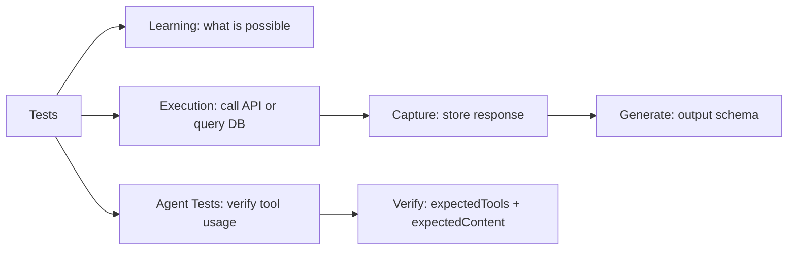
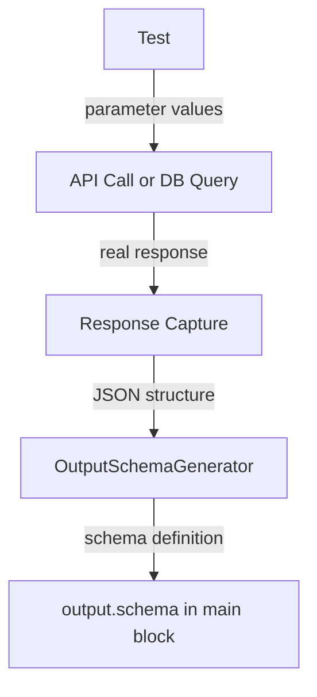
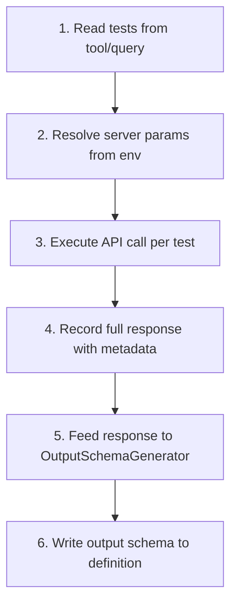
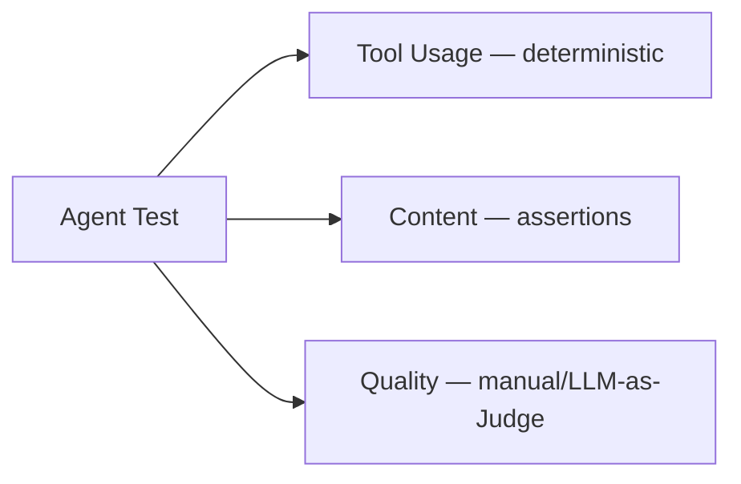

# FlowMCP Specification v4.0.0 — Tests

> Normative language (MUST/SHOULD/MAY) follows the conventions defined in [00-overview.md](./00-overview.md) (Conformance Language).

Tests are executable examples embedded in tool and resource query definitions. For agents, tests are prompts with expected tool usage and content assertions. They serve three purposes: they document what a tool or resource query can do, they provide the input data needed to capture real responses, and those captured responses are the basis for generating accurate output schemas. This document defines the test format for both tools and resources, design principles, the response capture lifecycle, and validation rules.

---

## Purpose

Without tests, a tool or resource query is a black box. The `description` field says what it does in prose, the `parameters` array says what inputs it accepts — but neither shows a concrete usage example with real values. Tests fill this gap.



The diagram shows the five roles of a test: teaching consumers what the tool or resource can do, executing real API calls (for tools) or database queries (for resources), capturing the response, generating the output schema from that response, and — for agents — verifying that the correct tools are invoked and that responses contain expected content.

### Tests as Learning Instrument

A developer or AI agent reading a schema SHOULD understand a tool's or resource query's capabilities **by reading the tests alone**. Well-designed tests express the breadth of what the tool or query can do — different parameter combinations, edge cases, different data categories. They are not regression tests — they are **executable documentation**.

### Tests as Output Schema Source

Output schemas describe the shape of `data` in a successful response. The only reliable source for this shape is a **real API response**. Tests provide the parameter values needed to make real API calls. The captured responses are fed into the `OutputSchemaGenerator` to produce accurate output schemas.



The diagram shows how tests feed the output schema generation pipeline: test parameters drive real API calls, responses are captured, and the generator derives the output schema from the actual data structure.

---

## Tool Test Format

Tests are defined as an array inside each tool, alongside `method`, `path`, `description`, `parameters`, and `output`:

```javascript
tools: {
    getSimplePrice: {
        method: 'GET',
        path: '/simple/price',
        description: 'Fetch current price for one or more coins',
        parameters: [
            { position: { key: 'ids', value: '{{USER_PARAM}}', location: 'query' }, z: { primitive: 'array()', options: [] } },
            { position: { key: 'vs_currencies', value: '{{USER_PARAM}}', location: 'query' }, z: { primitive: 'string()', options: [] } }
        ],
        tests: [
            {
                _description: 'Single coin in single currency',
                ids: ['bitcoin'],
                vs_currencies: 'usd'
            },
            {
                _description: 'Multiple coins in multiple currencies',
                ids: ['bitcoin', 'ethereum', 'solana'],
                vs_currencies: 'usd,eur,gbp'
            }
        ],
        output: { /* ... */ }
    }
}
```

The `tests` array is part of the `main` block and therefore JSON-serializable. It MUST NOT contain functions, Date objects, or any non-serializable values.

---

## Test Fields

Each test object contains `_description` and parameter values:

| Field | Type | Required | Description |
|-------|------|----------|-------------|
| `_description` | `string` | Yes | Human-readable explanation of what this test demonstrates |
| `{paramKey}` | matches parameter type | Yes (per required param) | Value for each `{{USER_PARAM}}` parameter, keyed by the parameter's `position.key` |

### `_description`

The description explains **what this specific test demonstrates** — not what the tool does (that is the tool's `description`), but what this particular parameter combination shows.

```javascript
// Good — explains the specific scenario
{ _description: 'ERC-20 token on Ethereum mainnet', ... }
{ _description: 'Native token on Layer 2 chain (Arbitrum)', ... }
{ _description: 'Wallet with high transaction volume', ... }

// Bad — generic, does not explain what makes this test different
{ _description: 'Test getTokenPrice', ... }
{ _description: 'Basic test', ... }
{ _description: 'Test 1', ... }
```

### Parameter Values

Each `{{USER_PARAM}}` parameter's `position.key` becomes a key in the test object. The value MUST pass the parameter's `z` validation:

```javascript
// Parameter definition
{ position: { key: 'chain_id', value: '{{USER_PARAM}}', location: 'query' }, z: { primitive: 'number()', options: ['min(1)'] } }

// Test value — must be a number >= 1
{ _description: 'Ethereum mainnet', chain_id: 1 }
```

Optional parameters (`optional()` or `default()` in z options) may be omitted from test objects. If omitted, the runtime uses the default value or excludes the parameter.

Fixed parameters (value is not `{{USER_PARAM}}`) and server parameters (`{{SERVER_PARAM:...}}`) are **never included in test objects** — they are handled automatically by the runtime.

---

## Design Principles

### 1. Express the Breadth

Tests SHOULD cover the **range of what is possible** with the tool or resource query. A tool that accepts a chain ID SHOULD test multiple chains. A tool that accepts different asset types SHOULD test each type. The goal is not exhaustive coverage but representative variety.

```javascript
// Good — shows breadth of chains and token types
tests: [
    { _description: 'ERC-20 token on Ethereum', chain_id: 1, contract: '0x6982508145454Ce325dDbE47a25d4ec3d2311933' },
    { _description: 'Native token on Polygon', chain_id: 137, contract: '0x0000000000000000000000000000000000001010' },
    { _description: 'Stablecoin on Arbitrum', chain_id: 42161, contract: '0xaf88d065e77c8cC2239327C5EDb3A432268e5831' }
]

// Bad — repetitive, same pattern three times
tests: [
    { _description: 'Test token 1', chain_id: 1, contract: '0xaaa...' },
    { _description: 'Test token 2', chain_id: 1, contract: '0xbbb...' },
    { _description: 'Test token 3', chain_id: 1, contract: '0xccc...' }
]
```

### 2. Teach Through Examples

Someone reading the tests SHOULD learn what the tool or resource query can do without reading the documentation. Each test teaches one capability or variation:

```javascript
// The tests teach: this route handles single/multiple coins, different currencies,
// and can mix coin types
tests: [
    { _description: 'Single coin in USD', ids: ['bitcoin'], vs_currencies: 'usd' },
    { _description: 'Multiple coins in single currency', ids: ['bitcoin', 'ethereum'], vs_currencies: 'eur' },
    { _description: 'Single coin in multiple currencies', ids: ['solana'], vs_currencies: 'usd,eur,gbp' }
]
```

### 3. No Personal Data

Tests MUST never contain personal data. All test values MUST be **publicly known, verifiable, and non-sensitive**:

| Allowed | Not Allowed |
|---------|-------------|
| Public smart contract addresses | Private wallet addresses with real holdings |
| Well-known token contracts (USDC, WETH) | Personal wallet addresses |
| Public blockchain data (block numbers, tx hashes) | Email addresses, names, phone numbers |
| Standard chain IDs (1, 137, 42161) | API keys, tokens, passwords |
| Published document IDs (government open data) | Session tokens, auth credentials |
| Generic search keywords | Personal identifiers |

```javascript
// Good — public, well-known contract addresses
{ _description: 'USDC on Ethereum', contract: '0xA0b86991c6218b36c1d19D4a2e9Eb0cE3606eB48' }

// Bad — personal wallet
{ _description: 'My wallet', address: '0x742d35Cc6634C0532925a3b844Bc9e7595f2bD18' }
```

### 4. Reproducible Results

Tests SHOULD produce **consistent, verifiable results** when executed. Prefer:

- Well-established tokens/contracts over newly deployed ones
- Historical data queries (specific block numbers) over latest-block queries when possible
- Stable endpoints over experimental ones

The API response MAY change over time (prices update, new data appears), but the **structure** of the response SHOULD remain stable. This structural stability is what makes captured responses useful for output schema generation.

---

## Test Count Guidelines

### Tool Test Count

| Scenario | Minimum | Recommended |
|----------|---------|-------------|
| Tool with no parameters | 3 | 3 |
| Tool with 1-2 parameters | 3 | 3-5 |
| Tool with enum/chain parameters | 3 | 4-6 (different enum values) |
| Tool with multiple optional parameters | 3 | 4-6 (with/without optionals) |

**Minimum: 3 tests per tool is required.** A tool with fewer than 3 tests is a validation error (TST001). Three tests ensure breadth coverage: one basic case, one edge case, and one cross-cutting case. The recommended count depends on the parameter variety — more diverse parameters benefit from more tests.

### Resource Query Test Count

| Scenario | Minimum | Recommended |
|----------|---------|-------------|
| Query with no parameters | 3 | 3 |
| Query with 1-2 parameters | 3 | 3-5 |
| Query with enum parameters | 3 | 4-6 (different enum values) |

**Minimum: 3 tests per resource query is required.** Three tests ensure breadth coverage: one basic case, one edge case, and one cross-cutting case. Resource query tests execute against the bundled database, so they are always runnable without API keys or network access. Results are deterministic.

**Maximum: No hard limit**, but tests SHOULD be purposeful. Each test MUST demonstrate something different. Duplicate or near-duplicate tests waste execution time during response capture.

---

## Response Capture Lifecycle

Tests are the starting point for a pipeline that ends with accurate output schemas:



The diagram shows the six-step lifecycle from test definition to output schema generation.

### Step 1: Read Tests

The runtime reads the `tests` array from the tool or resource query definition and extracts parameter values for each test.

### Step 2: Resolve Server Params

If the schema has `requiredServerParams`, the corresponding environment variables are loaded. Tests that require API keys cannot run without the appropriate `.env` file.

### Step 3: Execute API Call

For each test, the runtime constructs the full API request (URL, headers, body) using the test's parameter values and executes it. A delay between calls (default: 1 second) prevents rate limiting.

### Step 4: Record Response

The full response is recorded with metadata:

```javascript
{
    namespace: 'coingecko',
    routeName: 'getSimplePrice',
    testIndex: 0,
    _description: 'Single coin in USD',
    userParams: { ids: ['bitcoin'], vs_currencies: 'usd' },
    responseTime: 234,
    timestamp: '2026-02-17T10:30:00Z',
    response: {
        status: true,
        messages: [],
        data: { /* actual API response after handler transformation */ }
    }
}
```

The `response.data` field contains the data **after handler transformation** (postRequest, executeRequest). This is critical because the output schema describes the final shape, not the raw API response.

### Step 5: Generate Output Schema

The `OutputSchemaGenerator` analyzes the `response.data` structure and produces a schema definition:

```javascript
// From response.data: [{ id: 'bitcoin', prices: { usd: 45000 } }]
// Generator produces:
{
    type: 'array',
    items: {
        type: 'object',
        properties: {
            id: { type: 'string', description: '' },
            prices: {
                type: 'object',
                description: '',
                properties: {
                    usd: { type: 'number', description: '' }
                }
            }
        }
    }
}
```

### Step 6: Write Output Schema

The generated schema is written back into the tool's or query's `output` field. If it already has an `output` schema, the captured response can be used to **validate** the existing schema against reality.

---

## Test Execution Modes

### Capture Mode

All tests are executed against the real API. Responses are stored as files for inspection and output schema generation. This is the primary use case — run during schema development to build output schemas.

```
capture/
└── {timestamp}/
    └── {namespace}/
        ├── {routeName}-0.json
        ├── {routeName}-1.json
        └── metrics.json
```

### Validation Mode

Tests are executed and the actual response structure is compared against the declared `output.schema`. Mismatches produce warnings (non-blocking, per output schema spec). This mode verifies that output schemas remain accurate over time.

### Dry-Run Mode

Tests are validated for correctness (parameter types, required fields, _description presence) without making API calls. Used during `flowmcp validate` to check test definitions statically.

---

## Connection to Output Schema

The output schema (defined in `04-output-schema.md`) describes the `data` field of a successful response. Tests are the mechanism that produces the real data from which output schemas are derived.

| Without Tests | With Tests |
|---------------|------------|
| Output schema MUST be written by hand | Output schema is generated from real responses |
| Schema author guesses the response shape | Schema author captures the actual shape |
| Output schema MAY drift from reality | Output schema is verified against reality |
| No way to detect API changes | Response capture detects structural changes |

**Tests and output schemas are complementary.** Tests provide the input, response capture provides the data, and the generator produces the schema. Maintaining one without the other is incomplete.

---

## Complete Example

### Tool Test Example

A tool with well-designed tests that demonstrate breadth:

```javascript
export const main = {
    namespace: 'chainlist',
    name: 'Chainlist Tools',
    description: 'Query EVM chain metadata from Chainlist',
    version: '3.0.0',
    root: 'https://chainlist.org/rpcs.json',
    tools: {
        getChainById: {
            method: 'GET',
            path: '/',
            description: 'Returns detailed information for a chain given its numeric chainId',
            parameters: [
                { position: { key: 'chain_id', value: '{{USER_PARAM}}', location: 'query' }, z: { primitive: 'number()', options: ['min(1)'] } }
            ],
            tests: [
                { _description: 'Ethereum mainnet — most widely used L1', chain_id: 1 },
                { _description: 'Polygon PoS — popular L2 sidechain', chain_id: 137 },
                { _description: 'Arbitrum One — optimistic rollup L2', chain_id: 42161 },
                { _description: 'Base — Coinbase L2 on OP Stack', chain_id: 8453 }
            ],
            output: {
                mimeType: 'application/json',
                schema: {
                    type: 'object',
                    properties: {
                        chainId: { type: 'number', description: 'Numeric chain identifier' },
                        name: { type: 'string', description: 'Human-readable chain name' },
                        nativeCurrency: {
                            type: 'object',
                            description: 'Native currency details',
                            properties: {
                                name: { type: 'string', description: 'Currency name' },
                                symbol: { type: 'string', description: 'Currency symbol' },
                                decimals: { type: 'number', description: 'Decimal places' }
                            }
                        },
                        rpc: { type: 'array', description: 'Available RPC endpoints' },
                        explorers: { type: 'array', description: 'Block explorer URLs' }
                    }
                }
            }
        },
        getChainsByKeyword: {
            method: 'GET',
            path: '/',
            description: 'Returns all chains matching a keyword substring',
            parameters: [
                { position: { key: 'keyword', value: '{{USER_PARAM}}', location: 'query' }, z: { primitive: 'string()', options: ['min(2)'] } },
                { position: { key: 'limit', value: '{{USER_PARAM}}', location: 'query' }, z: { primitive: 'number()', options: ['min(1)', 'optional()'] } }
            ],
            tests: [
                { _description: 'Search for Ethereum-related chains', keyword: 'Ethereum' },
                { _description: 'Search for Binance chains with limit', keyword: 'BNB', limit: 3 },
                { _description: 'Search for testnet chains', keyword: 'Sepolia' }
            ],
            output: { /* ... */ }
        }
    }
}
```

### What these tests demonstrate

**`getChainById` tests teach:**
- The tool works with well-known L1 chains (Ethereum)
- It works with L2 sidechains (Polygon)
- It works with rollup L2s (Arbitrum)
- It works with newer OP Stack chains (Base)
- All test values are public chain IDs — no personal data

**`getChainsByKeyword` tests teach:**
- The tool does substring matching on chain names
- The `limit` parameter is optional (first test omits it)
- Different keyword patterns produce different result sets
- Testnet chains are also searchable

---

## Resource Query Tests

Resource queries use the same test format as tools. Each test provides parameter values for a query execution against the bundled SQLite database.

### Resource Test Format

```javascript
queries: {
    bySymbol: {
        sql: 'SELECT * FROM tokens WHERE symbol = ? COLLATE NOCASE',
        description: 'Find tokens by ticker symbol',
        parameters: [
            {
                position: { key: 'symbol', value: '{{USER_PARAM}}' },
                z: { primitive: 'string()', options: [ 'min(1)' ] }
            }
        ],
        output: { /* ... */ },
        tests: [
            { _description: 'Well-known stablecoin (USDC)', symbol: 'USDC' },
            { _description: 'Major L1 token (ETH)', symbol: 'ETH' },
            { _description: 'Case-insensitive match (lowercase)', symbol: 'wbtc' }
        ]
    }
}
```

### Resource Test Differences from Tool Tests

| Aspect | Tool Tests | Resource Tests |
|--------|-----------|----------------|
| Execution target | External API over network | Local SQLite database |
| API keys required | Often yes (`requiredServerParams`) | Never |
| Network required | Yes | No |
| Result determinism | Response MAY vary over time | Always deterministic (bundled data) |
| Test count minimum | 3 per tool | 3 per query |
| Server params in test | Never included | Not applicable |

### Resource Test Design Principles

The same four design principles apply (express breadth, teach through examples, no personal data, reproducible results). Resource tests have an additional advantage: **results are always reproducible** because the data is bundled in the `.db` file. Tests serve as documentation of what data the database contains.

```javascript
// Good — shows different lookup strategies and data coverage
tests: [
    { _description: 'Well-known stablecoin (USDC)', symbol: 'USDC' },
    { _description: 'Major DeFi token (UNI)', symbol: 'UNI' },
    { _description: 'Case-insensitive match (lowercase)', symbol: 'weth' }
]

// Bad — only one test, does not show data variety
tests: [
    { _description: 'Test query', symbol: 'ETH' }
]
```

See `13-resources.md` for the complete resource specification including query definitions, parameter binding, and handler integration.

---

## Agent Tests

Agent tests validate end-to-end behavior at the agent level. Instead of testing individual tool calls with parameter values, agent tests provide a **natural language prompt** and assert which tools the agent SHOULD invoke and what content the response SHOULD contain.

### Agent Test Format

```json
{
    "tests": [
        {
            "_description": "Basic token lookup",
            "input": "What is the current price of Ethereum?",
            "expectedTools": ["coingecko-com/tool/simplePrice"],
            "expectedContent": ["current price", "24h change"]
        }
    ]
}
```

### Agent Test Fields

| Field | Type | Required | Description |
|-------|------|----------|-------------|
| `_description` | `string` | Yes | What this test demonstrates |
| `input` | `string` | Yes | Natural language prompt (as a user would ask) |
| `expectedTools` | `string[]` | Yes | Tool IDs that SHOULD be called (deterministic check) |
| `expectedContent` | `string[]` | No | Content assertions against response text |

The `input` field contains a prompt exactly as a human user would type it. The `expectedTools` array lists the tool IDs (in `namespace/tool/name` format) that the agent MUST invoke to answer the prompt. The optional `expectedContent` array contains substrings that the final response text MUST include (case-insensitive matching).

### Three-Level Test Model

Agent test validation operates on three levels, each with a different degree of determinism:



| Level | Checkable | Method |
|-------|-----------|--------|
| Tool Usage | Yes — deterministic | expectedTools[] against actual tool calls |
| Content | Partially — assertions | expectedContent[] against response text (case-insensitive) |
| Quality | No — subjective | Human review or LLM-as-Judge |

**Tool Usage** is the strongest assertion. Given a well-scoped prompt, the set of tools an agent SHOULD call is deterministic. If the prompt is "What is the current price of Ethereum?", the agent MUST call the price tool — there is no ambiguity.

**Content** assertions are semi-deterministic. The response text will vary across LLM runs, but certain factual elements (like "current price" or "24h change") should always appear if the agent answered correctly.

**Quality** is subjective and cannot be validated by the spec runtime. It is included in the model for completeness — teams MAY use LLM-as-Judge or human review to evaluate response quality beyond the scope of automated checks.

### Consistency: Tool Tests vs Agent Tests

| Aspect | Tool Test | Agent Test |
|--------|-----------|------------|
| Minimum | 3 | 3 |
| `_description` | Required | Required |
| Input | Parameter values | Natural language prompt |
| Output | API response (deterministic) | Tool calls + text (partially deterministic) |
| Validation | Schema match | expectedTools + expectedContent |

Both test types share the same `_description` convention and the same minimum of 3 tests. The difference is in **what they test**: tool tests validate a single API call with concrete parameter values, while agent tests validate the agent's ability to select and orchestrate the right tools for a given user intent.

### Complete Agent Test Example

A crypto-research agent with three tests demonstrating breadth:

```json
{
    "tests": [
        {
            "_description": "Single token price lookup — basic case",
            "input": "What is the current price of Ethereum?",
            "expectedTools": ["coingecko-com/tool/simplePrice"],
            "expectedContent": ["current price", "USD"]
        },
        {
            "_description": "Cross-chain token comparison — edge case with multiple tools",
            "input": "Compare the TVL of Aave on Ethereum vs Arbitrum",
            "expectedTools": [
                "defillama-com/tool/getProtocolTvl",
                "defillama-com/tool/getProtocolChainTvl"
            ],
            "expectedContent": ["TVL", "Ethereum", "Arbitrum"]
        },
        {
            "_description": "Wallet analysis — cross-cutting case combining on-chain data",
            "input": "Show me the top 5 token holdings in vitalik.eth",
            "expectedTools": [
                "etherscan-io/tool/getTokenBalances",
                "coingecko-com/tool/simplePrice"
            ],
            "expectedContent": ["token", "balance"]
        }
    ]
}
```

**What these tests demonstrate:**

- **Test 1** (basic case): A simple single-tool lookup. Validates that the agent correctly routes a straightforward price question to the CoinGecko price tool.
- **Test 2** (edge case): A comparative question requiring multiple calls to the same provider. Validates that the agent can decompose a comparison into separate data fetches.
- **Test 3** (cross-cutting case): A question that requires data from multiple providers (on-chain balances + price data). Validates that the agent can orchestrate tools across different namespaces.

---

## Skill Tests (v4.0.0)

Skills have two test types: structural and one-shot.

### Primitive Test Overview

| Primitive | Test Type | Minimum Count |
|-----------|-----------|---------------|
| Tools | Structural + API | 3 per tool |
| Resources | Structural + Query | 3 per query |
| Skills | Structural + One-Shot | 1 + 1 |
| Agents | End-to-End | 3 |

### Structural Test for Skills

The structural test validates that all internal references in the skill are resolvable:

- All `{{tool:name}}` references exist in `main.tools`
- All `{{resource:name}}` references exist in `main.resources`
- All `{{input:key}}` placeholders match the skill's `input` array
- No unresolvable `{{skill:name}}` references

This test is deterministic and runs during `flowmcp validate`.

### One-Shot Test for Skills

A Skill passes the **One-Shot Test** when an AI agent can execute the complete workflow described in the skill's `content` field without requiring additional ToolSearch roundtrips for disambiguation.

**Definition:** The One-Shot Test is a probabilistic (LLM-eval) test. The skill is delivered to an AI agent as an MCP prompt. The agent executes it. If the agent can complete the workflow in one pass — calling the correct tools in the correct order, with correct parameters — the skill passes.

**Empirical basis:** Testing in March 2026 (FlowMCP Harness CLI) showed:

| Skill Type | 5-Run Success Rate |
|------------|-------------------|
| Enriched Skills (with embedded tool descriptions, parameter tables, example calls) | 5/5 (100%) |
| Bare Skills (tool name only, no embedded metadata) | 0/5 (0%) |

This demonstrates that One-Shot performance is directly correlated with information density in the skill's `content` field. A skill that only names tools without embedding their parameters forces the agent into a ToolSearch roundtrip and breaks the one-shot constraint.

**Test format:**

```javascript
// Structural test: deterministic
// 1. Validate all references resolve
// 2. Run: flowmcp validate providers/{namespace}/skills/skill-name.mjs

// One-Shot test: probabilistic (LLM-eval)
// 1. Load skill as MCP prompt
// 2. Send to agent with a representative input
// 3. Evaluate: did the agent complete the workflow in one pass?
// 4. Repeat 3-5 times, require ≥ 4/5 success rate for PASS
```

**Implication for skill authoring:** Skills MUST be self-contained. Each skill's `content` must embed:

- Parameter tables for every referenced tool
- Allowed enum values for enum parameters
- Example tool calls with placeholder values
- Expected output format

See `14-skills.md` (One-Shot Design Principle) for authoring guidelines.

---

## Validation Rules

| Code | Severity | Rule |
|------|----------|------|
| TST001 | error | Each tool MUST have at least 3 tests. Each resource query MUST have at least 3 tests. Each agent MUST have at least 3 tests. |
| TST002 | error | Each test MUST have a `_description` field of type string |
| TST003 | error | Each test MUST provide values for all required `{{USER_PARAM}}` parameters |
| TST004 | error | Test parameter values MUST pass the corresponding `z` validation |
| TST005 | error | Test objects MUST be JSON-serializable (no functions, no Date, no undefined) |
| TST006 | error | Test objects MUST only contain keys that match `{{USER_PARAM}}` parameter keys or `_description` |
| TST007 | warning | Tools/queries with enum or chain parameters SHOULD have tests covering multiple enum values |
| TST008 | info | Consider adding tests that demonstrate optional parameter usage |
| TST009 | error | Each agent test MUST have an `input` field of type string |
| TST010 | error | Each agent test MUST have an `expectedTools` field as non-empty array |
| TST011 | error | Each expectedTools entry MUST be a valid ID (contains `/`) |
| TST012 | warning | Agent tests SHOULD cover different tool combinations |
| TST013 | info | Consider adding expectedContent assertions for richer validation |
