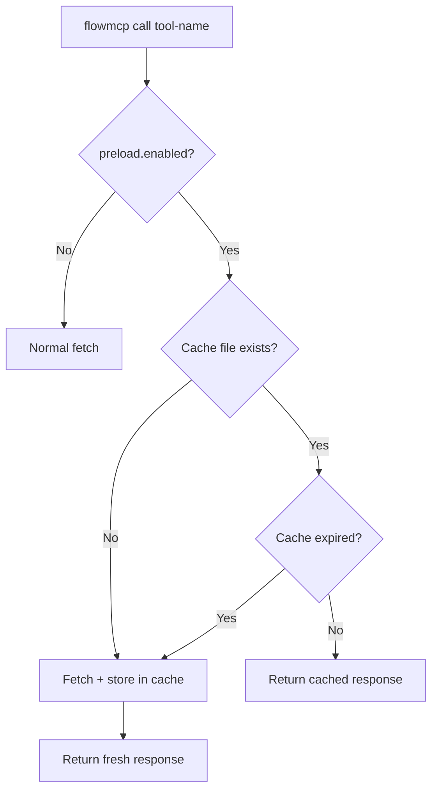
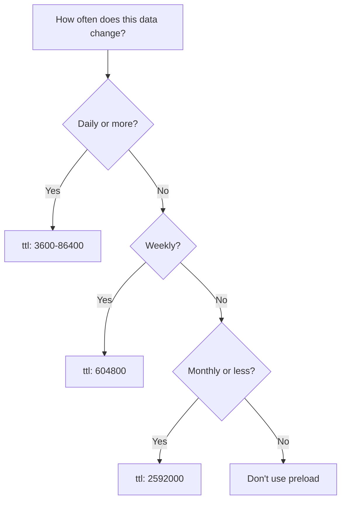

> Normative language (MUST/SHOULD/MAY) follows the conventions defined in [Conformance Language](/specification/overview/#conformance-language).

This document defines the optional `preload` field on route level. It signals that a route returns a static or slow-changing dataset and that the runtime MAY cache the response locally.

---

## Motivation

Some API endpoints return complete, rarely changing datasets (e.g. all hospitals in Germany, all memorial stones in Berlin). Fetching these on every call wastes bandwidth and time. The `preload` field lets schema authors declare caching intent so the CLI and other runtimes can cache responses transparently.

---

## The `preload` Field

`preload` is an **optional object** on route level, alongside `method`, `path`, `description`, `parameters`, `output`, and `tests`.

```javascript
routes: {
    getLocations: {
        method: 'GET',
        path: '/locations.json',
        description: 'All hospital locations in Germany',
        parameters: [],
        preload: {
            enabled: true,
            ttl: 604800,
            description: 'All hospital locations in Germany (~760KB)'
        },
        output: { /* ... */ },
        tests: [ /* ... */ ]
    }
}
```

### Fields

| Field | Type | Required | Description |
|-------|------|----------|-------------|
| `enabled` | `boolean` | Yes | Whether caching is allowed for this route. Must be `true` to activate caching. |
| `ttl` | `number` | Yes | Cache time-to-live in seconds. Must be a positive integer. |
| `description` | `string` | No | Human-readable note shown on cache hit (e.g. dataset size, update frequency). |

### Semantics

- **`enabled: true`** signals that the route's response is safe to cache. The runtime decides whether to actually cache (caching is always optional).
- **`enabled: false`** explicitly disables caching even if present. Equivalent to omitting `preload` entirely.
- **`ttl`** defines the maximum age of a cached response in seconds before it must be re-fetched. Common values:

| TTL | Duration | Use Case |
|-----|----------|----------|
| `3600` | 1 hour | Frequently updated data |
| `86400` | 1 day | Daily snapshots |
| `604800` | 1 week | Weekly releases, semi-static data |
| `2592000` | 30 days | Static reference data |

---

## Validation Rules

These rules extend the existing validation rule set from `09-validation-rules.md`:

| Code | Severity | Rule |
|------|----------|------|
| `VAL060` | error | If `preload` is present, it must be a plain object. |
| `VAL061` | error | `preload.enabled` must be a boolean. |
| `VAL062` | error | `preload.ttl` must be a positive integer (> 0). |
| `VAL063` | warning | `preload.description` if present MUST be a string. |
| `VAL064` | info | Routes with `preload.enabled: true` and no parameters are ideal cache candidates. |
| `VAL065` | warning | Routes with `preload.enabled: true` and required parameters SHOULD document caching behavior — the cache key MUST include parameter values. |

---

## Cache Key

When a route has parameters, the cache key MUST include the parameter values to avoid serving stale data for different inputs. The recommended cache key format is:

```
{namespace}/{routeName}/{paramHash}.json
```

Where `paramHash` is a deterministic hash of the sorted, JSON-serialized user parameters.

For routes with no parameters (or only optional parameters that were omitted), the cache key simplifies to:

```
{namespace}/{routeName}.json
```

---

## Runtime Behavior

### Cache Storage

The recommended cache directory is `~/.flowmcp/cache/`. Each cached response is stored as a JSON file with metadata:

```json
{
    "meta": {
        "fetchedAt": "2026-02-17T12:00:00.000Z",
        "expiresAt": "2026-02-24T12:00:00.000Z",
        "ttl": 604800,
        "size": 760123,
        "paramHash": null
    },
    "data": { }
}
```

### Cache Flow



### User Overrides

Runtimes SHOULD support these override mechanisms:

| Flag | Behavior |
|------|----------|
| `--no-cache` | Skip cache entirely, always fetch fresh |
| `--refresh` | Fetch fresh and update cache |

### Cache Management Commands

Runtimes SHOULD provide cache management:

| Command | Description |
|---------|-------------|
| `cache status` | List all cached responses with size, age, expiry |
| `cache clear` | Remove all cached responses |
| `cache clear {namespace}` | Remove cached responses for a specific namespace |

### User Communication

| Event | Message |
|-------|---------|
| Cache hit | `Cached (fetched: {date}, expires: {date})` |
| Cache miss | `Fetching fresh data...` → `Cached for {ttl human}` |
| Cache expired | `Cache expired, refreshing...` |
| Force refresh | `Refreshing cache...` |

---

## Schema Author Guidelines

### When to Use Preload

Use `preload` when:
- The endpoint returns a complete, static or slow-changing dataset
- The response is larger than ~10KB
- The data doesn't change based on time-of-day or real-time events
- Multiple calls with the same parameters return identical results

### When NOT to Use Preload

Do not use `preload` when:
- The data changes frequently (live prices, real-time feeds)
- The response depends on authentication state
- The endpoint has rate limits that make caching counterproductive (use rate limiting instead)

### TTL Selection Guide



---

## Interaction with Other Features

### Handlers

Handlers (`preRequest`, `postRequest`) still execute on cached data. The cache stores the raw API response before `postRequest` transformation. This ensures handler logic always runs on the most appropriate data format.

**Alternative (simpler):** Cache the final transformed response after `postRequest`. This avoids re-running handlers on every cache hit but requires cache invalidation when handler logic changes.

Runtimes SHOULD document which approach they use.

### Tests

Route tests (`10-route-tests.md`) always bypass the cache to ensure they test the live API. The `--no-cache` flag is implied during test execution.

### Output Schema

The output schema (`04-output-schema.md`) describes the response shape regardless of whether the response comes from cache or a live fetch. Caching does not affect the output contract.
