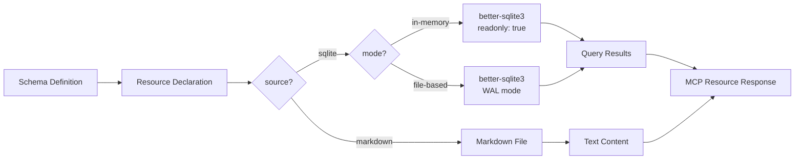
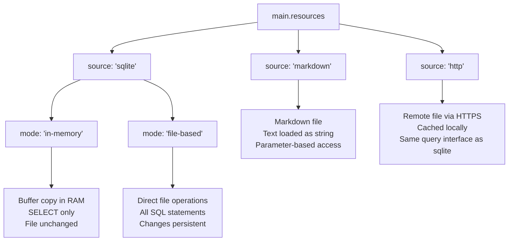
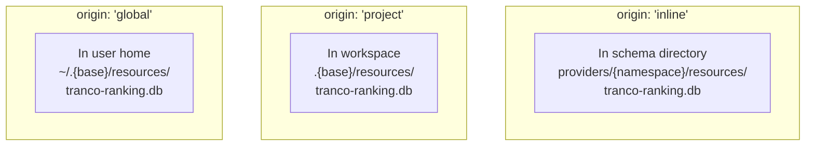
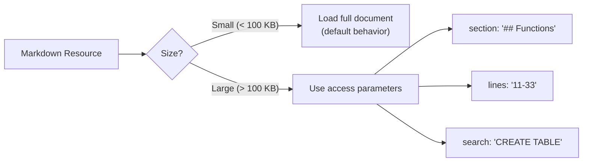
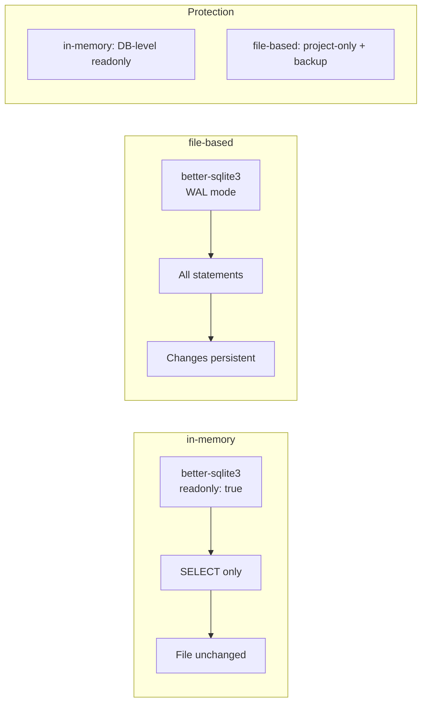
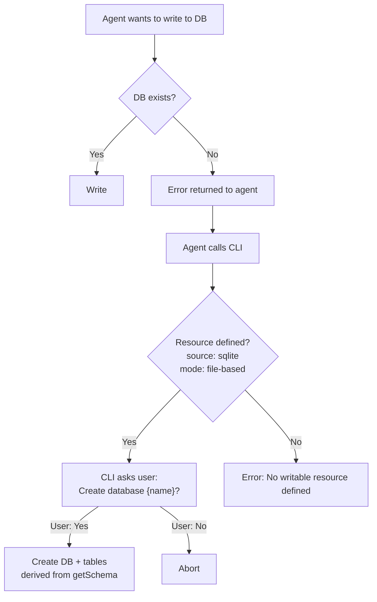
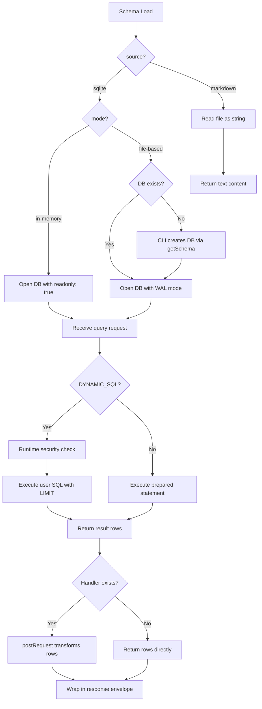

Resources give a schema local, deterministic data access alongside its network tools. They map to the MCP `server.resource` primitive and live in `main.resources` next to `main.tools`. A resource is backed by a SQLite database (read-only in-memory or writable file-based), a remote SQLite file fetched over HTTPS, or a Markdown document — and the runtime exposes each through a small set of typed queries, with the auto-injected `runSql` and `describeTables` rounding out the query surface. Where a tool reaches out to a third-party API, a resource serves data that should always be available: reference tables, lookups, agent-collected results, and inline documentation.


## Why Resources Exist

Tools fetch data from external APIs over the network — they depend on third-party availability, rate limits, and response format stability. Some use cases require data that is **local, deterministic, and always available**: token metadata lookups, chain ID mappings, contract registries, country code tables. Other use cases require **persistent local storage** for agent-generated data: analysis results, collected metrics, scraping output.

Resources solve both by providing two SQLite modes and a Markdown document type:



The diagram shows the data flow from the schema's resource declaration through either SQLite (two modes) or Markdown into MCP resource responses.

### When to Use Resources

| Use Case | Mechanism | Example |
|----------|-----------|---------|
| Live API data | Tool | Current token price from CoinGecko |
| Static reference data | Resource (SQLite in-memory) | Token metadata by symbol or contract address |
| Agent-generated data | Resource (SQLite file-based) | PageSpeed analysis results, collected metrics |
| API documentation | Resource (Markdown) | DuneSQL syntax reference, API field descriptions |

---

## Resource Types

FlowMCP supports two resource types, identified by the `source` field:



| Source | Mode | Description |
|--------|------|-------------|
| `sqlite` | `in-memory` | DB opened with `readonly: true`. SELECT only. File remains unchanged. |
| `sqlite` | `file-based` | DB opened with WAL mode. All SQL statements. Changes persistent on disk. |
| `markdown` | — | Markdown file loaded as string. Parameter-based access (section, lines, search). |
| `http` | — | Remote file fetched via HTTPS and cached locally. Same SQLite query interface as `sqlite` source. |

---

## SQLite Resources

### Resource Fields

| Field | Type | Required | Description |
|-------|------|----------|-------------|
| `source` | `'sqlite'` | Yes | Resource type. Must be `'sqlite'` for SQLite resources. |
| `mode` | `'in-memory'` or `'file-based'` | Yes | Access mode. Determines readonly vs. writable. |
| `origin` | `'global'`, `'project'`, or `'inline'` | Yes | Storage location. See [Origin System](#origin-system). |
| `name` | `string` | Yes | Filename with extension. Must end with `.db`. Convention: `{namespace}-{descriptive-name}.db`. |
| `description` | `string` | Yes | What this resource provides. Appears in resource discovery. |
| `queries` | `object` | Yes | Query definitions. Maximum 7 schema-defined queries. `runSql` and `describeTables` are auto-injected by the runtime. |

All fields are required. There are no defaults and no optional fields.

### Mode: `in-memory`

The database is opened with `better-sqlite3` using `readonly: true`. Only SELECT statements are allowed. The file on disk is never modified.

```javascript
resources: {
    rankingDb: {
        source: 'sqlite',
        mode: 'in-memory',
        origin: 'global',
        name: 'tranco-ranking.db',
        description: 'Top 1M domain rankings from Tranco List',
        queries: {
            getSchema: {
                sql: "SELECT name, sql FROM sqlite_master WHERE type='table'",
                description: 'Returns the database schema (tables and their CREATE statements)',
                parameters: [],
                output: {
                    mimeType: 'application/json',
                    schema: {
                        type: 'array',
                        items: {
                            type: 'object',
                            properties: {
                                name: { type: 'string', description: 'Table name' },
                                sql: { type: 'string', description: 'CREATE TABLE statement' }
                            }
                        }
                    }
                },
                tests: [
                    { _description: 'Get all table definitions' }
                ]
            },
            lookupDomain: {
                sql: 'SELECT rank, domain FROM rankings WHERE domain = ?',
                description: 'Look up the rank of a specific domain',
                parameters: [
                    {
                        position: { key: 'domain', value: '{{USER_PARAM}}' },
                        z: { primitive: 'string()', options: [ 'min(3)' ] }
                    }
                ],
                output: {
                    mimeType: 'application/json',
                    schema: {
                        type: 'array',
                        items: {
                            type: 'object',
                            properties: {
                                rank: { type: 'number', description: 'Domain rank' },
                                domain: { type: 'string', description: 'Domain name' }
                            }
                        }
                    }
                },
                tests: [
                    { _description: 'Look up google.com', domain: 'google.com' },
                    { _description: 'Look up amazon.de', domain: 'amazon.de' },
                    { _description: 'Look up zalando.de', domain: 'zalando.de' }
                ]
            }
        }
        // runSql + describeTables are auto-injected by the runtime
    }
}
```

| Aspect | Value |
|--------|-------|
| **Runtime** | `better-sqlite3` with `readonly: true` |
| **Allowed statements** | SELECT only |
| **File changes** | Never — readonly flag on DB level |
| **Allowed origins** | `global` (recommended) or `project` |
| **Use case** | Reference data, lookups, open data |
| **getSchema** | **OPTIONAL** — prefer auto-injected describeTables |
| **runSql** | Auto-injected by runtime (SELECT only) |
| **describeTables** | Auto-injected by runtime (AI-friendly schema discovery) |

### Mode: `file-based`

The database is opened with `better-sqlite3` using WAL mode. All SQL statements are allowed. Changes are persistent on disk. Only `origin: 'project'` is allowed.

```javascript
resources: {
    analysisDb: {
        source: 'sqlite',
        mode: 'file-based',
        origin: 'project',
        name: 'pagespeed-results.db',
        description: 'PageSpeed analysis results collected by the agent',
        queries: {
            getSchema: {
                sql: "SELECT name, sql FROM sqlite_master WHERE type='table'",
                description: 'Returns the database schema (tables and their CREATE statements)',
                parameters: [],
                output: {
                    mimeType: 'application/json',
                    schema: {
                        type: 'array',
                        items: {
                            type: 'object',
                            properties: {
                                name: { type: 'string', description: 'Table name' },
                                sql: { type: 'string', description: 'CREATE TABLE statement' }
                            }
                        }
                    }
                },
                tests: [
                    { _description: 'Get all table definitions' }
                ]
            },
            getLatestResults: {
                sql: 'SELECT domain, score, created_at FROM results ORDER BY created_at DESC LIMIT ?',
                description: 'Get the most recent analysis results',
                parameters: [
                    {
                        position: { key: 'limit', value: '{{USER_PARAM}}' },
                        z: { primitive: 'number()', options: [ 'min(1)', 'max(100)' ] }
                    }
                ],
                output: {
                    mimeType: 'application/json',
                    schema: {
                        type: 'array',
                        items: {
                            type: 'object',
                            properties: {
                                domain: { type: 'string', description: 'Analyzed domain' },
                                score: { type: 'number', description: 'Performance score' },
                                created_at: { type: 'string', description: 'Analysis timestamp' }
                            }
                        }
                    }
                },
                tests: [
                    { _description: 'Get last 10 results', limit: 10 }
                ]
            }
        }
        // runSql + describeTables are auto-injected by the runtime
    }
}
```

| Aspect | Value |
|--------|-------|
| **Runtime** | `better-sqlite3` with WAL mode |
| **Allowed statements** | All — SELECT, INSERT, UPDATE, DELETE, CREATE TABLE, DROP |
| **File changes** | Yes — persistent on disk |
| **Only allowed origin** | `project` |
| **Use case** | Analysis results, agent memory, data collection |
| **getSchema** | **OPTIONAL** — define only if CLI MUST bootstrap DB via CREATE TABLE |
| **runSql** | Auto-injected by runtime (all statements) |
| **describeTables** | Auto-injected by runtime (AI-friendly schema discovery) |
| **DB does not exist** | CLI creates DB based on getSchema if defined, otherwise reports missing-DB warning |
| **Backup** | Automatic `.bak` copy before first write per session |
| **Concurrent writes** | Supported via WAL mode |

### Mode Comparison

| Aspect | `in-memory` | `file-based` |
|--------|------------|-------------|
| Runtime flag | `readonly: true` | WAL mode |
| SELECT | Yes | Yes |
| INSERT/UPDATE/DELETE | No | **Yes** |
| CREATE/DROP TABLE | No | **Yes** |
| Changes persistent | No | **Yes** |
| Allowed origins | `global`, `project` | Only `project` |
| DB MUST exist | Yes (warning if missing) | No (CLI creates via getSchema) |
| getSchema | OPTIONAL (rarely needed) | OPTIONAL (only for CLI DB bootstrap) |
| runSql | Auto-injected (SELECT only) | Auto-injected (all statements) |
| describeTables | Auto-injected (structured discovery) | Auto-injected (structured discovery) |
| Backup | Not needed | `.bak` before first write |
| Concurrent access | Yes (readonly) | Yes (WAL mode) |

### Why Only Two Modes

Only two modes exist. Either completely readonly (safe) or completely on disk (free). Clear separation:

- **In-memory** = `better-sqlite3` with `readonly: true` — no write operations possible at all
- **File-based** = `better-sqlite3` with WAL mode — full access, but only on project level

Intermediate modes (append-only, insert-but-no-delete) are intentionally omitted:

1. **Hard to enforce** — SQL is too flexible for reliable pattern matching
2. **Misleading** — they suggest safety that cannot be guaranteed
3. **Counterproductive** — they create problems without solving real ones

---

## SQLite-GTFS Resources

### Overview

The `source: 'sqlite-gtfs'` resource type is a **top-level sub-type of `sqlite`** (Design C — top-level with inheritance). It denotes a SQLite database that has been produced by a FlowMCP add-on (the `geo-gtfs-toolkit` package, cloned from `github:FlowMCP/geo-gtfs-toolkit`) and carries a verified quality seal in its `meta` table. The seal guarantees that the database structure, validation status, and discoverable capabilities are conformant with a known add-on contract — which allows FlowMCP-CLI to automatically inject standard tools without the schema author writing any SQL by hand.

`sqlite-gtfs` is **not** a fallback for `sqlite`. A database without a valid seal is rejected (see [Validation Rules](#validation-rules) — `RES032`). Users who want full manual control over a SQLite database continue to use `source: 'sqlite'`.

### Required Fields

| Field | Type | Required | Description |
|-------|------|----------|-------------|
| `source` | `'sqlite-gtfs'` | Yes | Resource type. Must be `'sqlite-gtfs'`. |
| `mode` | `'file-based'` | Yes | Access mode. Only `'file-based'` is allowed. `'in-memory'` is rejected (`RES030`) because the seal verification depends on the persisted `meta` table. |
| `path` | `string` | Yes | Absolute path to the converted SQLite database. May contain the path variable `${FLOWMCP_RESOURCES}` (see [Path Variable Support](#path-variable-support)). |
| `addon` | `string` | Yes | Name of the FlowMCP add-on responsible for producing and interpreting the database (e.g. `geo-gtfs-toolkit`). The add-on is the authority over which standard tools are auto-injected. |

### Optional Fields

| Field | Type | Required | Description |
|-------|------|----------|-------------|
| `addonVersion` | `string` | No | SemVer range pinning the add-on version (e.g. `>=0.1.0`). When omitted, the FlowMCP-CLI uses the version listed in its add-on registry. |
| `addonSource` | `string` | No | Add-on source reference. Default: `github:FlowMCP/<addon>`. **NPM is not supported** — only `github:` paths are valid. FlowMCP is not published to the NPM registry. |

### Seal Requirement

Every `sqlite-gtfs` resource MUST point to a database whose `meta` table contains the entry `qualitySeal === 'sqlite-gtfs'`. This is a hard requirement enforced by the validator (`RES032`). A database that does not carry the seal — whether because it was produced by an unverified converter, manually edited, or partially converted — is rejected at schema activation time.

The seal is written by the converter (e.g. `MetaWriter` in `github:FlowMCP/geo-gtfs-toolkit`) only when the conversion completes successfully and all pre-validation checks pass strictly. A failed or partial conversion produces `qualitySeal: null` and the database is not usable as a `sqlite-gtfs` resource.

### Required Meta Keys

The `meta` table of a sealed database MUST contain the following ten keys. They support reproducibility, capability detection, and audit logging:

| Key | Purpose |
|-----|---------|
| `qualitySeal` | Add-on identifier (here: `'sqlite-gtfs'`). The seal value. |
| `specRevision` | FlowMCP spec revision the converter targeted (e.g. `'2026-04-27'`). Used for spec-drift warnings (`RES034`). |
| `specUrl` | URL of the spec revision document. |
| `converterVersion` | SemVer of the add-on that produced the database (e.g. `github:FlowMCP/geo-gtfs-toolkit@0.1.0`). |
| `capabilities` | JSON-encoded map of capability booleans (e.g. `basicLookup`, `routing`, `shapesVisualization`, `flexService`). Drives auto-injection. |
| `validationReport` | JSON-encoded summary of pre-validation results (counts of errors / warnings / info). |
| `buildDate` | ISO-8601 timestamp of the conversion run. |
| `rowCounts` | JSON-encoded per-table row counts. |
| `sourceUrl` | URL of the upstream data source the converter consumed (provider feed URL). |
| `sourceHash` | SHA-256 hash of the source archive — supports content-addressed deduplication and replay. |

### Path Variable Support

The `path` field MAY contain the variable `${FLOWMCP_RESOURCES}`. The FlowMCP-CLI resolves the variable from the `FLOWMCP_RESOURCES` environment variable, falling back to `~/.flowmcp/resources/` when the variable is unset.

| Variable | Resolution | Default when unset |
|----------|------------|--------------------|
| `${FLOWMCP_RESOURCES}` | `process.env.FLOWMCP_RESOURCES` | `~/.flowmcp/resources/` |

Path variables establish the `FLOWMCP_*` naming family — variable names mirror the spec primitive they reference (`main.resources` → `FLOWMCP_RESOURCES`). Future variables follow the same pattern (`FLOWMCP_LOGS`, `FLOWMCP_CACHE`).

A path variable that cannot be resolved (no environment variable and no documented default) raises `RES035`.

### Schema Example

A minimal POC schema demonstrating `sqlite-gtfs`:

```javascript
export const schema = {
    namespace: 'gtfsde',
    name: 'gtfsde-transit-v2',
    version: '4.2.0',
    main: {
        resources: [
            {
                source: 'sqlite-gtfs',                              // Design C
                mode: 'file-based',
                path: '${FLOWMCP_RESOURCES}/gtfs-de.db',            // User-configurable
                addon: 'geo-gtfs-toolkit',                          // Authority over default methods
                addonVersion: '>=0.1.0',                            // optional
                addonSource: 'github:FlowMCP/geo-gtfs-toolkit'   // NPM is not supported
            }
        ],
        tools: [
            // OPTIONAL: schema-specific tools only.
            // Standard GTFS tools are auto-injected by the add-on.
        ]
    }
}
```

When the FlowMCP-CLI initializes this resource schema (on first use — there is no separate activation command), it (1) resolves the path variable, (2) verifies the seal, (3) reads `capabilities` from the `meta` table, (4) loads the add-on declared in `addon`, and (5) injects the standard toolset that the add-on derives from the active capabilities.

### Add-on Authority

The `sqlite-gtfs` resource type **delegates the definition of standard tools to the add-on**. The spec describes the resource contract; the add-on (the `geo-gtfs-toolkit` package, cloned from `github:FlowMCP/geo-gtfs-toolkit`) owns the catalog of default methods — `searchStops`, `searchRoutes`, `getDepartures`, `getShapeForRoute`, `getFlexBookingRules`, and so on — and decides which ones become available based on the `capabilities` map.

This split keeps the spec stable while letting add-ons evolve independently. New add-ons (for example a future `sqlite-netex` or `sqlite-trias`) follow the same `Design C` pattern: top-level source value, seal requirement, add-on reference, capability-driven auto-injection.

### Data Policy Note

**Provider GTFS data MUST NOT be committed to the spec repository, the add-on repository, or any other public FlowMCP repository.** GTFS feeds carry third-party licensing terms that typically prohibit redistribution. Users provide their own GTFS data locally — either by downloading from the provider directly or by using the add-on's converter against a local source archive. The converted database lives under the user-controlled `${FLOWMCP_RESOURCES}` directory and is never published.

The synthetic Mini-GTFS fixture shipped with `github:FlowMCP/geo-gtfs-toolkit` (under a CC0 license) is the only GTFS-shaped data permitted in any public FlowMCP repository. It exists exclusively for testing and CI.

---

## Add-on URL Mode (`mode: 'url'`)

Add-on resources (`source: 'geo-geojson'`, `source: 'geo-csv'`) support a second access mode, `mode: 'url'`, in addition to the file-based mode used by `sqlite-gtfs`. In URL mode the schema carries only a thin reference — `source`, `mode`, `url`, `addon` (and, for CSV, a mandatory `parseConfig`). At schema activation the add-on fetches the **complete** dataset in a **single** request, parses it, validates it on load, and holds it **in memory** for the lifetime of the process. There is no SQLite file, no on-disk artifact, and no quality seal.

### How it Differs from `source: 'http'`

`source: 'http'` (see below) downloads a **SQLite file**, caches it on disk, and exposes it through `runSql`/`queries`. `mode: 'url'` on an add-on source downloads a **complete GeoJSON or CSV document**, holds it **in memory**, and exposes it through the add-on's central default methods (`featuresInBBox`, `nearPoint`, `byType`) — not through hand-written SQL. The two are deliberately distinct: file-cache + `runSql` versus in-memory + add-on methods.

### Required Fields

| Field | Type | Required | Description |
|-------|------|----------|-------------|
| `source` | `'geo-geojson'` \| `'geo-csv'` | Yes | Add-on resource type. `sqlite-gtfs` does NOT support URL mode (`RES043`). |
| `mode` | `'url'` | Yes | Access mode. Explicit — there is no default mode (`RES044`). |
| `url` | `string` | Yes | HTTPS URL of the complete dataset. MUST use HTTPS (`RES044`). |
| `addon` | `string` | Yes | Add-on package that owns the parser and default methods (e.g. `geo-geojson-toolkit`). |

### Conditional Fields

| Field | Type | Required | Description |
|-------|------|----------|-------------|
| `parseConfig` | `object` | For `geo-csv`: Yes | Parse configuration (delimiter, header, column types, lat/lon columns). For CSV this is **mandatory** — there is no silent default (`RES045`). For GeoJSON, omit (structure is self-describing). |

### Lifecycle

1. **Init (on first use):** the CLI loads the add-on declared in `addon`, calls its consumer API to fetch the full file from `url` in one request, parse it, and **validate it on load** (valid GeoJSON / required CSV columns) — replacing the file-based seal check. The parsed records are held in memory, keyed by URL.
2. **Runtime:** queries are served from the in-memory store via the add-on's default methods. Spatial queries (`nearPoint`, `featuresInBBox`) use a pure-`Math` Haversine implementation; no external module is required.
3. **Central maintenance:** the add-on owns the methods. A fix in the add-on propagates to every schema that references it.

### Scope

URL mode is for **complete datasets downloadable in a single step** — small static GeoJSON files and tabular CSV (Memo-090 class K3). Paginated or windowed sources (e.g. WFS) are out of scope and require a dedicated adapter.

### Schema Example

A minimal `mode: 'url'` GeoJSON schema:

```javascript
resources: {
    berlinPois: {
        source: 'geo-geojson',
        mode: 'url',
        url: 'https://example.org/berlin-pois.geojson',   // HTTPS only
        addon: 'geo-geojson-toolkit',                      // owns nearPoint / featuresInBBox / byType
        description: 'Berlin points of interest — fetched and held in memory'
    }
}
```

For CSV the `parseConfig` field is mandatory:

```javascript
resources: {
    stations: {
        source: 'geo-csv',
        mode: 'url',
        url: 'https://example.org/stations.csv',
        addon: 'geo-csv-tsv-toolkit',
        parseConfig: {                                     // mandatory — no silent default
            delimiter: ',',
            header: true,
            columns: { name: 'string', lat: 'number', lon: 'number' },
            latColumn: 'lat',
            lonColumn: 'lon'
        },
        description: 'Charging stations — in-memory, spatial queries via lat/lon'
    }
}
```

---

## Origin System

### Three Locations, Explicitly Defined

Instead of pseudo-paths (`~/.flowmcp/data/`, `./data/`), resources use an `origin` + `name` system. The origin determines where the file lives. The name determines the filename.

The **base folder** is configurable. Default: `flowmcp`. Changeable via CLI flag.



### Path Resolution

| Origin | Resolved Path | Who Creates | Description |
|--------|---------------|-------------|-------------|
| `inline` | `{schema-dir}/resources/{name}` | Schema author | Ships with the schema. Committed to repo. |
| `project` | `.{base}/resources/{name}` | User or CLI | Project-local. Not committed. |
| `global` | `~/.{base}/resources/{name}` | User (download) | System-level. Shared across projects. |

### Base Folder

| Aspect | Value |
|--------|-------|
| **Default** | `flowmcp` |
| **Configurable** | Yes, via CLI flag |
| **Affects** | `project` and `global` origins |
| **Example default** | `~/.flowmcp/resources/`, `.flowmcp/resources/` |
| **Example custom** | `~/.myagent/resources/`, `.myagent/resources/` |

### Origin Rules per Resource Type

| Origin | SQLite in-memory | SQLite file-based | Markdown |
|--------|-----------------|-------------------|----------|
| `inline` | **Not recommended** (data privacy) | **Not allowed** | **Yes** (recommended) |
| `project` | Yes | **Yes** (only allowed origin) | Yes |
| `global` | Yes (recommended) | **Not allowed** | Yes |

**Why SQLite inline is not recommended:** SQLite databases MAY contain personal data, proprietary datasets, or large binary files. Committing them to a schema repository exposes data to all users of the catalog. Markdown documents are text, typically documentation, and safe to commit.

**Why file-based is project-only:** Writable databases MUST be isolated to a single project. A writable global database could be corrupted by concurrent use from multiple projects.

### Name Field

The `name` field contains the **complete filename including extension**:

```javascript
// SQLite
name: 'tranco-ranking.db'
name: 'ofacsdn-sanctions.db'
name: 'pagespeed-results.db'

// Markdown
name: 'duneanalytics-sql-reference.md'
```

| Part | Rule | Example |
|------|------|---------|
| Prefix | Namespace of the schema | `tranco` |
| Separator | Hyphen | `-` |
| Description | Kebab-case | `ranking` |
| Extension | `.db` or `.md` | `.db` |
| **Complete** | | `tranco-ranking.db` |

The folder is always named `resources/` (not `data/`).

---

## Standard Queries

### `getSchema` — OPTIONAL (Schema-Defined)

Schema authors MAY define `getSchema` if they want to expose CREATE TABLE statements directly. For `in-memory` mode, `describeTables` provides AI-friendly structured discovery automatically (recommended). For `file-based` mode, `getSchema` is useful when CLI needs to construct the DB.

**When to define `getSchema`:**

- `mode: 'file-based'`: Only when the CLI MUST create the database on first run. The CLI derives CREATE TABLE statements from the getSchema return value (table names, column names, column types).
- `mode: 'in-memory'`: Almost never — `describeTables` is sufficient. Define `getSchema` only if a downstream consumer needs the CREATE TABLE text directly (e.g. dump/migration tooling).

**getSchema and CREATE TABLE:** When defined, the CLI can derive CREATE TABLE statements from the getSchema return value. No separate `createSchema` query is needed.

```javascript
getSchema: {
    sql: "SELECT name, sql FROM sqlite_master WHERE type='table'",
    description: 'Returns CREATE TABLE statements for all tables (optional, for CLI bootstrap)',
    parameters: [],
    output: {
        mimeType: 'application/json',
        schema: {
            type: 'array',
            items: {
                type: 'object',
                properties: {
                    name: { type: 'string', description: 'Table name' },
                    sql: { type: 'string', description: 'CREATE TABLE statement' }
                }
            }
        }
    },
    tests: [
        { _description: 'Get all table definitions' }
    ]
}
```

### `runSql` — Auto-Injected by Runtime

`runSql` is automatically added by the runtime. Schema authors do **not** define it manually. The SELECT-only enforcement for `in-memory` mode is unchanged — security comes from the `mode` field, not from the query name.

| Aspect | in-memory | file-based |
|--------|----------|-----------|
| SELECT | Yes | Yes |
| INSERT | No | Yes |
| UPDATE | No | Yes |
| DELETE | No | Yes |
| CREATE TABLE | No | Yes |
| DROP TABLE | No | Yes |
| LIMIT default | 100 (max 1000) | 100 (max 1000) |

For `in-memory`, the auto-injected runSql enforces SELECT-only via runtime checks. For `file-based`, all SQL statements are allowed.

### `describeTables` — Auto-Injected by Runtime

`describeTables` is automatically added by the runtime alongside `runSql`. Schema authors do **not** define it manually. It returns the database structure as a flat row set, optimized for AI consumption (no CREATE TABLE parsing required).

**Auto-Inject SQL:**

```sql
SELECT m.name as table_name, p.name as column, p.type
FROM sqlite_master m JOIN pragma_table_info(m.name) p
WHERE m.type = 'table'
```

**Return shape:**

```javascript
[
    { table_name: 'pools', column: 'pool_address', type: 'TEXT' },
    { table_name: 'pools', column: 'token0', type: 'TEXT' },
    { table_name: 'pools', column: 'token1', type: 'TEXT' },
    { table_name: 'tokens', column: 'symbol', type: 'TEXT' },
    { table_name: 'tokens', column: 'decimals', type: 'INTEGER' }
]
```

| Aspect | in-memory | file-based |
|--------|----------|-----------|
| Auto-injected | Yes | Yes |
| Underlying SQL | `sqlite_master` JOIN `pragma_table_info` | identical |
| Return format | Rows (table_name, column, type) | identical |
| Use case | AI-friendly schema discovery | AI-friendly schema discovery |
| Read-only safety | Yes (SQLite built-in metadata) | Yes (SQLite built-in metadata) |

`describeTables` works in `readonly: true` mode because `sqlite_master` and `pragma_table_info` are read-only metadata functions baked into SQLite. They function identically with the `SQLITE_OPEN_READONLY` flag.

**When to use `describeTables` vs `getSchema`:**

| Aspect | `describeTables` (auto) | `getSchema` (optional, author-defined) |
|--------|-----------------------|---------------------------------------|
| Format | Structured rows | CREATE TABLE text |
| Constraints (PRIMARY KEY, NOT NULL, FK) | Not included | Included |
| AI-friendliness | High (immediate consumption) | Medium (regex parsing required) |
| Use case | Default AI discovery | Author needs CREATE-text (e.g. CLI bootstraps file-based DB) |

For `mode: 'in-memory'`, constraints are practically irrelevant — the agent only builds SELECTs. `describeTables` covers 100% of practical discovery use cases. For `mode: 'file-based'`, schema authors MAY still define `getSchema` if the CLI needs CREATE TABLE statements to bootstrap the database on first run.

### Query Limits

| Type | Count |
|------|-------|
| Auto-injected | 2 (runSql + describeTables) |
| Schema-defined (getSchema is optional) | Max 7 |
| **Total** | **Max 9** |

### Summary Table

| Query | in-memory | file-based |
|-------|----------|-----------|
| `getSchema` | OPTIONAL (rarely needed) | OPTIONAL (only for CLI DB bootstrap) |
| `runSql` | Auto-injected (SELECT only) | Auto-injected (all statements) |
| `describeTables` | Auto-injected (structured discovery) | Auto-injected (structured discovery) |
| Domain queries | Schema-defined | Schema-defined |

---

## Markdown Resources

### `source: 'markdown'`

Markdown resources provide text documents as MCP resources. They are intended for API documentation, syntax references, and other text content that an agent needs alongside tools.

```javascript
resources: {
    sqlReference: {
        source: 'markdown',
        origin: 'inline',
        name: 'duneanalytics-sql-reference.md',
        description: 'Complete DuneSQL syntax reference — functions, datatypes, table catalog'
    }
}
```

### Markdown Resource Fields

| Field | Type | Required | Description |
|-------|------|----------|-------------|
| `source` | `'markdown'` | Yes | Resource type. Must be `'markdown'`. |
| `origin` | `'global'`, `'project'`, or `'inline'` | Yes | Storage location. `inline` recommended. |
| `name` | `string` | Yes | Filename with `.md` extension. |
| `description` | `string` | Yes | What this document contains. |

All fields are required. There is no `mode` field (Markdown is always read-only) and no `queries` field.

### Parameter-Based Access

Markdown resources support parameter-based access for large documents. The runtime auto-injects access functions similar to how it auto-injects `runSql` for SQLite resources.



| Parameter | Type | Description |
|-----------|------|-------------|
| *(none)* | — | Full document as string (default) |
| `section` | `string` | Markdown heading name (e.g. `'## Functions'`) |
| `lines` | `string` | Line range as `'from-to'` (e.g. `'11-33'`) |
| `search` | `string` | Text search, returns matches with context lines |

These access parameters are auto-injected by the runtime. Schema authors do not define them.

### Markdown Constraints

| Aspect | Value |
|--------|-------|
| **File format** | Only `.md` (Markdown) |
| **Max size** | ~2 MB (recommendation) |
| **Behavior** | File is read, content returned as string |
| **Recommended origin** | `inline` (committed with schema) |
| **No queries field** | Text is loaded directly |
| **Referenceable** | `{{resource:namespace/name}}` from prompts and skills |

### Why Only Markdown

- **Uniform format** — no parser variety needed
- **AI-friendly** — Markdown is the most natural format for LLMs
- **Renderable** — can be displayed in documentation
- **No ambiguity** — JSON/YAML would raise questions (parse or treat as text?)

### Resolved Path Example

```
{schema-dir}/resources/duneanalytics-sql-reference.md
```

---

## HTTP Resources (v4.3.0)

HTTP Resources allow schemas to reference remote files (typically SQLite databases) that are fetched via HTTPS and cached locally. They combine the rich query interface of SQLite resources with the distribution flexibility of remote hosting.

### Use Cases

| Scenario | Example |
|----------|---------|
| Large reference databases too big for the repo | OFAC SDN sanctions list (SQLite, ~40 MB) |
| Frequently updated datasets | Daily-updated government open data |
| Externally maintained datasets | Third-party data providers |

### HTTP Resource Example

```javascript
resources: {
    ofacList: {
        source: 'http',
        url: 'https://cdn.example.com/ofac-sdn.sqlite',
        cacheTtl: 86400,
        description: 'OFAC SDN List — updated daily',
        queries: {
            getSchema: {
                sql: "SELECT name, sql FROM sqlite_master WHERE type='table'",
                description: 'Returns the database schema',
                parameters: [],
                output: {
                    mimeType: 'application/json',
                    schema: {
                        type: 'array',
                        items: {
                            type: 'object',
                            properties: {
                                name: { type: 'string', description: 'Table name' },
                                sql: { type: 'string', description: 'CREATE TABLE statement' }
                            }
                        }
                    }
                },
                tests: [
                    { _description: 'Get all table definitions' }
                ]
            },
            searchByName: {
                sql: 'SELECT * FROM sdn_list WHERE name LIKE ? LIMIT 20',
                description: 'Search the SDN list by name (partial match)',
                parameters: [
                    {
                        position: { key: 'name', value: '{{USER_PARAM}}' },
                        z: { primitive: 'string()', options: [ 'min(3)' ] }
                    }
                ],
                output: {
                    mimeType: 'application/json',
                    schema: {
                        type: 'array',
                        items: {
                            type: 'object',
                            properties: {
                                name: { type: 'string', description: 'Entity name' },
                                type: { type: 'string', description: 'SDN type' },
                                programs: { type: 'string', description: 'Sanctioned programs' }
                            }
                        }
                    }
                },
                tests: [
                    { _description: 'Search for common name', name: '%Khan%' },
                    { _description: 'Search for organization', name: '%Corp%' },
                    { _description: 'Search partial match', name: '%Ltd%' }
                ]
            }
        }
    }
}
```

### HTTP Resource Fields

| Field | Type | Required | Description |
|-------|------|----------|-------------|
| `source` | `'http'` | Yes | Resource type. Must be `'http'`. |
| `url` | `string` | Yes | HTTPS URL of the remote file. Must use HTTPS (no HTTP). |
| `cacheTtl` | `number` | Yes | Cache duration in seconds. The downloaded file is reused until TTL expires. |
| `description` | `string` | Yes | What this resource provides. Appears in resource discovery. |
| `queries` | `object` | Yes | Query definitions. Same structure as SQLite `in-memory` queries. |

### Caching Behavior

| Aspect | Behavior |
|--------|----------|
| **Cache location** | `.flowmcp/cache/resources/{hash}.db` |
| **Cache key** | SHA-256 of the URL |
| **TTL check** | On every schema load |
| **Expired cache** | Re-fetch from URL |
| **Fetch failure** | Use stale cache if available, error if no cache |
| **SQL access** | `better-sqlite3` with `readonly: true` (same as `in-memory`) |

### Validation Rule

**RES024:** `source: 'http'` requires a `url` field. The URL MUST use HTTPS (`https://`). HTTP URLs are rejected to prevent insecure data transfer.

---

## Security Model

### In-Memory: Safe by Architecture

| Layer | What Happens |
|-------|-------------|
| DB opened with `readonly: true` | `better-sqlite3` enforces read-only at DB level |
| Only SELECT in runSql | Runtime enforces SELECT-only |
| File unchanged | No write operations possible at all |

No block patterns needed. `better-sqlite3` with `readonly: true` prevents all write operations at the database level. This is more reliable than pattern-matching on SQL strings.

### File-Based: Conscious Decision

| Layer | What Happens |
|-------|-------------|
| Only project-level | No access to global or inline DBs |
| All statements allowed | User has consciously chosen file-based |
| CLI asks on creation | User MUST confirm |
| Backup before first write | `.bak` copy as safety net |
| WAL mode | Concurrent access safely possible |
| Changes persistent | Intended — that is the purpose |

No block patterns. Schema authors who choose `file-based` want to write. Restrictions would only suggest safety that cannot be guaranteed.

### Summary



---

## CLI: Database Creation

### Problem

For `file-based` databases at project level, the DB MUST exist before the agent can write. But who creates it?

### Solution: CLI Creates on Demand



### Rules

| Rule | Value |
|------|-------|
| CLI creates DB | Only when `source: 'sqlite'` + `mode: 'file-based'` + DB missing |
| User confirmation | **Required** — CLI always asks |
| Path | Always `project`: `.{base}/resources/{name}` |
| getSchema | OPTIONAL for file-based — required only when CLI MUST bootstrap the DB on first run (derives CREATE TABLE) |
| Backup | `.bak` copy before first write (for existing DB) |

### Backup Strategy

Before the first write operation per session, the runtime automatically creates a `.bak` copy:

```
.flowmcp/resources/pagespeed-results.db      <- active DB
.flowmcp/resources/pagespeed-results.db.bak  <- backup before first write
```

| Aspect | Value |
|--------|-------|
| **When** | Before the first write statement per session |
| **Where** | Same directory, `.bak` extension |
| **Overwrite** | Yes — always the latest backup |
| **Deletable** | Yes — `.bak` file can be deleted anytime |
| **Recovery** | Rename `.bak` to `.db` |

---

## Runtime: better-sqlite3

### One Runtime for Both Modes

`better-sqlite3` is the unified runtime for all SQLite resources, replacing `sql.js`:

| Aspect | sql.js (v3.0.0) | better-sqlite3 (v3.1.0) |
|--------|-----------------|------------------------|
| **In-memory** | `readFileSync` -> Buffer -> `new SQL.Database(buffer)` | `new Database(path, { readonly: true })` |
| **File-based** | Not possible (RAM only) | `new Database(path)` + `pragma journal_mode = WAL` |
| **Readonly** | No native support | `readonly: true` flag |
| **WAL mode** | Not supported | Natively supported |
| **Concurrent access** | No | Yes (with WAL mode) |
| **Performance** | Slower (WebAssembly) | Faster (native C binding) |
| **Installation** | Pure JS (no build needed) | Requires native build (node-gyp) |

### Why One Runtime

- **No feature split** — no "this only works in this mode because different library" problems
- **WAL mode** — concurrent writes only possible with `better-sqlite3`
- **Real readonly** — `readonly: true` at DB level instead of pattern matching on SQL strings
- **Performance** — native C binding instead of WebAssembly

### Trade-off: Native Build

`better-sqlite3` requires `node-gyp` (C compiler). This is a trade-off:

- **Pro:** Performance, WAL, real readonly, one runtime for everything
- **Contra:** Native build needed, can cause issues on some systems

Decision: The advantages outweigh the disadvantages. `node-gyp` is standard in Node.js projects. `better-sqlite3` is a core dependency (not optional).

### Code Examples

```javascript
// in-memory
import Database from 'better-sqlite3'
const db = new Database( path, { readonly: true } )
const rows = db.prepare( 'SELECT * FROM rankings WHERE domain = ?' ).all( 'google.com' )

// file-based
const db = new Database( path )
db.pragma( 'journal_mode = WAL' )
db.prepare( 'INSERT INTO results (domain, score) VALUES (?, ?)' ).run( 'google.com', 95 )
```

---

## Query Definition

Each query defines a SQL prepared statement, its parameters, output schema, and tests.

| Field | Type | Required | Description |
|-------|------|----------|-------------|
| `sql` | `string` | Yes | SQL prepared statement with `?` placeholders for parameter binding. |
| `description` | `string` | Yes | What this query does. Appears in the MCP resource description. |
| `parameters` | `array` | Yes | Parameter definitions using the `position` + `z` system. Can be empty `[]` for no-parameter queries. |
| `output` | `object` | Yes | Output schema declaring expected result shape. Uses the same format as tool output schemas (see [04-output-schema](/specification/output-schema/)). |
| `tests` | `array` | Yes | Executable test cases. At least 1 per query. |

### SQL Field

A SQL prepared statement using `?` as the placeholder for bound parameters. Parameters are bound in the order they appear in the `parameters` array.

```javascript
// Single parameter
sql: 'SELECT * FROM tokens WHERE symbol = ? COLLATE NOCASE'

// Multiple parameters — bound in array order
sql: 'SELECT * FROM tokens WHERE address = ? AND chain_id = ?'

// No parameters
sql: 'SELECT DISTINCT chain_id, chain_name FROM tokens ORDER BY chain_id'
```

For `in-memory` resources, only `SELECT` statements and `WITH` (CTE) expressions are allowed in schema-defined queries. For `file-based` resources, all SQL statements are allowed.

### Dynamic SQL (`{{DYNAMIC_SQL}}`)

For resources where the AI client needs to write its own SQL queries (e.g., exploratory data analysis), the special placeholder `{{DYNAMIC_SQL}}` signals that the SQL comes from the user at runtime.

This is used by the auto-injected `runSql`. Schema authors do not normally need to use `{{DYNAMIC_SQL}}` directly — it is documented here for completeness.

#### `{{DYNAMIC_SQL}}` Rules

1. **Runtime security checks** — for `in-memory`, user SQL MUST start with `SELECT` and MUST NOT contain write operations. For `file-based`, all statements are allowed.
2. **Automatic LIMIT** — the runtime appends `LIMIT {n}` to SELECT queries if no LIMIT clause is present. Default: 100, maximum: 1000.
3. **The `sql` parameter** — provides the user's SQL query.
4. **The `limit` parameter** — optional, controls the automatic LIMIT.

---

## Parameters

Resource parameters use the same `position` + `z` system as tool parameters (see [02-parameters](/specification/parameters/)), with one key difference: **resource parameters have no `location` field**.

### Why No `location`

Tool parameters need `location` (`query`, `body`, `insert`) because they are placed into HTTP requests. Resource parameters are bound to SQL `?` placeholders — their position is determined by array order, not by an HTTP request structure.

### Parameter Structure

```javascript
{
    position: { key: 'symbol', value: '{{USER_PARAM}}' },
    z: { primitive: 'string()', options: [ 'min(1)' ] }
}
```

| Field | Type | Required | Description |
|-------|------|----------|-------------|
| `position.key` | `string` | Yes | Parameter name exposed to the AI client. |
| `position.value` | `string` | Yes | Must be `'{{USER_PARAM}}'` for user-provided values, or a fixed string. |
| `z.primitive` | `string` | Yes | Zod-based type declaration. Same primitives as tool parameters. |
| `z.options` | `string[]` | Yes | Validation constraints. Same options as tool parameters. |

### Binding Order

Parameters are bound to `?` placeholders in array order. The first parameter in the array binds to the first `?` in the SQL statement, the second to the second `?`, and so on.

```javascript
// SQL: SELECT * FROM tokens WHERE address = ? AND chain_id = ?
//                                             ^               ^
//                                     parameter[0]     parameter[1]

parameters: [
    {
        position: { key: 'address', value: '{{USER_PARAM}}' },
        z: { primitive: 'string()', options: [ 'min(42)', 'max(42)' ] }
    },
    {
        position: { key: 'chainId', value: '{{USER_PARAM}}' },
        z: { primitive: 'number()', options: [ 'min(1)' ] }
    }
]
```

The number of parameters MUST match the number of `?` placeholders in the SQL statement. A mismatch is a validation error.

### Supported Primitives

Resource parameters support scalar Zod primitives only:

| Primitive | Description | Example |
|-----------|-------------|---------|
| `string()` | String value | `'string()'` |
| `number()` | Numeric value | `'number()'` |
| `boolean()` | Boolean value | `'boolean()'` |
| `enum(A,B,C)` | One of the listed values | `'enum(ethereum,polygon,arbitrum)'` |

The `array()` and `object()` primitives are not supported for resource parameters — SQL parameter binding accepts only scalar values.

---

## Handler Integration

Resources support optional handlers for post-processing query results. Resource handlers are defined in the `handlers` export, nested under the resource name and query name:

```javascript
export const handlers = ( { sharedLists, libraries } ) => ( {
    tokenLookup: {
        bySymbol: {
            postRequest: async ( { response, struct, payload } ) => {
                const enriched = response
                    .map( ( row ) => {
                        const { address, chain_id } = row
                        const explorerUrl = `https://etherscan.io/token/${address}`

                        return { ...row, explorerUrl }
                    } )

                return { response: enriched }
            }
        }
    }
} )
```

### Handler Structure

Resource handlers are nested one level deeper than tool handlers:

```
handlers
  +-- {resourceName}          (tool handlers are at this level)
       +-- {queryName}
            +-- postRequest   (same signature as tool postRequest)
```

### Handler Type

| Handler | When | Input | Must Return |
|---------|------|-------|-------------|
| `postRequest` | After query execution | `{ response, struct, payload }` | `{ response }` |

Resource handlers only support `postRequest`. There is no `preRequest` for resources because there is no HTTP request to modify — the query is executed directly against the local database.

### Handler Rules

1. **Handlers are optional.** Queries without handlers return the raw SQL result rows directly.
2. **Only `postRequest` is supported.** Resource handlers transform query results, not query construction.
3. **Same security restrictions apply.** Resource handlers follow the same rules as tool handlers: no imports, no restricted globals, pure transformations only. See `05-security.md`.
4. **Return shape MUST match.** `postRequest` must return `{ response }`.

---

## Tests

Resource queries use the same test format as tool tests (see [10-tests](/specification/tests/)). Each test provides parameter values for a query execution against the database.

```javascript
tests: [
    { _description: 'Well-known stablecoin (USDC)', symbol: 'USDC' },
    { _description: 'Major L1 token (ETH)', symbol: 'ETH' },
    { _description: 'Case-insensitive match (lowercase)', symbol: 'wbtc' }
]
```

### Test Fields

| Field | Type | Required | Description |
|-------|------|----------|-------------|
| `_description` | `string` | Yes | What this test demonstrates |
| `{paramKey}` | matches parameter type | Yes (per required param) | Value for each `{{USER_PARAM}}` parameter |

### Test Count

| Scenario | Minimum | Recommended |
|----------|---------|-------------|
| Query with no parameters | 1 | 1 |
| Query with 1-2 parameters | 1 | 2-3 |
| Query with enum parameters | 1 | 2-3 (different enum values) |

Minimum: 1 test per query is required. A query without tests is a validation error.

---

## Execution Flow



---

## Coexistence with Tools

A schema can define both `tools` and `resources` in the same `main` export:

```javascript
export const main = {
    namespace: 'tokens',
    name: 'TokenExplorer',
    description: 'Token data from API and local database',
    version: '3.0.0',
    root: 'https://api.coingecko.com/api/v3',
    tools: {
        getPrice: {
            method: 'GET',
            path: '/simple/price',
            description: 'Get current token price from CoinGecko API',
            parameters: [ /* ... */ ],
            tests: [ /* ... */ ]
        }
    },
    resources: {
        tokenMetadata: {
            source: 'sqlite',
            mode: 'in-memory',
            origin: 'global',
            name: 'tokens-metadata.db',
            description: 'Token metadata from local database',
            queries: {
                getSchema: { /* ... */ },
                bySymbol: { /* ... */ }
            }
        }
    }
}
```

### Coexistence Rules

1. **`tools` and `resources` are independent.** A schema can have tools only, resources only, or both.
2. **Limits are separate.** The 8-tool limit and 2-resource limit are independent constraints.
3. **Handlers are namespaced.** Tool handlers are keyed by tool name, resource handlers are keyed by resource name then query name. There is no collision because resource handlers are nested one level deeper.
4. **`root` is not required when a schema has only resources.** The `root` field provides the base URL for HTTP tools. A resource-only schema does not make HTTP calls and MAY omit `root`.

---

## Limits

| Constraint | Value | Rationale |
|------------|-------|-----------|
| Max resources per schema | 2 | Keeps schemas focused. Resources SHOULD be tightly scoped to one data domain. |
| Max schema-defined queries per resource | 7 | getSchema is optional. Plus 2 auto-injected (runSql + describeTables) = 9 total. |
| Query name pattern | `^[a-z][a-zA-Z0-9]*$` | camelCase, consistent with tool names. |
| Resource name pattern | `^[a-z][a-zA-Z0-9]*$` | camelCase, consistent with tool names. |
| Database file extension | `.db` | Standardized file extension for SQLite databases. |
| Markdown file extension | `.md` | Standardized file extension for Markdown documents. |
| Resource folder name | `resources/` | Standardized folder name (not `data/`). |
| `source` value | `'sqlite'` or `'markdown'` | Only these two types are supported. |
| `mode` value (sqlite only) | `'in-memory'` or `'file-based'` | Two explicit modes. |
| `origin` value | `'global'`, `'project'`, or `'inline'` | Three storage locations. |
| `runSql` LIMIT | Default 100, max 1000 | Prevents unbounded result sets. |
| All fields | Required | No defaults, no optional fields. |

---

## Hash Calculation

Resource definitions participate in schema hash calculation with specific inclusion and exclusion rules:

### Included in Hash

The following fields are part of the `main` export and therefore included in the schema hash (via `JSON.stringify()`):

- Resource name (object key)
- `source`, `mode`, `origin`, `name`
- `description`
- Query definitions (`sql`, `description`, `parameters`, `output`, `tests`)

### Excluded from Hash

| Excluded | Reason |
|----------|--------|
| Database file contents | Data updates SHOULD NOT invalidate the schema hash. |
| Markdown file contents | Same reasoning as database contents. |
| Handler code | Consistent with tool handler exclusion. Handler functions are in the `handlers` export, not in `main`. |

---

## Naming Conventions

| Element | Convention | Pattern | Example |
|---------|-----------|---------|---------|
| Resource name | camelCase | `^[a-z][a-zA-Z0-9]*$` | `tokenLookup`, `chainConfig` |
| Query name | camelCase | `^[a-z][a-zA-Z0-9]*$` | `bySymbol`, `byAddress`, `getSchema` |
| Parameter key | camelCase | `^[a-z][a-zA-Z0-9]*$` | `symbol`, `chainId` |
| Database filename | kebab-case with namespace prefix | `^[a-z][a-z0-9-]*\.db$` | `tranco-ranking.db`, `ofacsdn-sanctions.db` |
| Markdown filename | kebab-case with namespace prefix | `^[a-z][a-z0-9-]*\.md$` | `duneanalytics-sql-reference.md` |
| Resource folder | `resources/` | Fixed | Not `data/` |

### Reserved Route Name — `about`

The Resource route name `about` is reserved as a namespace-level convention by the FlowMCP Grading Specification ([`flowmcp-grading` — `spec/1.0.0/11-about-convention.md`](https://github.com/FlowMCP/flowmcp-grading/blob/main/spec/1.0.0/11-about-convention.md)). A namespace MAY expose a `Resource.About` route; when it does, the resource is expected to follow the content contract defined in the Grading-Spec.

This is a **forward-looking convention**, not a v4.1 validation rule. The Schemas-Spec does NOT enforce the reservation; conformant schemas MUST NOT use the route name `about` for a resource that is not an About Resource per the Grading-Spec contract. The binding content contract lives in the Grading-Spec.

---

## Validation Rules

The following rules are enforced when validating resource definitions:

Resource validation codes are shared with [09-validation-rules.md](/specification/validation-rules/), which is the canonical RES code catalog. Codes `RES001`–`RES024` carry the same meaning in both chapters. Codes `RES025`+ are SQLite/markdown/sqlite-gtfs-specific rules defined locally here. `RES001` and `RES036` are enforced by core (`ResourceDatabaseManager`); all other RES codes are pipeline-level validation checks.

| Code | Severity | Rule |
|------|----------|------|
| RES001 | error | `source` must be `'sqlite'`, `'markdown'`, or `'http'`. |
| RES002 | error | `description` must be a non-empty string. |
| RES005 | error | Maximum 2 resources per schema. |
| RES007 | error | Each query MUST have a `sql` field of type string. |
| RES008 | error | Each query MUST have a `description` field of type string. |
| RES009 | error | Each query MUST have a `parameters` array. |
| RES010 | error | Each query MUST have an `output` object with `mimeType` and `schema`. |
| RES011 | error | Each query MUST have at least 1 test. |
| RES014 | error | Number of parameters MUST match number of `?` placeholders in the SQL statement. |
| RES015 | error | Resource parameters MUST NOT have a `location` field in `position`. |
| RES016 | error | Resource parameters MUST NOT use `{{SERVER_PARAM:...}}` values. |
| RES017 | error | Resource name MUST match `^[a-z][a-zA-Z0-9]*$` (camelCase). |
| RES018 | error | Query name MUST match `^[a-z][a-zA-Z0-9]*$` (camelCase). |
| RES019 | error | Resource parameter primitives MUST be scalar: `string()`, `number()`, `boolean()`, or `enum()`. |
| RES020 | warning | Database file SHOULD exist at validation time. Missing file produces a warning. |
| RES021 | error | `output.schema.type` must be `'array'` for resource queries. |
| RES022 | error | Test parameter values MUST pass the corresponding `z` validation. |
| RES023 | error | Test objects MUST be JSON-serializable. |
| RES024 | error | `source: 'http'` requires a `url` field. The URL MUST use HTTPS. (added in v4.3.0) |
| RES025 | error | `mode` is required for `source: 'sqlite'` and MUST be `'in-memory'` or `'file-based'`. |
| RES026 | error | `origin` is required and MUST be `'global'`, `'project'`, or `'inline'`. |
| RES027 | error | `name` is required, must be a non-empty string with the correct extension (`.db` for sqlite, `.md` for markdown). |
| RES028 | error | Maximum 7 schema-defined queries per SQLite resource (9 total with auto-injected runSql + describeTables). |
| RES029 | error | For `mode: 'in-memory'`, schema-defined SQL MUST begin with `SELECT` or `WITH` (CTE). |
| RES030 | error | `source: 'sqlite-gtfs'` requires `mode: 'file-based'`. `in-memory` is not allowed. |
| RES031 | error | `source: 'sqlite-gtfs'` requires the `addon` field (add-on name). |
| RES032 | error | Database at `path` does not contain `meta.qualitySeal === 'sqlite-gtfs'`. Schema rejected. |
| RES033 | error | Database at `path` cannot be opened (file missing or corrupt). |
| RES034 | warning | Database `meta.specRevision` is outside the expected range. |
| RES035 | error | Path variable in `path` (e.g. `${FLOWMCP_RESOURCES}`) cannot be resolved (environment variable not set AND no default available). |
| RES036 | error | `source: 'http'` requires a `path` field (local cache file). Enforced by core (`ResourceDatabaseManager`). (added in v4.3.0) |
| RES037 | error | `mode: 'file-based'` requires `origin: 'project'`. |
| RES038 | error | `source: 'markdown'` MUST NOT have a `mode` field. |
| RES039 | error | `source: 'markdown'` MUST NOT have a `queries` field. |
| RES040 | warning | `source: 'sqlite'` with `origin: 'inline'` is not recommended (data privacy). |
| RES041 | error | All resource fields are required. No field MAY be omitted. |
| RES042 | info | SQLite resources MAY include a `getSchema` query for CLI bootstrap (file-based) or downstream tooling. Not required. |
| RES043 | error | `mode: 'url'` is only valid for `source: 'geo-geojson'` or `'geo-csv'`. `sqlite-gtfs` does not support URL mode. (added in v4.3.0) |
| RES044 | error | `mode: 'url'` requires `url` (HTTPS) and `addon`. The URL MUST use HTTPS. `mode` MUST be explicit (no default). (added in v4.3.0) |
| RES045 | error | `source: 'geo-csv'` with `mode: 'url'` requires a `parseConfig` object. No silent default. (added in v4.3.0) |

---

## Complete Example

A full schema combining SQLite in-memory, SQLite file-based, and Markdown resources with tools and prompts:

```javascript
export const main = {
    namespace: 'duneanalytics',
    name: 'Dune Analytics',
    description: 'Query blockchain data with DuneSQL',
    version: '3.0.0',

    tools: {
        executeQuery: { method: 'POST', path: '/api/v1/query', /* ... */ },
        getExecutionResults: { method: 'GET', path: '/api/v1/execution/:id/results', /* ... */ },
        getLatestResults: { method: 'GET', path: '/api/v1/query/:id/results', /* ... */ }
    },

    resources: {
        sqlReference: {
            source: 'markdown',
            origin: 'inline',
            name: 'duneanalytics-sql-reference.md',
            description: 'DuneSQL syntax — functions, datatypes, tables'
        },
        queryTemplates: {
            source: 'sqlite',
            mode: 'in-memory',
            origin: 'global',
            name: 'duneanalytics-templates.db',
            description: 'Pre-built query templates for common blockchain analytics',
            queries: {
                getSchema: {
                    sql: "SELECT name, sql FROM sqlite_master WHERE type='table'",
                    description: 'Returns the database schema',
                    parameters: [],
                    output: {
                        mimeType: 'application/json',
                        schema: {
                            type: 'array',
                            items: {
                                type: 'object',
                                properties: {
                                    name: { type: 'string', description: 'Table name' },
                                    sql: { type: 'string', description: 'CREATE TABLE statement' }
                                }
                            }
                        }
                    },
                    tests: [
                        { _description: 'Get all table definitions' }
                    ]
                },
                searchTemplates: {
                    sql: 'SELECT name, description, sql FROM templates WHERE category = ?',
                    description: 'Search query templates by category',
                    parameters: [
                        {
                            position: { key: 'category', value: '{{USER_PARAM}}' },
                            z: { primitive: 'string()', options: [ 'min(1)' ] }
                        }
                    ],
                    output: {
                        mimeType: 'application/json',
                        schema: {
                            type: 'array',
                            items: {
                                type: 'object',
                                properties: {
                                    name: { type: 'string', description: 'Template name' },
                                    description: { type: 'string', description: 'Template description' },
                                    sql: { type: 'string', description: 'SQL query template' }
                                }
                            }
                        }
                    },
                    tests: [
                        { _description: 'Find DeFi templates', category: 'defi' },
                        { _description: 'Find NFT templates', category: 'nft' }
                    ]
                }
            }
        }
    },

    prompts: {
        about: {
            name: 'about',
            version: 'flowmcp-prompt/1.0.0',
            namespace: 'duneanalytics',
            description: 'Overview of Dune Analytics — tools, resources, DuneSQL workflow',
            dependsOn: [ 'executeQuery', 'getExecutionResults', 'getLatestResults' ],
            references: [],
            contentFile: './prompts/about.mjs'
        }
    }
}
```

### Directory Structure

```
providers/
+-- duneanalytics/
    +-- analytics.mjs                        # Schema (main export)
    +-- prompts/
    |   +-- about.mjs                        # Content for about prompt
    +-- resources/
        +-- duneanalytics-sql-reference.md   # Markdown resource (inline)
```

The SQLite database `duneanalytics-templates.db` is not in the schema directory — its `origin: 'global'` places it at `~/.flowmcp/resources/duneanalytics-templates.db`.

## Related

- [00-overview.md](/specification/overview/) — mission, the two-channel catalog, and the knowledge framing.
- [01-schema-format.md](/specification/schema-format/) — how a schema declares its tools through main and handlers.
- [02-parameters.md](/specification/parameters/) — how a parameter places a value and validates it before the call.
- [04-output-schema.md](/specification/output-schema/) — how a route declares its expected response shape.
- [11-preload.md](/specification/preload/) — how a tool declares that its response is safe to cache.
- [05-security.md](/specification/security/) — the trust boundary that keeps schema handlers off the network and filesystem.
- [19-mcp-integration.md](/specification/mcp-integration/) — the per-tool meta block and its mapping to MCP annotations.
- [14-skills.md](/specification/skills/) — reusable instruction sets an agent can load and follow.

