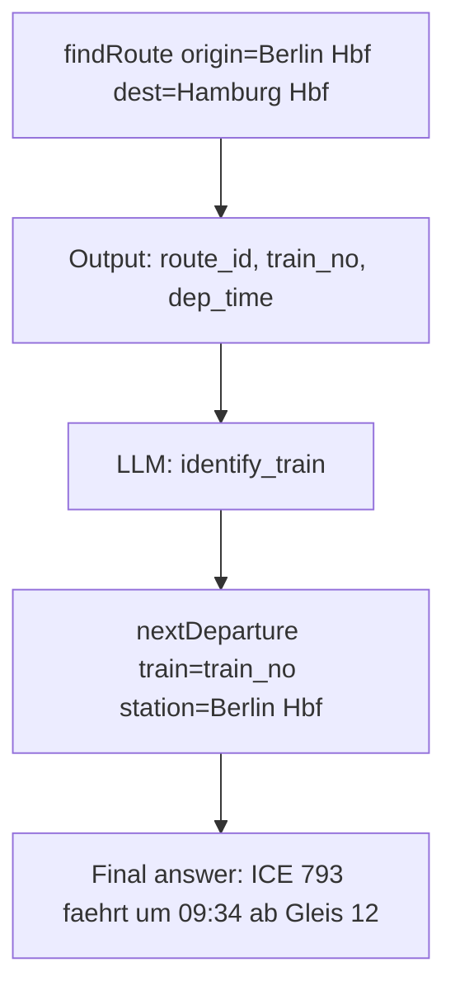

> 2026-05-24 · FlowMCP Team · #release #v4 #skills #selections #pipes

FlowMCP v4 closes the gap between "deterministic" and "LLM". Skills bring their own parameter reference along. Selections curate tools across namespaces. Pipes chain outputs into the inputs of the next tool. This post explains why these three primitives belong together — and which lab test triggered them.

## Why v4?

Before v4, an AI had to call schemas one by one and handle composition itself. That worked for simple requests — *"What's the price of ETH right now?"* — and broke down on multi-step tasks — *"Which ETH validator earned the highest reward last month?"* The AI had to guess in which order to call which tools, which parameters to chain how, which enum values were valid. Hallucinations were the result.

FlowMCP v4 turns this around: the AI gets **tools for composing** — structured variables, deterministically inserted, while the power of LLM composition is preserved.

## Skills + Self-Contained Skill Pattern

The heart of v4 is a small but consequential insight. In an internal lab test, two skill variants were tested against LLMs:

- **Enriched skills** (full parameter table, enum values, concrete example): **5 out of 5 successful**.
- **Reduced skills** (name + description only): **0 out of 5 successful**.

The errors in the reduced variant were consistent: wrong enum values, hallucinated fields, wrong parameter names, occasionally outright refusal. With full parameter information, these errors disappeared.

From this emerged the **Self-Contained Skill Pattern**: skills bring their own parameter reference along. Schema data comes **before** the workflow instructions. The AI doesn't guess, it chooses from documented options.

A skill in v4 looks like this:

```yaml
# Skill: "berlin-transit-research"
inputs:
  origin: string
  destination: string
  date: iso-date
prefill:
  feed_url: "https://www.vbb.de/vbbgtfs"
  agency_id: "vbb"
tools:
  - sqlite-gtfs.findRoute
  - sqlite-gtfs.nextDeparture
```

The LLM sees `origin`, `destination`, `date` as variable — the rest is deterministic. `feed_url` and `agency_id` are not guessed but prefilled.

The result: **structured variables, deterministically inserted — and the power of LLM composition is preserved.**

## Selections — Cherry-Picking Across Namespaces

Selections are curated lists of tools from different schemas. They make "favorite toolsets" per use case visible and can be combined with skills via prefill.

```yaml
# Selection: "mobility-stack"
namespaces:
  - sqlite-gtfs
  - overpass-osm
  - dwd-weather
tools:
  - sqlite-gtfs.findRoute
  - overpass-osm.nearbyStops
  - dwd-weather.forecast
```

<!-- snapshot:2026-05 — Tool-Count zum Veroeffentlichungs-Zeitpunkt. Aktuelle Stats: repos/flowmcp-schemas-public/stats.json -->
A selection is a layer on top of the schema library. Instead of showing the AI 3,100+ tools and letting it combine them itself, a selection gives a pre-curated answer: "These five tools belong together for mobility requests."

Selections are the combinatorics lever: schemas live in their own namespaces (Crypto, Open Data, Weather), and a selection cuts straight across.

## Output Schema + Pipes

v4 schemas declare a structured output schema. From this schema, pipes can be built: the output of tool A becomes the modified input for tool B.



The pipe is deterministic where fields map directly (output field `train_no` → input field `train`). It is LLM-driven where interpretation is needed (which of the three trains in the list is the "fastest"?). Output schemas make the deterministic parts predictable — the LLM parts stay where they are needed.

```javascript
// Pipe run (abbreviated)
const route = await flowmcp.call('sqlite-gtfs.findRoute', { origin, destination });
const train = await llm.pick('identify_train', { from: route.trains, criterion: 'fastest' });
const departure = await flowmcp.call('sqlite-gtfs.nextDeparture', { train, station: origin });
```

## How They Work Together

Skills, Selections, and Pipes are not three isolated features — they build on each other.

A skill with a prefilled selection that chains three tools via a pipe:

```yaml
skill: "berlin-event-route"
inputs:
  event_name: string
  event_date: iso-date
selection: "mobility-stack"
pipe:
  - tool: eventbrite.search
    input: { name: "{{event_name}}", date: "{{event_date}}" }
    output: { venue, lat, lon }
  - tool: overpass-osm.nearbyStops
    input: { lat: "{{venue.lat}}", lon: "{{venue.lon}}", radius_m: 800 }
    output: { stops[] }
  - tool: sqlite-gtfs.findRoute
    input: { destination: "{{stops[0].id}}", date: "{{event_date}}" }
```

The AI gets this skill as a single tool. It doesn't have to guess in which order to call, which parameters to draw from which output, which selection to activate. It supplies `event_name` and `event_date` — the rest runs deterministically.

## Data Security

Because v4 inserts parameters deterministically instead of letting the LLM
improvise them, every tool call can be checked before it leaves the system.
Inputs are validated against the schema, and the structured pipe makes it
explicit which field flows into which downstream request — so a security
review can reason about data flow instead of guessing. Determinism is not
only about reliability; it is also what makes the call surface auditable.

## Next Steps

v4 is the structural foundation. Three near-term follow-ups:

- **v4.1 — GTFS as the first data-class add-on.** How an external toolkit (`gtfs-sqlite-toolkit`) extends FlowMCP and provides public-transit data as an audited schema. *(Follow-up blog post in preparation.)*
- **The add-on concept in general.** How to build your own add-ons, with capability-driven auto-injection and a quality seal.
- **Output determinism vs. LLM variability as an open question.** Skills + Pipes shift the hallucination question from "where does hallucination happen?" to "how much LLM is actually needed?" This question gets its own post.

Grading lives as a separate module with its own documentation area
([/grading/](/grading/overview/)). Externally there is only one number to
track — the FlowMCP version; the grading standard is referenced by name,
not by a second version number.

---

### Sources

- FlowMCP Specification: [Skills](/specification/skills/), [Selections](/specification/selections/), [Prefill](/specification/prefill/), [Resources](/specification/resources/), [Output Schema](/specification/output-schema/)
- CHANGELOG v4.0.0 (Skills, Selections, Output Schema, Pipes)
- Internal lab test on the Self-Contained Skill Pattern (5/5 vs 0/5 success rate)

> 📖 Read also: *FlowMCP v4.1 — GTFS as the first data class with its own add-on* (in preparation)
