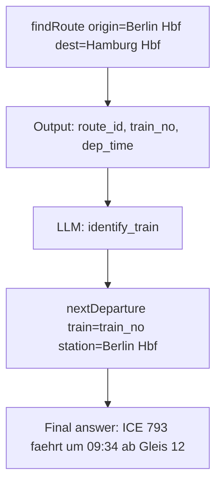

> 2026-05-24 · FlowMCP Team · #release #v4 #skills #selections #pipes

FlowMCP v4 schließt die Lücke zwischen "deterministisch" und "LLM". Skills bringen ihre eigene Parameter-Referenz mit. Selections kuratieren Tools über Namespaces hinweg. Pipes verketten Outputs zu Inputs des nächsten Tools. Dieser Beitrag erklärt, warum diese drei Primitive zusammengehören — und welcher Labortest sie ausgelöst hat.

## Warum v4?

Vor v4 musste eine AI Schemas einzeln aufrufen und die Komposition selbst übernehmen. Das funktionierte für simple Anfragen — *"Welcher Preis hat ETH gerade?"* — und brach bei mehrstufigen Aufgaben — *"Welcher ETH-Validator hat im letzten Monat den höchsten Reward erzielt?"* Die AI musste raten, in welcher Reihenfolge sie welche Tools aufruft, welche Parameter sie wie verkettet, welche Enum-Werte gültig sind. Halluzinationen waren die Folge.

FlowMCP v4 dreht das um: die AI bekommt **Werkzeuge zum Komponieren** — strukturierte Variablen, deterministisch eingefügt, die Power von LLM-Komposition bleibt erhalten.

## Skills + Self-Contained Skill Pattern

Das Herzstück von v4 ist eine kleine, aber folgenreiche Erkenntnis. In einem internen Labortest wurden zwei Skill-Varianten gegen LLMs getestet:

- **Angereicherte Skills** (vollständige Parameter-Tabelle, Enum-Werte, konkretes Beispiel): **5 von 5 erfolgreich**.
- **Reduzierte Skills** (nur Name + Beschreibung): **0 von 5 erfolgreich**.

Die Fehler in der reduzierten Variante waren konsistent: falsche Enum-Werte, halluzinierte Felder, falsche Parameter-Namen, vereinzelt komplette Verweigerung. Mit voller Parameter-Information verschwanden diese Fehler.

Daraus entstand das **Self-Contained Skill Pattern**: Skills bringen ihre eigene Parameter-Referenz mit. Schema-Daten stehen **vor** den Workflow-Instruktionen. Die AI rät nicht, sondern wählt aus dokumentierten Optionen.

Ein Skill in v4 sieht so aus:

```yaml
# Skill: "berlin-transit-research"
inputs:
  origin: string
  destination: string
  date: iso-date
prefill:
  feed_url: "https://www.vbb.de/vbbgtfs"
  agency_id: "vbb"
tools:
  - sqlite-gtfs.findRoute
  - sqlite-gtfs.nextDeparture
```

Die LLM sieht `origin`, `destination`, `date` als variabel — der Rest ist deterministisch. `feed_url` und `agency_id` werden nicht erraten, sondern vorgefertigt.

Das Resultat: **strukturierte Variablen, deterministisch eingefügt — und die Power von LLM-Komposition bleibt erhalten.**

## Selections — Cherry-Picking über Namespaces

Selections sind kuratierte Listen von Tools aus verschiedenen Schemas. Sie machen "Lieblings-Toolsets" pro Use-Case sichtbar und sind mit Skills via Prefill kombinierbar.

```yaml
# Selection: "mobility-stack"
namespaces:
  - sqlite-gtfs
  - overpass-osm
  - dwd-weather
tools:
  - sqlite-gtfs.findRoute
  - overpass-osm.nearbyStops
  - dwd-weather.forecast
```

<!-- snapshot:2026-05 — Tool-Count zum Veroeffentlichungs-Zeitpunkt. Aktuelle Stats: repos/flowmcp-schemas-public/stats.json -->
Eine Selection ist eine Schichtung über der Schema-Library. Statt der AI 3.100+ Tools zu zeigen und sie selbst kombinieren zu lassen, gibt eine Selection eine vorkurierte Antwort: "Diese fünf Tools gehören für Mobility-Anfragen zusammen."

Selections sind der Kombinatorik-Hebel: Schemas leben in eigenen Namespaces (Crypto, Open Data, Weather), eine Selection schneidet quer durch.

## Output-Schema + Pipes

v4-Schemas deklarieren ein strukturiertes Output-Schema. Aus diesem Schema lassen sich Pipes bauen: der Output von Tool A wird zum modifizierten Input für Tool B.



Die Pipe ist deterministisch, wo Felder direkt mappen (Output-Feld `train_no` → Input-Feld `train`). Sie ist LLM-gesteuert, wo Interpretation nötig ist (welche der drei Trains in der Liste ist der "schnellste"?). Output-Schemas machen die deterministischen Teile vorhersagbar — die LLM-Teile bleiben dort, wo sie gebraucht werden.

```javascript
// Pipe-Run (verkürzt)
const route = await flowmcp.call('sqlite-gtfs.findRoute', { origin, destination });
const train = await llm.pick('identify_train', { from: route.trains, criterion: 'fastest' });
const departure = await flowmcp.call('sqlite-gtfs.nextDeparture', { train, station: origin });
```

## Zusammenspiel

Skills, Selections und Pipes sind nicht drei isolierte Features — sie bauen aufeinander auf.

Ein Skill mit prefilled Selection, der per Pipe drei Tools verkettet:

```yaml
skill: "berlin-event-route"
inputs:
  event_name: string
  event_date: iso-date
selection: "mobility-stack"
pipe:
  - tool: eventbrite.search
    input: { name: "{{event_name}}", date: "{{event_date}}" }
    output: { venue, lat, lon }
  - tool: overpass-osm.nearbyStops
    input: { lat: "{{venue.lat}}", lon: "{{venue.lon}}", radius_m: 800 }
    output: { stops[] }
  - tool: sqlite-gtfs.findRoute
    input: { destination: "{{stops[0].id}}", date: "{{event_date}}" }
```

Die AI bekommt diesen Skill als ein Werkzeug. Sie muss nicht raten, in welcher Reihenfolge zu rufen, welche Parameter aus welchem Output zu ziehen, welche Selection zu aktivieren. Sie liefert `event_name` und `event_date` — der Rest läuft deterministisch.

## Nächste Schritte

v4 ist die strukturelle Grundlage. Drei nähere Folgeschritte:

- **v4.1 — GTFS als erstes Datenklasse-Add-on.** Wie ein externes Toolkit (`gtfs-sqlite-toolkit`) FlowMCP erweitert und ÖPNV-Daten als auditiertes Schema bereitstellt. *(Folge-Blogpost in Vorbereitung.)*
- **Add-on-Konzept allgemein.** Wie eigene Add-ons gebaut werden, mit Capability-Driven Auto-Injection und Quality-Seal.
- **Output-Determinismus vs. LLM-Variabilität als offene Frage.** Skills + Pipes verschieben die Halluzinations-Frage von "wo wird halluziniert?" zu "wieviel LLM ist eigentlich nötig?" Diese Frage bekommt ihren eigenen Beitrag.

---

### Quellen

- FlowMCP Specification: [Skills](/de/specification/skills/), [Selections](/de/specification/selections/), [Prefill](/de/specification/prefill/), [Resources](/de/specification/resources/), [Output Schema](/de/specification/output-schema/)
- CHANGELOG v4.0.0 (Skills, Selections, Output-Schema, Pipes)
- Interner Labortest zum Self-Contained Skill Pattern (5/5 vs 0/5 Erfolgsrate)

> 📖 Lies auch: *FlowMCP v4.1 — GTFS als erste Datenklasse mit eigenem Add-on* (in Vorbereitung)
