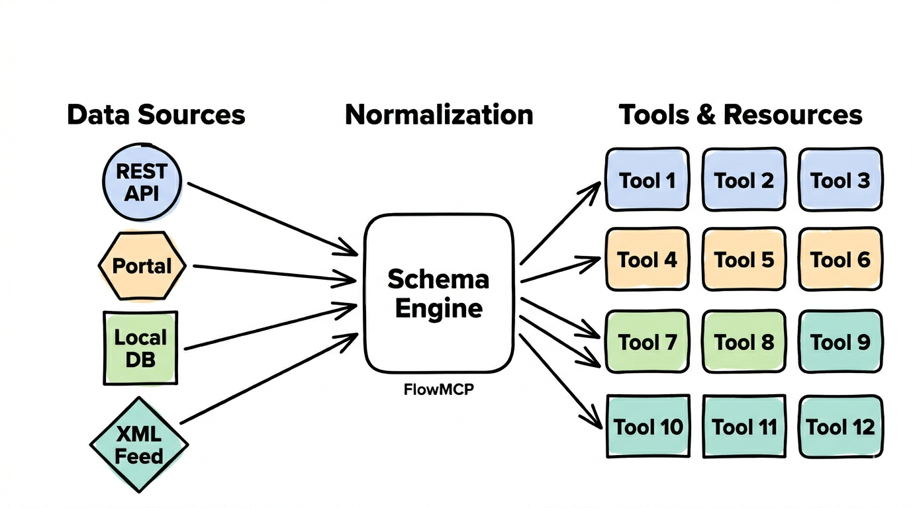

## The Problem

There is a vast amount of open data in Germany and Europe — transit schedules, weather data, government records, geodata, environmental data. But it is scattered across hundreds of portals and interfaces, in different formats, with varying quality and behind different access methods.

For a human, finding and using the right data is tedious. For an AI, it is nearly impossible — without prior preparation.

## Our Solution

We make open data usable for AI agents through a schema system. Each schema describes how to access a data source — and brings it to a common standard.

**We do not change the data sources.** We adapt to them. The schema translates between the data source and the agent.

## The Goal

> **Build your own agent in 5 minutes.**

We provide validated schemas. You combine them into an agent that answers your questions with real data. Open source, self-hostable, accessible to everyone.

That is our challenge — and we are working to make it a reality. Our schemas lay the foundation. The AI can adapt them and the user can develop them further for their needs.

## Who is this for?

| Audience | Description |
|----------|-------------|
| **Individuals** | Decision support with real data — e.g. route planning, weather, local information |
| **Government and public sector** | A starting point for making open data structurally accessible — not a finished product, but a foundation to build on |
| **Developers** | Build your own agents, customize schemas, contribute to the ecosystem |

## Why Schemas?

An AI without prior knowledge would have to analyze each data source from scratch — an enormous token cost and energy expenditure on every call. Our schema preparation is a **one-time investment**: once described, usable by every AI. This saves energy and costs — by a **factor of 10**.

More about this and our convictions: [Why We Do This →](/warum/)

## A Fast-Growing Market

AI agents are developing rapidly. [OpenClaw](https://docs.openclaw.ai) — an open-source AI assistant gateway — has existed only since November 2025 and has already reached over 330,000 GitHub stars, overtaking the Linux operating system (225,000 stars) in less than four months.

The industry is working on security guidelines so that companies and government agencies can also work with AI agents. Our contribution: preparing and validating datasets so AI agents can use them.

## Technical Openness

Our software is **model-agnostic**: It runs with any LLM. We optimize agents for one model (a necessary decision for the best possible quality), but operation on other models is easily possible.

It is also **client-agnostic**: Any MCP-compatible client or CLI can use our schemas — you have free choice. More at [MCP Clients & CLI](/mcp-clients/).

## Where does this come from?

FlowMCP started as a way to make public data sources accessible to AI agents. Today, it provides a complete framework — from schema definition to agent integration. More at [Schemas and Tools](/schemas-and-tools/)
