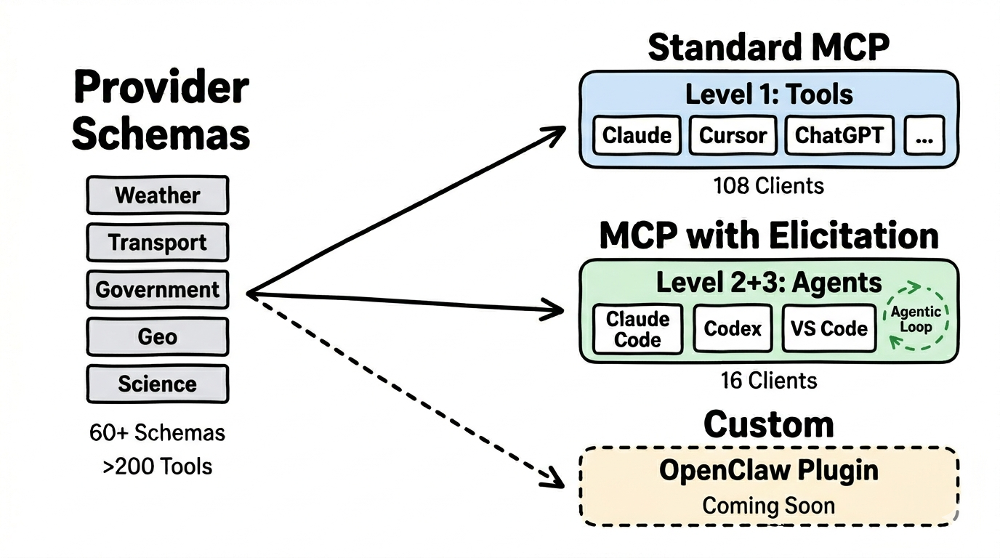

## MCP — The Connecting Protocol

The **Model Context Protocol (MCP)** is the standard through which AI clients access tools. It defines how tools are described, called, and how results are returned. Over 100 clients support MCP already — from Claude to ChatGPT to Cursor.

Our schemas are based on MCP and work with any compatible client. You are not locked into any specific provider.

## Compatibility Table

Not every client can do everything. Capabilities depend on which MCP features the client supports:

| Level | What is supported | Number of Clients | Examples |
|-------|------------------|------------------|----------|
| **Level 1: Tools** | Individual tool calls, Resources, Prompts | 46+ clients | Claude, ChatGPT, Cursor, VS Code Copilot, Cline, Continue |
| **Level 2+3: Elicitation** | Everything from Level 1 + Agent can ask follow-up questions | 16 clients | Claude Code, Claude Desktop, OpenClaw, Codex, Cursor, Postman |
| **Custom CLI** | Command-line interfaces for direct access | FlowMCP CLI, OpenClaw Plugin | For developers and automation |

What the levels mean: [Agents and Architectures →](/basics/agents/)

**As of:** March 2026. Current list: [modelcontextprotocol.io/clients](https://modelcontextprotocol.io/clients)

## Clients with Elicitation (Level 2+3)

These 16 clients support Elicitation — the agent can ask follow-up questions for better answers:

1. AIQL TUUI
2. Claude Code
3. Codex
4. Cursor
5. fast-agent
6. Glama
7. goose
8. Joey
9. mcp-agent
10. mcp-use
11. MCPJam
12. Memgraph Lab
13. Postman
14. Tambo
15. VS Code GitHub Copilot
16. VT Code

Why elicitation matters: [Agents and Architectures → Elicitation](/basics/agents/#elicitation-when-the-agent-asks-back)

## CLI — Command-Line Interfaces

Besides graphical clients, there are command-line interfaces that are particularly relevant for developers and automation.

### FlowMCP CLI

The fastest way for developers to find schemas and try tools:

- `flowmcp list` — Show all available schemas
- `flowmcp search <query>` — Search schemas by keyword
- `flowmcp add <schema>` — Activate a schema
- `flowmcp call <tool> '{...}'` — Call a tool directly

Documentation: [CLI Usage](/docs/usage/cli/)

### OpenClaw

[OpenClaw](https://docs.openclaw.ai) is an open-source AI assistant gateway with a plugin system. The special feature: **Cron Jobs** — recurring queries that run automatically. For example, a daily mobility recommendation every morning at 7:30 AM.

More: [Integration →](/roadmap/integration/)

## Which Client for Whom?

| You are... | Recommended Client | Why |
|-----------|-------------------|-----|
| **Individual** | OpenClaw (WhatsApp, Telegram, Slack) or Claude Desktop | Where you already are, Cron Jobs for automation |
| **Developer** | Claude Code, Cursor, or FlowMCP CLI | Direct control, fast testing, IDE integration |
| **Enterprise** | NemoClaw (enterprise security) | Deny-by-default policies, sandbox isolation, audit trail |

Details on enterprise integration: [Integration → NemoClaw](/roadmap/integration/#enterprise-security-with-nemoclaw)
