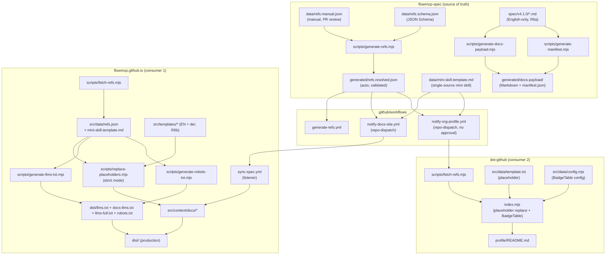

This page describes how a single manual change to `data/refs.manual.json` in the spec repo automatically produces updated docs, org profile, llms.txt variants, and robots.txt.

## Architecture rules R1-R8

| Rule | Short | Detail |
|-------|------|--------|
| **R1** | Information authority | The spec decides what is displayed |
| **R2** | Payload-first | Only exchange is via `manifest.json` + spec files |
| **R3** | Build trigger | Spec push triggers the docs build automatically |
| **R4** | No interpretation | The docs repo MUST NOT reinterpret spec content |
| **R5** | No abandoned content | Legacy files (e.g. `route-tests.md`) are filtered |
| **R6a** | Spec repo English-only | No DE mirrors in `spec/v4.1.0/`, no `translations.*` fields in the manifest |
| **R6b** | Docs site MAY have DE versions | `flowmcp.github.io/src/content/docs/de/...` is allowed, but is NOT a spec mirror — independent text with placeholder system |
| **R7** | Single source of truth | `flowmcp-spec/data/refs.manual.json` (manual) + auto-generated `refs.resolved.json` |
| **R8** | Placeholder-first | All consumers read values from the interface JSON. Hardcoded versions/URLs are forbidden. Build scripts fail on missing placeholders. |

## Pipeline diagram

## refs.manual.json — maintenance guide

### Who may maintain it

`flowmcp-spec/data/refs.manual.json` is the **only** manually maintained source for versions, imports and URLs.

| Aspect | Value |
|--------|-------|
| Path | `flowmcp-spec/data/refs.manual.json` |
| Maintenance | Pull request with review (branch protection on `main`) |
| Protection | JSON Schema `flowmcp-spec/data/refs.schema.json` validates structure + regex |
| Visibility | Open in the spec repo (not in `generated/`) |

### JSON Schema reference

Validation runs in two steps:

1. **CI workflow** `generate-refs.yml` triggers on pushes that touch `data/refs.manual.json`
2. **Resolver** `scripts/generate-refs.mjs` validates against `refs.schema.json` and the import regex `^github:FlowMCP/[\w-]+(#[\w./-]+)?$`

On a violation the resolver aborts — no `refs.resolved.json`, no notify, no consumer builds.

### Required fields

| Field path | Validation |
|------------|------------|
| `schemaVersion` | `^refs/\d+\.\d+\.\d+$` |
| `spec.currentVersion` | `^4\.\d+\.\d+$` |
| `spec.recommendedRelease` | `^v\d+\.\d+\.\d+$` |
| `spec.miniSkillTemplate` | `^data/.*\.md$` |
| `imports.*` | `^github:FlowMCP/[\w-]+(#[\w./-]+)?$` |
| `docs.canonical` | `^https://[a-z0-9.-]+(/.*)?$` |
| `llmsFiles.*` | URL regex |

## Pipeline consumers

The following components read `refs.resolved.json` from the spec repo:

| Consumer | Repo | Function |
|----------|------|----------|
| Docs website | `flowmcp.github.io` | Templates with `{{spec.currentVersion}}`, `{{imports.cli.github}}`, etc. |
| Org profile | `.github` (org profile) | `profile/README.md` with version and spec URL placeholders |
| llms.txt variants | `flowmcp.github.io` | `dist/llms.txt`, `dist/docs-llms.txt`, `dist/llms-full.txt` from refs |
| robots.txt | `flowmcp.github.io` | `dist/robots.txt` from `refs.json.robotsTxt.publishedLlmsFiles` |
| Mini skill | `flowmcp.github.io` (hosted) / `flowmcp-spec` (single source) | `data/mini-skill.template.md` with placeholders |

## Troubleshooting

### My placeholder was not replaced

**Symptom:** A `{{key.subkey}}` string appears in the built `dist/`.

**Causes and fixes:**

1. The placeholder key does not exist in `refs.resolved.json` — check spelling and JSON path
2. The template is not under `src/templates/` — the replacer only processes that folder
3. The build did not reach strict mode — check `npm run check:placeholders`

### Org profile shows the old version

**Symptom:** `profile/README.md` still shows v4.0.0 although the spec is at v4.1.0.

**Causes and fixes:**

1. `notify-org-profile.yml` did not fire — check the spec workflow runs
2. `.github/.github/workflows/sync-refs.yml` listener is not active
3. `fetch-refs.mjs` in `.github` is not in the build chain — check the `index.mjs` order

### Sync does not complete

**Symptom:** A spec push does not trigger a docs build.

**Causes and fixes:**

1. Branch protection blocks direct push — push via pull request
2. `notify-docs-site.yml` token expired — check the GitHub repo secrets
3. The `sync-spec.yml` listener in the docs repo is not installed

## Version lifecycle

How a new minor version (e.g. v4.2.0) is rolled out:

1. **Spec repo:** hard copy `cp -r spec/v4.1.0 spec/v4.2.0`
2. **Spec repo:** switch generators to `SPEC_VERSION = '4.2.0'`
3. **Spec repo:** `CHANGELOG.md` `## v4.2.0 — YYYY-MM-DD` with the release date
4. **Spec repo:** `package.json` `"version": "4.2.0"`
5. **Spec repo:** update `data/refs.manual.json`:
   - `spec.currentVersion: "4.2.0"`
   - `spec.recommendedRelease: "v4.2.0"`
   - `imports.cli: "github:FlowMCP/flowmcp-cli#v4.2.0"`
   - `imports.core: "github:FlowMCP/flowmcp-core#v4.2.0"`
6. **Spec repo:** pull request → review → merge
7. **CI:** `generate-refs.yml` validates and generates `refs.resolved.json`
8. **CI:** `notify-docs-site.yml` + `notify-org-profile.yml` fire via repo-dispatch
9. **Docs / org profile:** consumers pull the new refs automatically, the build runs
10. **Spec repo:** git tag `v4.2.0` + GitHub release

The old `v4.1.0` directory stays untouched as a historical release.

:::note
The R6a–R6b separation also applies to new versions: `spec/v4.2.0/` is English-only, the DE website under `src/content/docs/de/...` is updated in parallel.
:::
