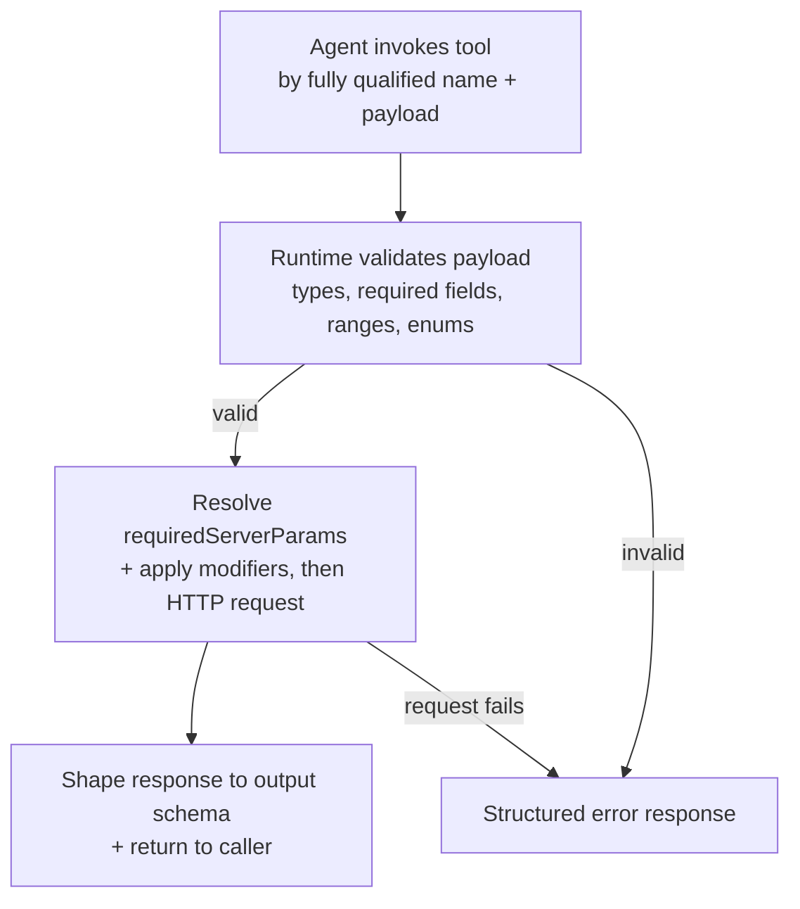
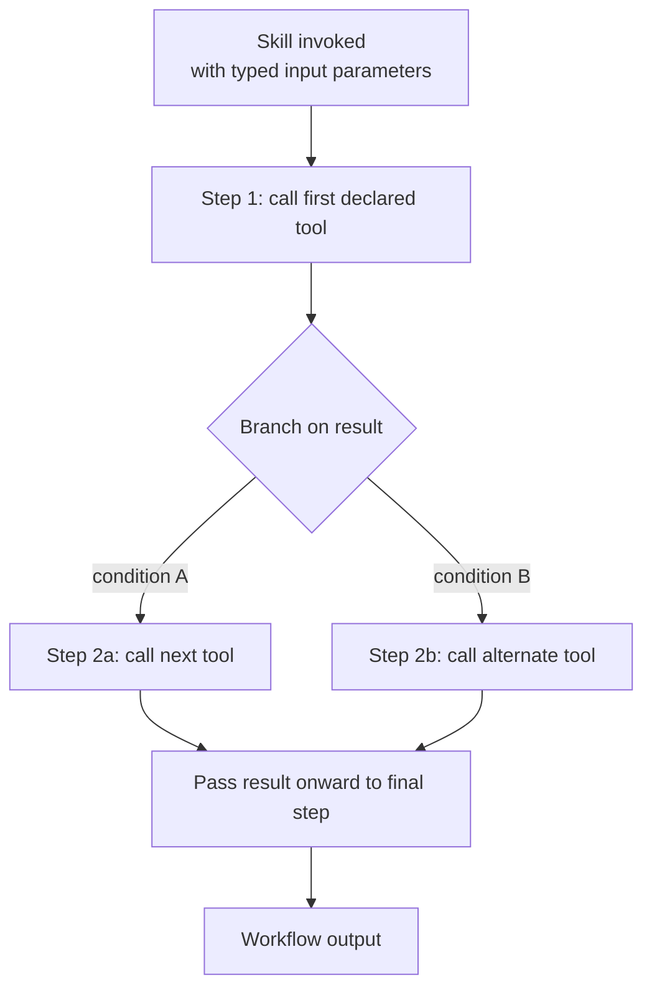

<!-- PAGEFIND-META-START -->
<span style="display:none" data-pagefind-meta="section">Concepts</span>
<!-- PAGEFIND-META-END -->

FlowMCP groups everything an AI agent needs into a small set of primitives: Tools, Resources, Prompts, Skills, and Agents. Tools, Resources, Prompts, and Skills live inside a [schema](/concepts/schemas/) and describe what one provider offers — only Tools are required, the rest come into play with more complex sources. Agents sit one level up: they combine tools from many schemas into a purpose-built unit. This page gives a brief, conceptual overview — for the full field definitions, validation rules, and examples, follow the spec links per section.

## Tools

A tool is a single, named operation that an AI agent can call. From the agent's perspective the tool is the smallest unit of action: pass typed inputs, receive a structured result. Under the hood the tool wraps one HTTP request to a data provider's API — but the agent does not need to know that. The tool description, parameter list, and result shape are all the agent sees. Each tool belongs to exactly one [schema](/concepts/schemas/), and a schema typically contains 2-8 tools.

### Tool Selection

Tools are not selected as a flat list. They flow through a funnel — from provider via schema and individual tools down to the curated Tool Set that an agent actually uses. Not every tool is needed for every task; the funnel is how relevance is enforced.


A Tool Set is the explicit list of tools an agent may call. It is part of the agent definition (see [Agents](#agents) below). The same tool can appear in many Tool Sets across many agents; the tool itself stays the same.

### Tool Execution Flow

A tool call goes through four stages. First, the agent (or client) invokes the tool by its fully qualified name with the input payload. Second, the FlowMCP runtime validates the payload against the parameter definitions in the schema — types, required fields, value ranges, enum membership. Third, if validation passes, the runtime resolves any `requiredServerParams` (e.g. API keys from the environment) and applies modifiers like header injection or path templating, then performs the HTTP request to the provider. Fourth, the response is shaped to match the declared output schema and returned to the caller. Errors at any stage produce a structured error response — never a raw exception.



The full step-by-step contract, including the modifier hooks (`preRequest`, `postRequest`), is documented in the spec: [FlowMCP Spec v4.1.0 — Tool Execution](/specification/overview/).

The quickest way to try a tool is via the FlowMCP CLI:

```bash
flowmcp search <provider>
flowmcp call <namespace.toolName> '{"param":"value"}'
```

The CLI handles validation, environment lookup, and HTTP execution end to end. For programmatic use, the same flow is available via the core API.

## Resources

A resource is a local dataset bundled with a schema, typically a SQLite database. The FlowMCP runtime loads the `.db` file and exposes each defined query as an MCP resource — no network calls, no API keys, no rate limits. Resources are ideal for bulk-downloaded open data such as company registers, transit schedules, or sanctions lists, where the data is large, rarely changes, and offline access matters.

Spec: [Resources](/specification/resources/).

## Prompts

A prompt is an explanatory text scoped to a namespace. Prompts teach an AI agent how a provider's tools work together — pagination patterns, error semantics, rate-limit guidance, how to combine endpoints. Prompts **explain**; they do not **instruct**. They are model-neutral, so any AI client benefits.

Spec: [Prompts](/specification/prompt-architecture/).

## Skills

A skill is a multi-step workflow instruction embedded in a schema. Where a prompt explains context, a skill tells an LLM exactly what to do, step by step: which tool to call first, how to pass the result onward, when to branch. Each skill declares its tool dependencies, defines typed input parameters, and records which model it was tested with.



Spec: [Skills](/specification/skills/).

## Agents

An agent is a purpose-driven composition that bundles tools from multiple providers into a single, testable unit. Where individual schemas wrap a single API, agents combine the right tools for a specific task — for example, a mobility agent might pull from a train-schedule schema, a weather schema, and a bike-sharing schema simultaneously. An agent has its own LLM, its own system prompt, and a curated tool set, and it runs an agentic loop — understand the question, pick a tool, evaluate the result, decide whether more information is needed.


FlowMCP recognises three usage architectures, from simple to complex: Level 1 (Tools Only — the client AI calls individual tools directly, no extra LLM), Level 2 (Sub-Agent — a specialised agent with its own LLM and agentic loop), Level 3 (Orchestration — a coordinator agent distributes work to multiple sub-agents). Not every request needs a full agent; many use cases are perfectly served by Level 1.


Spec: [Agents](/specification/agents/).

## Why These Layers Stay Separate

The primitives above all run on top of a deliberate separation: the FlowMCP engine, the schemas, and the data operators are three distinct layers, and each is responsible for a different thing. The engine moves and signs every request, schemas only declare how to reach a source, and the operator owns the data and its terms. Keeping these apart is what makes the model trustworthy — a community-contributed schema can never reach beyond its declaration, the engine audit covers every call the same way, and no provider's terms get silently reinterpreted along the path.

The canonical explanation of this three-layer model, including what FlowMCP deliberately does *not* do, lives on [Schemas](/concepts/schemas/).
