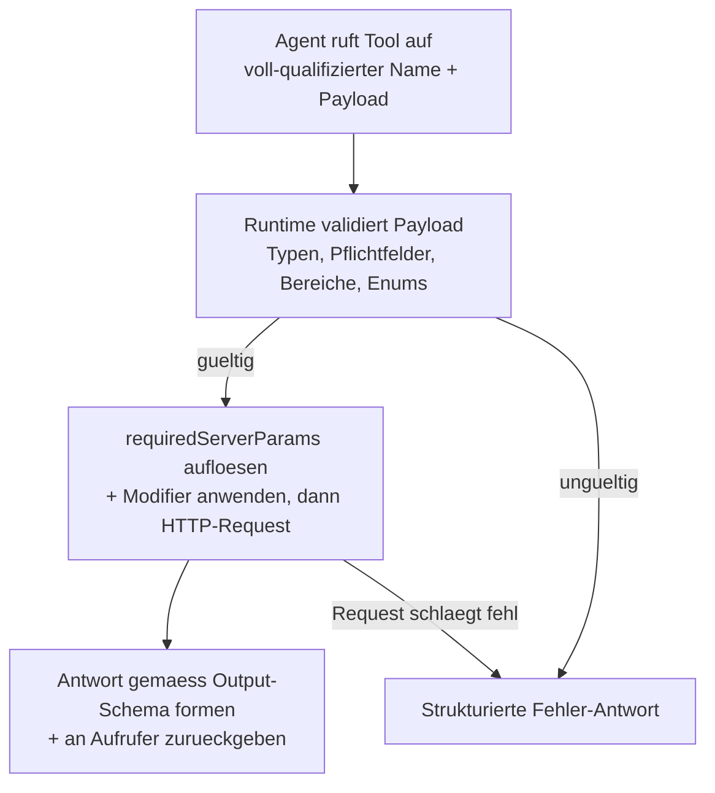
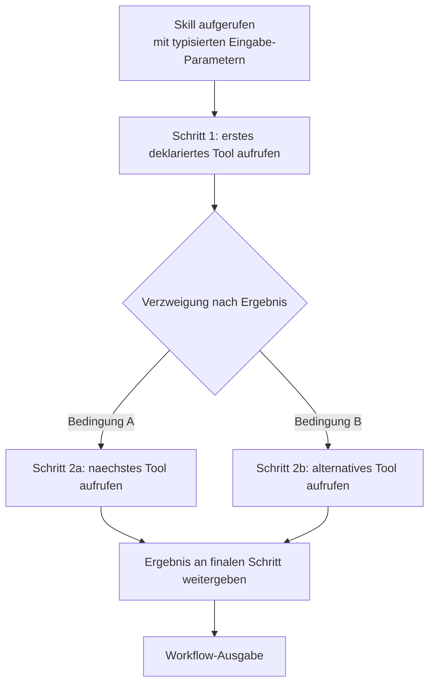

<!-- PAGEFIND-META-START -->
<span style="display:none" data-pagefind-meta="section">Concepts</span>
<!-- PAGEFIND-META-END -->

FlowMCP gruppiert alles, was ein KI-Agent braucht, in einen kleinen Satz von Primitiven: Tools, Resources, Prompts, Skills und Agents. Tools, Resources, Prompts und Skills leben in einem [Schema](/de/concepts/schemas/) und beschreiben, was ein Anbieter bietet — nur Tools sind Pflicht, der Rest kommt bei komplexeren Quellen ins Spiel. Agents sitzen eine Ebene darueber: Sie kombinieren Tools aus mehreren Schemas zu einer aufgaben-spezifischen Einheit. Diese Seite gibt einen kurzen, konzeptionellen Ueberblick — fuer die vollstaendigen Felddefinitionen, Validierungsregeln und Beispiele folgen Sie den Spec-Links pro Abschnitt.

## Tools

Ein Tool ist eine einzelne, benannte Operation, die ein KI-Agent aufrufen kann. Aus Sicht des Agenten ist das Tool die kleinste Handlungs-Einheit: typisierte Eingaben uebergeben, strukturiertes Ergebnis empfangen. Unter der Haube kapselt das Tool einen einzelnen HTTP-Request an die API eines Daten-Anbieters — der Agent muss das aber nicht wissen. Die Tool-Beschreibung, Parameter-Liste und Result-Form sind alles, was der Agent sieht. Jedes Tool gehoert zu genau einem [Schema](/de/concepts/schemas/), und ein Schema enthaelt typischerweise 2-8 Tools.

### Tool-Auswahl

Tools werden nicht als flache Liste ausgewaehlt. Sie laufen durch einen Funnel — vom Provider ueber Schema und einzelne Tools bis zum kuratierten Tool Set, das ein Agent tatsaechlich nutzt. Nicht jedes Tool wird fuer jede Aufgabe gebraucht; der Funnel erzwingt Relevanz.


Ein Tool Set ist die explizite Liste an Tools, die ein Agent aufrufen darf. Es ist Teil der Agent-Definition (siehe [Agents](#agents) weiter unten). Dasselbe Tool kann in vielen Tool Sets ueber viele Agents auftauchen; das Tool selbst bleibt gleich.

### Tool-Execution-Flow

Ein Tool-Aufruf durchlaeuft vier Stufen. Erstens ruft der Agent (oder Client) das Tool mit seinem voll-qualifizierten Namen und dem Eingabe-Payload auf. Zweitens validiert die FlowMCP-Runtime den Payload gegen die Parameter-Definitionen im Schema — Typen, Pflichtfelder, Wertebereiche, Enum-Zugehoerigkeit. Drittens, wenn die Validierung passiert, loest die Runtime `requiredServerParams` auf (z.B. API-Keys aus der Umgebung), wendet Modifier wie Header-Injection oder Path-Templating an und fuehrt den HTTP-Request zum Anbieter aus. Viertens wird die Antwort gemaess dem deklarierten Output-Schema geformt und an den Aufrufer zurueckgegeben. Fehler in jeder Stufe produzieren eine strukturierte Fehler-Antwort — nie eine rohe Exception.



Den vollstaendigen Schritt-fuer-Schritt-Kontrakt inkl. Modifier-Hooks (`preRequest`, `postRequest`) dokumentiert die Spezifikation: [FlowMCP Spec v4.1.0 — Tool Execution](/specification/overview/).

Der schnellste Weg, ein Tool auszuprobieren, ist die FlowMCP CLI:

```bash
flowmcp search <provider>
flowmcp call <namespace.toolName> '{"param":"wert"}'
```

Die CLI uebernimmt Validierung, Environment-Lookup und HTTP-Execution End-to-End. Fuer programmatische Nutzung steht derselbe Flow ueber die Core-API zur Verfuegung.

## Resources

Eine Resource ist ein lokales Dataset, das mit einem Schema gebuendelt wird, typischerweise eine SQLite-Datenbank. Die FlowMCP-Runtime laedt die `.db`-Datei und stellt jede definierte Abfrage als MCP-Resource bereit — keine Netzwerk-Calls, keine API-Keys, keine Rate-Limits. Resources eignen sich ideal fuer Bulk-Open-Data wie Unternehmensregister, Fahrplaene oder Sanktionslisten, wo die Daten gross sind, sich selten aendern und Offline-Zugriff zaehlt.

Spec: [Resources](/specification/resources/).

## Prompts

Ein Prompt ist ein erklaerender Text, der an einen Namespace gebunden ist. Prompts erklaeren einem KI-Agenten, wie die Tools eines Anbieters zusammen funktionieren — Pagination-Muster, Fehler-Semantik, Hinweise zu Rate-Limits, wie Endpoints kombiniert werden. Prompts **erklaeren**, sie **instruieren** nicht. Sie sind modellneutral, sodass jeder AI-Client profitiert.

Spec: [Prompts](/specification/prompt-architecture/).

## Skills

Ein Skill ist eine mehrstufige Workflow-Instruktion, die im Schema eingebettet ist. Waehrend ein Prompt Kontext erklaert, sagt ein Skill einem LLM exakt, was zu tun ist, Schritt fuer Schritt: welches Tool zuerst aufgerufen wird, wie das Ergebnis weitergegeben wird, wann verzweigt wird. Jeder Skill deklariert seine Tool-Abhaengigkeiten, definiert typisierte Eingabe-Parameter und vermerkt, mit welchem Modell er getestet wurde.



Spec: [Skills](/specification/skills/).

## Agents

Ein Agent ist eine aufgaben-getriebene Komposition, die Tools aus mehreren Anbietern zu einer einzelnen, testbaren Einheit buendelt. Waehrend einzelne Schemas eine einzelne API kapseln, kombinieren Agents die richtigen Tools fuer eine konkrete Aufgabe — ein Mobility-Agent koennte etwa Tools aus einem Fahrplan-Schema, einem Wetter-Schema und einem Bike-Sharing-Schema gleichzeitig ziehen. Ein Agent hat sein eigenes LLM, einen eigenen System-Prompt und ein kuratiertes Tool-Set und durchlaeuft eine Agentic Loop — Frage verstehen, Tool waehlen, Ergebnis bewerten, entscheiden, ob mehr Information noetig ist.


FlowMCP kennt drei Nutzungs-Architekturen, von einfach zu komplex: Stufe 1 (Tools Only — die KI des Nutzers ruft Tools direkt auf, kein zusaetzliches LLM), Stufe 2 (Sub-Agent — ein spezialisierter Agent mit eigenem LLM und Agentic Loop), Stufe 3 (Orchestrierung — ein Koordinator-Agent verteilt Arbeit an mehrere Sub-Agents). Nicht jede Anfrage braucht einen vollen Agent; viele Use-Cases sind mit Stufe 1 perfekt bedient.


Spec: [Agents](/specification/agents/).

## Warum diese Ebenen getrennt bleiben

Die obigen Primitive laufen alle auf einer bewussten Trennung: Die FlowMCP-Engine, die Schemas und die Daten-Betreiber sind drei eigenstaendige Ebenen, und jede ist fuer etwas anderes zustaendig. Die Engine bewegt und signiert jeden Request, Schemas deklarieren nur, wie eine Quelle erreicht wird, und der Betreiber besitzt die Daten und deren Bedingungen. Diese Trennung macht das Modell vertrauenswuerdig — ein Community-Schema kann nie ueber seine Deklaration hinausgreifen, das Engine-Audit deckt jeden Call gleich ab, und die Bedingungen eines Anbieters werden auf dem Weg nicht still umgedeutet.

Die kanonische Erklaerung dieses Drei-Ebenen-Modells, inkl. dem, was FlowMCP bewusst *nicht* tut, steht auf [Schemas](/de/concepts/schemas/).
