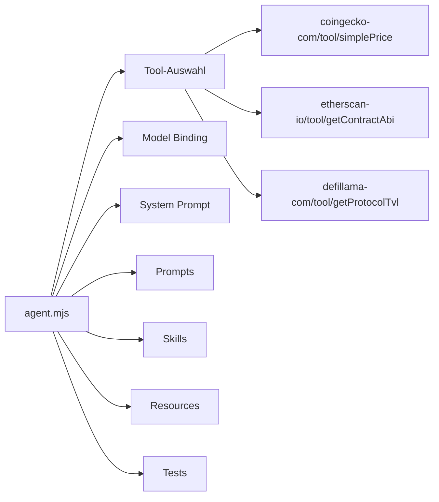

Agents sind zweckgerichtete Kompositionen, die Tools mehrerer Provider in einer einzigen, testbaren Einheit buendeln. Waehrend einzelne Schemas eine einzelne API wrappen, kombinieren Agents die richtigen Tools fuer eine bestimmte Aufgabe -- zum Beispiel koennte ein Crypto-Research-Agent gleichzeitig von CoinGecko, Etherscan und DeFi Llama abrufen.

:::note
Diese Seite behandelt die praktische Anleitung zum Erstellen von Agents. Fuer die vollstaendige Spezifikation und Validierungsregeln siehe [Agents-Spezifikation](/specification/agents).
:::

## Uebersicht

Ein Agent-Manifest (`agent.mjs`) deklariert alles, was der Agent braucht: welche Tools verwendet werden, welches Modell angesteuert wird, wie sich der Agent verhalten soll und wie seine Funktion verifiziert wird.



## Agent-Manifest

Jeder Agent wird durch eine `agent.mjs`-Datei mit `export const agent` definiert:

```javascript
export const agent = {
    name: 'crypto-research',
    version: 'flowmcp/3.0.0',
    description: 'Cross-provider crypto analysis agent',
    model: 'anthropic/claude-sonnet-4-5-20250929',
    systemPrompt: 'You are a crypto research agent...',
    tools: {
        'coingecko-com/tool/simplePrice': null,
        'coingecko-com/tool/coinMarkets': null,
        'etherscan-io/tool/getContractAbi': null,
        'defillama-com/tool/getProtocolTvl': null
    },
    prompts: {
        'research-guide': { file: './prompts/research-guide.mjs' }
    },
    skills: {
        'token-analysis': { file: './skills/token-analysis.mjs' }
    },
    resources: {},
    tests: [
        {
            _description: 'Token price lookup',
            input: 'What is the current price of Bitcoin?',
            expectedTools: ['coingecko-com/tool/simplePrice'],
            expectedContent: ['bitcoin', 'price', 'USD']
        },
        {
            _description: 'Contract analysis',
            input: 'Analyze the USDC contract on Ethereum',
            expectedTools: ['etherscan-io/tool/getContractAbi'],
            expectedContent: ['USDC', 'contract']
        },
        {
            _description: 'DeFi protocol TVL',
            input: 'What is the TVL of Aave?',
            expectedTools: ['defillama-com/tool/getProtocolTvl'],
            expectedContent: ['Aave', 'TVL']
        }
    ],
    sharedLists: ['evmChains']
}
```

## Slash-Regel

Tools, Prompts und Resources verwenden eine einheitliche Konvention: Keys mit `/` sind externe Referenzen (Wert `null`), Keys ohne `/` sind Inline-Definitionen.

| Key-Muster | Wert | Bedeutung |
|------------|------|-----------|
| Enthaelt `/` | `null` | Externe Referenz aus einem Provider-Schema |
| Ohne `/` | object | Inline-Definition, die dem Agent gehoert |

```javascript
tools: {
    'coingecko-com/tool/simplePrice': null,     // extern
    'customEndpoint': { method: 'GET', ... }    // inline
}
```

Skills sind die Ausnahme -- sie koennen keine Slash-Keys haben, da sie modellspezifisch sind und nicht ueber verschiedene LLMs hinweg geteilt werden koennen.

## Drei Inhaltsebenen

Agents trennen Zustaendigkeiten in drei verschiedene Ebenen, die bestimmen, wie der Agent denkt, versteht und handelt.

:::note[Persona]
**Feld:** `systemPrompt`

Wer der Agent IST. Definiert Persoenlichkeit, Expertise und Verhaltensgrenzen.

*"Du bist ein Crypto-Research-Analyst, der datengetriebene Einblicke liefert..."*
:::

:::note[Erklaerungen]
**Feld:** `prompts`

Wie Tools funktionieren. Liefert Kontext ueber Datenformate, API-Eigenheiten und Interpretationshilfen.

*"CoinGecko gibt Preise in der Basiswaehrung zurueck. Immer in USD umrechnen fuer Vergleiche..."*
:::

:::note[Anweisungen]
**Feld:** `skills`

Schritt-fuer-Schritt-Workflows. Fuehrt den Agent durch Multi-Tool-Sequenzen fuer komplexe Aufgaben.

*"Schritt 1: Token nach Name suchen. Schritt 2: OHLCV-Daten abrufen. Schritt 3: Metriken berechnen..."*
:::

| Ebene | Feld | Zweck | Beispiel |
|-------|------|-------|---------|
| Persona | `systemPrompt` | Wer der Agent IST | "Du bist ein Crypto-Research-Analyst..." |
| Erklaerungen | `prompts` | Wie Tools funktionieren | "CoinGecko gibt Preise zurueck in..." |
| Anweisungen | `skills` | Schritt-fuer-Schritt-Workflows | "Schritt 1: Token suchen. Schritt 2: OHLCV abrufen..." |

## Tool Cherry-Picking

Tools werden als Objekt-Keys mit dem vollstaendigen ID-Format deklariert: `namespace/type/name`. Externe Tools haben `null` als Wert. So kannst du genau die Tools auswaehlen, die ein Agent von jedem Provider braucht.

```
coingecko-com/tool/simplePrice        # Key im tools-Objekt, Wert: null
coingecko-com/tool/coinMarkets        # Weiteres Tool vom selben Provider
etherscan-io/tool/getContractAbi      # Tool von einem anderen Provider
defillama-com/tool/getProtocolTvl     # Noch ein anderer Provider
```

Nur die Tools auswaehlen, die dem Zweck des Agents dienen. Ein Crypto-Research-Agent braucht nicht jeden CoinGecko-Endpunkt -- `simplePrice` und `coinMarkets` koennten ausreichen.

## Agent-Tests

:::note
Jeder Agent muss mindestens 3 Tests haben. Das stellt sicher, dass Tool-Auswahl und Output-Qualitaet ueber verschiedene Nutzungsszenarien hinweg verifiziert werden.
:::

Tests validieren Agent-Verhalten auf drei Ebenen:

| Ebene | Feld | Was wird geprueft | Deterministisch? |
|-------|------|-------------------|-----------------|
| **Tool-Nutzung** | `expectedTools` | Hat der Agent die richtigen Tools aufgerufen? | Ja |
| **Inhalt** | `expectedContent` | Enthaelt die Ausgabe erwartete Stichwoerter? | Teilweise |
| **Qualitaet** | Manuelle Pruefung | Ist die Ausgabe koherent und nuetzlich? | Nein |

Jeder Testfall definiert einen Eingabe-Prompt, die Tools, die der Agent nutzen soll, und Stichwoerter, die die Antwort enthalten soll:

```javascript
{
    _description: 'Token price lookup',
    input: 'What is the current price of Bitcoin?',
    expectedTools: ['coingecko-com/tool/simplePrice'],
    expectedContent: ['bitcoin', 'price', 'USD']
}
```

- **`expectedTools`** ist deterministisch -- der Agent muss genau diese Tools fuer die gegebene Eingabe aufrufen.
- **`expectedContent`** ist eine Teilpruefung -- die Antwort sollte diese Strings enthalten, zusaetzlicher Inhalt ist ok.
- **Qualitaetspruefung** ist manuell -- die Ausgabe lesen und pruefen, ob sie als koherente Antwort Sinn ergibt.

## Verzeichnisstruktur

Jeder Agent lebt in seinem eigenen Verzeichnis innerhalb des `agents/`-Ordners des Katalogs:

```
agents/crypto-research/
├── agent.mjs              # Manifest (export const agent)
├── prompts/
│   └── research-guide.mjs
├── skills/
│   └── token-analysis.mjs
└── resources/             # Optionale eigene Datenbanken
```

Die `agent.mjs`-Datei ist der Einstiegspunkt. Prompts und Skills werden per relativem Pfad vom Manifest referenziert und folgen dem gleichen Format wie Schema-Level-Skills und Prompt-Architektur.
