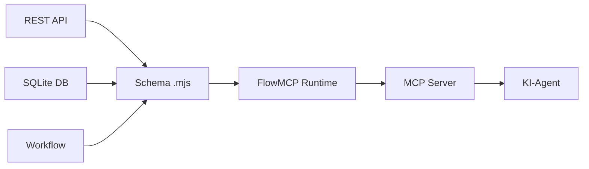

## Das Problem

KI-Agenten brauchen Tools — "Kryptopreise abrufen", "Wallet-Salden pruefen", "Open Data abfragen". Aber APIs sind chaotisch: unterschiedliche Authentifizierungsmethoden, URL-Strukturen, Antwortformate und Rate Limits. Jede Integration erfordert individuellen Servercode, Parametervalidierung, Fehlerbehandlung und Antwortformatierung.

Bei 5 APIs ist das muehsam. Bei 50 unwartbar. Bei 500 unmoeglich ohne systematischen Ansatz.

## Die Loesung

FlowMCP ist eine **Schema-basierte Normalisierungsschicht**, die jede Datenquelle in MCP-kompatible Tools transformiert. Du schreibst ein deklaratives `.mjs` Schema. FlowMCP uebernimmt Validierung, URL-Konstruktion, Authentifizierung und Antwortformatierung.

Kein individueller Servercode. Kein Boilerplate. Ein Schema pro Provider.



## Vier Primitive

FlowMCP v3.0.0 unterstuetzt vier Primitive in einer einzelnen Schema-Datei:

:::note[Tools]
REST API Endpoints (GET/POST/PUT/DELETE). Parameter auf URLs abbilden, Authentifizierung injizieren, Eingaben validieren. Das Kern-Primitiv.
:::

:::note[Resources]
Lokale SQLite-Datenbanken fuer Massendaten und Open Data. Schnelle schreibgeschuetzte Abfragen via Prepared Statements — keine Netzwerkaufrufe.
:::

:::note[Prompts]
Namespace-Beschreibungen, die erklaeren, wie Tools effektiv genutzt werden. KI-Agenten mit Domain-Kontext und Nutzungsmustern leiten.
:::

:::note[Skills]
Mehrstufige Workflow-Anweisungen. Wiederverwendbare Pipelines, die Tools und Resources zu uebergeordneten Operationen zusammensetzen.
:::

## Minimales Beispiel

Ein vollstaendiges, ausfuehrbares Schema — alles, was ein KI-Agent braucht, um die CoinGecko-Preis-API aufzurufen:

```javascript
export const main = {
    namespace: 'coingecko',
    name: 'CoinGecko Prices',
    description: 'Cryptocurrency price data from CoinGecko',
    version: '3.0.0',
    root: 'https://api.coingecko.com/api/v3',
    tools: {
        simplePrice: {
            method: 'GET',
            path: '/simple/price',
            description: 'Get current price of cryptocurrencies',
            parameters: {
                ids: { type: 'string', required: true, description: 'Coin IDs (comma-separated)' },
                vs_currencies: { type: 'string', required: true, description: 'Target currencies' }
            }
        }
    }
}
```

:::tip
Die meisten Schemas benoetigen nur den `main` Export. Ein optionaler `handlers` Export ist verfuegbar, wenn API-Antworten vor der Weitergabe an den KI-Agenten transformiert werden muessen.
:::

## Schnellstart

1. **FlowMCP installieren**

   ```bash
   npm install -g flowmcp
   ```

2. **Verfuegbare Schemas durchsuchen**

   FlowMCP wird mit 450+ vorgefertigten Schemas fuer Krypto, DeFi, Open Data und mehr ausgeliefert.

   ```bash
   flowmcp search coingecko
   ```

3. **Ein Tool zum Projekt hinzufuegen**

   Aktiviert das Tool und zeigt die erwarteten Eingabeparameter an.

   ```bash
   flowmcp add simple_price_coingecko
   ```

4. **Das Tool aufrufen**

   ```bash
   flowmcp call simple_price_coingecko '{"ids": "bitcoin", "vs_currencies": "usd"}'
   ```

:::note
Einige Schemas erfordern API-Keys, die in `~/.flowmcp/.env` konfiguriert werden. Wenn ein Aufruf wegen fehlender Keys fehlschlaegt, zeigt FlowMCP an, welche Variable gesetzt werden muss.
:::

## Wie es funktioniert

FlowMCP trennt jedes Schema in zwei Exports:

| Export | Zweck | Beschreibung |
|--------|-------|--------------|
| `main` | Deklarative Konfiguration | JSON-serialisierbar, hashbar — beschreibt Tools, Resources, Prompts und Skills |
| `handlers` | Ausfuehrbare Logik | Optionale Factory-Funktion zur Transformation von API-Antworten |

Diese Trennung ermoeglicht Integritaets-Hashing (Schema-Manipulation erkennen), Security-Scanning (Handler vor Ausfuehrung analysieren) und Shared-List-Injektion (wiederverwendbare Wertelisten zur Laufzeit geladen).

## Naechste Schritte

:::note[Installation]
Systemanforderungen und Einrichtungsanweisungen. Siehe [Installation](/de/docs/getting-started/installation/).
:::

:::note[CLI-Referenz]
Vollstaendige Befehlsreferenz fuer search, add, call, validate und test. Siehe [CLI-Referenz](/de/docs/guides/cli-reference/).
:::

:::note[Schema-Erstellung]
Eigene Schemas von Grund auf schreiben. Siehe [Schema-Erstellung](/de/docs/guides/schema-creation/).
:::

:::note[Spezifikation]
Vollstaendige v3.0.0-Spezifikation mit allen Primitiven und Validierungsregeln. Siehe [Spezifikation](/de/docs/specification/overview/).
:::
