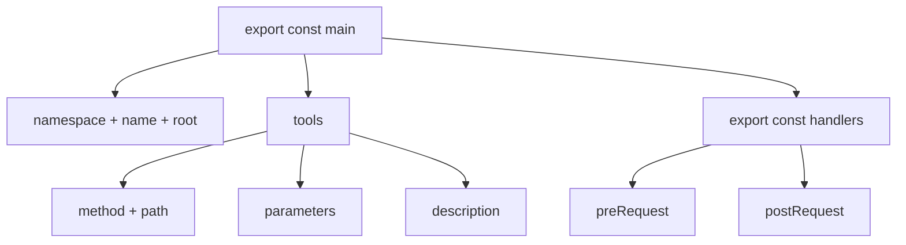

Tools kapseln REST API Endpoints. Jedes Tool entspricht einem HTTP-Request. Schemas sind `.mjs`-Dateien mit zwei benannten Exports: einem statischen `main`-Block und einer optionalen `handlers`-Factory-Funktion.

:::note
Diese Seite konzentriert sich auf die praktische Tool-Erstellung. Siehe [Schema-Format](/de/docs/specification/schema-format/) fuer die vollstaendige Spezifikation und [Parameter](/de/docs/specification/parameters/) fuer Parameterdetails.
:::

## Schema-Struktur

Eine Schema-Datei besteht aus zwei Teilen: dem deklarativen `main` Export, der beschreibt was Tools tun, und dem optionalen `handlers` Export, der Requests und Responses transformiert.



## Der `main` Export

Der `main` Export ist ein statisches, JSON-serialisierbares Objekt. Keine Funktionen, keine dynamischen Werte, keine Imports.

### Pflichtfelder

| Feld | Typ | Beschreibung |
|------|-----|--------------|
| `namespace` | `string` | Provider-Bezeichner, nur Kleinbuchstaben (`/^[a-z]+$/`). |
| `name` | `string` | Schema-Name in PascalCase (z.B. `SmartContractExplorer`). |
| `description` | `string` | Was dieses Schema tut, 1-2 Saetze. |
| `version` | `string` | Muss `3.\d+.\d+` entsprechen (Semver, Major muss `3` sein). |
| `root` | `string` | Basis-URL fuer alle Tools. Muss mit `https://` beginnen (kein Trailing Slash). |
| `tools` | `object` | Tool-Definitionen. Keys sind camelCase Tool-Namen. Maximal 8 Tools. |

### Optionale Felder

| Feld | Typ | Beschreibung |
|------|-----|--------------|
| `docs` | `string[]` | Dokumentations-URLs des API-Providers. |
| `tags` | `string[]` | Kategorisierungs-Tags fuer Tool-Discovery. |
| `requiredServerParams` | `string[]` | Umgebungsvariablen-Namen, die zur Laufzeit benoetigt werden (z.B. API-Keys). |
| `requiredLibraries` | `string[]` | npm-Pakete, die von Handlern benoetigt werden. |
| `headers` | `object` | Standard-HTTP-Header, die auf alle Tools angewendet werden. |
| `sharedLists` | `object[]` | Shared-List-Referenzen fuer dynamische Enum-Werte. Siehe [Shared Lists](/de/docs/specification/shared-lists/). |

```javascript
export const main = {
    namespace: 'etherscan',
    name: 'SmartContractExplorer',
    description: 'Explore verified smart contracts on EVM chains via Etherscan APIs',
    version: '3.0.0',
    root: 'https://api.etherscan.io',
    docs: [ 'https://docs.etherscan.io/' ],
    tags: [ 'ethereum', 'blockchain' ],
    requiredServerParams: [ 'ETHERSCAN_API_KEY' ],
    tools: {
        // Tool-Definitionen hier
    }
}
```

## Tool-Definition

Jeder Key in `tools` ist der Tool-Name in camelCase. Der Tool-Name wird Teil des vollqualifizierten MCP-Tool-Namens.

### Tool-Felder

| Feld | Typ | Erforderlich | Beschreibung |
|------|-----|-------------|--------------|
| `method` | `string` | Ja | HTTP-Methode: `GET`, `POST`, `PUT`, `DELETE`. |
| `path` | `string` | Ja | URL-Pfad, der an `root` angehaengt wird. Kann `{{key}}`-Platzhalter enthalten. |
| `description` | `string` | Ja | Was dieses Tool tut. Erscheint in der MCP-Tool-Beschreibung. |
| `parameters` | `array` | Ja | Eingabeparameter-Definitionen. Kann leer sein `[]`. |

### Pfad-Templates

Der Pfad unterstuetzt `{{key}}`-Platzhalter, die zur Aufrufzeit durch `insert`-Parameter ersetzt werden:

```javascript
// Statischer Pfad
path: '/api'

// Einzelner Platzhalter
path: '/api/v1/{{address}}/transactions'

// Mehrere Platzhalter
path: '/api/v1/{{chainId}}/address/{{address}}/balances'
```

Jeder `{{key}}`-Platzhalter muss einen entsprechenden Parameter mit `location: 'insert'` haben.

## Parameter

Jeder Parameter hat zwei Bloecke: `position` (wohin der Wert geht) und `z` (wie er validiert wird).

### Parametertypen

| Typ | Beschreibung | Beispiel |
|-----|--------------|---------|
| `string()` | Beliebiger String-Wert | `'string()'` |
| `number()` | Numerischer Wert | `'number()'` |
| `boolean()` | Wahr oder falsch | `'boolean()'` |
| `enum(A,B,C)` | Einer der aufgelisteten Werte | `'enum(mainnet,testnet)'` |
| `array()` | Array von Werten | `'array()'` |

### Wertquellen

| Muster | Beschreibung | Fuer User sichtbar |
|--------|-------------|-------------------|
| `{{USER_PARAM}}` | User gibt den Wert zur Aufrufzeit an | Ja |
| `{{SERVER_PARAM:KEY}}` | Aus Umgebungsvariable injiziert | Nein |
| Fester String | Wird automatisch mit jedem Request gesendet | Nein |

### Validierungsoptionen

| Option | Beschreibung | Beispiel |
|--------|-------------|---------|
| `min(n)` | Minimalwert oder -laenge | `'min(1)'` |
| `max(n)` | Maximalwert oder -laenge | `'max(100)'` |
| `optional()` | Parameter ist nicht erforderlich | `'optional()'` |
| `default(value)` | Standardwert wenn ausgelassen | `'default(100)'` |

```javascript
// User-bereitgestellte Adresse mit Laengenvalidierung
{
    position: { key: 'address', value: '{{USER_PARAM}}', location: 'query' },
    z: { primitive: 'string()', options: [ 'min(42)', 'max(42)' ] }
}

// Fester Parameter (fuer User unsichtbar)
{
    position: { key: 'module', value: 'contract', location: 'query' },
    z: { primitive: 'string()', options: [] }
}

// API-Key aus Umgebung injiziert
{
    position: { key: 'apikey', value: '{{SERVER_PARAM:ETHERSCAN_API_KEY}}', location: 'query' },
    z: { primitive: 'string()', options: [] }
}
```

:::tip
Feste Parameter sind ueblich bei APIs wie Etherscan, die Query-Parameter fuer Routing verwenden (`module=contract`, `action=getabi`). Sie ermoelichen es, dass mehrere Tools die gleiche `root` + `path` Kombination teilen.
:::

## Handler

Der optionale `handlers` Export ist eine Factory-Funktion, die injizierte Abhaengigkeiten empfaengt und Handler-Objekte pro Tool zurueckgibt.

```javascript
export const handlers = ( { sharedLists, libraries } ) => ({
    toolName: {
        preRequest: async ( { struct, payload } ) => {
            // Request vor dem Senden modifizieren
            return { struct, payload }
        },
        postRequest: async ( { response, struct, payload } ) => {
            // Antwort nach dem Empfang transformieren
            return { response }
        }
    }
})
```

### Injizierte Abhaengigkeiten

| Parameter | Typ | Beschreibung |
|-----------|-----|--------------|
| `sharedLists` | `object` | Aufgeloeste Shared-List-Daten, nach Listennamen geschluesselt. Schreibgeschuetzt (deep-frozen). |
| `libraries` | `object` | Geladene npm-Pakete aus `requiredLibraries`, nach Paketnamen geschluesselt. |

### Handler-Typen

| Handler | Wann | Input | Muss zurueckgeben |
|---------|------|-------|-------------------|
| `preRequest` | Vor dem API-Aufruf | `{ struct, payload }` | `{ struct, payload }` |
| `postRequest` | Nach dem API-Aufruf | `{ response, struct, payload }` | `{ response }` |

### Handler-Regeln

1. **Handler sind optional.** Tools ohne Handler machen direkte API-Aufrufe.
2. **Null Import-Statements.** Alle Abhaengigkeiten kommen durch die Factory-Funktion.
3. **Keine eingeschraenkten Globals.** `fetch`, `fs`, `process`, `eval` sind verboten.
4. **Rueckgabe-Form muss uebereinstimmen.** `preRequest` gibt `{ struct, payload }` zurueck. `postRequest` gibt `{ response }` zurueck.

:::caution
Schema-Dateien duerfen null `import`-Statements haben. Alle externen Abhaengigkeiten werden in `requiredLibraries` deklariert und zur Laufzeit injiziert.
:::

## Vollstaendiges Beispiel

Ein vollstaendiges Etherscan-Schema mit zwei Tools, API-Key-Injektion und einem `postRequest`-Handler:

```javascript
export const main = {
    namespace: 'etherscan',
    name: 'SmartContractExplorer',
    description: 'Ethereum blockchain explorer API',
    version: '3.0.0',
    docs: [ 'https://docs.etherscan.io/' ],
    tags: [ 'ethereum', 'blockchain' ],
    root: 'https://api.etherscan.io',
    requiredServerParams: [ 'ETHERSCAN_API_KEY' ],
    headers: { 'Accept': 'application/json' },
    tools: {
        getContractAbi: {
            method: 'GET',
            path: '/api',
            description: 'Get the ABI of a verified smart contract',
            parameters: [
                {
                    position: { key: 'module', value: 'contract', location: 'query' },
                    z: { primitive: 'string()', options: [] }
                },
                {
                    position: { key: 'action', value: 'getabi', location: 'query' },
                    z: { primitive: 'string()', options: [] }
                },
                {
                    position: { key: 'address', value: '{{USER_PARAM}}', location: 'query' },
                    z: { primitive: 'string()', options: [ 'min(42)', 'max(42)' ] }
                },
                {
                    position: { key: 'apikey', value: '{{SERVER_PARAM:ETHERSCAN_API_KEY}}', location: 'query' },
                    z: { primitive: 'string()', options: [] }
                }
            ]
        },
        getSourceCode: {
            method: 'GET',
            path: '/api',
            description: 'Get the Solidity source code of a verified smart contract',
            parameters: [
                {
                    position: { key: 'module', value: 'contract', location: 'query' },
                    z: { primitive: 'string()', options: [] }
                },
                {
                    position: { key: 'action', value: 'getsourcecode', location: 'query' },
                    z: { primitive: 'string()', options: [] }
                },
                {
                    position: { key: 'address', value: '{{USER_PARAM}}', location: 'query' },
                    z: { primitive: 'string()', options: [ 'min(42)', 'max(42)' ] }
                },
                {
                    position: { key: 'apikey', value: '{{SERVER_PARAM:ETHERSCAN_API_KEY}}', location: 'query' },
                    z: { primitive: 'string()', options: [] }
                }
            ]
        }
    }
}

export const handlers = ( { sharedLists } ) => ({
    getContractAbi: {
        postRequest: async ( { response } ) => {
            return { response: JSON.parse( response['result'] ) }
        }
    },
    getSourceCode: {
        postRequest: async ( { response } ) => {
            const { result } = response
            const [ first ] = result
            const { SourceCode, ABI, ContractName, CompilerVersion, OptimizationUsed } = first

            return {
                response: {
                    contractName: ContractName,
                    compilerVersion: CompilerVersion,
                    optimizationUsed: OptimizationUsed === '1',
                    sourceCode: SourceCode,
                    abi: ABI
                }
            }
        }
    }
})
```

:::tip
Dieses Beispiel demonstriert: feste Parameter (`module`, `action`), User-Parameter (`address`), Server-Parameter-Injektion (`apikey`) und `postRequest`-Handler, die verschachtelte API-Antworten in sauberen Output flachklopfen.
:::

## Einschraenkungen

| Einschraenkung | Wert | Begruendung |
|----------------|------|-------------|
| Max Tools pro Schema | 8 | Haelt Schemas fokussiert. Grosse APIs auf mehrere Schema-Dateien aufteilen. |
| Version Major | `3` | Muss `3.\d+.\d+` entsprechen. |
| Namespace-Muster | `^[a-z]+$` | Nur Buchstaben. Keine Zahlen, Bindestriche oder Unterstriche. |
| Root-URL-Protokoll | `https://` | HTTP ist nicht erlaubt. |
| Root-URL Trailing Slash | Verboten | `root` darf nicht mit `/` enden. |
| Schema-Datei-Imports | Null | Alle Abhaengigkeiten werden via die `handlers`-Factory injiziert. |
