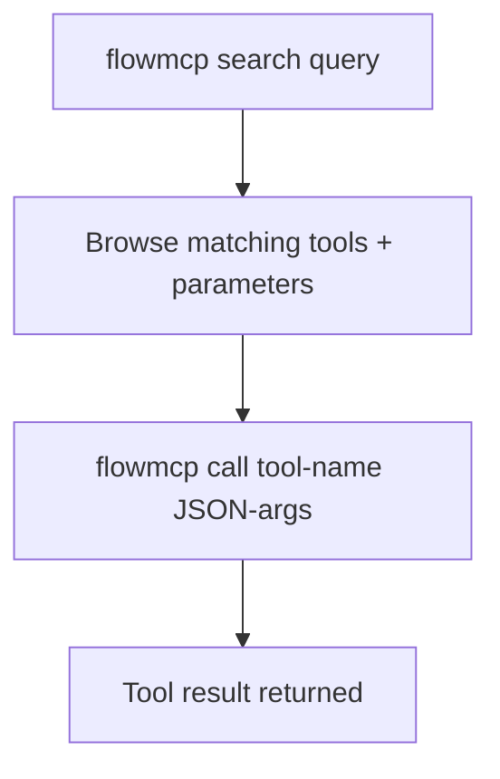

{/* PAGEFIND-META-START */}
<span style="display:none" data-pagefind-meta="section">Reference</span>
{/* PAGEFIND-META-END */}

import InstallNote from '../../../../components/InstallNote.astro';

:::note[Neu bei FlowMCP?]
Diese Seite ist die vollstaendige CLI-Referenz. Fuer eine gefuehrte Fuenf-Minuten-Installation und deinen ersten Live-API-Aufruf starte mit [CLI Setup](/de/quickstart/quickstart/).
:::

## Installation

<InstallNote repo="flowmcp-cli" global />

## CLI-Workflow

Die CLI folgt einem Zwei-Schritte-Muster: Tools entdecken, dann aufrufen. Es gibt keinen Aktivierungsschritt — jedes Tool aus den konfigurierten `schemaFolders[]` ist sofort aufrufbar.



## Kernbefehle

| Befehl | Beschreibung |
|--------|-------------|
| `flowmcp search <query>` | Tools suchen (max. 10 Ergebnisse), zeigt erforderliche Parameter |
| `flowmcp list` | Alle verfuegbaren Tools anzeigen (mit `disabledCount`) |
| `flowmcp call <tool-name> '{json}'` | Tool mit JSON-Parametern aufrufen |
| `flowmcp status` | Health-Check |

## Suchen, Auflisten, Aufrufen

Tools per Stichwort entdecken — die Antwort zeigt die erforderlichen Parameter jedes Tools. Dann das Tool direkt mit JSON-Argumenten aufrufen. Es gibt keinen Aktivierungsschritt: Jedes Tool aus den konfigurierten `schemaFolders[]` ist sofort aufrufbar. Ein Tool, dem ein API-Schluessel fehlt, erscheint als `[disabled: missing KEY]`.

```bash
flowmcp search ethereum
flowmcp call get_contract_abi_etherscan '{"address": "0xdAC17F958D2ee523a2206206994597C13D831ec7"}'
```

`flowmcp list` zeigt den vollstaendigen Katalog, inklusive der Anzahl wegen fehlender Schluessel deaktivierter Tools.

:::note[Programmatische Nutzung]
Fuer programmatischen Zugriff (nicht via CLI) siehe die [Programmatic API](/de/reference/core-methods).
:::

## Agent-Modus vs Dev-Modus

Die CLI hat zwei Betriebsmodi, die steuern, welche Befehle verfuegbar sind:

| Modus | Befehle | Anwendungsfall |
|-------|---------|----------------|
| **Agent** | search, list, call, status | Taeglicher KI-Agent-Einsatz |
| **Dev** | + validate, grading, migrate | Schema-Entwicklung |

```bash
flowmcp mode dev    # In den Dev-Modus wechseln
flowmcp mode agent  # Zurueck zum Agent-Modus
```

:::note[Standard-Modus]
Agent-Modus ist der Standard. Er stellt nur die Befehle bereit, die ein KI-Agent zum Entdecken und Aufrufen von Tools benoetigt. Wechsle in den Dev-Modus fuer Schema-Entwicklung und Validierungs-Workflows.
:::

## Dev-Modus-Befehle

Der Dev-Modus schaltet zusaetzliche Befehle fuer Schema-Autoren frei:

```bash
flowmcp validate <path>                       # Schema-Struktur validieren
flowmcp grading deterministic <id>            # Strukturvalidierung + Live-Daten-Pretest (Alias: det)
flowmcp grading non-deterministic <ns>        # LLM-Scoring (Alias: nondet)
flowmcp validate-agent <path>                 # Agent-Manifest validieren
```

## Lokale Projektkonfiguration

Die CLI liest ihre konfigurierten `schemaFolders[]` aus einem `.flowmcp/`-Verzeichnis in deinem Projekt:

```
.flowmcp/
└── config.json              # Konfigurierte schemaFolders[] + Modus
```

`config.json` listet die Schema-Ordner, die die CLI laedt. Jedes Tool in diesen Ordnern ist sofort fuer `search`, `list` und `call` verfuegbar — es wird keine Aktivierungsdatei pro Tool geschrieben.

## API-Schluessel

:::tip[API-Schluessel-Verwaltung]
Manche Tools benoetigen API-Schluessel, die in `~/.flowmcp/.env` gespeichert werden. Wenn ein `call` wegen fehlender Schluessel fehlschlaegt, fuege den benoetigten Schluessel zur globalen Konfiguration hinzu:

```bash
echo "ETHERSCAN_API_KEY=your_key_here" >> ~/.flowmcp/.env
```

API-Schluessel niemals in die Versionskontrolle committen. Die `.env`-Datei in `~/.flowmcp/` ist dein globaler Schluessel-Speicher und sollte nur auf deinem Rechner bleiben.
:::
