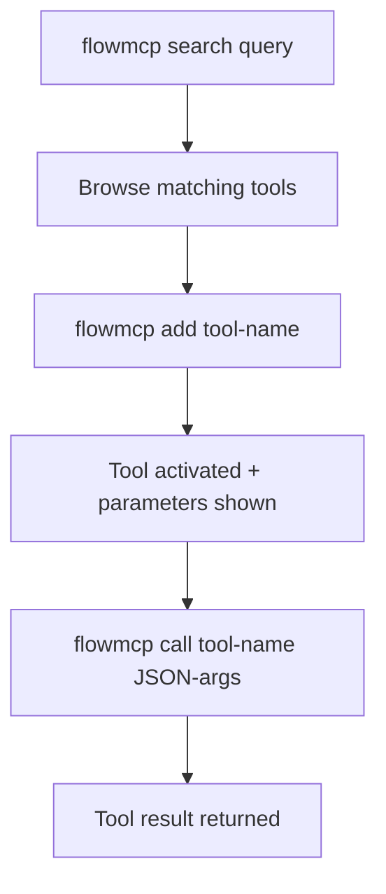

{/* PAGEFIND-META-START */}
<span style="display:none" data-pagefind-meta="section">Reference</span>
{/* PAGEFIND-META-END */}

import InstallNote from '../../../../components/InstallNote.astro';

:::note[Neu bei FlowMCP?]
Diese Seite ist die vollstaendige CLI-Referenz. Fuer eine gefuehrte Fuenf-Minuten-Installation und deinen ersten Live-API-Aufruf starte mit [CLI Setup](/de/quickstart/quickstart/).
:::

## Installation

<InstallNote repo="flowmcp-cli" global />

## CLI-Workflow

Die CLI folgt einem Drei-Schritte-Muster: Tools entdecken, aktivieren, dann aufrufen.



## Kernbefehle

| Befehl | Beschreibung |
|--------|-------------|
| `flowmcp search <query>` | Tools suchen (max. 10 Ergebnisse) |
| `flowmcp add <tool-name>` | Tool aktivieren + Parameter anzeigen |
| `flowmcp call <tool-name> '{json}'` | Tool mit JSON-Parametern aufrufen |
| `flowmcp remove <tool-name>` | Tool deaktivieren |
| `flowmcp list` | Aktive Tools anzeigen |
| `flowmcp status` | Health-Check |

## Suchen, Hinzufuegen, Aufrufen

Tools per Stichwort entdecken. Ein Tool hinzufuegen aktiviert es fuer das Projekt — die Antwort zeigt die Parameter. Dann das Tool mit JSON-Argumenten aufrufen.

```bash
flowmcp search ethereum
flowmcp add get_contract_abi_etherscan
flowmcp call get_contract_abi_etherscan '{"address": "0xdAC17F958D2ee523a2206206994597C13D831ec7"}'
```

Das Parameter-Schema fuer jedes hinzugefuegte Tool wird lokal in `.flowmcp/tools/` zur Inspektion gespeichert.

:::note[Programmatische Nutzung]
Fuer programmatischen Zugriff (nicht via CLI) siehe die [Programmatic API](/de/reference/core-methods).
:::

## Agent-Modus vs Dev-Modus

Die CLI hat zwei Betriebsmodi, die steuern, welche Befehle verfuegbar sind:

| Modus | Befehle | Anwendungsfall |
|-------|---------|----------------|
| **Agent** | search, add, call, remove, list, status | Taeglicher KI-Agent-Einsatz |
| **Dev** | + validate, test, migrate | Schema-Entwicklung |

```bash
flowmcp mode dev    # In den Dev-Modus wechseln
flowmcp mode agent  # Zurueck zum Agent-Modus
```

:::note[Standard-Modus]
Agent-Modus ist der Standard. Er stellt nur die Befehle bereit, die ein KI-Agent zum Entdecken, Aktivieren und Aufrufen von Tools benoetigt. Wechsle in den Dev-Modus fuer Schema-Entwicklung und Validierungs-Workflows.
:::

## Dev-Modus-Befehle

Der Dev-Modus schaltet zusaetzliche Befehle fuer Schema-Autoren frei:

```bash
flowmcp validate <path>           # Schema-Struktur validieren
flowmcp test single <path>        # Live-API-Test
flowmcp validate-agent <path>     # Agent-Manifest validieren
```

## Lokale Projektkonfiguration

Wenn du Tools hinzufuegst, wird ein `.flowmcp/`-Verzeichnis in deinem Projekt erstellt:

```
.flowmcp/
├── config.json              # Aktive Tools + Modus
└── tools/                   # Parameter-Schemas (automatisch generiert)
    └── get_contract_abi_etherscan.json
```

Jede Datei in `tools/` enthaelt den Tool-Namen, die Beschreibung und die erwarteten Eingabeparameter:

```json
{
    "name": "get_contract_abi_etherscan",
    "description": "Returns the Contract ABI of a verified smart contract",
    "parameters": {
        "address": { "type": "string", "required": true }
    }
}
```

## API-Schluessel

:::tip[API-Schluessel-Verwaltung]
Manche Tools benoetigen API-Schluessel, die in `~/.flowmcp/.env` gespeichert werden. Wenn ein `call` wegen fehlender Schluessel fehlschlaegt, fuege den benoetigten Schluessel zur globalen Konfiguration hinzu:

```bash
echo "ETHERSCAN_API_KEY=your_key_here" >> ~/.flowmcp/.env
```

API-Schluessel niemals in die Versionskontrolle committen. Die `.env`-Datei in `~/.flowmcp/` ist dein globaler Schluessel-Speicher und sollte nur auf deinem Rechner bleiben.
:::
