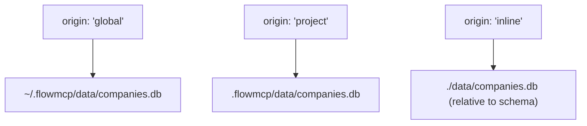

Resources provide local, deterministic data via SQLite. Unlike tools (which call remote REST APIs), resources query local databases. They are perfect for bulk-downloaded open data such as company registers, transit schedules, and sanctions lists.

## What are Resources?

A resource is a SQLite database bundled with a schema. The FlowMCP runtime loads the `.db` file via `sql.js` (a pure JavaScript/WASM SQLite implementation) and exposes each defined query as an MCP resource. No network calls, no API keys, no rate limits.

Resources are ideal when:

- Data is large and rarely changes (company registers, geographic data)
- Offline access is required
- Latency must be near-zero
- The dataset is publicly available as a bulk download

## When to Use Resources vs Tools

| Aspect | Tools | Resources |
|--------|-------|-----------|
| Data source | Remote REST API | Local SQLite database |
| Latency | Network-dependent | Instant |
| Availability | Requires internet | Always available |
| Data freshness | Real-time | Snapshot (periodic refresh) |
| API key required | Usually yes | No |
| Use case | Live prices, on-chain data | Company registers, transit data |

:::tip
Many schemas benefit from combining both. Use tools for live data and resources for reference lookups. The AI agent chooses the right approach based on the query.
:::

## Resource Definition

Resources are declared inside `main.resources`. Each resource points to a SQLite database and defines named queries with SQL and parameters:

```javascript
export const main = {
    namespace: 'offeneregister',
    name: 'OffeneRegister',
    version: '3.0.0',
    root: '',
    tools: {},
    resources: {
        companiesDb: {
            source: 'sqlite',
            database: 'companies.db',
            origin: 'global',
            description: 'German company register (OffeneRegister)',
            queries: {
                searchCompanies: {
                    sql: "SELECT * FROM companies WHERE name LIKE ? LIMIT ?",
                    description: 'Search companies by name',
                    parameters: {
                        searchTerm: { type: 'string', required: true },
                        limit: { type: 'number', required: false, default: 10 }
                    },
                    output: { columns: ['company_number', 'name', 'registered_address', 'status'] }
                }
            }
        }
    }
}
```

## Database Paths -- Three Levels

The `origin` field determines where the runtime looks for the `.db` file:



| Origin | Path Resolution | Best For |
|--------|----------------|----------|
| `global` | `~/.flowmcp/data/{database}` | Shared datasets used across projects |
| `project` | `.flowmcp/data/{database}` | Project-specific data |
| `inline` | Relative to the schema file | Self-contained schemas with small databases |

:::note
The `origin` field is required. The runtime does not guess where the database lives. If the file is not found at the resolved path, the resource fails to load with a clear error message.
:::

## CTE Support

Complex queries can use Common Table Expressions (CTEs) for multi-step filtering:

```sql
WITH recent AS (
    SELECT * FROM companies WHERE registered_date > ?
)
SELECT * FROM recent WHERE status = 'active' LIMIT ?
```

CTEs must still start with a read-only statement. The same SQL security rules apply: no `INSERT`, `UPDATE`, `DELETE`, or other write operations anywhere in the CTE chain.

## Constraints

:::note
These limits keep resources focused and predictable. If you need more queries, split into multiple schemas.
:::

| Constraint | Value | Rationale |
|------------|-------|-----------|
| Max resources per schema | 2 | Resources are supplementary, not primary output |
| Max queries per resource | 8 | 7 defined + 1 auto-injected `freeQuery` |
| `getSchema` query | Required | Must return the database table structure |
| SQL operations | `SELECT` only | Read-only enforcement -- no INSERT/UPDATE/DELETE |
| Parameter placeholders | `?` only | Prevents SQL injection |
| Source type | `sqlite` only | Future versions may add other sources |
| Database file extension | `.db` | Standard SQLite extension |

### Auto-Injected Queries

Two queries are handled automatically by the runtime:

- **`getSchema`** -- You must define this query. It returns the database structure so AI agents can understand available tables and columns.
- **`freeQuery`** -- Auto-injected by the runtime. Allows AI agents to run arbitrary `SELECT` queries within the read-only sandbox. This counts toward the 8-query limit.

## Complete Example

An OffeneRegister schema with a SQLite resource for querying the German company register:

```javascript
export const main = {
    namespace: 'offeneregister',
    name: 'OffeneRegister',
    description: 'German company register — local SQLite database',
    version: '3.0.0',
    tags: ['open-data', 'germany', 'companies'],
    root: '',
    tools: {},
    resources: {
        companiesDb: {
            source: 'sqlite',
            database: 'openregister.db',
            origin: 'global',
            description: 'OffeneRegister company database (2.5 GB)',
            queries: {
                getSchema: {
                    sql: "SELECT sql FROM sqlite_master WHERE type='table'",
                    description: 'Get database schema',
                    parameters: {},
                    output: { columns: ['sql'] }
                },
                searchCompanies: {
                    sql: "SELECT company_number, name, registered_address, status FROM companies WHERE name LIKE ? LIMIT ?",
                    description: 'Full-text search for companies by name',
                    parameters: {
                        searchTerm: { type: 'string', required: true, description: 'Company name (use % for wildcards)' },
                        limit: { type: 'number', required: false, default: 10, description: 'Max results' }
                    },
                    output: { columns: ['company_number', 'name', 'registered_address', 'status'] }
                },
                getByNumber: {
                    sql: "SELECT * FROM companies WHERE company_number = ?",
                    description: 'Look up a company by its registration number',
                    parameters: {
                        companyNumber: { type: 'string', required: true, description: 'Company registration number' }
                    },
                    output: { columns: ['company_number', 'name', 'registered_address', 'status', 'registered_date'] }
                },
                recentRegistrations: {
                    sql: "SELECT company_number, name, registered_date FROM companies ORDER BY registered_date DESC LIMIT ?",
                    description: 'List the most recently registered companies',
                    parameters: {
                        limit: { type: 'number', required: false, default: 20, description: 'Max results' }
                    },
                    output: { columns: ['company_number', 'name', 'registered_date'] }
                }
            }
        }
    }
}
```

This schema has no tools and no `root` URL -- it operates entirely on local data. The AI agent can search companies, look up by number, or browse recent registrations without any network access.

:::tip
Resource-only schemas set `root: ''` and `tools: {}`. They are valid FlowMCP schemas that expose only MCP resources, no MCP tools.
:::

## Validation Rules

Resources are validated by rules RES001-RES023. Key rules include:

| Code | Rule |
|------|------|
| RES003 | Maximum 2 resources per schema |
| RES005 | Source must be `'sqlite'` |
| RES006 | Database path must end in `.db` |
| RES008 | Maximum 8 queries per resource (7 + freeQuery) |
| RES012 | SQL must start with `SELECT` (or `With` for CTEs) |
| RES013 | SQL must not contain blocked patterns |
| RES014 | SQL must use `?` placeholders |
| RES015 | Placeholder count must match parameter count |

See [Validation Rules](/docs/specification/validation-rules/) for the complete list.
