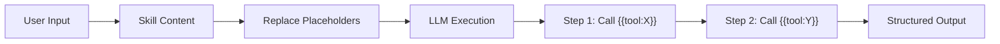

Skills are instructional multi-step workflows embedded in a schema. Unlike Prompts (which explain context), Skills **instruct** -- they tell an LLM exactly what to do, step by step. Each skill declares its tool dependencies, defines typed input parameters, and records the model it was tested with.

:::tip
**Skills vs Prompts:** Use a Prompt when you want to provide context or explain a domain. Use a Skill when you want to orchestrate a repeatable multi-step workflow that calls specific tools in sequence.
:::

## Skill Execution Flow

How a skill is resolved and executed at runtime:



The skill's `content` is a template. Placeholders like `{{input:tokenSymbol}}` are replaced with user-provided values, and `{{tool:computeRSI}}` references tell the LLM which tool to call at each step.

## Defining Skills

Skills are declared in the `main` export's `skills` key. Each entry points to a separate `.mjs` file:

```javascript
export const main = {
    namespace: 'tradingsignals',
    name: 'TradingSignals',
    version: '3.0.0',
    root: 'https://api.example.com',
    tools: {
        computeRSI: { /* ... */ },
        computeMACD: { /* ... */ }
    },
    skills: {
        'token-technical-analysis': { file: './skills/token-technical-analysis.mjs' }
    }
}
```

### Skill Reference Fields

Each key in `main.skills` is the skill name (must match `^[a-z][a-z0-9-]*$`). The value is an object:

| Field | Type | Required | Description |
|-------|------|----------|-------------|
| `file` | `string` | Yes | Path to the `.mjs` skill file, relative to the schema. Must end in `.mjs`. |

## Skill File Format

Each skill file exports a `skill` object with the full workflow definition:

```javascript
const content = `Perform technical analysis of {{input:tokenSymbol}} on {{input:chain}}.

## Step 1: Token Discovery
Use {{tool:searchBySymbol}} to find {{input:tokenSymbol}} on {{input:chain}}.

## Step 2: OHLCV Data
Use {{tool:getRecursiveOhlcvEVM}} for {{input:timeframeDays}}-day candles.

## Step 3: Indicators
Use {{tool:computeRSI}} with period 14.
Use {{tool:computeMACD}} with fast 12, slow 26, signal 9.

## Step 4: Synthesis
Compile findings into BULLISH / BEARISH / NEUTRAL signal.`

export const skill = {
    name: 'token-technical-analysis',
    version: 'flowmcp-skill/1.0.0',
    description: 'Full technical analysis: discovery, OHLCV, indicators, chart, signal summary',
    testedWith: 'anthropic/claude-sonnet-4-5-20250929',
    requires: {
        tools: [
            'indicators/tool/searchBySymbol',
            'ohlcv/tool/getRecursiveOhlcvEVM',
            'tradingsignals/tool/computeRSI',
            'tradingsignals/tool/computeMACD'
        ],
        resources: [],
        external: [ 'playwright' ]
    },
    input: [
        { key: 'tokenSymbol', type: 'string', description: 'Token symbol (e.g. WETH)', required: true },
        { key: 'chain', type: 'string', description: 'Blockchain (e.g. ethereum)', required: true },
        { key: 'timeframeDays', type: 'number', description: 'Days of history', required: false }
    ],
    output: 'Structured report with trend, momentum, volatility, chart, and signal summary',
    content
}
```

## Skill Object Fields

| Field | Type | Required | Description |
|-------|------|----------|-------------|
| `name` | `string` | Yes | Must match the `name` in the schema's `skills` array entry. |
| `version` | `string` | Yes | Must be `'flowmcp-skill/1.0.0'`. |
| `description` | `string` | Yes | What this skill does. |
| `testedWith` | `string` | Yes | Model ID the skill was tested with (e.g. `anthropic/claude-sonnet-4-5-20250929`). |
| `requires` | `object` | Yes | Dependencies: `tools`, `resources`, and `external` arrays. |
| `input` | `array` | No | User-provided input parameters. |
| `output` | `string` | No | Description of what the skill produces. |
| `content` | `string` | Yes | The instruction text with placeholders. |

:::note
**`testedWith` is required for Skills.** Every skill must declare which model it was tested with. This is a key difference from Prompts, which do not require `testedWith`. The field records accountability -- if a skill produces unreliable results, the tested model is the first variable to check.
:::

### `requires` Object

| Field | Type | Description |
|-------|------|-------------|
| `tools` | `string[]` | Tool references this skill uses. Uses the full ID format (`namespace/tool/name`) for cross-schema references, or plain names for same-schema tools. |
| `resources` | `string[]` | Resource names this skill reads. Must match names in `main.resources`. |
| `external` | `string[]` | External capabilities not provided by the schema (e.g. `playwright`, `puppeteer`). For documentation purposes. |

:::note
**`requires.external` is Skills-only.** Prompts do not have an `external` field. Use it to document dependencies that exist outside the FlowMCP ecosystem, so consumers know what additional setup is needed.
:::

### `input` Array

Each input parameter:

| Field | Type | Description |
|-------|------|-------------|
| `key` | `string` | Parameter name (camelCase). Referenced in content as `{{input:key}}`. |
| `type` | `string` | One of `string`, `number`, `boolean`, or `enum`. |
| `description` | `string` | What this input parameter is for. |
| `required` | `boolean` | Whether the user must provide this value. |

## Placeholder Syntax

The `content` field supports four placeholder types, identical to the Prompts placeholder system:

| Placeholder | Syntax | Resolves To | Example |
|-------------|--------|-------------|---------|
| Tool reference | `{{tool:name}}` | Tool name from `requires.tools` | `{{tool:computeRSI}}` |
| Resource reference | `{{resource:name}}` | Resource name from `requires.resources` | `{{resource:verifiedContracts}}` |
| Skill reference | `{{skill:name}}` | Another skill in the same schema | `{{skill:quick-check}}` |
| Input reference | `{{input:key}}` | User-provided input value | `{{input:tokenSymbol}}` |

### Placeholder Rules

1. `{{tool:x}}` -- `x` should be listed in `requires.tools`
2. `{{resource:x}}` -- `x` should be listed in `requires.resources`
3. `{{skill:x}}` -- must reference another skill in the same schema (no circular references)
4. `{{input:x}}` -- should match an `input[].key`

Unresolved placeholders produce validation warnings (not errors), except for `{{skill:x}}` which must resolve.

## Constraints

| Constraint | Value | Rationale |
|------------|-------|-----------|
| Max skills per schema | 4 | Keep schemas focused |
| `testedWith` | Required | Accountability for non-deterministic workflows |
| `requires.external` | Skills-only | Prompts do not support this field |
| Skill name pattern | `^[a-z][a-z0-9-]*$` | Lowercase with hyphens |
| Skill file extension | `.mjs` | ES module format |
| Version | `flowmcp-skill/1.0.0` | Fixed for v3.0.0 |
| Content | Non-empty string | Must contain instructions |
| No circular references | Via `{{skill:x}}` | Prevents infinite loops |

## Skills vs Prompts Summary

| Aspect | Prompt | Skill |
|--------|--------|-------|
| Purpose | Explain context | Instruct step-by-step |
| `testedWith` | Optional | **Required** |
| `requires.external` | Not available | Available |
| Placeholder system | Same | Same |
| Max per schema | 4 | 4 |
| File format | `.mjs` | `.mjs` |
| MCP primitive | Prompts | Prompts |
