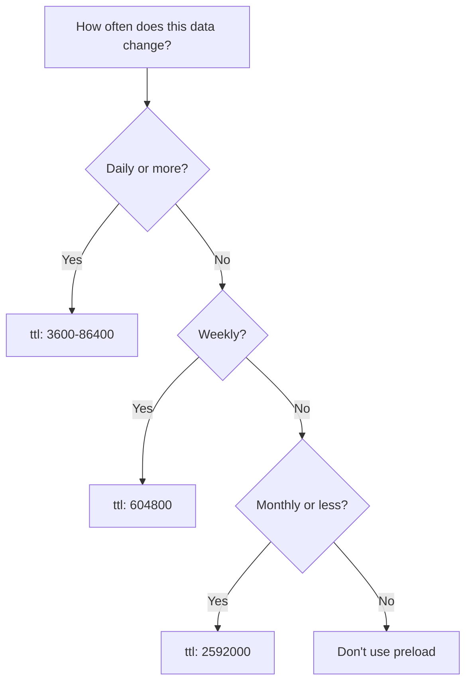
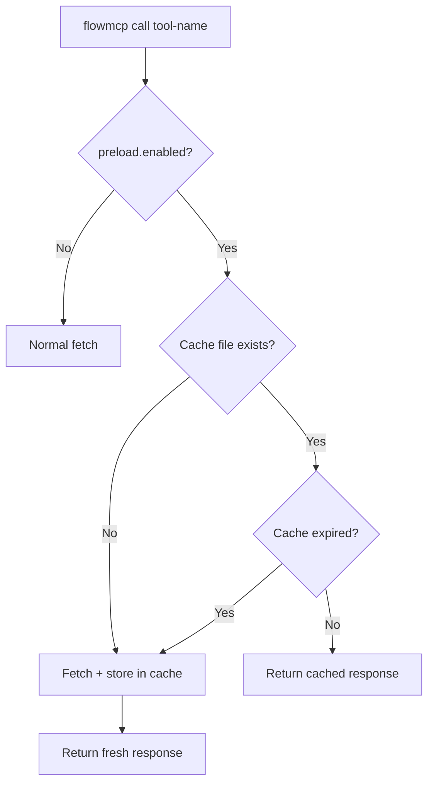

The optional `preload` field on routes signals that the response is static or slow-changing and that the runtime may cache it locally. This avoids redundant API calls for data that rarely changes.

:::note
This page covers preload and caching from the [formal specification](https://github.com/FlowMCP/flowmcp-spec). Preload is an optimization — tools work identically with or without caching.
:::

## Motivation

Some API endpoints return complete, rarely changing datasets (e.g. all hospitals in Germany, all memorial stones in Berlin). Fetching these on every call wastes bandwidth and time. The `preload` field lets schema authors declare caching intent.

## The `preload` Field

`preload` is an optional object on route level:

```javascript
routes: {
    getLocations: {
        method: 'GET',
        path: '/locations.json',
        description: 'All hospital locations in Germany',
        parameters: [],
        preload: {
            enabled: true,
            ttl: 604800,
            description: 'All hospital locations in Germany (~760KB)'
        },
        output: { /* ... */ },
        tests: [ /* ... */ ]
    }
}
```

### Fields

| Field | Type | Required | Description |
|-------|------|----------|-------------|
| `enabled` | `boolean` | Yes | Whether caching is allowed. Must be `true` to activate. |
| `ttl` | `number` | Yes | Cache time-to-live in seconds. Must be a positive integer. |
| `description` | `string` | No | Human-readable note shown on cache hit. |

### TTL Guidelines

| TTL | Duration | Use Case |
|-----|----------|----------|
| `3600` | 1 hour | Frequently updated data |
| `86400` | 1 day | Daily snapshots |
| `604800` | 1 week | Weekly releases, semi-static data |
| `2592000` | 30 days | Static reference data |



## Cache Key Strategy

When a route has parameters, the cache key must include parameter values:

```
# With parameters
{namespace}/{routeName}/{paramHash}.json

# Without parameters (or all optional and omitted)
{namespace}/{routeName}.json
```

## Runtime Behavior

### Cache Storage

Recommended cache directory: `~/.flowmcp/cache/`. Each cached response is stored as JSON with metadata:

```json
{
    "meta": {
        "fetchedAt": "2026-02-17T12:00:00.000Z",
        "expiresAt": "2026-02-24T12:00:00.000Z",
        "ttl": 604800,
        "size": 760123,
        "paramHash": null
    },
    "data": { }
}
```

### Cache Flow



### User Overrides

| Flag | Behavior |
|------|----------|
| `--no-cache` | Skip cache entirely, always fetch fresh |
| `--refresh` | Fetch fresh and update cache |

### Cache Management

| Command | Description |
|---------|-------------|
| `cache status` | List all cached responses with size, age, expiry |
| `cache clear` | Remove all cached responses |
| `cache clear {namespace}` | Remove cached responses for a specific namespace |

## When to Use Preload

**Good candidates:**
- The endpoint returns a complete, static or slow-changing dataset
- The response is larger than ~10KB
- The data doesn't change based on time-of-day or real-time events
- Multiple calls with the same parameters return identical results

**Bad candidates:**
- The data changes frequently (live prices, real-time feeds)
- The response depends on authentication state
- The endpoint has rate limits that make caching counterproductive

## Interaction with Other Features

### Handlers

Handlers (`preRequest`, `postRequest`) still execute on cached data. The cache stores the raw API response before `postRequest` transformation.

:::tip
Some runtimes may alternatively cache the final transformed response after `postRequest`, avoiding re-running handlers on every cache hit. Check your runtime's documentation for which approach is used.
:::

### Tests

Route tests always bypass the cache to ensure they test the live API. The `--no-cache` flag is implied during test execution.

## Validation Rules

| Code | Severity | Rule |
|------|----------|------|
| VAL060 | error | If `preload` is present, it must be a plain object |
| VAL061 | error | `preload.enabled` must be a boolean |
| VAL062 | error | `preload.ttl` must be a positive integer (> 0) |
| VAL063 | warning | `preload.description` if present must be a string |
| VAL064 | info | Routes with `preload.enabled: true` and no parameters are ideal cache candidates |
| VAL065 | warning | Routes with `preload.enabled: true` and required parameters should document caching behavior |
