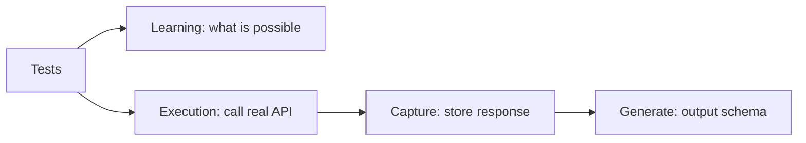
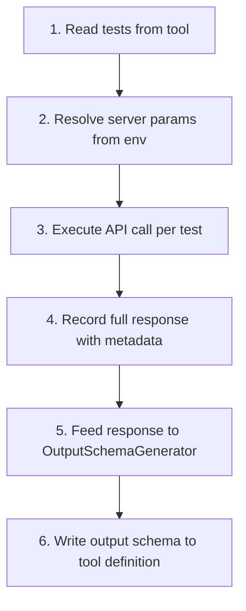

<!-- PAGEFIND-META-START -->
<span style="display:none" data-pagefind-meta="section">Specification</span>
<!-- PAGEFIND-META-END -->

Tests are executable examples embedded in each tool and resource definition. They serve three purposes: documenting what a tool can do, providing input data to capture real API responses, and generating accurate output schemas from those responses.

:::note
This page covers tests from the [formal specification](https://github.com/FlowMCP/flowmcp-spec). See [Output Schema](/docs/specification/output-schema/) for how generated schemas are used.
:::

## Purpose



- **Learning instrument** — a developer or AI agent reading tests should understand the tool's capabilities by reading tests alone
- **Output schema source** — tests provide parameter values for real API calls, and captured responses are fed into the `OutputSchemaGenerator`

## Tool Test Format

Tests are defined as an array inside each tool definition, alongside `method`, `path`, `description`, and `parameters`:

```javascript
tools: {
    getSimplePrice: {
        method: 'GET',
        path: '/simple/price',
        description: 'Fetch current price for one or more coins',
        parameters: [
            {
                position: { key: 'ids', value: '{{USER_PARAM}}', location: 'query' },
                z: { primitive: 'array()', options: [] }
            },
            {
                position: { key: 'vs_currencies', value: '{{USER_PARAM}}', location: 'query' },
                z: { primitive: 'string()', options: [] }
            }
        ],
        tests: [
            {
                _description: 'Single coin in single currency',
                ids: ['bitcoin'],
                vs_currencies: 'usd'
            },
            {
                _description: 'Multiple coins in multiple currencies',
                ids: ['bitcoin', 'ethereum', 'solana'],
                vs_currencies: 'usd,eur,gbp'
            }
        ]
    }
}
```

## Resource Query Tests

Resources can also have tests. Since resources use SQL queries instead of HTTP requests, test values correspond to query parameters:

```javascript
resources: {
    verifiedContracts: {
        source: 'sqlite',
        database: 'contracts.db',
        queries: {
            byAddress: {
                description: 'Find contract by address',
                sql: 'SELECT * FROM contracts WHERE address = ?',
                parameters: [
                    { key: 'address', type: 'string', description: 'Contract address', required: true }
                ],
                tests: [
                    {
                        _description: 'Known verified contract (USDC)',
                        address: '0xA0b86991c6218b36c1d19D4a2e9Eb0cE3606eB48'
                    }
                ]
            }
        }
    }
}
```

## Test Fields

| Field | Type | Required | Description |
|-------|------|----------|-------------|
| `_description` | `string` | Yes | What this specific test demonstrates |
| `{paramKey}` | matches parameter type | Yes (per required param) | Value for each `{{USER_PARAM}}` parameter (tools) or query parameter (resources) |

### Writing Good Descriptions

```javascript
// Good — explains the specific scenario
{ _description: 'ERC-20 token on Ethereum mainnet', ... }
{ _description: 'Native token on Layer 2 chain (Arbitrum)', ... }
{ _description: 'Wallet with high transaction volume', ... }

// Bad — generic, uninformative
{ _description: 'Test getTokenPrice', ... }
{ _description: 'Basic test', ... }
```

## Design Principles

### 1. Express the Breadth

Tests should cover the **range of what is possible**:

```javascript
// Good — shows breadth of chains and token types
tests: [
    { _description: 'ERC-20 token on Ethereum', chain_id: 1, contract: '0x6982...' },
    { _description: 'Native token on Polygon', chain_id: 137, contract: '0x0000...' },
    { _description: 'Stablecoin on Arbitrum', chain_id: 42161, contract: '0xaf88...' }
]
```

### 2. Teach Through Examples

Each test should teach one capability or variation.

### 3. No Personal Data

:::caution
Tests must never contain personal data. All test values must be publicly known, verifiable, and non-sensitive.
:::

| Allowed | Not Allowed |
|---------|-------------|
| Public smart contract addresses | Private wallet addresses |
| Well-known token contracts (USDC, WETH) | Personal wallet addresses |
| Public blockchain data (block numbers, tx hashes) | Email addresses, names |
| Standard chain IDs (1, 137, 42161) | API keys, tokens, passwords |

### 4. Reproducible Results

Prefer well-established tokens/contracts over newly deployed ones, and historical data queries over latest-block queries when possible.

## Test Count Guidelines

| Scenario | Minimum | Recommended |
|----------|---------|-------------|
| No parameters | 1 | 1 |
| 1-2 parameters | 1 | 2-3 |
| Enum/chain parameters | 1 | 2-4 (different enum values) |
| Multiple optional parameters | 1 | 2-3 (with/without optionals) |
| Resource queries | 1 | 1-2 |

Minimum 1 test per tool is required (validation error TST001 if missing).

## Response Capture Lifecycle



1. **Read Tests** — Extract parameter values from each test object.
2. **Resolve Server Params** — Load `requiredServerParams` from environment variables.
3. **Execute API Call** — Construct the full request and execute. A delay between calls (default: 1s) prevents rate limiting.
4. **Record Response** — Store full response with metadata (namespace, toolName, testIndex, timestamp, responseTime).
5. **Generate Output Schema** — The `OutputSchemaGenerator` analyzes `response.data` structure and produces a schema definition.
6. **Write Output Schema** — Generated schema is written to the tool's `output` field. Existing schemas can be validated against reality.

### Captured Response Format

```javascript
{
    namespace: 'coingecko',
    toolName: 'getSimplePrice',
    testIndex: 0,
    _description: 'Single coin in USD',
    userParams: { ids: ['bitcoin'], vs_currencies: 'usd' },
    responseTime: 234,
    timestamp: '2026-02-17T10:30:00Z',
    response: {
        status: true,
        messages: [],
        data: { /* actual API response after handler transformation */ }
    }
}
```

:::tip
The `response.data` contains data **after handler transformation**. This is critical because the output schema describes the final shape, not the raw API response.
:::

### Capture File Structure

```
capture/
└── {timestamp}/
    └── {namespace}/
        ├── {toolName}-0.json
        ├── {toolName}-1.json
        └── metrics.json
```

## Test Execution Modes

| Mode | Description | Use Case |
|------|-------------|----------|
| **Capture** | Execute against real API, store responses | Schema development, output schema generation |
| **Validation** | Execute and compare against declared `output.schema` | Verify schemas remain accurate over time |
| **Dry-Run** | Validate test definitions without API calls | During `flowmcp validate` |

## Validation Rules

| Code | Severity | Rule |
|------|----------|------|
| TST001 | error | Each tool must have at least 1 test |
| TST002 | error | Each test must have a `_description` field of type string |
| TST003 | error | Each test must provide values for all required `{{USER_PARAM}}` parameters |
| TST004 | error | Test parameter values must pass the corresponding `z` validation |
| TST005 | error | Test objects must be JSON-serializable |
| TST006 | error | Test objects must only contain keys matching `{{USER_PARAM}}` parameter keys or `_description` |
| TST007 | warning | Tools with enum parameters should test multiple enum values |
| TST008 | info | Consider adding tests that demonstrate optional parameter usage |
