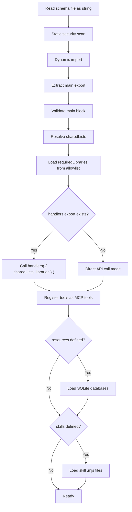

A FlowMCP schema is a `.mjs` file with **two separate named exports**: a static `main` block and an optional `handlers` factory function. This separation enables integrity hashing, security scanning, and dependency injection.

:::note
This page covers the schema format from the [formal specification](https://github.com/FlowMCP/flowmcp-spec). See [Parameters](/docs/specification/parameters/) for parameter details and [Security Model](/docs/specification/security/) for security constraints.
:::

## The Two-Export Pattern

```javascript
// main export (required)
// Static, declarative, JSON-serializable — hashable without execution
export const main = {
    namespace: 'provider',
    name: 'SchemaName',
    description: 'What this schema does',
    version: '4.0.0',
    root: 'https://api.provider.com',
    tools: { /* ... */ },
    resources: { /* ... */ },   // optional
    skills: [ /* ... */ ]       // optional
}

// handlers export (optional)
// Factory function — receives injected dependencies
export const handlers = ( { sharedLists, libraries } ) => ({
    toolName: {
        preRequest: async ( { struct, payload } ) => {
            return { struct, payload }
        },
        postRequest: async ( { response, struct, payload } ) => {
            return { response }
        }
    }
})
```

### Why Two Separate Exports

- **`main` can be hashed without calling any function.** The runtime reads the static export, serializes it via `JSON.stringify()`, and computes its hash.
- **Handlers receive all dependencies through injection.** Schema files have zero `import` statements.
- **`requiredLibraries` declares what npm packages the schema needs.** The runtime loads them from a security allowlist and injects them.

## The `main` Export

All fields in `main` must be JSON-serializable. No functions, no dynamic values, no imports.

### Required Fields

| Field | Type | Description |
|-------|------|-------------|
| `namespace` | `string` | Provider identifier, lowercase letters only (`/^[a-z]+$/`). |
| `name` | `string` | Schema name in PascalCase (e.g. `SmartContractExplorer`). |
| `description` | `string` | What this schema does, 1-2 sentences. |
| `version` | `string` | Must match `4.\d+.\d+` (semver, major must be `4`). |
| `root` | `string` | Base URL for all tools. Must start with `https://` (no trailing slash). |
| `tools` | `object` | Tool definitions. Keys are camelCase tool names. Maximum 8 tools. |

### Optional Fields

| Field | Type | Default | Description |
|-------|------|---------|-------------|
| `docs` | `string[]` | `[]` | Documentation URLs for the API provider. |
| `tags` | `string[]` | `[]` | Categorization tags for tool discovery. |
| `requiredServerParams` | `string[]` | `[]` | Environment variable names needed at runtime. |
| `requiredLibraries` | `string[]` | `[]` | npm packages needed by handlers (must be on allowlist). |
| `headers` | `object` | `{}` | Default HTTP headers applied to all tools. |
| `sharedLists` | `object[]` | `[]` | Shared list references. See [Shared Lists](/docs/specification/shared-lists/). |
| `resources` | `object` | `{}` | SQLite-based read-only data resources. See [Resources](/docs/specification/resources/). |
| `skills` | `array` | `[]` | AI agent skill references. See [Skills](/docs/specification/skills/). |

### Field Details

#### `namespace`

Only lowercase ASCII letters. No numbers, hyphens, or underscores:

```javascript
// Valid
namespace: 'etherscan'
namespace: 'coingecko'

// Invalid
namespace: 'defi-llama'    // hyphen not allowed
namespace: 'CoinGecko'     // uppercase not allowed
```

#### `root`

Must use HTTPS with no trailing slash:

```javascript
// Valid
root: 'https://api.etherscan.io'
root: 'https://pro-api.coingecko.com/api/v3'

// Invalid
root: 'http://api.etherscan.io'     // must be HTTPS
root: 'https://api.etherscan.io/'   // no trailing slash
```

## Tool Definition

Each key in `tools` is the tool name in camelCase.

### Tool Fields

| Field | Type | Required | Description |
|-------|------|----------|-------------|
| `method` | `string` | Yes | HTTP method: `GET`, `POST`, `PUT`, `DELETE`. |
| `path` | `string` | Yes | URL path appended to `root`. May contain `{{key}}` placeholders. |
| `description` | `string` | Yes | What this tool does. Appears in tool description. |
| `parameters` | `array` | Yes | Input parameter definitions. Can be empty `[]`. |
| `tests` | `array` | Yes | Executable test cases. At least 1 per tool. |
| `output` | `object` | No | Output schema. See [Output Schema](/docs/specification/output-schema/). |
| `preload` | `object` | No | Cache configuration. See [Preload](/docs/specification/preload/). |

### Path Templates

The path supports `{{key}}` placeholders that are replaced by `insert` parameters:

```javascript
// Static path
path: '/api'

// Single placeholder
path: '/api/v1/{{address}}/transactions'

// Multiple placeholders
path: '/api/v1/{{chainId}}/address/{{address}}/balances'
```

## The `handlers` Export

The `handlers` export is a factory function receiving injected dependencies:

```javascript
export const handlers = ( { sharedLists, libraries } ) => {
    const { ethers } = libraries

    return {
        getContractAbi: {
            preRequest: async ( { struct, payload } ) => {
                const checksummed = ethers.getAddress( payload.address )
                return { struct, payload: { ...payload, address: checksummed } }
            }
        }
    }
}
```

### Handler Types

| Handler | When | Input | Must Return |
|---------|------|-------|-------------|
| `preRequest` | Before the API call | `{ struct, payload }` | `{ struct, payload }` |
| `postRequest` | After the API call | `{ response, struct, payload }` | `{ response }` |

### Handler Rules

1. **Handlers are optional.** Tools without handlers make direct API calls.
2. **Zero import statements.** All dependencies are injected through the factory function.
3. **No restricted globals.** `fetch`, `fs`, `process`, `eval`, `Function`, `setTimeout` are forbidden.
4. **`sharedLists` is read-only.** Deep-frozen via `Object.freeze()`. Mutations throw `TypeError`.
5. **Handlers must be pure transformations.** No side effects, no state mutations, no logging.

## Runtime Loading Sequence



## Naming Conventions

| Element | Convention | Pattern | Example |
|---------|-----------|---------|---------|
| Namespace | Lowercase letters only | `^[a-z]+$` | `etherscan` |
| Schema name | PascalCase | `^[A-Z][a-zA-Z0-9]*$` | `SmartContractExplorer` |
| Schema filename | PascalCase `.mjs` | `^[A-Z][a-zA-Z0-9]*\.mjs$` | `SmartContractExplorer.mjs` |
| Tool name | camelCase | `^[a-z][a-zA-Z0-9]*$` | `getContractAbi` |
| Parameter key | camelCase | `^[a-z][a-zA-Z0-9]*$` | `contractAddress` |
| Tag | lowercase with hyphens | `^[a-z][a-z0-9-]*$` | `smart-contracts` |

## Constraints

| Constraint | Value | Rationale |
|------------|-------|-----------|
| Max tools per schema | 8 | Keeps schemas focused. Split large APIs into multiple schemas. |
| Max resources per schema | 2 | Resources are supplementary data, not primary output. |
| Max skills per schema | 4 | Skills compose tools; keep schemas focused. |
| Version major | `4` | Must match `4.\d+.\d+`. |
| Namespace pattern | `^[a-z]+$` | Letters only. No numbers, hyphens, or underscores. |
| Root URL protocol | `https://` | HTTP is not allowed. |
| `main` export | JSON-serializable | Must survive `JSON.parse( JSON.stringify() )` roundtrip. |
| Schema file imports | Zero | All dependencies are injected. |

## Complete Example

```javascript
export const main = {
    namespace: 'etherscan',
    name: 'SmartContractExplorer',
    description: 'Explore verified smart contracts on EVM-compatible chains via Etherscan APIs',
    version: '4.0.0',
    root: 'https://api.etherscan.io',
    docs: [ 'https://docs.etherscan.io/api-endpoints/contracts' ],
    tags: [ 'smart-contracts', 'evm', 'abi' ],
    requiredServerParams: [ 'ETHERSCAN_API_KEY' ],
    requiredLibraries: [],
    headers: { 'Accept': 'application/json' },
    sharedLists: [
        { ref: 'evmChains', version: '1.0.0', filter: { key: 'etherscanAlias', exists: true } }
    ],
    tools: {
        getContractAbi: {
            method: 'GET',
            path: '/api',
            description: 'Returns the Contract ABI of a verified smart contract',
            parameters: [
                { position: { key: 'module', value: 'contract', location: 'query' }, z: { primitive: 'string()', options: [] } },
                { position: { key: 'action', value: 'getabi', location: 'query' }, z: { primitive: 'string()', options: [] } },
                { position: { key: 'address', value: '{{USER_PARAM}}', location: 'query' }, z: { primitive: 'string()', options: [ 'min(42)', 'max(42)' ] } },
                { position: { key: 'apikey', value: '{{SERVER_PARAM:ETHERSCAN_API_KEY}}', location: 'query' }, z: { primitive: 'string()', options: [] } }
            ]
        }
    }
}

export const handlers = ( { sharedLists } ) => ({
    getContractAbi: {
        postRequest: async ( { response } ) => {
            const [ first ] = response.result
            return { response: { contractName: first.ContractName, sourceCode: first.SourceCode } }
        }
    }
})
```

:::tip
This example demonstrates: two separate exports, fixed parameters, user parameters, server parameter injection, a shared list reference, and a `postRequest` handler that flattens the response.
:::
