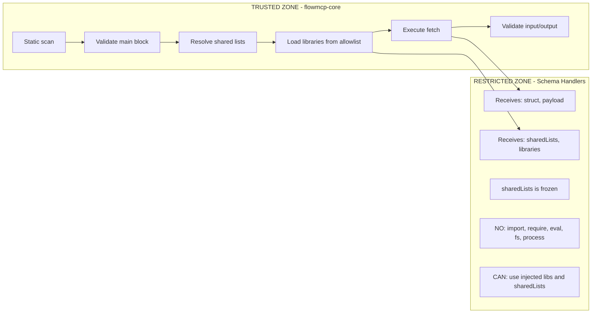
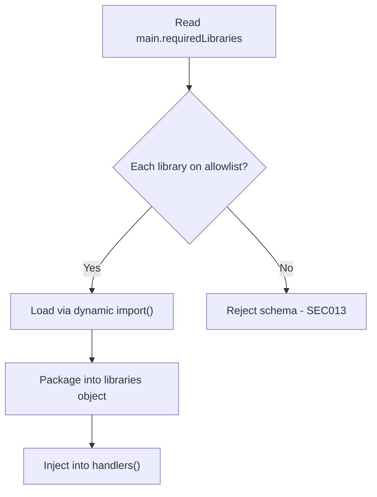
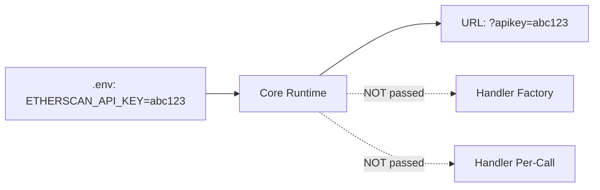

<!-- PAGEFIND-META-START -->
<span style="display:none" data-pagefind-meta="section">Specification</span>
<!-- PAGEFIND-META-END -->

FlowMCP enforces a layered security model that prevents schema files from accessing the network, filesystem, or process environment. All potentially dangerous operations are restricted to the trusted core runtime. Dependencies are injected through a factory function pattern, and external libraries are gated by an allowlist.

:::note
This page covers the security model from the [formal specification](https://github.com/FlowMCP/flowmcp-spec). Security is enforced at multiple levels — static scan, runtime constraints, and API key isolation.
:::

## Trust Boundary

FlowMCP enforces a strict trust boundary between the core runtime and schema handlers:



**Trusted Zone (flowmcp-core):**
- Reads schema file as raw string and runs static security scan
- Loads and validates the `main` export
- Resolves shared list references and deep-freezes the data
- Loads libraries from the allowlist
- Executes HTTP fetch (handlers never fetch directly)
- Validates input parameters and output schema

**Restricted Zone (schema handlers):**
- Receives `sharedLists` and `libraries` through the factory function
- Receives `struct`, `payload`, and `response` per-call
- Transforms data (restructure, filter, compute)
- Cannot access network, filesystem, process, or global scope

## Static Security Scan

Before a schema is loaded, the **raw file content** is scanned for forbidden patterns. This happens before `import()` to prevent code execution.

:::caution
Since all dependencies are injected through the factory function, schema files must have **zero import statements**. Any occurrence of `import ` in the file content causes rejection.
:::

### Forbidden Patterns

| Pattern | Reason |
|---------|--------|
| `import ` | No imports — all dependencies are injected |
| `require(` | No CommonJS imports |
| `eval(` | Code injection |
| `Function(` | Code injection |
| `new Function` | Code injection |
| `fs.` | Filesystem access |
| `node:fs` | Filesystem access |
| `fs/promises` | Filesystem access |
| `process.` | Process access |
| `child_process` | Shell execution |
| `globalThis.` | Global scope access |
| `global.` | Global scope access |
| `__dirname` | Path leaking |
| `__filename` | Path leaking |
| `setTimeout` | Async side effects |
| `setInterval` | Async side effects |

### Scan Sequence

```
1. Read file as raw string (before import)
2. Scan entire file for all forbidden patterns
3. If any pattern matches -> reject file with error message(s)
4. If clean -> proceed with dynamic import()
```

The entire file is scanned uniformly — no distinction between main and handler regions.

## Library Allowlist

The runtime maintains an allowlist of approved npm packages. Only these packages can be declared in `requiredLibraries` and injected into handlers.

### Default Allowlist

```javascript
const DEFAULT_ALLOWLIST = [
    'ethers',
    'moment',
    'indicatorts',
    '@erc725/erc725.js',
    'ccxt',
    'axios'
]
```

### User-Extended Allowlist

Users can extend the allowlist in `.flowmcp/config.json`:

```json
{
    "security": {
        "allowedLibraries": [ "custom-lib", "another-lib" ]
    }
}
```

The effective allowlist is the union of default and user-extended lists.

### Library Loading Sequence



1. **Read requiredLibraries** — Extract the list of declared packages from the main block.
2. **Check allowlist** — Every entry must appear in the default or user-extended allowlist.
3. **Load approved libraries** — Each approved library is loaded via dynamic `import()`.
4. **Inject into factory** — The `libraries` object is passed to `handlers( { sharedLists, libraries } )`.

## Shared List File Restrictions

Shared list files have an **even stricter** scan:

| Allowed | Forbidden |
|---------|-----------|
| `export const list = { meta: {...}, entries: [...] }` | Any function definition |
| String/number/boolean/null values | `async`, `await`, `function`, `=>` |
| Arrays and objects | Any schema forbidden patterns |
| Comments (`//`, `/* */`) | Template literals with expressions |

Shared lists are pure data. No logic, no transformations, no computed values.

## Handler Runtime Constraints

Even after passing the static scan, handlers are constrained:

1. **No `fetch` access** — the runtime executes fetch and passes the response to `postRequest`
2. **No side effects** — receive data, return data. No logging, no file writes
3. **`sharedLists` is read-only** — deep-frozen via `Object.freeze()`. Mutations throw `TypeError`
4. **Only allowlisted packages** — non-injected packages are not in scope
5. **Return value required** — must return the expected shape

### Handler Function Signatures

```javascript
// preRequest — modify the request before fetch
preRequest: async ( { struct, payload } ) => {
    // struct: the request structure (url, headers, body)
    // payload: resolved route parameters
    // sharedLists + libraries: available via factory closure
    return { struct, payload }
}

// postRequest — transform the response after fetch
postRequest: async ( { response, struct, payload } ) => {
    // response: parsed JSON from the API
    // sharedLists + libraries: available via factory closure
    return { response }
}
```

## API Key Protection

:::caution
API keys are **never exposed to handler code**. They are injected by the runtime into URL/headers only.
:::



- `requiredServerParams` values are injected into URL/headers by the runtime
- The `handlers()` factory receives `sharedLists` and `libraries` only
- Per-call handlers receive `struct`, `payload`, and `response` only
- Key values are never logged

### Key Injection Flow

```
1. Schema declares requiredServerParams: [ 'ETHERSCAN_API_KEY' ]
2. Runtime reads ETHERSCAN_API_KEY from .env
3. Parameter template: '{{SERVER_PARAM:ETHERSCAN_API_KEY}}'
4. Runtime substitutes into URL: '?apikey=abc123'
5. Handler receives response — never sees the key value
```

## Threat Model

| Threat | Mitigation |
|--------|------------|
| Schema imports a module | Static scan blocks `import`/`require` |
| Schema requests unapproved library | Blocked by allowlist (SEC013) |
| Schema reads filesystem | Static scan blocks `fs`, `node:fs` |
| Schema executes shell commands | Static scan blocks `child_process` |
| Schema accesses environment | Static scan blocks `process.` |
| Schema exfiltrates data via fetch | Handlers cannot call `fetch()` |
| Schema modifies global state | Static scan blocks `globalThis`/`global.` |
| Handler mutates shared list data | `sharedLists` is deep-frozen |
| Shared list contains executable code | Stricter scan blocks all functions/arrows |
| Schema leaks API keys | Keys never passed to factory or handlers |
| Schema uses eval | Static scan blocks `eval(`, `Function(` |

## Security Error Codes

### SEC001-SEC099 — Static Scan Failures

| Code | Description |
|------|-------------|
| SEC001 | Forbidden `import` statement found |
| SEC002 | Forbidden `require()` call found |
| SEC003 | Forbidden `eval()` call found |
| SEC004 | Forbidden `Function()` constructor found |
| SEC005 | Forbidden filesystem access |
| SEC006 | Forbidden `process.` access |
| SEC007 | Forbidden `child_process` access |
| SEC008 | Forbidden global scope access |
| SEC009 | Forbidden path variable |
| SEC010 | Forbidden `new Function` |
| SEC011 | Forbidden timer (`setTimeout`/`setInterval`) |
| SEC013 | Unapproved library in `requiredLibraries` |

### SEC100-SEC199 — Runtime Constraint Violations

| Code | Description |
|------|-------------|
| SEC100 | Handler attempted to call `fetch()` |
| SEC101 | Handler returned invalid shape |
| SEC102 | Handler attempted to mutate frozen `sharedLists` |
| SEC103 | Library loading failed for approved package |
| SEC104 | Factory function `handlers()` threw during initialization |

### SEC200-SEC299 — Shared List Scan Failures

| Code | Description |
|------|-------------|
| SEC200 | Function definition found in shared list |
| SEC201 | Arrow function found in shared list |
| SEC202 | Async/await keyword found in shared list |
| SEC203 | Template literal with expression found |
| SEC204 | Forbidden pattern found in shared list |

All violations in a single file are reported together — the scan does not stop at the first match.
