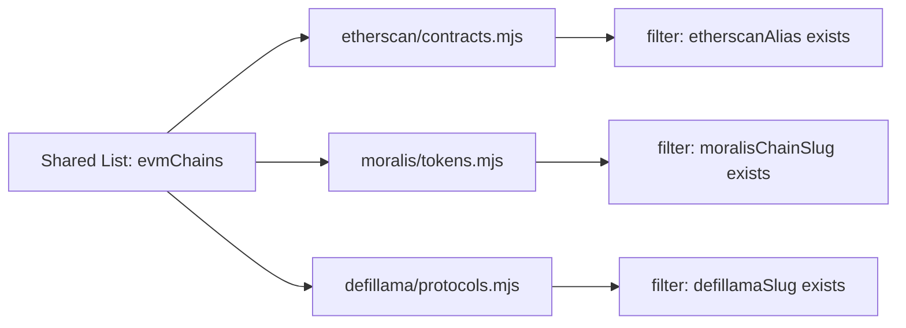
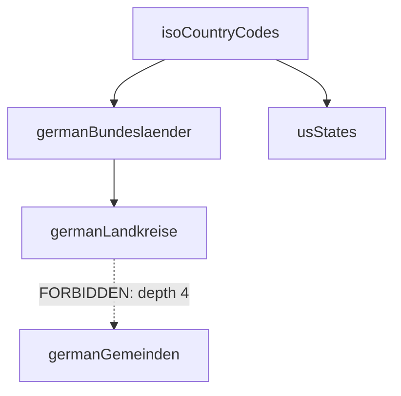
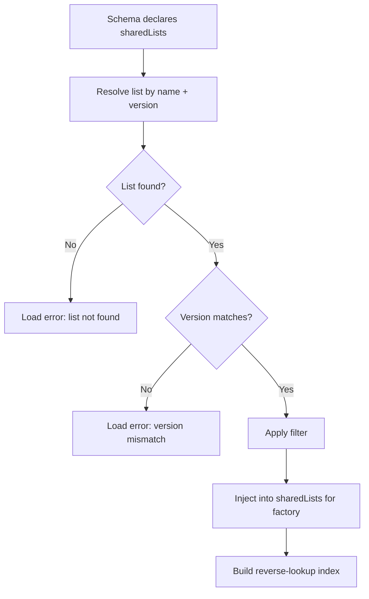

Shared lists eliminate duplication of common value sets across schemas. Instead of every Etherscan schema maintaining its own chain list, they reference a single `evmChains` shared list that is injected at load-time.

:::note
This page covers shared lists from the [formal specification](https://github.com/FlowMCP/flowmcp-spec). See [Parameters](/docs/specification/parameters/) for how schemas use shared list interpolation.
:::

## Purpose

Many schemas across different providers need the same sets of values — EVM chain identifiers, fiat currency codes, token standards. Without shared lists, each schema duplicates these values inline, leading to:

- **Inconsistency** — one schema uses `'eth'`, another uses `'ETH'`, a third uses `'ethereum'`
- **Maintenance burden** — adding a new chain means updating dozens of schemas
- **No single source of truth** — no way to verify which values are canonical



A single shared list feeds multiple schemas. Each schema applies its own filter to extract only the entries relevant to that provider.

## List Definition Format

A shared list is a `.mjs` file that exports a `list` object with two top-level keys: `meta` and `entries`.

```javascript
export const list = {
    meta: {
        name: 'evmChains',
        version: '1.0.0',
        description: 'Unified EVM chain registry with provider-specific aliases',
        fields: [
            { key: 'alias', type: 'string', description: 'Canonical chain alias' },
            { key: 'chainId', type: 'number', description: 'EVM chain ID' },
            { key: 'name', type: 'string', description: 'Human-readable chain name' },
            { key: 'etherscanAlias', type: 'string', optional: true, description: 'Etherscan API chain parameter' },
            { key: 'moralisChainSlug', type: 'string', optional: true, description: 'Moralis chain slug' },
            { key: 'defillamaSlug', type: 'string', optional: true, description: 'DeFi Llama chain identifier' },
            { key: 'coingeckoPlatformId', type: 'string', optional: true, description: 'CoinGecko asset platform ID' }
        ],
        dependsOn: []
    },
    entries: [
        {
            alias: 'ETHEREUM_MAINNET',
            chainId: 1,
            name: 'Ethereum Mainnet',
            etherscanAlias: 'ETH',
            moralisChainSlug: 'eth',
            defillamaSlug: 'Ethereum',
            coingeckoPlatformId: 'ethereum'
        },
        {
            alias: 'POLYGON_MAINNET',
            chainId: 137,
            name: 'Polygon Mainnet',
            etherscanAlias: 'POLYGON',
            moralisChainSlug: 'polygon',
            defillamaSlug: 'Polygon',
            coingeckoPlatformId: 'polygon-pos'
        }
        // ... more entries
    ]
}
```

:::caution
The file must export exactly one `list` constant. No other exports, no imports, no function definitions, no dynamic expressions. Shared lists are pure data.
:::

## Meta Block

The `meta` block describes the list identity and structure.

| Field | Type | Required | Description |
|-------|------|----------|-------------|
| `name` | `string` | Yes | Unique list identifier (camelCase) |
| `version` | `string` | Yes | Semver version |
| `description` | `string` | Yes | What this list contains |
| `fields` | `array` | Yes | Field definitions for entries |
| `dependsOn` | `array` | No | Dependencies on other lists |

### Naming Convention

List names use camelCase and must be globally unique. The name should describe the collection, not a single entry:

- `evmChains` (not `evmChain`)
- `fiatCurrencies` (not `fiatCurrency`)
- `isoCountryCodes` (not `countryCode`)

### Versioning

Lists follow strict semver:

| Bump | When |
|------|------|
| **Patch** (`1.0.1`) | Correcting a typo, fixing a wrong value |
| **Minor** (`1.1.0`) | Adding new entries, adding new optional fields |
| **Major** (`2.0.0`) | Removing entries, removing fields, renaming fields, changing types |

Schemas pin to a specific version. A major version bump requires all referencing schemas to update.

## Field Definitions

Each entry in `meta.fields` describes one field that entries can or must contain.

| Field | Type | Required | Description |
|-------|------|----------|-------------|
| `key` | `string` | Yes | Field name |
| `type` | `string` | Yes | `string`, `number`, or `boolean` |
| `description` | `string` | Yes | What this field represents |
| `optional` | `boolean` | No | If `true`, entries may omit this field |

Only three primitive types are supported — no objects, arrays, or nested structures. Lists are flat by design.

### Required vs Optional Fields

Fields without `optional: true` are required in every entry. Optional fields may be omitted or set to `null`. This enables provider-specific columns — `etherscanAlias` is optional because not every chain has an Etherscan explorer.

## Dependencies Between Lists

Lists can declare dependencies on other lists using `meta.dependsOn`:

```javascript
meta: {
    name: 'germanBundeslaender',
    version: '1.0.0',
    description: 'German federal states',
    fields: [
        { key: 'name', type: 'string', description: 'State name' },
        { key: 'code', type: 'string', description: 'State code' },
        { key: 'countryRef', type: 'string', description: 'Reference to parent country' }
    ],
    dependsOn: [
        { ref: 'isoCountryCodes', version: '1.0.0', condition: { field: 'alpha2', value: 'DE' } }
    ]
}
```

### Dependency Rules

1. **`ref` must resolve** — the referenced list name must exist in the registry
2. **Version pinning** — `version` pins the dependency to a specific semver version
3. **`condition` is optional** — when present, it filters the parent list
4. **No circular dependencies** — A depends on B means B cannot depend on A
5. **Maximum depth: 3 levels** — prevents resolution complexity



## Referencing from Schemas

Schemas reference shared lists in the `main.sharedLists` array:

```javascript
main: {
    sharedLists: [
        {
            ref: 'evmChains',
            version: '1.0.0',
            filter: { key: 'etherscanAlias', exists: true }
        }
    ]
}
```

### Reference Fields

| Field | Type | Required | Description |
|-------|------|----------|-------------|
| `ref` | `string` | Yes | List name to reference |
| `version` | `string` | Yes | Required list version |
| `filter` | `object` | No | Filter entries before injection |

### Filter Types

| Filter | Description | Example |
|--------|-------------|---------|
| `{ key, exists: true }` | Only entries where field exists and is not `null` | `{ key: 'etherscanAlias', exists: true }` |
| `{ key, value }` | Only entries where field equals value | `{ key: 'mainnet', value: true }` |
| `{ key, in: [...] }` | Only entries where field is in the list | `{ key: 'chainId', in: [1, 137, 42161] }` |

When `filter` is omitted, all entries are injected.

## Runtime Injection Lifecycle



1. **Resolve** — The runtime looks up each `ref` in the list registry. If not found, the schema fails to load.
2. **Version Check** — The runtime verifies the registry version matches. A mismatch is a hard error.
3. **Filter** — If a `filter` is declared, the runtime applies it. Otherwise all entries pass through.
4. **Inject** — Filtered entries are passed to the `handlers` factory as `sharedLists`:

```javascript
export const handlers = ( { sharedLists } ) => ({
    getGasOracle: {
        preRequest: async ( { struct, payload } ) => {
            const chain = sharedLists.evmChains
                .find( ( entry ) => entry.etherscanAlias === payload.chainName )
            return { struct, payload }
        }
    }
})
```

## List Registry

All shared lists are tracked in `_lists/_registry.json`:

```json
{
    "specVersion": "2.0.0",
    "lists": [
        {
            "name": "evmChains",
            "version": "1.0.0",
            "file": "_lists/evm-chains.mjs",
            "entryCount": 15,
            "hash": "sha256:def456..."
        }
    ]
}
```

### Registry Invariants

- Every `.mjs` file in `_lists/` must have a registry entry
- Every registry entry must point to an existing file
- The `hash` must match the current file content
- Validate with `flowmcp validate-lists`

## File Conventions

```
_lists/
    _registry.json
    evm-chains.mjs
    fiat-currencies.mjs
    iso-country-codes.mjs
```

- File names use kebab-case: `evm-chains.mjs`
- List names use camelCase: `evmChains`
- One list per file
