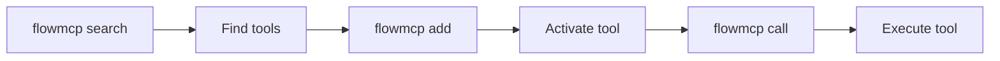

## Installation

```bash
npm install -g flowmcp
```

## CLI Workflow

The CLI follows a three-step pattern: discover tools, activate them, then call them.



## Core Commands

| Command | Description |
|---------|-------------|
| `flowmcp search <query>` | Find tools (max 10 results) |
| `flowmcp add <tool-name>` | Activate a tool + show parameters |
| `flowmcp call <tool-name> '{json}'` | Call a tool with JSON parameters |
| `flowmcp remove <tool-name>` | Deactivate a tool |
| `flowmcp list` | Show active tools |
| `flowmcp status` | Health check |

## Search, Add, Call

1. **Search for tools**

   Find tools by keyword. Results include name, description, and the command to add each tool.

   ```bash
   flowmcp search ethereum
   # Shows up to 10 matching tools with name + description

   flowmcp search "token price"
   # Refine query if too many results
   ```

2. **Add a tool**

   Activate a tool for your project. The response shows the tool's parameters with types and requirements.

   ```bash
   flowmcp add get_contract_abi_etherscan
   # Response shows: name, description, parameters with types
   ```

   The parameter schema is also saved locally in `.flowmcp/tools/` for reference.

3. **Call a tool**

   Execute the tool with JSON parameters. Use the parameter information from the `add` response.

   ```bash
   flowmcp call get_contract_abi_etherscan '{"address": "0xdAC17F958D2ee523a2206206994597C13D831ec7"}'
   ```

## Agent Mode vs Dev Mode

The CLI has two operating modes that control which commands are available:

| Mode | Commands | Use Case |
|------|----------|----------|
| **Agent** | search, add, call, remove, list, status | Daily AI agent usage |
| **Dev** | + validate, test, migrate | Schema development |

```bash
flowmcp mode dev    # Switch to dev mode
flowmcp mode agent  # Switch back to agent mode
```

:::note[Default Mode]
Agent mode is the default. It exposes only the commands an AI agent needs to discover, activate, and call tools. Switch to Dev mode for schema development and validation workflows.
:::

## Dev Mode Commands

Dev mode unlocks additional commands for schema authors:

```bash
flowmcp validate <path>           # Validate schema structure
flowmcp test single <path>        # Live API test
flowmcp validate-agent <path>     # Validate agent manifest
```

## Local Project Config

When you `add` tools, a `.flowmcp/` directory is created in your project:

```
.flowmcp/
├── config.json              # Active tools + mode
└── tools/                   # Parameter schemas (auto-generated)
    └── get_contract_abi_etherscan.json
```

Each file in `tools/` contains the tool name, description, and expected input parameters:

```json
{
    "name": "get_contract_abi_etherscan",
    "description": "Returns the Contract ABI of a verified smart contract",
    "parameters": {
        "address": { "type": "string", "required": true }
    }
}
```

## API Keys

:::tip[API Key Management]
Some tools require API keys stored in `~/.flowmcp/.env`. If a `call` fails because of missing keys, add the required key to your global config:

```bash
echo "ETHERSCAN_API_KEY=your_key_here" >> ~/.flowmcp/.env
```

Never commit API keys to version control. The `.env` file in `~/.flowmcp/` is your global key store and should stay on your machine only.
:::
