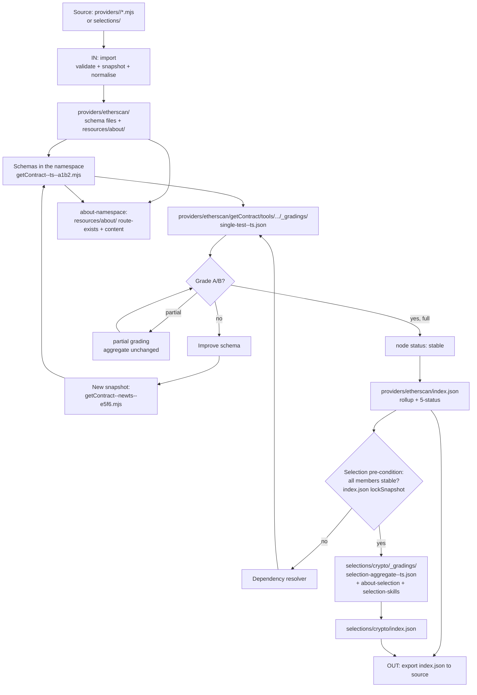

<aside class="edit-warning" role="note">
  <strong>Auto-generated:</strong> This file is auto-generated. Source: grading/3.0.0/18-flywheel-loop.md.
</aside>

> Conformance language (MUST/SHOULD/MAY) follows BCP 14 [RFC2119]/[RFC8174] as defined in [`00-overview.md`](/grading/overview/). The binding source is the FlowMCP Schemas Specification v4.3.0.

---

## The Flywheel as an IN/OUT Round-Trip

The grading process is a **round-trip** between the source repository and the workbench:

- **IN** — a provider folder (or selection definition) is imported into the workbench, snapshotted, and normalised.
- **Grade** — the provider-side and selection-side Areas grade the imported primitives, writing `_gradings/` and rolling them up into `index.json`.
- **OUT** — the graded state, primarily the `index.json`, is exported back to the source.

The pattern is self-reinforcing: every improvement raises the aggregate quality of the selections that contain the schema, and every selection run identifies the weakest schemas in a namespace. The loop is iteration over the same artefacts; the workbench `index.json` carries the current graded state across rounds.

---

## Mermaid Diagram

---

## Reading Direction

**Reading direction:** top-down (`flowchart TD`) follows the iteration flow. The pre-condition gate and the `stable` back-reference make the flywheel effect visible: every new `stable` provider-side grade opens the door for selection-side grading, and every selection run identifies the weakest schemas in the namespace.

---

## Reference Fields per Node

| Node | Reference |
|------|-----------|
| IMPORT / OUT | [`19-folder-layout.md`](/grading/folder-layout/) — the IN/OUT round-trip and folder layout |
| NS / SCHEMA | [`04-phases-single.md`](/grading/phases-single/) — provider-side Areas; [`08-grading-model.md`](/grading/grading-model/) — data model |
| SINGLE / SGRADE | [`04-phases-single.md`](/grading/phases-single/), [`05-phases-selection.md`](/grading/phases-selection/) — Area `_gradings/` placement |
| IDXN / IDXS | [`19-folder-layout.md`](/grading/folder-layout/) — the `index.json` rollup (live rollup + frozen lockSnapshot, 5-status) |
| GATE | [`21-pre-conditions.md`](/grading/pre-conditions/) — pre-conditions (only `stable` members pass) |
| STABLE / PART | [`06-determinism-and-tier.md`](/grading/determinism-and-tier/) — partial vs. full and the five node statuses |
| ABOUT | [`11-about-convention.md`](/grading/about-convention/) — About as a schema Resource |

---

## Self-Reinforcing Effect

The flywheel is self-reinforcing along three loops:

1. **Quality loop per schema**: SINGLE → CHECK → FIX → NEWSNAP → SCHEMA → SINGLE. Each iteration writes a new versioned snapshot (timestamp + hash in the file name); the next grading tests the improved schema variant. The hash binding lives in `index.json`, never in the source (see [`19-folder-layout.md`](/grading/folder-layout/)).
2. **Aggregation loop per selection**: SGRADE → (on member change) GATE → SGRADE. Every re-grading of a member updates the namespace `index.json`; the selection's frozen `lockSnapshot` is refreshed at the next selection-grading start.
3. **About-verification loop**: ABOUT (route-exists + content check) → on change a new About snapshot → re-check; the namespace `index.json` records the new About grade.

---

## Anti-Patterns

The following patterns break the flywheel and are excluded by the spec:

- **Partial gradings without a concluding full grading**: the node status never reaches `stable`, the selection stays blocked (see [`06-determinism-and-tier.md`](/grading/determinism-and-tier/)).
- **Schema edit without a new snapshot**: a source edit MUST produce a new versioned snapshot file; editing in place breaks the latest-resolution and the hash binding (see [`19-folder-layout.md`](/grading/folder-layout/)).
- **Selection grading with non-`stable` members**: the pre-condition (see [`21-pre-conditions.md`](/grading/pre-conditions/)) blocks the selection run before any Area runs.

---

## Cross-References

- Round-trip and folder layout → [`19-folder-layout.md`](/grading/folder-layout/)
- Partial vs. full and the five node statuses → [`06-determinism-and-tier.md`](/grading/determinism-and-tier/)
- Pre-condition → [`21-pre-conditions.md`](/grading/pre-conditions/)
- Provider-side Areas → [`04-phases-single.md`](/grading/phases-single/)
- Selection-side Areas → [`05-phases-selection.md`](/grading/phases-selection/)

## Related

- **Depends on:** [`00-overview.md`](/grading/overview/), [`06-determinism-and-tier.md`](/grading/determinism-and-tier/), [`08-grading-model.md`](/grading/grading-model/), [`19-folder-layout.md`](/grading/folder-layout/), [`21-pre-conditions.md`](/grading/pre-conditions/)
- **Related:** [`04-phases-single.md`](/grading/phases-single/), [`05-phases-selection.md`](/grading/phases-selection/), [`11-about-convention.md`](/grading/about-convention/)

