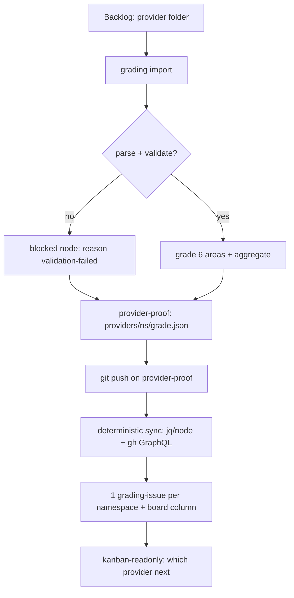

<aside class="edit-warning" role="note">
  <strong>Auto-generated:</strong> This file is auto-generated. Source: grading/3.0.0/26-monitoring-track.md.
</aside>

> Conformance language (MUST/SHOULD/MAY) follows BCP 14 [RFC2119]/[RFC8174] as defined in [`00-overview.md`](/grading/overview/). The binding source is the FlowMCP Schemas Specification v4.3.0.

---

## Scope — the board is back

This chapter brings the **grading-monitoring board back into scope**, reversing the `2.0.x` stance where the GitHub-Kanban wiring was declared out of scope and "superseded by `index.json`" (the scope flip is recorded in [`00-overview.md`](/grading/overview/)). The board is a deterministic projection of the per-namespace grading state; it is **separate** from the schema-development track.

What is in scope here: the **two-track decoupling**, the **one-grading-issue-per-namespace** contract and its metadata source, the **board contract** (which status vocabulary drives which column, idempotency), and the explicit **island ↔ repo ↔ provider-proof data flow**. What is not: the executable sync workflow, the producer that writes the provider-proof, and the consuming skills — those are implementation phases (see [Out of scope](#out-of-scope)).

---

## Two Tracks (decoupling)

The pipeline is split into two tracks that are **not linked**.

### Track A — Schema-Development

File versioning via Git plus the existing schema issues. Owned by the **Schemas-Spec lifecycle** ([Schemas-Spec v4.3.0 §21](/specification/schema-lifecycle/)). The development gate is unchanged: a schema must pass `flowmcp validate` (clean) before it reaches `stage:production`. The Grading-Spec does **not** own Track A issues.

### Track B — Grading-Monitoring

**One grading-issue per namespace**, driven by the **provider-proof** (`providers/<ns>/grade.json`) and synced deterministically to a board. This is the track this chapter defines.

### The binding non-coupling invariant

The two tracks are **NOT linked**:

- A Track B grading-issue carries **no reference** into Track A schema-issue numbers, and vice versa.
- This protects the existing schema-issue commit references — the Git history that links commits to schema issues stays valid because Track B never reuses or rewrites those numbers.

**Selection** (which providers to bundle into a domain selection) remains **OUT OF SCOPE** (a separate memo). The selection gate is unchanged: selection runs only once all member providers are `stable` (the `stable`-only pre-condition, [`21-pre-conditions.md`](/grading/pre-conditions/)).

---

## One Grading-Issue per Namespace

Exactly **one** grading-issue exists per namespace. This supersedes the per-primitive sub-issue model that the Schemas-Spec used to describe (the sub-issue wording is removed from [Schemas-Spec v4.3.0 §21](/specification/schema-lifecycle/)); a removed primitive is now a `blockers[]` entry under the namespace grading-issue, not its own issue.

### Metadata source — the provider-proof

The grading-issue metadata is sourced **only** from the provider-proof `providers/<ns>/grade.json`:

| Source field | Used for |
|--------------|----------|
| `namespace` | issue identity (one issue per namespace) |
| schema names | issue body — the schemas under the namespace |
| the 5-status per node | issue body — per-schema/per-tool status |
| `namespaceAggregate` (the aggregate grade) | the provider grade shown on the issue and board |
| `blockers[]` | the actionable list (e.g. removed primitives, `validation-failed` records) |

### Provider grade = `namespaceAggregate`

The **provider grade is the `namespaceAggregate`** — the namespace-level rollup grade (Memo 093 F3/F4). A per-schema grade **rolls up** into the namespace aggregate; the per-schema grade is **not** the gate. This resolves the schema-spec conflict where §21 implied a per-schema grade gate: §21 now consumes the `namespaceAggregate` (see [Schemas-Spec v4.3.0 §21](/specification/schema-lifecycle/)).

### Namespace anlage (where the namespace name comes from)

The namespace is normally derived from the schema `namespace` field. When **all** schemas in a folder are unparseable, the **folder name** is the fallback namespace identifier (cross-ref [`19-folder-layout.md`](/grading/folder-layout/)); the folder↔namespace consistency rule is the tested invariant ([Schemas-Spec v4.3.0 §09](/specification/validation-rules/), `VAL012`). Once a schema parses and exposes a real namespace, that field is authoritative and the folder is renamed to match (rename-later). The fallback namespace MUST be a valid namespace (`/^[a-z][a-z0-9-]*$/`).

---

## Board Contract

The board is a **deterministic** projection of the provider-proof. The contract has five parts.

### 1. One writer, pure code

The **sync workflow (a script) is the only writer** of issue / board state. The chain `provider-proof → issue/board` is pure code (`jq` / node plus `gh` GraphQL) — **no LLM**. Before any board update, the proof is validated against [`index.schema.json`](./index.schema.json). A proof that does not validate is not synced.

### 2. Column mapping (rollup operational vocabulary)

The board columns are driven by the **rollup operational vocabulary** (`operational` / `partial` / `blocked` / `pending` / `rejected`, defined in [`23-index-json.md`](/grading/index-json/)), **NOT** the node 5-status enum. The mapping is:

| Rollup status | Board column |
|---------------|--------------|
| `pending` | Backlog |
| `partial` | In Progress |
| `blocked` (incl. `reason: validation-failed`) | Blocked |
| `operational` | Done |
| `rejected` | Rejected |

Every status value in this table exists in the operational rollup enum of [`23-index-json.md`](/grading/index-json/); the `validation-failed` reason matches the pinned reason set there.

### 3. Idempotency (backref)

The sync reads the `githubIssue` / `boardColumn` backref (defined on the node and the namespace rollup in [`23-index-json.md`](/grading/index-json/), enforced in [`index.schema.json`](./index.schema.json)). When the `githubIssue` backref is **present**, the sync MUST NOT create a second issue for the namespace — it **updates** the existing issue / moves the existing card instead.

### 4. Determinism boundary

The **only** non-deterministic part of the whole pipeline is the LLM evaluation of the six grading areas. Everything downstream of the provider-proof — the issue creation, the column move, the board state — is deterministic. The issue/board sync is **never** non-deterministic.

### 5. Read-only consumer

A `kanban-readonly` consumer reads the proof / board and answers "which provider next". The binding invariant is that the **reader never writes**: a read-only consumer MUST NOT create or mutate issues, cards, or proofs. (The implementing skill ships in a later phase; this chapter only states the contract it must honour.)

---

## Island ↔ Repo ↔ Provider-Proof Data Flow

This is the explicit data-flow contract: where `index.json` is born, where it is committed, and what CI reads.

1. **Island** (`~/.flowmcp/grading` = `grading-data/`) is an internal workbench, **not a repo**. It is gitignored and **never CI-visible**. Grading runs here; `index.json` is **born and rebuilt** here (see [`22-workbench-island.md`](/grading/workbench-island/) and [`23-index-json.md`](/grading/index-json/)).
2. **Repo** (`flowmcp-schemas-private`) holds the neutral source `.mjs` and **receives** the committed **provider-proof** `providers/<ns>/grade.json` — the CI-visible, per-namespace grade/status rollup (Memo 093 F10).
3. The **export step** (`grading export`, the OUT side of [`22-workbench-island.md`](/grading/workbench-island/)) lands the proof into the provider folder of the repo. CI reads the **repo-resident** proof, **never** the island-local `index.json`.
4. A **push on the provider-proof** triggers the deterministic sync workflow (Memo 093 F10, decision A). The push is the event; the sync is the deterministic reaction.

### Island vs. Repo (comparison)

| Aspect | Island (`grading-data/`) | Repo (`flowmcp-schemas-private`) |
|--------|--------------------------|----------------------------------|
| Nature | internal workbench, not a repo | versioned source repository |
| Structure | verbose (timestamp + hash, per-primitive folders) | neutral `.mjs` + per-namespace `providers/<ns>/grade.json` |
| `index.json` / proof location | `grading-data/providers/<ns>/index.json` (born + rebuilt here) | `providers/<ns>/grade.json` (exported, committed) |
| CI-visible | no (gitignored) | yes (the proof is the CI/board source) |

### Flow

The diagram mirrors the Soll-Ablauf of Memo 093 Kap. 10: `Backlog → import → {parse?} → blocked-node | grade+aggregate → provider-proof → git push → deterministic sync → 1 issue/namespace + board → kanban-readonly`. The only non-deterministic node is `grade 6 areas`.

---

## Relationship to the superseded Chapter 14

The two salvaged rules from [`14-kanban-data-contract.md`](/grading/kanban-data-contract/) remain normative and now apply to this monitoring track:

- **Audit trail — never delete, newest is current.** Grading entries and provider-proofs are never deleted or overwritten in place; the current state is the newest entry. The board projection follows the newest proof.
- **Irreversible veto — `rejected` is terminal.** A `rejected` namespace stays `rejected`; the board MUST NOT move a `rejected` card back to another column by editing or deleting an entry. A veto is lifted only by a fully new evaluation.

---

## Cross-References

- The emit-on-failure import gate that produces `blocked` records: [`22-workbench-island.md`](/grading/workbench-island/)
- The `index.json` rollup, pinned reason set, board vocabulary, and backref fields: [`23-index-json.md`](/grading/index-json/)
- Folder↔namespace invariant, fallback, rename-on-parse, provider-proof location: [`19-folder-layout.md`](/grading/folder-layout/)
- The status-record artefact class (non-grading `blocked` node): [`08-grading-model.md`](/grading/grading-model/)
- The salvaged audit-trail / irreversible-veto rules: [`14-kanban-data-contract.md`](/grading/kanban-data-contract/)

## Out of scope

- The executable **sync workflow** (proof → issue/board via `gh` GraphQL) — implementation phase; this chapter writes only its contract.
- The **producer** that writes the provider-proof — implementation phase.
- The `kanban-readonly` and provider-grading-issue / provider-grade-bridge **skills** — implementation phase; this chapter states only the read-only and deterministic invariants they must honour.
- **Selection** (which providers to bundle) — a separate memo.

## Related

- **Depends on:** [`22-workbench-island.md`](/grading/workbench-island/), [`23-index-json.md`](/grading/index-json/), [`19-folder-layout.md`](/grading/folder-layout/)
- **Related:** [`06-determinism-and-tier.md`](/grading/determinism-and-tier/), [`08-grading-model.md`](/grading/grading-model/), [`14-kanban-data-contract.md`](/grading/kanban-data-contract/)

