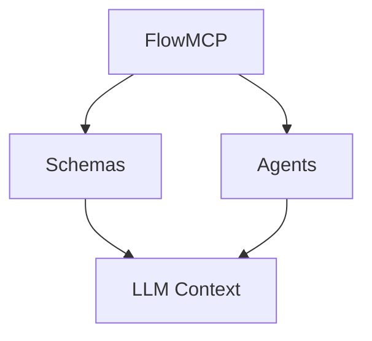

import { Card, CardGrid } from '@astrojs/starlight/components';
import LogoStrip from '../../components/LogoStrip.astro';
import StatsBar from '../../components/StatsBar.astro';

  <h1 style="font-size:clamp(2rem, 5vw, 3.5rem); font-weight:800; color:var(--text-primary); margin-bottom:1rem; line-height:1.1;">
    Normalize any data source for AI agents.
  </h1>
  

    Open source · MIT · GitHub-native · No vendor lock-in
  

  

    Used at Berlin Mobility Hackathon 2026 · DB InfraGO
  

<LogoStrip />

<StatsBar />

## What is this?

Public data exists in many formats, quality levels, and behind different access methods. We make it usable for AI agents through a schema system — without changing the data sources.

<CardGrid>
	<Card title="Schemas & Tools" icon="puzzle">
		240+ open data schemas normalize data sources into unified tools.
	</Card>
	<Card title="AI Agents" icon="rocket">
		Specialized agents with agentic loops answer questions with real data.
	</Card>
	<Card title="Open Source" icon="github">
		MIT license. Clone, customize, self-host.
	</Card>
</CardGrid>

## Architecture (Test Render)

