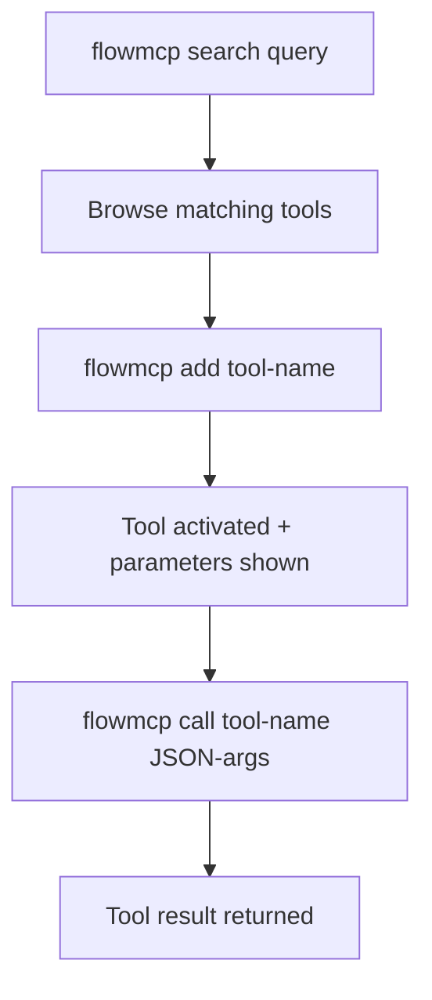

{/* PAGEFIND-META-START */}
<span style="display:none" data-pagefind-meta="section">Reference</span>
{/* PAGEFIND-META-END */}

import InstallNote from '../../../components/InstallNote.astro';

:::note[New to FlowMCP?]
This page is the complete CLI reference. For a guided five-minute install and your first live API call, start with [CLI Setup](/quickstart/quickstart/).
:::

## Installation

<InstallNote repo="flowmcp-cli" global />

## CLI Workflow

The CLI follows a three-step pattern: discover tools, activate them, then call them.



## Core Commands

| Command | Description |
|---------|-------------|
| `flowmcp search <query>` | Find tools (max 10 results) |
| `flowmcp add <tool-name>` | Activate a tool + show parameters |
| `flowmcp call <tool-name> '{json}'` | Call a tool with JSON parameters |
| `flowmcp remove <tool-name>` | Deactivate a tool |
| `flowmcp list` | Show active tools |
| `flowmcp status` | Health check |

## Search, Add, Call

Discover tools by keyword. Add a tool to activate it for your project — the response shows the tool's parameters. Then call the tool with JSON arguments.

```bash
flowmcp search ethereum
flowmcp add get_contract_abi_etherscan
flowmcp call get_contract_abi_etherscan '{"address": "0xdAC17F958D2ee523a2206206994597C13D831ec7"}'
```

The parameter schema for each added tool is saved locally in `.flowmcp/tools/` for inspection.

:::note[Programmatic Usage]
For programmatic access (not via CLI), see the [Programmatic API](/reference/core-methods).
:::

## Agent Mode vs Dev Mode

The CLI has two operating modes that control which commands are available:

| Mode | Commands | Use Case |
|------|----------|----------|
| **Agent** | search, add, call, remove, list, status | Daily AI agent usage |
| **Dev** | + validate, test, migrate | Schema development |

```bash
flowmcp mode dev    # Switch to dev mode
flowmcp mode agent  # Switch back to agent mode
```

:::note[Default Mode]
Agent mode is the default. It exposes only the commands an AI agent needs to discover, activate, and call tools. Switch to Dev mode for schema development and validation workflows.
:::

## Dev Mode Commands

Dev mode unlocks additional commands for schema authors:

```bash
flowmcp validate <path>           # Validate schema structure
flowmcp test single <path>        # Live API test
flowmcp validate-agent <path>     # Validate agent manifest
```

## Local Project Config

When you `add` tools, a `.flowmcp/` directory is created in your project:

```
.flowmcp/
├── config.json              # Active tools + mode
└── tools/                   # Parameter schemas (auto-generated)
    └── get_contract_abi_etherscan.json
```

Each file in `tools/` contains the tool name, description, and expected input parameters:

```json
{
    "name": "get_contract_abi_etherscan",
    "description": "Returns the Contract ABI of a verified smart contract",
    "parameters": {
        "address": { "type": "string", "required": true }
    }
}
```

## API Keys

:::tip[API Key Management]
Some tools require API keys stored in `~/.flowmcp/.env`. If a `call` fails because of missing keys, add the required key to your global config:

```bash
echo "ETHERSCAN_API_KEY=your_key_here" >> ~/.flowmcp/.env
```

Never commit API keys to version control. The `.env` file in `~/.flowmcp/` is your global key store and should stay on your machine only.
:::

## Grading (Experimental)

:::caution[Experimental]
The `grading` command area is **experimental** — its CLI surface may change. It drives the FlowMCP [Grading standard](/grading/overview/) (`gradingSpec`), which scores and grades schemas and selections.
:::

The CLI stores its grading working data — the **workbench island** — next to your global config, **not** in any repository. Default location and override chain:

| Priority | Source | Example |
|----------|--------|---------|
| 1 | `--grading-data <path>` flag | per-call override |
| 2 | `FLOWMCP_GRADING_DATA` env var | shell/session override |
| 3 | `gradingDataDir` in `~/.flowmcp/config.json` | persistent config |
| 4 | Default | `~/.flowmcp/grading/` |

This island holds runtime grading data only. It lives in your home directory, is never published, and must not be committed. The published **Grading standard** itself is the versioned spec at [`/grading/`](/grading/overview/).
