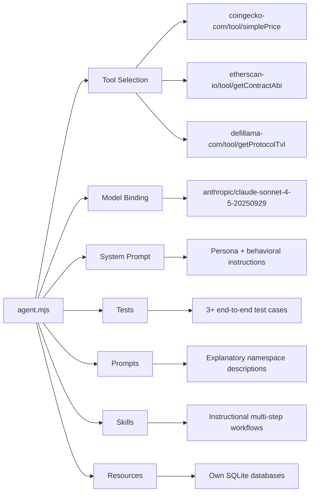
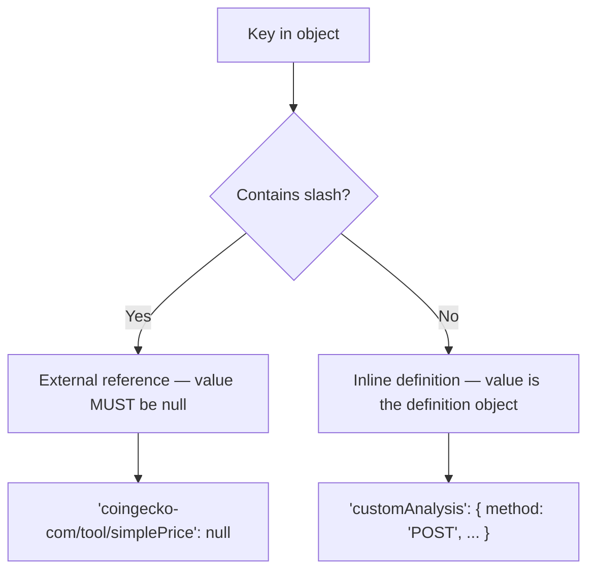
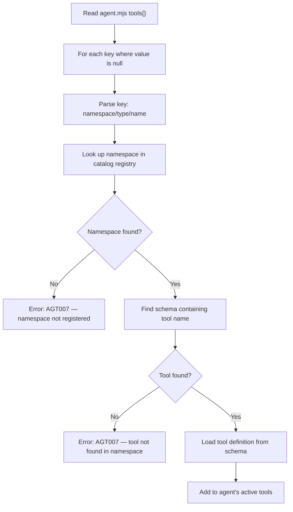
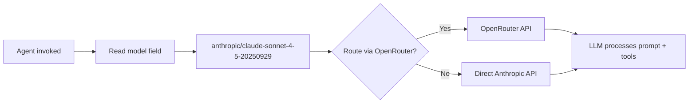
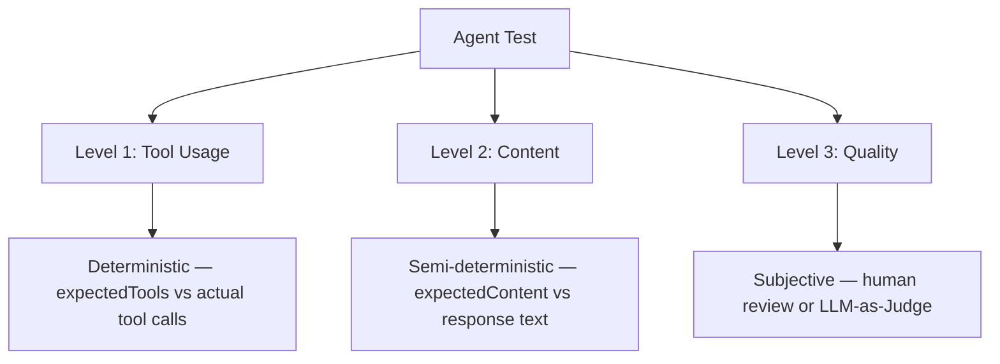
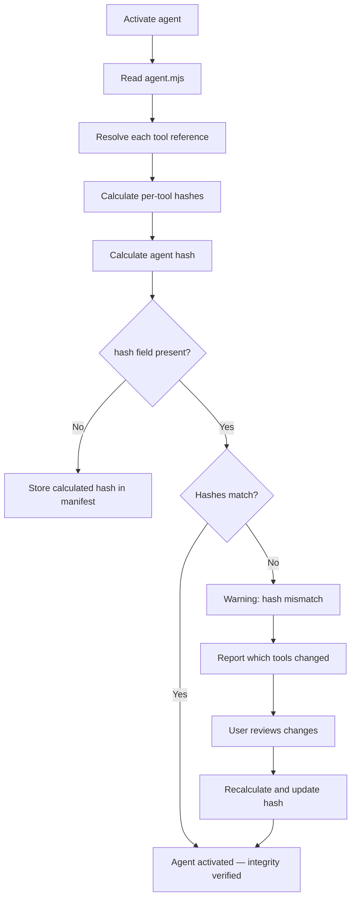
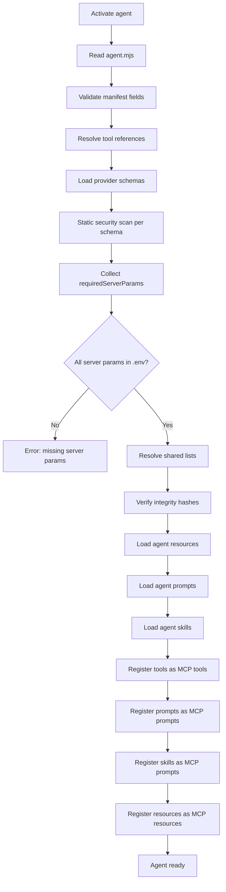

<aside class="edit-warning" role="note">
  <strong>Auto-generated:</strong> This file is auto-generated. Source: spec/v4.1.0/06-agents.md.
</aside>

# FlowMCP Specification v4.0.0 — Agents

> Normative language (MUST/SHOULD/MAY) follows the conventions defined in [00-overview.md](./00-overview.md) (Conformance Language).

An Agent is a complete, purpose-driven definition that bundles tools from multiple providers for a specific task. Agents replace Groups from v2. Where Groups were simple tool lists, Agents are full compositions with a model binding, system prompt, tests, prompts, skills, and optional resources. This document defines the agent manifest format, tool cherry-picking, model binding, system prompts, integrity verification, and validation rules.

---

## Purpose

A typical FlowMCP catalog contains hundreds of tools across dozens of providers. A developer working on a crypto research task needs tools from CoinGecko (prices), Etherscan (on-chain data), and DeFi Llama (TVL data) — but not the other 200 tools in the catalog. An Agent selects exactly the tools needed, binds them to a specific LLM, defines how the LLM SHOULD behave, and includes tests that verify the composition works.



The diagram shows how an agent manifest connects seven concerns: which tools to use, which model to target, how the model SHOULD behave, how to verify the composition, what explanatory prompts to provide, what instructional skills to include, and what own resources to bring.

---

## Agent Manifest Format

Each agent is defined by an `agent.mjs` file inside its own directory under `agents/`. The manifest is an ES module exporting `export const agent` containing all metadata, tool references, configuration, and tests. Where provider schemas export `main`, agent manifests export `agent` to clearly distinguish the two.

```javascript
export const agent = {
    name: 'crypto-research',
    description: 'Cross-provider crypto analysis agent',
    version: 'flowmcp/4.0.0',
    model: 'anthropic/claude-sonnet-4-5-20250929',
    systemPrompt: 'You are a crypto research agent. You analyze token prices, on-chain data, and DeFi protocol metrics. Always provide sources for your data. When comparing across chains, normalize values to USD.',
    tools: {
        'coingecko-com/tool/simplePrice': null,
        'coingecko-com/tool/getCoinMarkets': null,
        'etherscan-io/tool/getContractAbi': null,
        'etherscan-io/tool/getTokenBalances': null,
        'defillama-com/tool/getProtocolTvl': null
    },
    resources: {},
    prompts: {
        'about': { file: './prompts/about.mjs' }
    },
    skills: {
        'token-deep-dive': { file: './skills/token-deep-dive.mjs' },
        'portfolio-analysis': { file: './skills/portfolio-analysis.mjs' }
    },
    tests: [
        {
            _description: 'Basic token lookup',
            input: 'What is the current price of Ethereum?',
            expectedTools: ['coingecko-com/tool/simplePrice'],
            expectedContent: ['current price', 'USD']
        },
        {
            _description: 'Cross-provider analysis',
            input: 'Compare TVL of Aave on Ethereum vs Arbitrum',
            expectedTools: ['defillama-com/tool/getProtocolTvl'],
            expectedContent: ['TVL', 'Ethereum', 'Arbitrum']
        },
        {
            _description: 'Multi-tool wallet analysis',
            input: 'Show top token holdings in vitalik.eth',
            expectedTools: ['etherscan-io/tool/getTokenBalances', 'coingecko-com/tool/simplePrice'],
            expectedContent: ['token', 'balance']
        }
    ],
    maxRounds: 5,
    maxTokens: 4096,
    sharedLists: ['evmChains'],
    inputSchema: {
        type: 'object',
        properties: {
            query: { type: 'string', description: 'Research question' }
        },
        required: ['query']
    }
}
```

---

## Manifest Fields

| Field | Type | Required | Description |
|-------|------|----------|-------------|
| `name` | `string` | Yes | Agent name. Must match `^[a-z][a-z0-9-]*$`. Must match the agent directory name. |
| `description` | `string` | Yes | Human-readable description of the agent's purpose. |
| `version` | `string` | Yes | Must be `flowmcp/4.0.0`. Declares which spec version this agent conforms to (unified versioning across all FlowMCP primitives). |
| `model` | `string` | Yes | Target LLM in OpenRouter syntax (`provider/model-name`). Must contain `/`. |
| `systemPrompt` | `string` | Yes | Agent persona and behavioral instructions. Sent as the system message in every conversation. |
| `tools` | `object` | Yes | Tool references as object. Keys with `/` are external references (value MUST be `null`). Keys without `/` are inline tool definitions (value is the tool definition object). Non-empty. See [Slash Rule](#slash-rule). |
| `tests` | `array` | Yes | Minimum 3 agent tests. See [Agent Tests](#agent-tests). |
| `maxRounds` | `number` | No | Maximum tool-call rounds per conversation. Default: `10`. |
| `maxTokens` | `number` | No | Maximum tokens per LLM response. Default: `4096`. |
| `prompts` | `object` | No | Explanatory prompts. Keys with `/` are external provider-prompt references (value MUST be `null`). Keys without `/` are inline declarations (value MUST have a `file` key pointing to an `.mjs` file that exports `export const content`). See [Slash Rule](#slash-rule). |
| `skills` | `object` | No | Instructional skills. Keys MUST NOT contain `/` — skills are model-specific and cannot be externally referenced. Each value MUST have a `file` key pointing to an `.mjs` file that exports `export const skill`. |
| `resources` | `object` | No | Own resources (SQLite databases). Keys with `/` are external provider-resource references (value MUST be `null`). Keys without `/` are inline resource definitions. See [Slash Rule](#slash-rule). |
| `sharedLists` | `string[]` | No | Names of shared lists the agent needs. Resolved from the catalog's `_lists/` directory. |
| `inputSchema` | `object` | No | JSON Schema defining the agent's input format. |
| `selections` | `string[]` | No | Selection IDs to load when the agent starts. All referenced Selections MUST be resolvable. See [Selections](#selections). |
| `elicitation` | `object` | No | MCP Elicitation configuration. See [Elicitation](#elicitation). |

### Field Details

#### `name`

The agent name serves as both the identifier and the directory name. It must be unique within a catalog.

```
crypto-research          <- valid
defi-monitor             <- valid
wallet-auditor           <- valid
CryptoResearch           <- INVALID (uppercase)
crypto research          <- INVALID (space)
```

#### `version`

The version field uses the format `flowmcp/X.Y.Z` (not semver of the agent itself). It declares which FlowMCP specification the manifest conforms to. This allows the runtime to apply the correct validation rules.

```
flowmcp/4.0.0            <- valid (current spec)
flowmcp/3.0.0            <- DEPRECATED (v3 agent, accepted with warning during migration)
4.0.0                    <- INVALID (missing flowmcp/ prefix)
flowmcp/2.0.0            <- INVALID (agents are a v3+ concept)
```

#### `model`

The model field uses OpenRouter syntax: `provider/model-name`. The `/` separator is required and distinguishes the model provider from the model identifier. The model determines which LLM the agent is tested with and optimized for. Agent prompts and skills are model-specific — a prompt tuned for Claude MAY not work well with GPT-4o and vice versa.

```
anthropic/claude-sonnet-4-5-20250929     <- valid
openai/gpt-4o                            <- valid
google/gemini-2.0-flash                  <- valid
claude-sonnet                            <- INVALID (no provider prefix)
```

#### `systemPrompt`

The system prompt contains the agent's persona and behavioral instructions. It is sent as the system message at the start of every conversation. The system prompt should:

- Define the agent's role and expertise
- Set behavioral guidelines (tone, format, sources)
- Specify how to handle edge cases
- Reference the available tools by describing capabilities, not by listing tool names

```javascript
export const agent = {
    systemPrompt: 'You are a crypto research agent specializing in token analysis and DeFi protocol comparison. Always cite data sources. When comparing metrics across chains, normalize to USD. If data is unavailable for a chain, state this explicitly rather than guessing.'
}
```

#### `tools`

Tools are declared as an object. External tools from provider schemas use keys with `/` (value `null`). Inline tools defined by the agent use keys without `/` (value is the tool definition). See the [Slash Rule](#slash-rule) for details.

```javascript
export const agent = {
    tools: {
        // External tools — referenced by full ID, value is null
        'coingecko-com/tool/simplePrice': null,
        'etherscan-io/tool/getContractAbi': null,
        'defillama-com/tool/getProtocolTvl': null,

        // Inline tool — no slashes in key, value is the definition
        'customAnalysis': {
            method: 'POST',
            path: '/api/analyze',
            description: 'Custom analysis endpoint owned by this agent',
            parameters: []
        }
    }
}
```

See [Tool Cherry-Picking](#tool-cherry-picking) for external tool resolution details.

#### `maxRounds`

The maximum number of tool-call rounds the agent MAY execute in a single conversation turn. A "round" is one cycle of: LLM generates a tool call, runtime executes it, result is returned to the LLM. Default is `10`. Set lower for agents that SHOULD answer quickly, higher for agents that perform complex multi-step analysis.

#### `maxTokens`

The maximum number of tokens the LLM MAY generate per response. Default is `4096`. This controls response length, not total context.

#### `prompts`

Explanatory prompts declared as an object. Each key is the prompt name, each value MUST have a `file` key pointing to an `.mjs` file. Prompt files export `export const content` — a string containing the explanatory text.

Agent-level prompts describe what the agent does and how its providers work together. The `about` prompt is a convention (SHOULD) that explains the agent's capabilities.

```javascript
export const agent = {
    prompts: {
        // External provider prompt — slash key, value null
        'coingecko-com/prompt/about': null,

        // Inline agent prompt — no slash, value has file key
        'research-guide': { file: './prompts/research-guide.mjs' }
    }
}
```

External prompt references (slash keys with `null` value) import prompts from provider schemas without copying them. Inline prompts use the format defined in `12-prompt-architecture.md` and use the `{{...}}` placeholder syntax for dynamic content.

#### `skills`

Instructional skills declared as an object. Each key is the skill name, each value MUST have a `file` key pointing to an `.mjs` file. Skill files export `export const skill` — an object containing the skill definition with content, input parameters, output description, and optionally external requirements.

Agent-level skills are **model-specific** — they are written and tested for the LLM specified in `model`. They describe multi-step workflows, tool chaining strategies, and fallback logic.

```javascript
export const agent = {
    skills: {
        // Skills are inline-only — no slash keys allowed (model-specific)
        'token-deep-dive': { file: './skills/token-deep-dive.mjs' },
        'portfolio-analysis': { file: './skills/portfolio-analysis.mjs' }
    }
}
```

Skills cannot be externally referenced because they are model-specific (`testedWith` required). A skill written for Claude MAY not work with GPT-4o. Skill files follow the format defined in `14-skills.md`.

#### systemPrompt vs prompts vs skills

The three content layers serve different purposes:

| Field | Type | Purpose | Example |
|-------|------|---------|---------|
| `systemPrompt` | String | **Persona** — who the agent is and how it behaves | "You are a crypto research agent. Always cite sources." |
| `prompts` | Object | **Explanatory** — what the agent can do, how providers relate | `about`: "This agent combines CoinGecko for prices, Etherscan for on-chain data, and DeFi Llama for TVL." |
| `skills` | Object | **Instructional** — step-by-step workflows the agent follows | `token-deep-dive`: "1) Get price, 2) Check on-chain activity, 3) Check DeFi exposure, 4) Generate report" |

At runtime, `systemPrompt` is always included as the system message. Prompts and skills are loaded and made available via MCP `server.prompt` — the LLM accesses them on demand.

#### `resources`

Own resources the agent brings — typically SQLite databases with curated context data. External resources from provider schemas can be referenced via slash keys (value `null`). Inline resources follow the same format as provider schema resources.

Resource paths resolve across three levels:

| Level | Path | Use Case |
|-------|------|----------|
| **Global** | `~/.flowmcp/` | Shared databases for all projects |
| **Project** | `.flowmcp/` | Project-specific databases |
| **Inline** | Relative to agent directory | Database bundled with the agent |

```javascript
export const agent = {
    resources: {
        // External provider resource — slash key, value null
        'offeneregister/resource/companiesDb': null,

        // Inline agent resource — no slash, value is the definition
        'token-metadata': {
            source: { type: 'sqlite', path: 'token-metadata.db' },
            queries: {
                'search-tokens': {
                    sql: "SELECT * FROM tokens WHERE symbol LIKE '%' || {{input:query}} || '%'"
                }
            }
        }
    }
}
```

#### `sharedLists`

Names of shared lists the agent needs. These are resolved from the catalog's `_lists/` directory at load time. Shared lists provide reusable value sets (EVM chain IDs, country codes, trading pairs) that the agent's prompts and system prompt MAY reference.

#### `inputSchema`

An optional JSON Schema that defines the expected input format when invoking the agent. This allows callers to validate their input before sending it to the agent.

---

## Slash Rule

The slash rule is a uniform convention across all four agent primitives (`tools`, `prompts`, `resources`, `skills`). It determines whether an entry is an external reference or an inline definition:



| Key Pattern | Value | Meaning | Example |
|-------------|-------|---------|---------|
| Contains `/` | `null` | External reference to a provider primitive | `'coingecko-com/tool/simplePrice': null` |
| Contains `/` | non-`null` | **ERROR** (AGT020) | `'coingecko-com/tool/simplePrice': { ... }` |
| No `/` | object | Inline definition owned by the agent | `'customAnalysis': { method: 'POST', ... }` |

### Per-Primitive Rules

| Primitive | External (slash + null) | Inline (no slash) | Notes |
|-----------|------------------------|-------------------|-------|
| `tools` | Yes | Yes (tool definition object) | Most agents use external tools only |
| `prompts` | Yes | Yes (`{ file: './...' }`) | Can reference provider prompts |
| `resources` | Yes | Yes (resource definition) | Can reference provider resources |
| `skills` | **No** (AGT014) | Yes (`{ file: './...' }`) | Model-specific, cannot be shared |

Skills are the exception: they cannot have slash keys because they are model-specific (`testedWith` required). A skill written for Claude MAY produce incorrect results with GPT-4o.

---

## Tool Cherry-Picking

Agents select specific tools from multiple providers. This is the key difference from loading entire schemas — an agent includes only the tools it needs, reducing context size and improving LLM focus.

### How Tool References Are Resolved



The diagram shows how each external tool reference (slash key with `null` value) in the manifest is resolved against the catalog registry. The runtime parses the key, looks up the namespace, finds the schema containing the tool, and loads the tool definition. Inline tools (keys without slashes) are used directly from the manifest.

### Resolution Steps

1. **Partition** — separate tool keys into external (contains `/`, value is `null`) and inline (no `/`, value is object)
2. **Parse external** — split each external key on `/` into namespace, type, and name (see [16-id-schema](./16-id-schema.md))
3. **Find namespace** — locate the provider namespace in the catalog's `registry.json`
4. **Find schema** — within the namespace, find the schema file that contains the named tool
5. **Load tool** — extract the tool definition from the provider schema's `main.tools[name]`
6. **Register inline** — add inline tool definitions directly to the agent's active tool set
7. **Register external** — add resolved external tools to the agent's active tool set

### Cross-Provider Composition

An agent can combine tools from any number of providers:

```javascript
export const agent = {
    tools: {
        'coingecko-com/tool/simplePrice': null,
        'coingecko-com/tool/getCoinMarkets': null,
        'etherscan-io/tool/getContractAbi': null,
        'etherscan-io/tool/getTokenBalances': null,
        'defillama-com/tool/getProtocolTvl': null,
        'defillama-com/tool/getProtocolChainTvl': null
    }
}
```

This agent uses 6 external tools from 3 providers. The runtime resolves each external tool key independently and collects `requiredServerParams` from all involved schemas.

### Server Params Collection

Each provider schema declares its own `requiredServerParams` (API keys). When an agent activates, the runtime collects all unique params across all referenced schemas:

```
Agent "crypto-research" requires:
  - COINGECKO_API_KEY     (from coingecko-com schemas)
  - ETHERSCAN_API_KEY     (from etherscan-io schemas)
  - (none)                (defillama-com has no requiredServerParams)

Checking .env... COINGECKO_API_KEY=set, ETHERSCAN_API_KEY=set
All server params available. Agent ready.
```

If any required param is missing, activation fails with a clear error identifying which schemas need which params.

---

## Model Binding

The `model` field binds the agent to a specific LLM. This binding has three implications:

### 1. Test Execution

Agent tests are executed against the specified model. The `expectedTools` and `expectedContent` assertions are validated using the bound model's behavior. A test suite that passes with `anthropic/claude-sonnet-4-5-20250929` may fail with `openai/gpt-4o` because different models make different tool selection decisions.

### 2. Prompt and Skill Optimization

Agent-level prompts (in the `prompts/` directory) and skills (in the `skills/` directory) are written for the specific model. They leverage the model's strengths and work around its weaknesses. A skill that works well with Claude's structured thinking MAY not translate to GPT-4o's different reasoning style.

### 3. Runtime Model Selection

When the agent is invoked, the runtime uses the `model` field to select which LLM to call. The model string uses OpenRouter syntax, enabling routing through OpenRouter or direct provider APIs.



The diagram shows how the model field determines LLM routing at runtime.

---

## System Prompt

The `systemPrompt` field is the agent's core behavioral definition. It is sent as the system message in every conversation, before any user input or tool results.

### What the System Prompt Should Contain

| Aspect | Purpose | Example |
|--------|---------|---------|
| Role | Define the agent's identity | "You are a crypto research agent" |
| Expertise | Scope the agent's knowledge | "specializing in token analysis and DeFi protocols" |
| Behavior | Set interaction guidelines | "Always cite data sources" |
| Format | Define output expectations | "Present comparisons in tables" |
| Edge cases | Handle missing data | "If data is unavailable, state this explicitly" |

### What the System Prompt Should NOT Contain

- **Tool names or IDs** — the LLM discovers available tools through the MCP tool list, not the system prompt
- **API-specific details** — tool descriptions handle this
- **Shared list values** — these are injected at runtime
- **Prompt or skill content** — prompts and skills are separate files with their own lifecycle

### System Prompt, Prompts, and Skills

The system prompt works alongside prompts and skills but serves a different purpose:

| Layer | Scope | Model-specific? | Content |
|-------|-------|-----------------|---------|
| System Prompt | Agent-wide | Yes | Persona, behavior, format |
| Prompts | Explanatory | No | How providers and agent work |
| Skills | Instructional | Yes | Tool combinatorics, chaining, workflows |

At runtime, the system prompt is always included. Prompts and skills are loaded and made available via MCP — see [12-prompt-architecture](./12-prompt-architecture.md) and `14-skills.md`.

---

## Agent Tests

Agent tests validate end-to-end behavior: given a natural language input, does the agent invoke the correct tools and produce a response containing the expected content? Tests are defined inline in the manifest's `tests` array.

### Test Format

```javascript
export const agent = {
    tests: [
        {
            _description: 'Basic token lookup',
            input: 'What is the current price of Ethereum?',
            expectedTools: ['coingecko-com/tool/simplePrice'],
            expectedContent: ['current price', 'USD']
        }
    ]
}
```

### Test Fields

| Field | Type | Required | Description |
|-------|------|----------|-------------|
| `_description` | `string` | Yes | What this test demonstrates |
| `input` | `string` | Yes | Natural language prompt (as a user would ask) |
| `expectedTools` | `string[]` | Yes | Tool IDs that SHOULD be called (deterministic check) |
| `expectedContent` | `string[]` | No | Substrings the response text MUST contain (case-insensitive) |

### Three-Level Test Model

Agent tests operate on three levels of determinism, consistent with the model defined in `10-tests.md`:



| Level | Assertion | Determinism | Method |
|-------|-----------|-------------|--------|
| Tool Usage | `expectedTools[]` | Deterministic | Compare expected tool IDs against actual tool calls |
| Content | `expectedContent[]` | Semi-deterministic | Case-insensitive substring match against response text |
| Quality | (not automated) | Subjective | Human review or LLM-as-Judge |

**Tool Usage** is the strongest assertion. Given a well-scoped prompt, which tools the agent calls is deterministic. "What is the current price of Ethereum?" must invoke a price tool — there is no ambiguity about which tool category to use.

**Content** assertions are semi-deterministic. LLM output varies across runs, but factual elements like "current price" or "USD" should appear in any correct response.

**Quality** is outside the scope of automated validation. It exists in the model for completeness — teams MAY evaluate response quality through human review or LLM-as-Judge.

### Minimum Test Count

Every agent MUST have at least 3 tests (validation rule AGT008). Three tests ensure coverage across:

1. **Basic case** — a straightforward single-tool query
2. **Edge case** — a question requiring multiple tools or complex reasoning
3. **Cross-cutting case** — a question that combines data from multiple providers

### Test Design Guidelines

The same principles from `10-tests.md` apply:

- **Express the breadth** — each test SHOULD demonstrate a different capability
- **Teach through examples** — reading the tests SHOULD reveal what the agent can do
- **No personal data** — use public, well-known entities
- **Reproducible** — prefer stable queries over time-sensitive ones

---

## Integrity Verification

Agents store hashes of their member tools to detect when underlying tool definitions change. When a tool's schema is updated (new parameters, changed output format, modified path), the hash mismatch signals that the agent needs review.

### Per-Tool Hash

Each tool's hash is calculated from its `main` block definition — the declarative, JSON-serializable part:

```
toolHash = SHA-256( JSON.stringify( {
    namespace: 'etherscan-io',
    version: '3.0.0',
    tool: {
        name: 'getContractAbi',
        method: 'GET',
        path: '/api',
        parameters: [ /* full parameter definitions */ ],
        output: { /* output schema if present */ }
    },
    sharedListRefs: [
        { ref: 'evmChains', version: '1.0.0' }
    ]
} ) )
```

The hash input includes:
- `namespace` from the provider schema
- `version` from the provider schema
- The tool definition (name, method, path, parameters, output)
- Shared list references the tool uses

Handler code is **excluded** from the hash. A handler change (e.g., improved response transformation) does not invalidate the agent because it does not change the tool's interface.

### Agent Hash

The agent hash is calculated from its sorted tool references and their individual hashes:

```
agentHash = SHA-256( JSON.stringify(
    Object.keys( tools )
        .filter( ( key ) => tools[ key ] === null )
        .sort()
        .map( ( toolId ) => {
            const hash = getToolHash( toolId )

            return { id: toolId, hash }
        } )
) )
```

Sorting ensures deterministic output regardless of the order tools appear in the manifest.

### Hash Storage

The agent hash is stored in the manifest alongside the tool list:

```javascript
export const agent = {
    name: 'crypto-research',
    tools: {
        'coingecko-com/tool/simplePrice': null,
        'etherscan-io/tool/getContractAbi': null
    },
    hash: 'sha256:a1b2c3d4e5f6...'
}
```

The `hash` field is optional in the manifest. When present, the runtime verifies it on activation. When absent, the runtime calculates and stores it on first activation.

### Verification Flow



The diagram shows the verification flow from activation through hash comparison to either success or mismatch resolution.

### Verification CLI

```bash
flowmcp agent verify crypto-research
```

Output on success:

```
Agent "crypto-research": 5 tools, all hashes valid
```

Output on hash mismatch:

```
Agent "crypto-research": HASH MISMATCH
  - etherscan-io/tool/getContractAbi: expected sha256:abc... got sha256:def...
  - Tool parameters changed (new optional parameter added)
  Recommendation: Review changes and run `flowmcp agent rehash crypto-research`
```

---

## Directory Structure

Each agent lives in its own directory under `agents/` in the catalog:

```
agents/
└── crypto-research/
    ├── agent.mjs                    ← export const agent
    ├── prompts/
    │   └── about.mjs                ← export const content
    └── skills/
        ├── token-deep-dive.mjs      ← export const skill
        └── portfolio-analysis.mjs   ← export const skill
```

### Directory Rules

- The directory name MUST match `agent.name`
- `agent.mjs` is required — it is the agent's entry point
- `prompts/` is optional — only needed if the agent defines prompts
- `skills/` is optional — only needed if the agent defines skills
- Prompt file paths in `agent.prompts` are relative to the agent directory
- Skill file paths in `agent.skills` are relative to the agent directory
- No other files or subdirectories are expected (except resource files like `.db`)

### Relationship to Catalog

The catalog's `registry.json` references each agent by its manifest path:

```javascript
{
    "agents": [
        {
            "name": "crypto-research",
            "description": "Cross-provider crypto analysis agent",
            "manifest": "agents/crypto-research/agent.mjs"
        }
    ]
}
```

See `15-catalog.md` for the full catalog specification.

---

## Agent vs Group Migration

Agents replace Groups from FlowMCP v2. The migration is conceptual — agents are not backward-compatible with groups because they serve a fundamentally different purpose.

### What Changed

| Aspect | Group (v2) | Agent (v3) |
|--------|-----------|------------|
| Definition file | `.flowmcp/groups.json` | `agents/{name}/agent.mjs` |
| Format | JSON | `.mjs` with `export const agent` |
| Purpose | Tool list for activation | Complete agent definition |
| Model binding | None | Required (`model` field) |
| System prompt | None | Required (`systemPrompt` field) |
| Tests | None | Required (minimum 3) |
| Resources | None | Optional (own SQLite databases) |
| Prompts | None | Optional (explanatory, as object) |
| Skills | None | Optional (instructional, as object) |
| Tool references | `namespace/file::tool` | `namespace/type/name` (ID schema) |
| Location | Local to project (`.flowmcp/`) | Part of catalog (`agents/`) |
| Sharing | Export/import JSON | Distributed via catalog registry |

### Migration Path

Groups cannot be automatically converted to agents because agents require fields that groups do not have (model, systemPrompt, tests). The migration is manual:

1. **Create agent directory** — `agents/{group-name}/`
2. **Create agent.mjs** — use the group's tool list as a starting point for `export const agent`
3. **Convert tool references** — from `namespace/file::tool` to `namespace/type/name` format
4. **Add model** — choose the target LLM
5. **Add systemPrompt** — define the agent's persona
6. **Add tests** — write at least 3 agent tests
7. **Add prompts** — optionally create explanatory prompts (as object with `{ file: './...' }`)
8. **Add skills** — optionally create instructional skills (as object with `{ file: './...' }`)
9. **Add resources** — optionally add own SQLite databases
10. **Register in catalog** — add the agent to `registry.json`

See `08-migration.md` for the complete v2-to-v3 migration guide.

---

## Agent Activation Lifecycle

When an agent is activated, the runtime performs these steps:



The diagram shows the full activation lifecycle from reading the manifest to the agent being ready for invocations.

### Activation Steps

1. **Read manifest** — import `agent.mjs` from the agent directory, access `export const agent`
2. **Validate** — check all required fields, format constraints, and version compatibility
3. **Resolve tools** — parse each tool ID and locate the corresponding provider schema
4. **Load schemas** — import the `.mjs` schema files for all referenced tools
5. **Security scan** — run the static security scanner on each loaded schema
6. **Collect params** — gather all `requiredServerParams` from all involved schemas
7. **Check env** — verify all required API keys are available in the environment
8. **Resolve lists** — load shared lists declared in `agent.sharedLists`
9. **Verify hashes** — compare stored hash against calculated hash (warn on mismatch)
10. **Load resources** — initialize agent-owned resources (SQLite databases) from `agent.resources`
11. **Load prompts** — import prompt files from `main.prompts`, each MUST export `export const content`
12. **Load skills** — import skill files from `agent.skills` (and any referenced Selections' `selection.skills` and the active namespaces' `providers/{ns}/skills/`). Each MUST export `export const skill`. `main.skills` is forbidden in v4.0.0.
13. **Register tools** — expose the agent's tools via MCP `server.tool`
14. **Register prompts** — expose the agent's prompts via MCP `server.prompt`
15. **Register skills** — expose the agent's skills via MCP `server.prompt`
16. **Register resources** — expose the agent's resources via MCP `server.resource`

---

## Selections

The `agent.selections` field is an array of Selection IDs. When an agent loads, all referenced Selections are automatically loaded alongside the agent's tools and prompts.

```javascript
export const agent = {
    name: 'evm-researcher',
    // ... other fields ...
    selections: [
        'evm-research/selection/contract-analysis',
        'defi-research/selection/tvl-monitor'
    ]
}
```

### Selection Loading Behavior

- Each Selection ID MUST follow the `namespace/selection/name` format (see [17-selections](./17-selections.md))
- Selections are loaded at agent startup as part of the activation sequence
- If a referenced Selection cannot be loaded (missing file, resolution error), agent startup fails with validation rule AGT030

### Validation Rule

**AGT030:** All IDs in `agent.selections` must be resolvable Selection IDs. An unresolvable Selection causes agent startup to fail with a clear error identifying which Selection could not be loaded.

---

## Elicitation

Elicitation enables an agent to request additional input from the user during a conversation using the MCP Elicitation Protocol. The `agent.elicitation` field configures this behavior.

```javascript
export const agent = {
    name: 'wallet-analyzer',
    // ... other fields ...
    elicitation: {
        enabled: true,
        maxRounds: 3,
        requestedSchemas: [
            {
                message: 'Please provide your wallet address:',
                requestedSchema: {
                    type: 'object',
                    properties: {
                        address: {
                            type: 'string',
                            title: 'Wallet Address',
                            description: 'Ethereum address (0x-prefixed, 42 chars)'
                        }
                    },
                    required: [ 'address' ]
                }
            }
        ]
    }
}
```

### MCP Elicitation Protocol

Elicitation uses the MCP `elicitation/create` method to request input from the user through the MCP client:

| Step | Direction | Payload |
|------|-----------|---------|
| 1. Request | Server → Client | `{ message: string, requestedSchema: JSONSchema }` |
| 2. Response | Client → Server | `{ action: 'accept' \| 'decline' \| 'cancel', content: { ... } }` |

**`requestedSchema` restrictions:** Only restricted JSON Schema is allowed — top-level properties only, no nesting beyond one level. Arrays and deeply nested objects are not permitted in the elicitation schema.

**Client actions:**
- `accept` — user provided the requested data; `content` contains the values
- `decline` — user explicitly refused to provide the data
- `cancel` — user cancelled the entire operation

### Elicitation Fields

| Field | Type | Required | Description |
|-------|------|----------|-------------|
| `enabled` | `boolean` | Yes | Whether elicitation is active for this agent |
| `maxRounds` | `number` | Yes | Maximum number of elicitation rounds per conversation. Must be a positive integer (≥ 1). |
| `requestedSchemas` | `array` | No | Pre-defined elicitation request templates the agent MAY use |

### FlowMCP Policy

The `maxRounds` field limits how many times the agent can request user input in a single conversation. After the limit is reached, the agent decides autonomously based on available information — it does not wait for additional user input.

This prevents infinite elicitation loops and ensures that agents remain responsive even when users are unavailable.

### Validation Rules

**AGT031:** `elicitation.maxRounds` must be a positive integer (value ≥ 1). Zero, negative values, and non-integers are rejected.

---

## Validation Rules

| Code | Severity | Rule |
|------|----------|------|
| AGT001 | error | `name` is required, must match `^[a-z][a-z0-9-]*$` |
| AGT002 | error | `description` is required, must be a non-empty string |
| AGT003 | error | `model` is required, must contain `/` (OpenRouter syntax) |
| AGT004 | error | `version` must be `flowmcp/4.0.0` |
| AGT005 | error | `systemPrompt` is required, must be a non-empty string |
| AGT006 | error | `tools` is required, must be a non-empty object |
| AGT007 | error | Each tool key containing `/` must be a valid ID format (`namespace/type/name`) and its value MUST be `null` |
| AGT008 | error | `tests[]` is required, minimum 3 tests |
| AGT009 | error | Each test MUST have an `input` field of type string |
| AGT010 | error | Each test MUST have an `expectedTools` field as a non-empty array |
| AGT011 | error | Each `expectedTools` entry MUST be a valid ID (contains `/`) |
| AGT012 | warning | Tests SHOULD cover different tool combinations |
| AGT013 | error | `prompts` if present MUST be an object. Keys with `/`: value MUST be `null` (external). Keys without `/`: value MUST have a `file` key |
| AGT014 | error | `skills` if present MUST be an object. Keys MUST NOT contain `/` (skills are model-specific, inline-only). Each value MUST have a `file` key |
| AGT015 | error | `resources` if present MUST be an object. Keys with `/`: value MUST be `null` (external). Keys without `/`: follows schema resource rules |
| AGT016 | error | Referenced prompt and skill files MUST exist and have `.mjs` extension |
| AGT017 | error | Prompt files MUST export `export const content` |
| AGT018 | error | Skill files MUST export `export const skill` |
| AGT019 | error | Inline tool keys (without `/`) must have a valid tool definition object as value (with `method`, `path`, `description`) |
| AGT020 | error | Keys containing `/` with a non-`null` value are forbidden (slash keys MUST always be `null`) |

### Rule Details

**AGT001** — The agent name is the primary identifier and MUST match the directory name. Invalid names prevent catalog resolution.

**AGT002** — The description is displayed in catalog listings and agent discovery. It must be meaningful — empty strings are rejected.

**AGT003** — The model field uses OpenRouter syntax where the `/` separates the provider from the model name. A model string without `/` cannot be routed to any provider. Examples: `anthropic/claude-sonnet-4-5-20250929`, `openai/gpt-4o`.

**AGT004** — The version MUST be exactly `flowmcp/4.0.0`. This is not the agent's own version — it declares which FlowMCP specification the manifest conforms to (unified versioning — Schema, Selection, Agent, Skill, and Prompt all use the same `flowmcp/X.Y.Z` string).

**AGT005** — The system prompt defines the agent's behavior. Without it, the agent has no persona or instructions. Empty strings are rejected because they provide no behavioral guidance.

**AGT006** — An agent without tools has nothing to execute. The tools object MUST contain at least one entry (external or inline).

**AGT007** — External tool keys (containing `/`) must follow the ID schema from `16-id-schema.md`. The full form `namespace/type/name` is required to ensure unambiguous resolution. The value for external keys MUST be `null`.

**AGT008** — Three tests is the minimum for meaningful coverage: one basic case, one edge case, one cross-cutting case. This matches the tool test minimum from `10-tests.md`.

**AGT009–AGT011** — These rules validate individual test fields. They correspond to the agent test validation rules TST009–TST011 defined in `10-tests.md`. Every test MUST have a natural language input and at least one expected tool call.

**AGT012** — Tests SHOULD demonstrate breadth. If all three tests expect the same single tool, the test suite does not validate the agent's multi-tool orchestration capability. This is a warning, not an error, because some agents genuinely use only one tool.

**AGT013** — The `prompts` field MUST be an object. Keys containing `/` are external provider-prompt references — their value MUST be `null`. Keys without `/` are inline prompt declarations — their value MUST have a `file` key pointing to a `.mjs` file.

**AGT014** — The `skills` field MUST be an object. Keys MUST NOT contain `/` because skills are model-specific (`testedWith` required) and cannot be shared across agents targeting different models. Each value MUST have a `file` key pointing to a skill file.

**AGT015** — The `resources` field MUST be an object. Keys containing `/` are external provider-resource references — their value MUST be `null`. Keys without `/` are inline resource definitions that MUST have a valid `source` and optional `queries`.

**AGT019** — Inline tool keys (without `/`) must have a valid tool definition object as their value. The object MUST contain at minimum `method`, `path`, and `description` — the same fields required for tools in provider schemas.

**AGT020** — A key containing `/` with a non-`null` value is always an error. This rule applies uniformly to `tools`, `prompts`, and `resources`. The slash in the key signals an external reference, which MUST have `null` as its value.

**AGT016** — All files referenced in `prompts` and `skills` must exist on disk and MUST have the `.mjs` extension. Missing files prevent activation.

**AGT017** — Prompt files MUST export a named constant `content` (`export const content`). This is a string containing the explanatory text, optionally with `{{...}}` placeholders.

**AGT018** — Skill files MUST export a named constant `skill` (`export const skill`). This is an object containing the skill definition as specified in `14-skills.md`.

### Validation Command

```bash
flowmcp validate-agent <agent-directory>
```

The command runs all AGT rules and reports errors and warnings. An agent with any error-level violations cannot be activated.

### Validation Output Example

```
flowmcp validate-agent agents/crypto-research/

  AGT001  pass    name "crypto-research" matches pattern
  AGT002  pass    description is non-empty
  AGT003  pass    model "anthropic/claude-sonnet-4-5-20250929" contains /
  AGT004  pass    version is flowmcp/4.0.0
  AGT005  pass    systemPrompt is non-empty
  AGT006  pass    tools{} has 5 entries
  AGT007  pass    all external tool keys are valid IDs with null values
  AGT008  pass    tests[] has 3 entries (minimum: 3)
  AGT009  pass    all tests have input field
  AGT010  pass    all tests have expectedTools field
  AGT011  pass    all expectedTools entries are valid IDs
  AGT012  pass    tests cover 4 different tool combinations
  AGT013  pass    prompts is valid object with file keys
  AGT014  pass    skills is valid object with file keys
  AGT015  skip    resources is empty
  AGT016  pass    all referenced files exist and are .mjs
  AGT017  pass    all prompt files export content
  AGT018  pass    all skill files export skill
  AGT019  skip    no inline tools defined
  AGT020  pass    no slash keys with non-null values

  0 errors, 0 warnings
  Agent is valid
```

---

## Complete Example

A fully specified agent manifest with directory structure:

### Directory

```
agents/
└── crypto-research/
    ├── agent.mjs                    ← export const agent
    ├── prompts/
    │   └── about.mjs                ← export const content
    └── skills/
        ├── token-deep-dive.mjs      ← export const skill
        └── portfolio-analysis.mjs   ← export const skill
```

### agent.mjs

```javascript
export const agent = {
    name: 'crypto-research',
    description: 'Cross-provider crypto analysis agent combining price data, on-chain analytics, and DeFi protocol metrics for comprehensive token and portfolio research',
    version: 'flowmcp/4.0.0',
    model: 'anthropic/claude-sonnet-4-5-20250929',
    systemPrompt: 'You are a crypto research agent specializing in token analysis, wallet forensics, and DeFi protocol comparison. Follow these guidelines:\n\n1. Always cite which data source provided each piece of information.\n2. When comparing metrics across chains, normalize values to USD.\n3. Present comparative data in tables when three or more items are compared.\n4. If data is unavailable for a requested chain or token, state this explicitly rather than guessing.\n5. For wallet analysis, always check both token balances and current prices to show USD values.',
    tools: {
        'coingecko-com/tool/simplePrice': null,
        'coingecko-com/tool/getCoinMarkets': null,
        'etherscan-io/tool/getContractAbi': null,
        'etherscan-io/tool/getTokenBalances': null,
        'defillama-com/tool/getProtocolTvl': null
    },
    resources: {},
    prompts: {
        'about': { file: './prompts/about.mjs' }
    },
    skills: {
        'token-deep-dive': { file: './skills/token-deep-dive.mjs' },
        'portfolio-analysis': { file: './skills/portfolio-analysis.mjs' }
    },
    tests: [
        {
            _description: 'Basic token lookup — single tool, single provider',
            input: 'What is the current price of Ethereum?',
            expectedTools: ['coingecko-com/tool/simplePrice'],
            expectedContent: ['current price', 'USD']
        },
        {
            _description: 'Cross-provider DeFi analysis — comparative query across chains',
            input: 'Compare the TVL of Aave on Ethereum vs Arbitrum',
            expectedTools: ['defillama-com/tool/getProtocolTvl'],
            expectedContent: ['TVL', 'Ethereum', 'Arbitrum']
        },
        {
            _description: 'Multi-tool wallet analysis — combines on-chain data with pricing',
            input: 'Show top token holdings in vitalik.eth',
            expectedTools: ['etherscan-io/tool/getTokenBalances', 'coingecko-com/tool/simplePrice'],
            expectedContent: ['token', 'balance']
        }
    ],
    maxRounds: 5,
    maxTokens: 4096,
    sharedLists: ['evmChains'],
    inputSchema: {
        type: 'object',
        properties: {
            query: {
                type: 'string',
                description: 'Research question about tokens, wallets, or DeFi protocols'
            }
        },
        required: ['query']
    },
    hash: 'sha256:a1b2c3d4e5f6789...'
}
```
