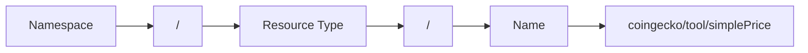
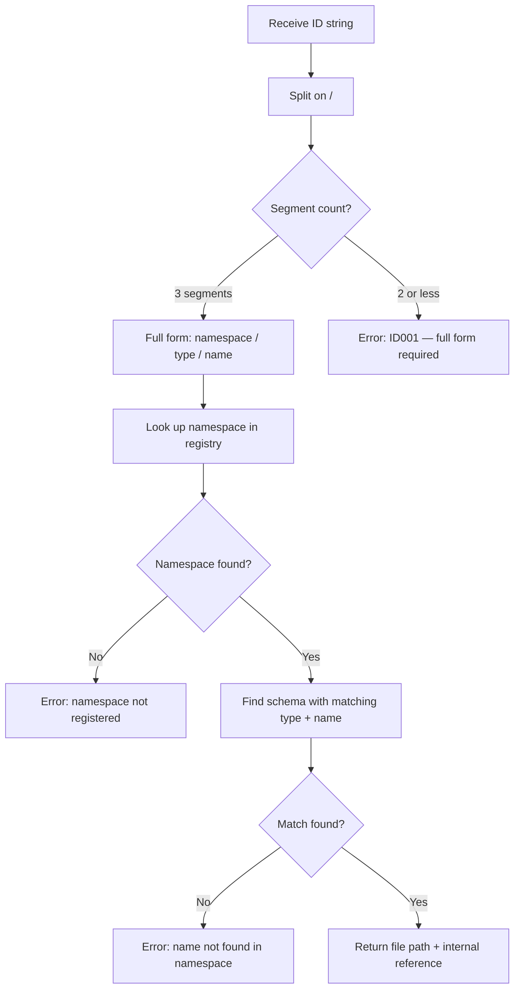

<aside class="edit-warning" role="note">
  <strong>Auto-generated:</strong> This file is auto-generated. Source: spec/v4.3.0/16-id-schema.md.
</aside>

> Normative language (MUST/SHOULD/MAY) follows the conventions defined in [Conformance Language](/specification/overview/#conformance-language).

A unified ID system for referencing all FlowMCP primitives. IDs MUST be unambiguous, human-readable, and resolvable. This document defines the ID format, component rules, Schema-File-ID, CLI-Adapter mapping, the No Short Form rule, resolution algorithm, placeholder integration, namespace governance, and validation rules.

---

## Purpose

FlowMCP exposes three MCP primitives — Tools, Resources, and Skills (prompts) — across potentially hundreds of schemas from dozens of providers. As the ecosystem grows, references to these primitives appear in multiple contexts: group definitions, skill placeholders, registry entries, CLI commands, and cross-schema dependencies.

Without a unified ID system, references are ambiguous. Does `simplePrice` refer to a tool, a resource, or a prompt? Which provider owns it? Is `evmChains` a tool name or a shared list?

The ID schema solves this by defining a **structured, human-readable identifier format** that uniquely identifies any primitive in the ecosystem. Every tool, resource, prompt, and shared list has exactly one canonical ID.



The diagram shows the three components of a full ID separated by `/` delimiters, forming a single unambiguous reference string.

---

## Format

The canonical ID format is a three-segment string separated by `/`:

```
namespace/resourceType/name
```

### Complete ID Types

| Type | Format | Slashes | Example |
|------|--------|---------|---------|
| **Schema-File** | `namespace/schema-name` | **1** | `etherscan-io/contracts` |
| Tool | `namespace/tool/name` | 2 | `etherscan-io/tool/getAbi` |
| Resource | `namespace/resource/name` | 2 | `etherscan-io/resource/chainDb` |
| Prompt | `namespace/prompt/name` | 2 | `etherscan-io/prompt/intro` |
| Skill | `namespace/skill/name` | 2 | `etherscan-io/skill/audit` |
| Selection | `namespace/selection/name` | 2 | `evm-research/selection/contract` |
| Agent | `namespace/agent/name` | 2 | `crypto/agent/researcher` |

**Distinguishing rule:** 1 Slash = Schema-File-ID (Container). 2 Slashes = Primitive-ID (Content).

### Full Form Examples

| ID | Description |
|----|-------------|
| `coingecko/tool/simplePrice` | Tool from CoinGecko provider |
| `coingecko/resource/supported-coins` | Resource from CoinGecko |
| `coingecko/prompt/price-comparison` | Prompt from CoinGecko |
| `crypto-research/prompt/token-deep-dive` | Agent prompt |
| `shared/list/evmChains` | Shared list reference |

Each segment serves a distinct purpose: the namespace identifies the owner, the resource type discriminates the primitive kind, and the name identifies the specific item within that namespace and type.

---

## Components

| Component | Pattern | Required | Description |
|-----------|---------|----------|-------------|
| namespace | `^[a-z][a-z0-9-]*$` | Yes | Provider or agent identifier. Lowercase letters, digits, and hyphens. Must start with a letter. |
| resourceType | `tool`, `resource`, `prompt`, `list`, `skill`, `selection`, `agent` | Required | Type discriminator. Always required — Short Form is not supported in v4. |
| name | `^[a-zA-Z][a-zA-Z0-9-]*$` | Yes | Resource name. camelCase for tools and resources, kebab-case for prompts. Must start with a letter. |

### Component Details

#### Namespace

The namespace identifies the owner of the primitive. It is derived from the provider's domain name or agent name and MUST be unique within its own `schemaFolder` — each folder is its own registry (see [Namespace Rules](#namespace-rules)). The CLI aggregates multiple folders into one catalog, so the same namespace MAY appear in more than one aggregated folder; cross-folder collisions are disambiguated by the optional source coordinate `<source>:<namespace>` (see [Source Coordinate](#source-coordinate)).

```
coingecko          ← provider namespace
etherscan          ← provider namespace
defilama           ← provider namespace
crypto-research    ← agent namespace
shared             ← reserved namespace for shared lists
```

Namespace rules:
- Lowercase letters, digits, and hyphens only
- Must start with a letter
- No dots, underscores, or uppercase characters
- `shared` is a reserved namespace (see [Namespace Rules](#namespace-rules))

#### Resource Type

The resource type discriminates between the seven kinds of addressable primitives in v4.3.0:

| Type | Maps To | Defined In |
|------|---------|-----------|
| `tool` | MCP `server.tool` | `main.tools` |
| `resource` | MCP `server.resource` | `main.resources` |
| `prompt` | MCP `server.prompt` | `main.prompts` |
| `skill` | MCP `server.prompt` (skill variant) | `providers/{ns}/skills/`, `selections/{name}/skills/`, or `agents/{name}/skills/` — never `main.skills` (forbidden) |
| `list` | Shared list | `list.meta.name` |
| `selection` | Selection | `selections/{name}/selection.mjs` |
| `agent` | Agent | `agents/{name}/agent.mjs` |

#### Name

The name identifies the specific primitive within its namespace and type. Naming conventions follow the same rules as schema element names (see [01-schema-format](/specification/schema-format/)):

| Primitive | Convention | Example |
|-----------|-----------|---------|
| Tool | camelCase | `simplePrice`, `getContractAbi` |
| Resource | camelCase | `tokenLookup`, `chainConfig` |
| Prompt | kebab-case | `price-comparison`, `token-deep-dive` |
| Shared List | camelCase | `evmChains`, `countryCodes` |

---

## Schema-File-ID

A schema is a `.mjs` file containing 1–8 Primitives. The Schema-File-ID identifies this file as a whole.

**Format:** `namespace/schema-name` (1 slash)

```
Schema-File-ID:  etherscan-io/contracts
                 └── namespace: etherscan-io
                 └── schema-name: contracts (equals filename without .mjs)

Contains Primitive-IDs:
  etherscan-io/tool/getAbi
  etherscan-io/tool/getContractCreation
  etherscan-io/resource/abiCache
```

### Naming Rules for schema-name

- Kebab-case, only lowercase letters and hyphens
- Thematic, not technical (e.g., `contracts`, `nft`, `defi` — not `schema1`, `tools-v2`)
- For providers with multiple schemas: topic prefix optional (`moralis-nft`, `moralis-defi`)
- Matches exactly the filename without `.mjs`

### Directory Mapping

```
schemas/v4.1.0/providers/etherscan-io/contracts.mjs
                          └── namespace    └── schema-name.mjs
→ Schema-File-ID: etherscan-io/contracts
```

The path segment labelled "namespace" above **MUST equal** `main.namespace` of every schema in the directory — it is a binding equality, not merely a label or a derivation. This is the folder↔namespace invariant `VAL019` (see [09-validation-rules](/specification/validation-rules/)). The grading-monitoring track and the namespace-resolution fallback below consume this invariant.

### Namespace Resolution / Fallback

The namespace of a provider folder is resolved as follows:

1. **Normal case.** The namespace is `main.namespace`, declared in the schema. The folder name MUST equal it (`VAL019`).
2. **All-unparseable fallback.** When **all** schemas in a folder are unparseable (no readable `main.namespace`), the **folder name** is the fallback namespace identifier. The fallback name MUST itself be a valid namespace (`^[a-z][a-z0-9-]*$`); a folder name that is not a valid namespace is an error, never silently normalised.
3. **Rename-on-parse.** Once a schema parses and exposes `main.namespace`, that field is **authoritative** and the folder is renamed to match it. A rename is an identity transition, not a delete.

The "all-unparseable → folder name" behaviour is **pipeline** behaviour, owned by the grading track (see the Grading-Spec [`19-folder-layout.md`](https://github.com/FlowMCP/flowmcp-spec/blob/main/grading/3.0.0/19-folder-layout.md) and [`22-workbench-island.md`](https://github.com/FlowMCP/flowmcp-spec/blob/main/grading/3.0.0/22-workbench-island.md)). The Schemas-Spec's job here is only to (a) name the fallback source (the folder name) and (b) assert the post-parse equality invariant (`VAL019`).

---

## CLI-Adapter

The MCP protocol does not allow slashes in tool names. The CLI maps Spec-IDs to internal MCP tool names:

| External Spec-ID | Internal MCP Tool Name |
|------------------|------------------------|
| `etherscan-io/tool/getAbi` | `getAbi_etherscan-io` |
| `moralis/tool/getTokenBalance` | `getTokenBalance_moralis` |

**Mapping Rule:** `routeName_namespace` (underscore separator, namespace at end). Implemented in `#buildToolName()` in the CLI.

This mapping is internal. Users and agents always use full Spec-IDs.

### Source Coordinate in the MCP Tool Name

When the CLI aggregates several `schemaFolders[]` and two folders expose the same namespace, the bare `routeName_namespace` tool name would collide at the MCP layer (the MCP protocol requires unique tool names). To let both folders coexist, the source coordinate (see [Source Coordinate](#source-coordinate)) is carried through `#buildToolName()` and appended to the internal MCP tool name on collision, so each tool stays addressable:

| External Spec-ID | Internal MCP Tool Name |
|------------------|------------------------|
| `folder-a:coingecko/tool/simplePrice` | `simplePrice_coingecko` (uncontested source kept bare) |
| `folder-b:coingecko/tool/simplePrice` | `simplePrice_coingecko_folder-b` (source appended to break the collision) |

Without this propagation, two equally-named folders cannot both be served — the MCP layer aborts on the duplicate tool name (the `serve` dedup/rename/error path). The CLI applies a deterministic dedup-or-rename so the source disambiguation reaches all the way into the served tool name; a genuine duplicate that cannot be disambiguated is reported, never silently dropped.

---

## No Short Form

Short Form is not supported in FlowMCP v4. `flowmcp call getTokenBalance` (without namespace/type) is not allowed.

**Reason:** Ambiguity and hidden data provenance. `moralis/tool/getTokenBalance` is explicit — the namespace immediately shows the data source. For LLMs especially, full Spec-IDs are semantically unambiguous.

All CLI commands use full Spec-IDs.

---

## Resolution

How IDs are resolved to actual files, schemas, and internal references.

### Resolution Algorithm



The diagram shows the resolution flow from receiving an ID string through parsing, namespace lookup, and name matching to the final file path reference.

### Resolution Steps

1. **Parse** — split the ID string on `/` to extract segments. Three segments required: namespace, type, name. Any other count: validation error ID001 (Short Form is not supported).
2. **Find** — look up the namespace in the loaded catalog. The catalog is the aggregation of the per-folder registries from `schemaFolders[]`; each folder maps its namespaces to schema file locations. When more than one aggregated folder owns the namespace, a qualified reference (`<source>:<namespace>/...`, see [Source Coordinate](#source-coordinate)) selects the exact folder, while an unqualified reference resolves first-wins (first folder in `schemaFolders[]` order) plus a visible collision warning.
3. **Match** — within the namespace, find the schema, tool, resource, or prompt with the matching name and type.
4. **Return** — produce the resolved reference: file path to the schema file and the internal key path (e.g., `main.tools.simplePrice`).

---

## Usage in Placeholders

The ID schema connects to the `{{type:name}}` placeholder syntax used in skill content (see [14-skills](/specification/skills/)). Skill content uses typed placeholders with a `type:` prefix to reference tools, resources, skills, and input parameters.

| Placeholder | Interpretation |
|-------------|---------------|
| `{{tool:getContractAbi}}` | Tool reference — resolved to a tool in the same schema's `main.tools` |
| `{{resource:verifiedContracts}}` | Resource reference — resolved to a resource in the same schema's `main.resources` |
| `{{skill:quick-summary}}` | Skill reference — resolved to a skill registered in the current scope (`selection.skills`, `agent.skills`, or the active namespace's `providers/{ns}/skills/`). `main.skills` is forbidden in v4.0.0. |
| `{{input:address}}` | Input parameter — value provided by the user at runtime |

### Resolution in Skills

When a skill's `content` field contains `{{tool:name}}`, `{{resource:name}}`, or `{{skill:name}}` placeholders, the runtime:

1. Parses the placeholder type prefix to determine the primitive kind
2. Resolves the name to a registered primitive within the same schema
3. Injects the primitive's description or metadata into the rendered content

The ID schema provides the canonical identifier format (`namespace/type/name`) used in registries, group definitions, and cross-schema references. Within skill content, the `{{type:name}}` syntax references primitives scoped to the same schema.

---

## Namespace Rules

Namespaces are the top-level organizational unit. They must be unique within a folder — each `schemaFolder` is its own registry. The CLI aggregates multiple folders into one catalog; across aggregated folders the same namespace is allowed and is disambiguated by the optional source coordinate (see [Source Coordinate](#source-coordinate)). Namespaces follow strict governance rules.

### One Folder, One Registry

A `schemaFolder` is a self-contained registry: namespace uniqueness is required **within** a folder, not across all folders the CLI knows about. The folder↔namespace invariant `VAL019` (see [Directory Mapping](#directory-mapping)) already operates per folder — the folder name MUST equal `main.namespace` of every schema in that folder.

The CLI aggregates the folders listed in `schemaFolders[]` into a single catalog at load time. Two different folders MAY each carry a schema with the same namespace; this is not an error. References are resolved as follows:

- **Qualified** — a reference prefixed with the source coordinate (`<source>:<namespace>/...`, see [Source Coordinate](#source-coordinate)) selects exactly one folder's namespace.
- **Unqualified** — a reference without a source coordinate resolves first-wins across the aggregated folders (the first folder in `schemaFolders[]` order that owns the namespace), and the CLI emits a visible collision warning so the ambiguity is never silent.

### Source Coordinate

When the CLI aggregates several `schemaFolders[]`, two folders may expose the same namespace. The **source coordinate** is an optional prefix that qualifies a reference to exactly one folder:

```
<source>:<namespace>[/<type>/<name>]
```

```
folder-a:coingecko/tool/simplePrice
folder-b:coingecko/tool/simplePrice
```

- `<source>` identifies the originating `schemaFolder` (the source key the CLI assigns to that folder).
- The separator is a **colon** (`:`), chosen so it does not disturb the slash grammar of the ID: the namespace/type/name segments are still split on `/` exactly as before, and the three-segment count is unchanged. The colon prefix is parsed off before the slash resolution runs.
- The coordinate applies to all referenceable primitives — `tool`, `resource`, `prompt`, `skill`, `list`, `selection`, and `agent`.
- **Unqualified** references (no `<source>:` prefix) resolve first-wins across the aggregated folders plus a visible collision warning; the source coordinate is the way to pin the exact folder.

### Namespace Assignment

| Source | Namespace Derivation | Example |
|--------|---------------------|---------|
| API Provider | Domain-derived name | `coingecko`, `etherscan`, `defilama` |
| Agent | Agent name | `crypto-research`, `defi-monitor` |
| Shared resources | Reserved `shared` | `shared/list/evmChains` |

### Provider Namespaces

Providers use their domain-derived name as the namespace. The derivation follows these rules:

- Remove the TLD (`.com`, `.io`, `.org`, etc.)
- Lowercase the remainder
- Replace dots with hyphens
- Remove `www.` prefix if present

```
api.coingecko.com   → coingecko
etherscan.io        → etherscan
defillama.com       → defilama
pro-api.coinmarketcap.com → coinmarketcap
```

### Agent Namespaces

Agents use their agent name as the namespace. Agent namespaces follow the same pattern constraints as provider namespaces (`^[a-z][a-z0-9-]*$`).

```
crypto-research     ← agent that performs token research
defi-monitor        ← agent that monitors DeFi protocols
```

### Reserved Namespaces

| Namespace | Purpose |
|-----------|---------|
| `shared` | Shared lists referenced across schemas. Only `list` type is valid under this namespace. |

The `shared` namespace is reserved by the FlowMCP specification. Schema authors MUST NOT use `shared` as a provider or agent namespace.

---

## Validation Rules

| Code | Severity | Rule |
|------|----------|------|
| ID001 | error | ID MUST contain at least one `/` separator |
| ID002 | error | Namespace MUST match `^[a-z][a-z0-9-]*$` |
| ID003 | error | ResourceType MUST be one of: `tool`, `resource`, `prompt`, `list`, `skill`, `selection`, `agent` |
| ID004 | error | Name MUST NOT be empty |
| ID005 | error | Short Form is not supported — full form (`namespace/type/name`) is always required |
| ID006 | error | Full form is required everywhere — no context-based inference |

### Validation Output Examples

```
flowmcp validate --id "coingecko/tool/simplePrice"

  0 errors, 0 warnings
  ID is valid
```

```
flowmcp validate --id "COINGECKO/tool/simplePrice"

  ID002 error   Namespace "COINGECKO" must match ^[a-z][a-z0-9-]*$

  1 error, 0 warnings
  ID is invalid
```

```
flowmcp validate --id "simplePrice"

  ID001 error   ID MUST contain at least one "/" separator

  1 error, 0 warnings
  ID is invalid
```

---

## Examples

### Tool Reference

```
coingecko/tool/simplePrice
```

- **Namespace**: `coingecko` — the CoinGecko provider
- **Type**: `tool` — an MCP tool (API endpoint)
- **Name**: `simplePrice` — the specific tool name (camelCase)

### Resource Reference

```
coingecko/resource/supported-coins
```

- **Namespace**: `coingecko` — the CoinGecko provider
- **Type**: `resource` — an MCP resource (SQLite data)
- **Name**: `supported-coins` — the specific resource

### Prompt Reference

```
crypto-research/prompt/token-deep-dive
```

- **Namespace**: `crypto-research` — an agent namespace
- **Type**: `prompt` — an MCP prompt (skill)
- **Name**: `token-deep-dive` — the specific prompt (kebab-case)

### Shared List Reference

```
shared/list/evmChains
```

- **Namespace**: `shared` — reserved namespace
- **Type**: `list` — a shared list
- **Name**: `evmChains` — the specific list (camelCase)

---

## Relationship to Existing Identifiers

The ID schema unifies several existing identification mechanisms:

| Existing Mechanism | ID Schema Equivalent | Migration |
|-------------------|---------------------|-----------|
| `namespace/file::tool` (group format) | `namespace/tool/name` | Replace `file::tool` with `tool/name` |
| `::resource::namespace/file::query` (group format) | `namespace/resource/name` | Replace prefix + `file::query` with `resource/name` |
| Skill `requires.tools` entries | `namespace/tool/name` | Add namespace prefix |
| Shared list `ref` field | `shared/list/name` | Wrap in `shared/list/` prefix |

The ID schema provides a single, consistent format that replaces these context-specific referencing styles. Backward compatibility with existing formats is maintained during migration — see [08-migration](/specification/migration/).

## Related

- **Depends on:** [00-overview.md](/specification/overview/), [01-schema-format.md](/specification/schema-format/)
- **Related:** [18-prefill.md](/specification/prefill/), [12-prompt-architecture.md](/specification/prompt-architecture/), [14-skills.md](/specification/skills/), [17-selections.md](/specification/selections/), [15-catalog.md](/specification/catalog/)

