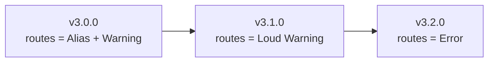

<aside class="edit-warning" role="note">
  <strong>Auto-generated:</strong> This file is auto-generated. Source: spec/v4.2.0/08-migration.md.
</aside>

This guide covers migrating schemas between FlowMCP versions. Section 1 covers v2.0.0 to v3.0.0 migration. Section 2 preserves the v1.2.0 to v2.0.0 guide for reference.

---

## Section 1: v2.0.0 to v3.0.0

The v3.0.0 migration is straightforward: rename `routes` to `tools` and update the version field. No structural changes to existing tool definitions are required. Resources and skills are new features that can be added incrementally.

### What Changes

| Aspect | v2.0.0 | v3.0.0 |
|--------|--------|--------|
| Tool definitions key | `main.routes` | `main.tools` |
| Version field | `'2.x.x'` | `'3.0.0'` |
| Resources | Not available | Optional `main.resources` |
| Skills | Not available | Optional `main.skills` |

### Automatic Migration

```bash
flowmcp migrate <schema-path>
```

The `migrate` command performs two changes:

1. Renames `routes:` to `tools:` in the schema file
2. Updates `version` from `2.x.x` to `3.0.0`

**The migration does NOT add resources or skills.** Those are new features that schema authors add when needed.

#### Batch Migration

```bash
flowmcp migrate --all <directory>
```

Migrates all `.mjs` schema files in the specified directory recursively.

#### Dry Run

```bash
flowmcp migrate --dry-run <schema-path>
```

Shows what would change without writing to disk.

### Migration Steps

#### Step 1: Rename `routes` to `tools`

**Before (v2.0.0):**

```javascript
export const main = {
    namespace: 'etherscan',
    name: 'SmartContractExplorer',
    version: '2.0.0',
    root: 'https://api.etherscan.io',
    routes: {
        getContractAbi: { /* ... */ },
        getSourceCode: { /* ... */ }
    }
}
```

**After (v3.0.0):**

```javascript
export const main = {
    namespace: 'etherscan',
    name: 'SmartContractExplorer',
    version: '3.0.0',
    root: 'https://api.etherscan.io',
    tools: {
        getContractAbi: { /* ... */ },
        getSourceCode: { /* ... */ }
    }
}
```

Tool definitions (method, path, parameters, output, tests) remain identical. Only the key name and version change.

#### Step 2: Update Handler Keys (if applicable)

Handler keys reference tool names. Since tool names do not change (only the container key from `routes` to `tools`), **no handler changes are needed**.

```javascript
// Handlers remain identical — they reference tool names, not the container key
export const handlers = ( { sharedLists, libraries } ) => ({
    getSourceCode: {
        postRequest: async ( { response, struct, payload } ) => {
            // ... same as before
        }
    }
})
```

#### Step 3: Run Validation

```bash
flowmcp validate <schema-path>
```

Validates the migrated schema against v3.0.0 rules.

#### Step 4 (Optional): Add Resources

If the schema would benefit from local, deterministic data, add a `resources` field to `main`. See `13-resources.md`.

#### Step 5 (Optional): Add Skills

If the schema has tools that compose well into multi-step workflows, add a `skills` field to `main` and create skill `.mjs` files. See `14-skills.md`.

#### Step 6: Agent Migration: manifest.json → agent.mjs

If you have agent definitions in `manifest.json` format, convert them to `agent.mjs` with `export const agent = { ... }`.

1. Create agent directory: `agents/{agent-name}/`
2. Create `agent.mjs` with `export const agent = { ... }` instead of `manifest.json`
3. Fields mapping:

| Field | v2.0.0 (manifest.json) | v3.0.0 (agent.mjs) |
|-------|------------------------|---------------------|
| `name` | Same | Same |
| `description` | Same | Same |
| `model` | Same | Same |
| `systemPrompt` | Same | Same |
| `version` | `'2.0.0'` | `'flowmcp/3.0.0'` |
| `tools` | Array of tool IDs | Object with full tool IDs as keys (`{ 'namespace/tool/name': null }`) |
| `prompts` | Array | Object: `{ 'prompt-name': { file: './prompts/prompt-name.mjs' } }` |
| `skills` | Not available | NEW Object: `{ 'skill-name': { file: './skills/skill-name.mjs' } }` |
| `resources` | Not available | NEW Object: `{ 'resource-name': { file: './resources/resource-name.db' } }` |
| `tests` | Array (inline) | Array stays inline, min 3 tests required |
| `sharedLists` | Array of list names | Array of list names (same as before) |

**Before (v2.0.0 manifest.json):**

```json
{
    "name": "crypto-analyst",
    "description": "Analyzes crypto markets",
    "model": "claude-sonnet-4-20250514",
    "version": "2.0.0",
    "systemPrompt": "You are a crypto analyst...",
    "tools": [ "etherscan/getContractAbi" ],
    "prompts": [
        { "name": "market-summary", "file": "./prompts/market-summary.mjs" }
    ],
    "tests": [ "analyze BTC", "check ETH gas" ],
    "sharedLists": [ "evmChains" ]
}
```

**After (v3.0.0 agent.mjs):**

```javascript
export const agent = {
    name: 'crypto-analyst',
    description: 'Analyzes crypto markets',
    model: 'claude-sonnet-4-20250514',
    version: 'flowmcp/3.0.0',
    systemPrompt: 'You are a crypto analyst...',
    tools: {
        'etherscan/SmartContractExplorer/getContractAbi': null
    },
    prompts: {
        'market-summary': { file: './prompts/market-summary.mjs' }
    },
    skills: {
        'portfolio-check': { file: './skills/portfolio-check.mjs' }
    },
    resources: {
        'token-list': { file: './resources/token-list.db' }
    },
    tests: [ 'analyze BTC', 'check ETH gas', 'compare SOL vs ETH' ],
    sharedLists: [ 'evmChains' ]
}
```

#### Step 7: Prompt Migration: `[[...]]` → `{{type:name}}`

The placeholder syntax in prompt and skill content changes from double-bracket to typed mustache syntax.

| Old Syntax (v2.0.0) | New Syntax (v3.0.0) | Type |
|----------------------|---------------------|------|
| `[[coingecko/simplePrice]]` | `{{tool:simplePrice}}` | `tool` — references a tool by name |
| `[[tokenSymbol]]` | `{{input:tokenSymbol}}` | `input` — references a user input parameter |
| — | `{{resource:token-list}}` | `resource` — references a resource |
| — | `{{prompt:market-summary}}` | `prompt` — references another prompt |

**Available types:**

| Type | Description |
|------|-------------|
| `tool` | References a tool name for dynamic invocation |
| `input` | References a user-provided input parameter |
| `resource` | References a resource definition |
| `prompt` | References another prompt for composition |

**Before (v2.0.0):**

```text
Fetch the current price using [[coingecko/simplePrice]] for the token [[tokenSymbol]].
```

**After (v3.0.0):**

```text
Fetch the current price using {{tool:simplePrice}} for the token {{input:tokenSymbol}}.
```

### Deprecation Timeline



| Version | Behavior |
|---------|----------|
| v3.0.0 | `main.routes` accepted as alias for `main.tools`. Emits deprecation warning. |
| v3.1.0 | `main.routes` still accepted but emits loud warning on every load. |
| v3.2.0 | `main.routes` rejected as a validation error. Only `main.tools` accepted. |

**Important:** A schema defining BOTH `main.tools` AND `main.routes` is a validation error in all v3.x versions.

### v2.0.0 to v3.0.0 Backward Compatibility

| Feature | v2.0.0 Schema (with `routes`) | v3.0.0 Schema (with `tools`) |
|---------|-------------------------------|------------------------------|
| Core v2.x runtime | Supported | Not supported |
| Core v3.0 runtime | Supported (alias + warning) | Supported |
| Core v3.2 runtime (future) | Rejected | Supported |

### v2.0.0 to v3.0.0 Migration Checklist

Per schema:

- [ ] `routes` renamed to `tools`
- [ ] `version` updated to `'3.0.0'`
- [ ] Validation passes (`flowmcp validate`)
- [ ] Tests pass (`flowmcp test single`)
- [ ] (Optional) Resources added if applicable
- [ ] (Optional) Skills added if applicable

Per agent:

- [ ] Convert agent `manifest.json` to `agent.mjs`
- [ ] Replace `[[...]]` placeholders with `{{type:name}}` in prompt/skill content
- [ ] Convert agent prompts from Array to Object
- [ ] Add `skills`/`resources` fields if needed

---

## Section 2: v3.0.0 to v4.0.0

The v3.0.0 to v4.0.0 migration requires adding a required `meta` block to every Tool and removing `main.skills`. There is no automatic migration command — the changes require domain knowledge about each tool.

### What Changes

| Step | What | How |
|------|------|-----|
| 1 | Remove `main.skills` | Move skills into a Selection or Agent Manifest |
| 2 | Add meta block per Tool | Set all 6 fields explicitly, `alwaysLoad: false` as default |
| 3 | Enum enforcement | Enums matching a Shared List MUST use `{{listName:alias}}` |
| 4 | Update version to 4.0.0 | `main.version: '4.0.0'` |
| 5 | Validate | `flowmcp validate` → PASS |
| 6 | API-Test | `flowmcp test single` → min. 1 response |

### Breaking Changes

- `main.skills` removal is a hard breaking change (no deprecation). Skills must be referenced via Selections or Agent Manifests.
- `meta` block is required for every Tool (VAL100–VAL106). Missing `meta` is a validation error.

### Why No Automatic Migration

The v3→v4 migration is more complex than v2→v3. Adding `meta` blocks requires domain knowledge about each tool (Is it read-only? Is it safe to call concurrently? What are good search keywords?). An automatic migration would generate incorrect defaults. Therefore: manual process guided by this document.

### Example: Before and After

**Before (v3.0.0):**

```javascript
export const schema = {
    main: {
        namespace: 'etherscan-io',
        name: 'contracts',
        version: '3.0.0'
    },
    tools: {
        getAbi: {
            description: 'Get contract ABI',
            parameters: { address: { type: 'string', description: 'Contract address' } }
        }
    }
}
```

**After (v4.0.0):**

```javascript
export const schema = {
    main: {
        namespace: 'etherscan-io',
        name: 'contracts',
        version: '4.0.0'
    },
    tools: {
        getAbi: {
            description: 'Get contract ABI',
            parameters: { address: { type: 'string', description: 'Contract address' } },
            meta: {
                isReadOnly: true,
                isConcurrencySafe: true,
                isDestructive: false,
                searchHint: 'contract ABI ethereum smart contract',
                aliases: [ 'getContractAbi' ],
                alwaysLoad: false
            }
        }
    }
}
```

---

## Section 3: v1.2.0 to v2.0.0

This section preserves the original v1.2.0 to v2.0.0 migration guide. The FlowMCP core v2.0.0 supported both formats during a transition period. Legacy v1.2.0 format is no longer supported in v3.0.0.

---

## Schema Categories

Existing schemas fall into three categories:

| Category | % of Schemas | Migration Effort | Description |
|----------|-------------|-----------------|-------------|
| **Pure declarative** | ~60% | Automatic | No handlers, no imports. Only URL construction and parameters. |
| **With handlers** | ~30% | Semi-automatic | Has `preRequest`/`postRequest` handlers but no imports. |
| **With imports** | ~10% | Manual review | Imports shared data (chain lists, etc.) that must become shared list references. |

---

## Migration Steps

### Step 1: Wrap Existing Fields in `main` Block

**Before (v1.2.0):**

```javascript
export const schema = {
    namespace: 'etherscan',
    name: 'SmartContractExplorer',
    flowMCP: '1.2.0',
    root: 'https://api.etherscan.io/v2/api',
    requiredServerParams: [ 'ETHERSCAN_API_KEY' ],
    routes: { /* ... */ },
    handlers: { /* ... */ }
}
```

**After (v2.0.0):**

```javascript
// Static, hashable — no imports
export const main = {
    namespace: 'etherscan',
    name: 'SmartContractExplorer',
    version: '2.0.0',
    root: 'https://api.etherscan.io/v2/api',
    requiredServerParams: [ 'ETHERSCAN_API_KEY' ],
    requiredLibraries: [],
    routes: { /* ... */ }
}

// Factory function — receives injected dependencies
export const handlers = ( { sharedLists, libraries } ) => ({
    /* ... */
})
```

Key changes:

- Two separate named exports: `main` (static) and `handlers` (factory function)
- `flowMCP: '1.2.0'` becomes `version: '2.0.0'` inside `main`
- `handlers` is now a factory function receiving `{ sharedLists, libraries }`
- New field `requiredLibraries` declares needed npm packages
- Zero import statements — all dependencies are injected

---

### Step 2: Update Version Field

| Before | After |
|--------|-------|
| `flowMCP: '1.2.0'` | `version: '2.0.0'` |

The `version` field moves inside `main` and follows semver starting with `2.`.

---

### Step 3: Convert Imports to Shared List References

**Before (v1.2.0):**

```javascript
import { evmChains } from '../_shared/evm-chains.mjs'

export const schema = {
    namespace: 'etherscan',
    // ...
    handlers: {
        getContractAbi: {
            preRequest: async ( { struct, payload } ) => {
                const chain = evmChains
                    .find( ( c ) => c.alias === payload.chainName )
                // ...
            }
        }
    }
}
```

**After (v2.0.0):**

```javascript
export const main = {
    namespace: 'etherscan',
    // ...
    sharedLists: [
        { ref: 'evmChains', version: '1.0.0' }
    ],
    routes: { /* ... */ }
}

export const handlers = ( { sharedLists, libraries } ) => ({
    getContractAbi: {
        preRequest: async ( { struct, payload } ) => {
            const chain = sharedLists.evmChains
                .find( ( c ) => c.alias === payload.chainName )
            // ...
            return { struct, payload }
        }
    }
})
```

Key changes:

- Remove `import` statement entirely (zero imports policy)
- Add `sharedLists` reference in `main`
- Access list via `sharedLists.evmChains` (injected by factory function)
- The list data is the same — only the access mechanism changes

---

### Step 4: Add Output Schemas (Optional but Recommended)

New in v2.0.0 — add `output` to routes for predictable responses:

```javascript
routes: {
    getContractAbi: {
        // ... existing fields ...
        output: {
            mimeType: 'application/json',
            schema: {
                type: 'object',
                properties: {
                    abi: {
                        type: 'string',
                        description: 'Contract ABI as JSON string'
                    }
                }
            }
        }
    }
}
```

This step is optional in v2.0.0 but will become recommended in v2.1.0.

---

### Step 5: Run Security Scan

After migration, run the security scan:

```bash
flowmcp validate --security <schema-path>
```

This verifies:

- No forbidden patterns in the file
- `main` block is JSON-serializable
- Handler constraints are met
- Shared list references are valid

---

### Step 6: Run Validation

```bash
flowmcp validate <schema-path>
```

Full validation checks:

- Required fields present
- Namespace format valid
- Version format valid
- Route count within limits (max 8)
- Parameter definitions complete
- Output schema valid (if present)
- Async fields valid (if present)

---

## Automatic Migration Tool

A CLI command assists with migration:

```bash
flowmcp migrate <schema-path>
```

The tool:

1. Reads the v1.2.0 schema
2. Wraps fields in `main` block
3. Updates version field
4. Detects imports and suggests shared list conversions
5. Writes the v2.0.0 schema to a new file (`<name>.v2.mjs`)
6. Runs validation on the new file

**Important**: The migration tool does NOT auto-convert imports. It flags them and creates TODO comments:

```javascript
// TODO: Convert import to shared list reference
// Original: import { evmChains } from '../_shared/evm-chains.mjs'
// Suggested: main.sharedLists: [{ ref: 'evmChains', version: '1.0.0' }]
```

---

## Backward Compatibility

| Feature | v1.2.0 Schema | v2.0.0 Schema |
|---------|--------------|--------------|
| Core v1.x runtime | Supported | Not supported |
| Core v2.0 runtime | Supported (legacy mode) | Supported |
| Core v3.0 runtime | Not supported | Supported (alias + warning) |

**Legacy mode** in Core v2.0:

- Detects v1.2.0 format (no `main` wrapper, has `flowMCP` field)
- Internally wraps in `main` block at load-time
- Emits deprecation warning: `WARN: Schema uses v1.2.0 format. Run "flowmcp migrate <path>" to upgrade.`
- All features work except: shared list references, output schema, groups, async

---

## Common Migration Issues

| Issue | Cause | Fix |
|-------|-------|-----|
| `SEC001: Forbidden pattern "import"` | Import statement still present | Convert to `sharedLists` reference |
| `VAL003: "flowMCP" is not a valid field` | Old version field | Change to `version` inside `main` |
| `VAL007: Route count exceeds 8` | v1.2.0 allowed 10 routes | Split schema into two files |
| `VAL012: Handler references undefined route` | Route name mismatch after refactor | Align handler keys with route keys |

---

## Migration Checklist

Per schema:

- [ ] Fields wrapped in `main` block
- [ ] `flowMCP: '1.2.0'` changed to `version: '2.0.0'` inside `main`
- [ ] `handlers` at top level (sibling of `main`)
- [ ] All `import` statements removed
- [ ] Imported data converted to `sharedLists` references
- [ ] Handler code uses `sharedLists` via factory injection instead of imported variables
- [ ] Security scan passes
- [ ] Full validation passes
- [ ] All routes still functional (manual or automated test)
