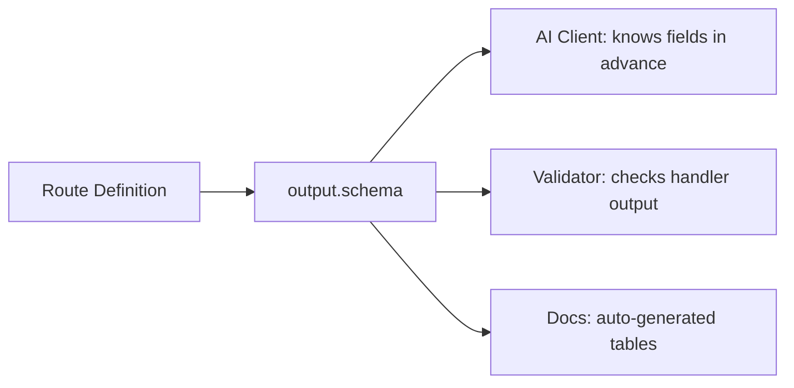
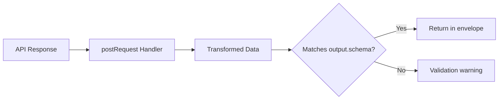
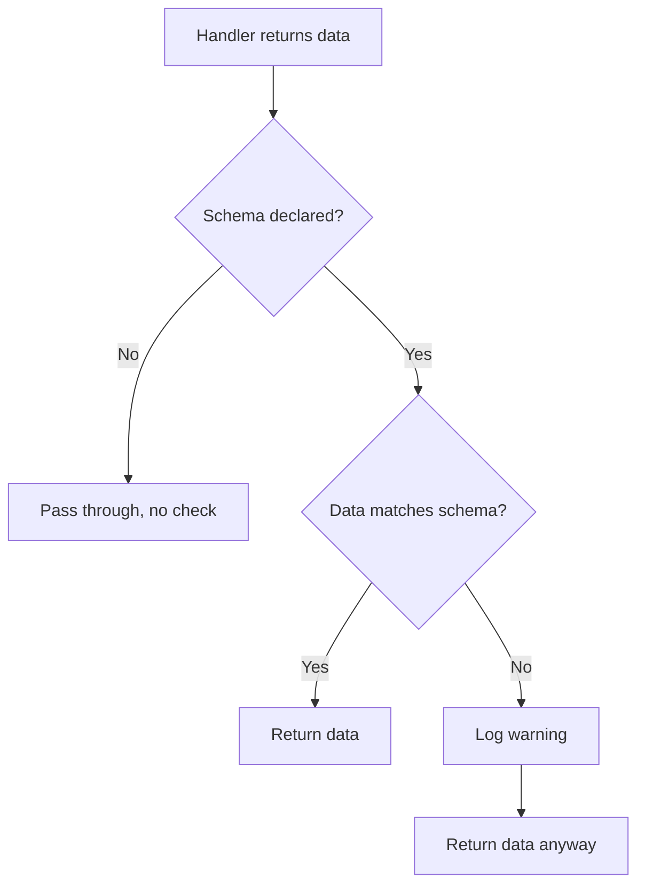

<aside class="edit-warning" role="note">
  <strong>Auto-generated:</strong> This file is auto-generated. Source: spec/v4.2.0/04-output-schema.md.
</aside>

> Normative language (MUST/SHOULD/MAY) follows the conventions defined in [Conformance Language](/specification/overview/#conformance-language).

Output schemas make tool responses predictable. AI clients can know in advance what shape the data will have, enabling structured reasoning without parsing guesswork. This document defines the output declaration format, supported types, the response envelope, handler interaction, and validation rules.

---

## Purpose

Without output schemas, an AI client calling a FlowMCP tool receives an opaque blob of JSON. The client MUST infer the structure from context, previous calls, or the tool description — all unreliable strategies.

Output schemas solve this by declaring the expected response shape at the route level:

- **AI clients** can pre-allocate structured reasoning about the response fields
- **Schema validators** can verify that handler output matches the declaration
- **Documentation generators** can produce accurate response tables automatically
- **Type-aware consumers** can generate TypeScript interfaces or Zod schemas from the output definition



The diagram shows how a single output schema declaration serves three consumers: AI clients, validators, and documentation tools.

---

## Route-Level Output Definition

Each route can optionally define an `output` field alongside its `method`, `path`, `description`, and `parameters`:

```javascript
routes: {
    getTokenPrice: {
        method: 'GET',
        path: '/simple/price',
        description: 'Get current token price',
        parameters: [ /* ... */ ],
        output: {
            mimeType: 'application/json',
            schema: {
                type: 'object',
                properties: {
                    id: { type: 'string', description: 'Token identifier' },
                    symbol: { type: 'string', description: 'Token symbol' },
                    price: { type: 'number', description: 'Current price in USD' },
                    marketCap: { type: 'number', description: 'Market capitalization', nullable: true },
                    volume24h: { type: 'number', description: 'Trading volume (24h)' }
                }
            }
        }
    }
}
```

The `output` field lives in the `main` block and is therefore part of the hashable, JSON-serializable schema surface. It MUST NOT contain functions or dynamic expressions.

---

## Output Fields

| Field | Type | Required | Description |
|-------|------|----------|-------------|
| `mimeType` | `string` | Yes | Response content type |
| `schema` | `object` | Yes | Simplified JSON Schema describing the `data` field |

Both fields are required when `output` is present. If a route does not declare `output`, the entire field is omitted (not set to `null` or `{}`).

---

## Supported MIME-Types

| MIME-Type | Description | Schema `type` |
|-----------|-------------|---------------|
| `application/json` | JSON response (default) | `object` or `array` |
| `image/png` | PNG image, base64-encoded | `string` with `format: 'base64'` |
| `text/plain` | Plain text response | `string` |

### MIME-Type to Schema Mapping

The `mimeType` constrains which `schema.type` values are valid:

- `application/json` requires `type: 'object'` or `type: 'array'`
- `image/png` requires `type: 'string'` with `format: 'base64'`
- `text/plain` requires `type: 'string'`

A mismatch between `mimeType` and `schema.type` is a validation error.

---

## Standard Response Envelope

Every FlowMCP tool response is wrapped in a standard envelope. This envelope is the same for all routes and does not need per-route definition.

### Success Response

```javascript
{
    status: true,
    messages: [],
    data: { /* described by output.schema */ }
}
```

### Error Response

```javascript
{
    status: false,
    messages: [ 'E001 getTokenPrice: API returned 404' ],
    data: null
}
```

### Envelope Fields

| Field | Type | Description |
|-------|------|-------------|
| `status` | `boolean` | `true` on success, `false` on error |
| `messages` | `array` | Empty on success, error descriptions on failure |
| `data` | `object` or `null` | Response payload on success, `null` on error |

The `output.schema` describes **only the `data` field** when `status: true`. Schema authors do not declare the envelope — it is implicit and standardized across all tools.

---

## Simplified JSON Schema Subset

FlowMCP uses a deliberately constrained subset of JSON Schema. This avoids the complexity of full JSON Schema while covering the needs of API response descriptions.

### Supported Keywords

| Keyword | Description | Example |
|---------|-------------|---------|
| `type` | Value type | `'string'`, `'number'`, `'boolean'`, `'object'`, `'array'` |
| `properties` | Object properties | `{ name: { type: 'string' } }` |
| `items` | Array item schema | `{ type: 'object', properties: {...} }` |
| `description` | Human-readable description | `'Current price in USD'` |
| `nullable` | Can be `null` | `true` |
| `enum` | Allowed values | `['active', 'inactive']` |
| `format` | Special format hint | `'base64'`, `'date-time'`, `'uri'` |

### Unsupported Keywords

The following JSON Schema keywords are intentionally excluded:

- `$ref` — no schema references; output schemas are self-contained
- `oneOf`, `anyOf`, `allOf` — no union types; keep schemas simple
- `required` — all declared properties are informational, not enforced
- `additionalProperties` — APIs MAY return extra fields; the schema describes the guaranteed minimum
- `pattern` — no regex validation on output fields
- `minimum`, `maximum` — no range validation on output fields

### Type Values

| Type | JavaScript equivalent | Description |
|------|----------------------|-------------|
| `string` | `typeof x === 'string'` | Text value |
| `number` | `typeof x === 'number'` | Numeric value (integer or float) |
| `boolean` | `typeof x === 'boolean'` | True or false |
| `object` | Plain object | Nested structure with `properties` |
| `array` | Array | Collection with `items` schema |

---

## Object Responses

The most common response type. The `schema` declares an object with named properties:

```javascript
output: {
    mimeType: 'application/json',
    schema: {
        type: 'object',
        properties: {
            id: { type: 'string', description: 'Token identifier' },
            symbol: { type: 'string', description: 'Token symbol' },
            price: { type: 'number', description: 'Current price in USD' },
            marketCap: { type: 'number', description: 'Market capitalization', nullable: true },
            volume24h: { type: 'number', description: 'Trading volume (24h)' }
        }
    }
}
```

### Nested Objects

Properties can themselves be objects, up to 4 levels deep:

```javascript
output: {
    mimeType: 'application/json',
    schema: {
        type: 'object',
        properties: {
            token: {
                type: 'object',
                description: 'Token metadata',
                properties: {
                    name: { type: 'string', description: 'Token name' },
                    contract: {
                        type: 'object',
                        description: 'Contract details',
                        properties: {
                            address: { type: 'string', description: 'Contract address' },
                            verified: { type: 'boolean', description: 'Verification status' }
                        }
                    }
                }
            }
        }
    }
}
```

---

## Array Responses

For routes that return lists, the schema uses `type: 'array'` with an `items` definition:

```javascript
output: {
    mimeType: 'application/json',
    schema: {
        type: 'array',
        items: {
            type: 'object',
            properties: {
                name: { type: 'string', description: 'Protocol name' },
                tvl: { type: 'number', description: 'Total value locked in USD' }
            }
        }
    }
}
```

### Array of Primitives

Arrays can also contain primitive types:

```javascript
output: {
    mimeType: 'application/json',
    schema: {
        type: 'array',
        items: {
            type: 'string',
            description: 'Contract address'
        }
    }
}
```

### Objects Containing Arrays

Properties within objects can be arrays:

```javascript
output: {
    mimeType: 'application/json',
    schema: {
        type: 'object',
        properties: {
            total: { type: 'number', description: 'Total result count' },
            results: {
                type: 'array',
                description: 'List of matching tokens',
                items: {
                    type: 'object',
                    properties: {
                        symbol: { type: 'string', description: 'Token symbol' },
                        price: { type: 'number', description: 'Current price' }
                    }
                }
            }
        }
    }
}
```

---

## Image Responses

For routes that return images (charts, QR codes, visual data), the schema declares a base64-encoded string:

```javascript
output: {
    mimeType: 'image/png',
    schema: {
        type: 'string',
        format: 'base64',
        description: 'Chart image as base64-encoded PNG'
    }
}
```

The runtime base64-encodes the binary response and places it in the `data` field of the envelope. AI clients that support image rendering can decode and display the image.

---

## Text Responses

For routes that return plain text:

```javascript
output: {
    mimeType: 'text/plain',
    schema: {
        type: 'string',
        description: 'Raw contract source code'
    }
}
```

---

## Nullable Fields

Fields that MAY be `null` in a successful response MUST declare `nullable: true`:

```javascript
properties: {
    marketCap: { type: 'number', description: 'Market capitalization', nullable: true },
    website: { type: 'string', description: 'Project website URL', nullable: true }
}
```

Without `nullable: true`, a `null` value in the response triggers a validation warning. This distinction helps AI clients differentiate between "field not available for this entry" (nullable) and "field SHOULD always be present" (not nullable).

---

## Enum Values in Output

Output fields can declare `enum` to restrict values to a known set:

```javascript
properties: {
    status: {
        type: 'string',
        description: 'Verification status',
        enum: ['verified', 'unverified', 'pending']
    }
}
```

This helps AI clients reason about possible values without inspecting raw data.

---

## Format Hints

The `format` keyword provides additional semantic information about a string field:

| Format | Description | Example value |
|--------|-------------|---------------|
| `base64` | Base64-encoded binary data | `'iVBORw0KGgo...'` |
| `date-time` | ISO 8601 date-time | `'2026-02-16T12:00:00Z'` |
| `uri` | Valid URI | `'https://etherscan.io/address/0x...'` |

Format is informational — the runtime does not validate format compliance. It exists to give AI clients and documentation generators better context.

---

## When Output Schema is Omitted

If a route does not define an `output` field:

- The response is treated as `application/json` by default
- The `data` field is passed through without schema validation
- AI clients cannot rely on a specific shape
- This is valid but **discouraged** for new schemas

Omitting the output schema is acceptable for:

- Legacy schemas migrating from v1.x
- Routes with highly variable response shapes (rare)
- Exploratory schemas during development

For production schemas, the output schema SHOULD always be declared.

---

## Output Schema and Handlers

When a route has a `postRequest` handler, the output schema describes the **final** response after handler transformation, not the raw API response.



The diagram shows the validation point: the output schema is checked against the handler's return value, not the raw API response.

### Implications for Schema Authors

- The `output.schema` must describe the shape **after** `postRequest` transforms the data
- If `postRequest` flattens nested API responses, the schema describes the flat structure
- If `postRequest` renames fields, the schema uses the new names
- If no `postRequest` handler exists, the schema describes the raw API response directly

### Example: Handler Transforms Response

```javascript
// Raw API response from CoinGecko:
// { "bitcoin": { "usd": 45000, "usd_market_cap": 850000000000 } }

// postRequest handler (inside factory) flattens it:
export const handlers = ( { sharedLists, libraries } ) => ({
    getTokenPrice: {
        postRequest: async ( { response, struct, payload } ) => {
            const [ id ] = Object.keys( response )
            const { usd, usd_market_cap } = response[ id ]

            return { response: { id, price: usd, marketCap: usd_market_cap } }
        }
    }
})

// Output schema describes the FLATTENED result:
output: {
    mimeType: 'application/json',
    schema: {
        type: 'object',
        properties: {
            id: { type: 'string', description: 'Token identifier' },
            price: { type: 'number', description: 'Price in USD' },
            marketCap: { type: 'number', description: 'Market capitalization in USD' }
        }
    }
}
```

---

## Validation Rules

The following rules are enforced when validating output schemas:

### 1. MIME-Type Restriction

`mimeType` must be one of the supported types: `application/json`, `image/png`, `text/plain`. Unknown MIME-types are rejected.

### 2. Type-MIME Consistency

`schema.type` must be compatible with the declared `mimeType`:

| `mimeType` | Allowed `schema.type` |
|------------|-----------------------|
| `application/json` | `object`, `array` |
| `image/png` | `string` (with `format: 'base64'`) |
| `text/plain` | `string` |

### 3. Properties Restriction

`properties` is only valid when `type` is `'object'`. Declaring `properties` on a `string` or `array` type is a validation error.

### 4. Items Restriction

`items` is only valid when `type` is `'array'`. Declaring `items` on a `string` or `object` type is a validation error.

### 5. Nesting Depth Limit

Maximum nesting depth is 4 levels. This prevents overly complex schemas that are difficult for AI clients to reason about:

```
Level 1: output.schema (root)
Level 2: output.schema.properties.token
Level 3: output.schema.properties.token.properties.contract
Level 4: output.schema.properties.token.properties.contract.properties.address
```

A 5th level is rejected.

### 6. Nullable Semantics

`nullable: true` means the field can be `null` in a successful response (when `status: true`). It does not mean the field can be absent — absent fields are not described by the schema at all.

### 7. Non-Blocking Validation

Output schema validation is **non-blocking**. A mismatch between the actual handler output and the declared schema produces a validation **warning**, not an error. The response is still delivered to the client.

This design choice reflects the reality that external APIs MAY change their response shapes without notice. A strict error would break the tool even though the data might still be usable. The warning is logged and surfaced to schema maintainers for review.



The diagram shows the non-blocking validation flow: mismatches produce warnings but do not prevent the response from being delivered.

## Related

- **Depends on:** [00-overview.md](/specification/overview/), [01-schema-format.md](/specification/schema-format/), [02-parameters.md](/specification/parameters/)
- **Related:** [10-tests.md](/specification/tests/), [22-scoring-protocol.md](/specification/scoring-protocol/), [19-mcp-integration.md](/specification/mcp-integration/)

