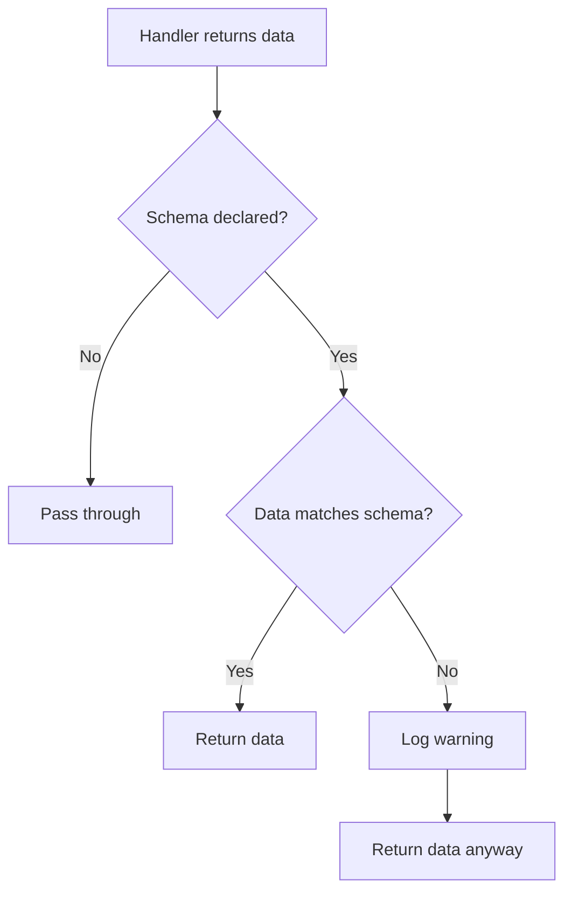

<!-- PAGEFIND-META-START -->
<span style="display:none" data-pagefind-meta="section">Specification</span>
<!-- PAGEFIND-META-END -->

Output schemas make tool responses predictable. AI clients can know in advance what shape the data will have, enabling structured reasoning without parsing guesswork.

:::note
This page covers output schemas from the [formal specification](https://github.com/FlowMCP/flowmcp-spec). See [Route Tests](/specification/route-tests/) for how output schemas are generated from captured responses.
:::

## Purpose

Without output schemas, an AI client calling a FlowMCP tool receives an opaque blob of JSON. Output schemas solve this by declaring the expected response shape at the route level:

- **AI clients** can pre-allocate structured reasoning about response fields
- **Schema validators** can verify handler output matches the declaration
- **Documentation generators** can produce accurate response tables automatically

## Route-Level Output Definition

Each route can optionally define an `output` field:

```javascript
tools: {
    getTokenPrice: {
        method: 'GET',
        path: '/simple/price',
        description: 'Get current token price',
        parameters: [ /* ... */ ],
        output: {
            mimeType: 'application/json',
            schema: {
                type: 'object',
                properties: {
                    id: { type: 'string', description: 'Token identifier' },
                    symbol: { type: 'string', description: 'Token symbol' },
                    price: { type: 'number', description: 'Current price in USD' },
                    marketCap: { type: 'number', description: 'Market capitalization', nullable: true },
                    volume24h: { type: 'number', description: 'Trading volume (24h)' }
                }
            }
        }
    }
}
```

## Output Fields

| Field | Type | Required | Description |
|-------|------|----------|-------------|
| `mimeType` | `string` | Yes | Response content type |
| `schema` | `object` | Yes | Simplified JSON Schema describing the `data` field |

## Supported MIME Types

| MIME Type | Description | Schema `type` |
|-----------|-------------|---------------|
| `application/json` | JSON response (default) | `object` or `array` |
| `image/png` | PNG image, base64-encoded | `string` with `format: 'base64'` |
| `text/plain` | Plain text response | `string` |

## Standard Response Envelope

Every FlowMCP tool response is wrapped in a standard envelope:

```javascript
// Success Response
{
    status: true,
    messages: [],
    data: { /* described by output.schema */ }
}

// Error Response
{
    status: false,
    messages: [ 'E001 getTokenPrice: API returned 404' ],
    data: null
}
```

| Field | Type | Description |
|-------|------|-------------|
| `status` | `boolean` | `true` on success, `false` on error |
| `messages` | `array` | Empty on success, error descriptions on failure |
| `data` | `object` or `null` | Response payload on success, `null` on error |

:::tip
The `output.schema` describes **only the `data` field** when `status: true`. Schema authors do not declare the envelope — it is implicit and standardized.
:::

## Supported JSON Schema Subset

FlowMCP uses a deliberately constrained subset of JSON Schema:

### Supported Keywords

| Keyword | Description | Example |
|---------|-------------|---------|
| `type` | Value type | `'string'`, `'number'`, `'boolean'`, `'object'`, `'array'` |
| `properties` | Object properties | `{ name: { type: 'string' } }` |
| `items` | Array item schema | `{ type: 'object', properties: {...} }` |
| `description` | Human-readable description | `'Current price in USD'` |
| `nullable` | Can be `null` | `true` |
| `enum` | Allowed values | `['active', 'inactive']` |
| `format` | Special format hint | `'base64'`, `'date-time'`, `'uri'` |

### Intentionally Excluded Keywords

- `$ref` — no schema references; output schemas are self-contained
- `oneOf`, `anyOf`, `allOf` — no union types
- `required` — all declared properties are informational
- `additionalProperties` — APIs may return extra fields
- `pattern`, `minimum`, `maximum` — no regex or range validation on output

## Response Examples

### Object Response

```javascript
output: {
    mimeType: 'application/json',
    schema: {
        type: 'object',
        properties: {
            id: { type: 'string', description: 'Token identifier' },
            price: { type: 'number', description: 'Current price in USD' },
            marketCap: { type: 'number', description: 'Market cap', nullable: true }
        }
    }
}
```

### Array Response

```javascript
output: {
    mimeType: 'application/json',
    schema: {
        type: 'array',
        items: {
            type: 'object',
            properties: {
                name: { type: 'string', description: 'Protocol name' },
                tvl: { type: 'number', description: 'Total value locked in USD' }
            }
        }
    }
}
```

### Image Response

```javascript
output: {
    mimeType: 'image/png',
    schema: {
        type: 'string',
        format: 'base64',
        description: 'Chart image as base64-encoded PNG'
    }
}
```

## Nullable Fields

Fields that may be `null` in a successful response must declare `nullable: true`:

```javascript
properties: {
    marketCap: { type: 'number', description: 'Market cap', nullable: true },
    website: { type: 'string', description: 'Project URL', nullable: true }
}
```

## Non-Blocking Validation

Output schema validation is **non-blocking**. A mismatch produces a validation **warning**, not an error. The response is still delivered.


