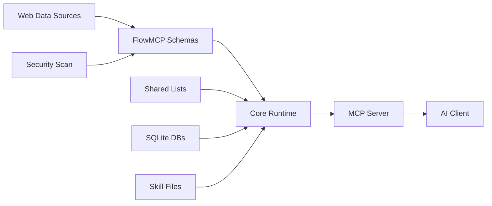

<!-- PAGEFIND-META-START -->
Specification
<!-- PAGEFIND-META-END -->

FlowMCP is a deterministic normalization layer that converts heterogeneous web data sources into uniform, AI-consumable tools. The v4.0.0 specification defines how schemas, shared lists, groups, resources, skills, and security constraints work together to produce reliable, verifiable tool catalogs.

:::note
This documentation adapts the formal specification for practical use. The full specification is maintained at [github.com/FlowMCP/flowmcp-spec](https://github.com/FlowMCP/flowmcp-spec).
:::

## Problem

Web data sources are organized by **provider** — Etherscan exposes smart contract endpoints, CoinGecko exposes market data, DeFi Llama exposes TVL metrics. Each source has its own interface style, authentication scheme, URL structure, response format, and error handling.

AI agents need tools organized by **application domain** — token prices, contract ABIs, TVL data, wallet balances. An agent answering a question about a token's market cap should not need to know whether the answer comes from CoinGecko, CoinCap, or DeFi Llama.

Manual integration per source is unsustainable at scale. With 187+ schemas across dozens of providers, the combinatorial complexity makes hand-written integrations fragile and expensive to maintain.

## Solution

FlowMCP introduces a **schema-driven normalization layer** between web data sources and AI clients. Each schema is a `.mjs` file that declaratively defines:

- **Input parameters** with Zod-based validation (type, constraints, enum values)
- **URL construction rules** (path templates, query parameters, body payloads)
- **Response transformation** (optional handlers for pre/post processing)
- **Security constraints** (no imports, no filesystem access, no eval)

The runtime reads these schemas and exposes them as MCP tools. The AI client sees a flat catalog of tools with typed inputs and predictable outputs — the underlying source complexity is completely abstracted away.

## Three MCP Primitives

FlowMCP v4.0.0 supports all three MCP primitives in a single schema:

| Primitive | Schema Key | MCP Concept | Description |
|-----------|-----------|-------------|-------------|
| **Tools** | `tools` | Tools | HTTP endpoints — deterministic API calls with parameter validation |
| **Resources** | `resources` | Resources | SQLite-based read-only data lookups — fast, local, no network |
| **Skills** | `skills` | Prompts | Reusable AI agent instructions — compose tools and resources into workflows |

Tools are the core primitive and the only one required. Resources and skills are optional additions that enhance what a schema can offer.

## Positioning

FlowMCP is the **deterministic anchor** in a system that pairs it with non-deterministic AI.

| Layer | Nature | Responsibility |
|-------|--------|----------------|
| AI Client (Skills) | Non-deterministic | Decides *which* tool to use, *how* to interpret results |
| FlowMCP | Deterministic | Guarantees the tool itself behaves identically every time |
| Web Data Sources | External | Provides the raw data (uncontrolled) |

FlowMCP guarantees that:
- The same input parameters always produce the same API call
- Parameter validation is enforced before any network request
- Response transformations are consistent and reproducible
- Security constraints are verified at load-time, not runtime

## Terminology

| Term | Definition |
|------|-----------|
| **Schema** | A `.mjs` file with two named exports: `main` (static) and optionally `handlers` (factory function). Defines tools, resources, and/or skills. |
| **Tool** | An API endpoint within a schema. Maps to one web data source endpoint. Each tool has parameters, a method, a path, and optional handlers. |
| **Resource** | A SQLite-based read-only data lookup within a schema. Uses `sql.js` for query execution. |
| **Skill** | A reusable AI agent instruction file (`.mjs`) that composes tools and resources into multi-step workflows. Maps to MCP Prompts. |
| **Namespace** | Provider identifier, lowercase letters only (e.g. `etherscan`, `coingecko`). Groups schemas by data source. |
| **Handler** | An async function returned by the `handlers` factory. Performs pre- or post-processing for a tool. Receives dependencies via injection. |
| **Modifier** | Handler subtype: `preRequest` transforms input before the API call, `postRequest` transforms output after. |
| **Shared List** | A reusable, versioned value list (e.g. EVM chain identifiers) referenced by schemas and injected at load-time. |
| **Group** | A named collection of cherry-picked tools, resources, and skills with an integrity hash. Used for project-level activation. |
| **Main Export** | `export const main = {...}` — the declarative, JSON-serializable part of a schema. Hashable for integrity verification. |
| **Handlers Export** | `export const handlers = ({ sharedLists, libraries }) => ({...})` — factory function receiving injected dependencies. |

## Design Principles

### 1. Deterministic over clever

Same input always produces the same API call. No randomness, no caching heuristics, no adaptive behavior inside the schema layer.

### 2. Declare over code

Maximize the `main` block, minimize handlers. Every field that can be expressed declaratively must live in `main`. Handlers exist only for transformations that cannot be expressed as static data.

### 3. Inject over import

Schemas receive data through dependency injection, never import. A handler that needs EVM chain data receives `sharedLists.evmChains` via the factory function. Libraries are declared in `requiredLibraries` and injected by the runtime from an allowlist.

### 4. Hash over trust

Integrity verification through SHA-256 hashes. The `main` block is hashable because it is pure JSON-serializable data. Groups store hashes of their member tools.

### 5. Constrain over permit

Security by default, explicit opt-in for capabilities. Schema files have zero import statements. The security scanner rejects schemas with forbidden patterns at load-time.

## Version History

| Version | Date | Changes |
|---------|------|---------|
| 1.0.0 | 2025-06 | Initial schema format. Flat structure with inline parameters. |
| 1.2.0 | 2025-11 | Added handlers, Zod-based parameter validation, modifier pattern. |
| 2.0.0 | 2026-02 | Two-export format (`main` + `handlers` factory). Dependency injection. Shared lists. Output schemas. Zero-import security. Groups with integrity hashes. Max routes reduced to 8. |
| 3.0.0 | 2026-03 | `routes` renamed to `tools`. Resources (SQLite). Skills (MCP Prompts). Type discriminators. `includeSchemaSkills`. Migration CLI. |

## What's New in v4.0.0

The v4.0.0 release extends FlowMCP from a tool-only framework to support all three MCP primitives:

- **`tools`** — primary schema key for tool definitions, aligned with MCP terminology
- **Resources** — SQLite-based read-only data access via `sql.js`. Declared in the `resources` key with prepared statements and SQL security enforcement
- **Skills** — reusable AI agent instructions stored as `.mjs` files. Declared in the `skills` key. Maps to MCP Prompts with placeholder system (`{{tool:x}}`, `{{resource:x}}`, `{{input:x}}`)
- **Type discriminators** — `::tool::name`, `::resource::name`, `::skill::name` for unambiguous references in groups
- **`includeSchemaSkills`** — groups can auto-include all skills from member schemas
- **New validation rules** — RES001-RES023 for resources, SKL001-SKL025 for skills

## Specification Document Index

| Document | Description |
|----------|-------------|
| [Schema Format](/specification/schema-format/) | File structure, main/handlers split, tool definitions, naming conventions |
| [Parameters](/specification/parameters/) | Position block, Z block validation, shared list interpolation, API key injection |
| [Shared Lists](/specification/shared-lists/) | List format, versioning, field definitions, filtering, resolution lifecycle |
| [Output Schema](/specification/output-schema/) | Response type declarations, field mapping, validation rules |
| [Security Model](/specification/security/) | Zero-import policy, library allowlist, static scan, dependency injection |
| [Resources](/specification/resources/) | SQLite-based read-only data, query definitions, SQL security |
| [Skills](/specification/skills/) | AI agent instructions, placeholder system, versioning |
| [Groups & Skills](/specification/groups-prompts/) | Cherry-pick groups, integrity hashes, skill workflows |
| [Tests](/specification/route-tests/) | Test format, response capture lifecycle, output schema generation |
| [Preload](/specification/preload/) | Cache configuration, TTL guidelines, runtime behavior |
| [Validation Rules](/specification/validation-rules/) | Validation rules across categories with severity levels |
| [Migration Guide](/specification/migration/) | Step-by-step migration guides for v1-to-v2 and v2-to-v3 |
