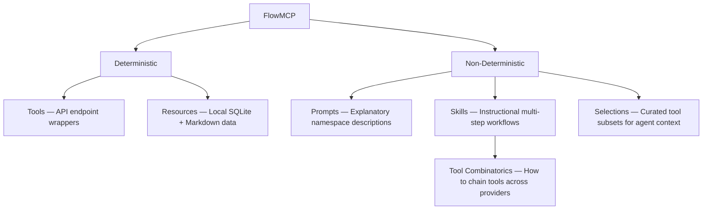
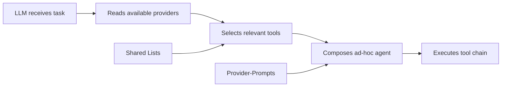
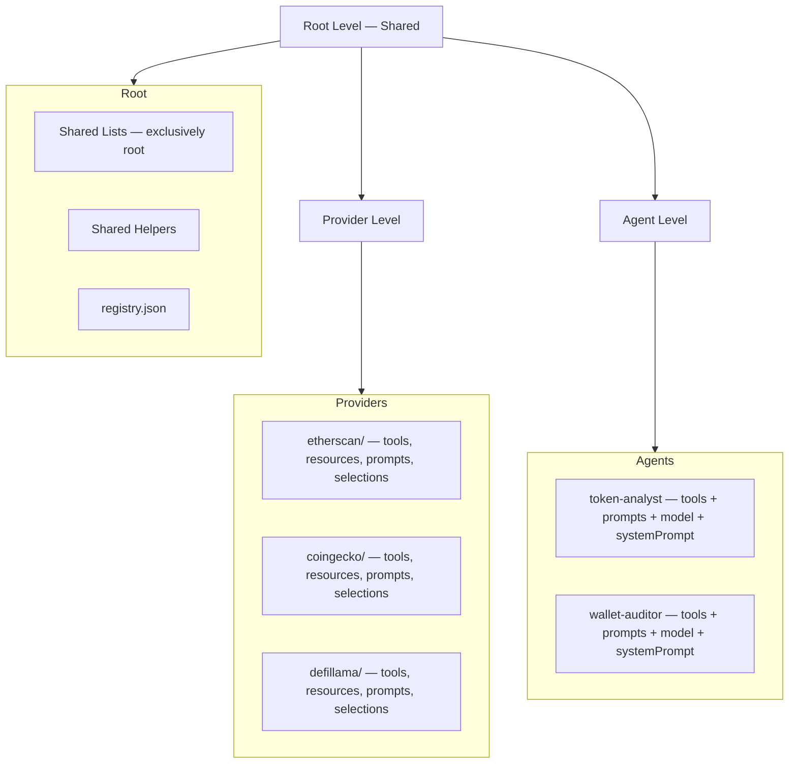

<aside class="edit-warning" role="note">
  <strong>Auto-generated:</strong> This file is auto-generated. Source: spec/v4.3.0/00-overview.md.
</aside>

FlowMCP is a **Tool Catalog with pre-built API templates** and a **Knowledge Base for API workflows**. It unifies access to APIs through two equal channels:

1. **CLI** — Direct access to Tools, Resources, Prompts, and Skills
2. **MCP/A2A Server** — Agents and MCP clients can use FlowMCP as a server (compatible with OpenClaw)

This document provides the conceptual foundation, positioning, terminology, and document index for the v4.3.0 specification.

---

## Conformance Language

The key words "MUST", "MUST NOT", "REQUIRED", "SHALL", "SHALL NOT", "SHOULD", "SHOULD NOT", "RECOMMENDED", "NOT RECOMMENDED", "MAY", and "OPTIONAL" in this document are to be interpreted as described in BCP 14 [RFC2119] [RFC8174] when, and only when, they appear in all capitals, as shown here.

Some specification files in `spec/v4.3.0/` are intentionally written in prose without normative keywords because they describe history, lifecycle, or conceptual background (this overview document, the migration guide, the schema lifecycle document). All other specification files use normative language and assume this conformance interpretation.

References:
- [RFC2119](https://www.rfc-editor.org/rfc/rfc2119) — Key words for use in RFCs to Indicate Requirement Levels
- [RFC8174](https://www.rfc-editor.org/rfc/rfc8174) — Ambiguity of Uppercase vs Lowercase in RFC 2119 Key Words
- [BCP 14](https://www.rfc-editor.org/info/bcp14) — Best Current Practice 14 (combined RFC2119 + RFC8174)

---

## The Problem FlowMCP Solves

Not every data source is a clean REST API. The real world is messy — some APIs have quirks, some tasks require combining multiple APIs, and some data lives behind websites with no API at all. FlowMCP provides a solution for each scenario:

| Data Source Type | Challenge | FlowMCP Solution |
|------------------|-----------|-------------------|
| Complete REST API | Standard endpoints, predictable responses | **Tool** (deterministic) |
| API with peculiarities | Rate limits, pagination, unusual auth, response quirks | **Tool + Prompt** |
| Multiple APIs combined | Cross-provider workflows, data enrichment chains | **Agent-Prompt** (Workflow) |
| Website without API | Data locked in HTML, no programmatic access | **Prompt** (Instructions) |

The key insight: not everything can be solved deterministically. A clean API call is deterministic — combine three APIs or scrape a website, and you need instructions for an LLM. FlowMCP covers both sides.

---

## What FlowMCP Offers

FlowMCP provides two categories of primitives: deterministic building blocks that always behave the same way, and non-deterministic guidance that helps LLMs combine those building blocks effectively.

FlowMCP provides **five primitives**: Tools, Resources, Prompts, Skills, and Selections. Tools, Resources, and Prompts are defined in `main.tools`, `main.resources`, and `main.prompts`. **Skills are a top-level entity** that lives outside `main` and is scoped to a namespace, selection, or agent — never `main.skills` (forbidden in v4.0.0, see VAL016). Selections are curated subsets that bundle tools/resources/prompts/skills for agent loading. Tools and Resources are deterministic — same input always produces the same result. Prompts and Skills are non-deterministic — they guide LLMs on which tools to call, in which order, how to pass results between them, and when to fall back to alternative providers. Prompts are explanatory (describing a namespace or workflow), while Skills are instructional (step-by-step procedures with typed inputs and outputs). Together, they encode knowledge that would take hours to figure out manually.

---

## Partial Validatability

Different primitives have different levels of validatability. FlowMCP embraces this spectrum rather than pretending everything is fully testable:

| Primitive | Validatable? | What Can Be Validated |
|-----------|-------------|----------------------|
| **Tools** | Completely | Schema structure, parameter types, output format, live API tests (minimum 3 deterministic test cases) |
| **Resources** | Completely | SQLite schema creation, query execution, parameter binding, result format |
| **Prompts** | Partially | Tool references resolve, parameter syntax `{{type:name}}` is valid, `references` entries exist |
| **Skills** | Partially | Placeholder syntax `{{type:name}}` is valid, `requires.tools` and `requires.resources` resolve, typed input/output structure |
| **Selections** | Partially | Structure valid, all referenced Primitives resolvable (SEL001–SEL003) |
| **Agents** | Partially | Manifest structure (`agent.mjs` with `export const agent`), tool references exist, `expectedTools` (deterministic), `expectedContent` (partially — LLM output varies) |

This is a feature, not a limitation. Tools and Resources are the deterministic anchor. Prompts, Skills, and Agents build on that anchor but acknowledge that LLM behavior introduces variability.

---

## Core Principles

### 1. Everything would be possible without FlowMCP

FlowMCP saves time through pre-built templates. Every tool, prompt, and agent definition encodes knowledge that a developer *could* acquire by reading API docs, experimenting with endpoints, and writing integration code. FlowMCP packages that work so it does not need to be repeated.

### 2. Providers AND Agents are important

Providers deliver data — one namespace per API source, model-neutral, reusable. Agents bundle tools from multiple providers for a specific task — purpose-driven, model-specific, opinionated. Neither is more important than the other. Providers are the building blocks, Agents are the compositions.

### 3. LLM-First

The specification MUST be written so an LLM can import it as plaintext and write tools itself. Schema files are `.mjs` with named exports — no build steps, no binary formats, no complex inheritance. An LLM reading a schema file SHOULD immediately understand what it does.

### 4. Token efficiency

Correct structure upfront saves LLM time and tokens at runtime. Shared lists avoid repeating enum values across schemas. Prompt placeholders reference tools by ID instead of duplicating descriptions. Agent manifests declare exactly which tools are needed — no discovery overhead.

### 5. Seamlessly extensible

From local `.env` auth today to OAuth in the future. The architecture does not lock into a single auth mechanism. API keys in environment variables work now. OAuth flows, token refresh, and delegated auth can be added without breaking existing schemas.

---

## LLM-First Design Philosophy

### Open Structures Instead of Strict Hierarchies

Traditional API frameworks optimize for machine enforcement — strict types, deep inheritance, access control layers. FlowMCP optimizes for LLM comprehension:

| Aspect | Traditional Architecture | LLM-First Architecture |
|--------|------------------------|----------------------|
| File format | JSON/YAML with strict schema | `.mjs` with named exports — readable as plaintext |
| Composition | Import chains, class hierarchies | Flat references by ID, no nesting |
| Access control | Roles, permissions, scopes | None — FlowMCP is local, the user controls access |
| Categorization | Enforced taxonomy | Efficiency categorization, not access control |
| Extension | Plugin APIs, hook systems | Add a new `.mjs` file, reference it in registry |

### Why This Works

FlowMCP is **local software**. It runs on the developer's machine or in their infrastructure. There is no multi-tenant permission system because there is only one tenant. The provider/agent categorization exists for **efficiency** — helping LLMs find the right tool quickly — not for access control.

### Consequences for Architecture

Because the system is open and local, an LLM can create new agents at runtime by combining existing provider tools:

Shared lists and provider-prompts are available as context at every step. The LLM does not need to discover capabilities through trial and error — it reads the catalog.

---

## Three-Level Architecture

FlowMCP organizes its catalog in three levels. The root level holds shared resources. Provider and Agent levels are peers that both reference root-level data:

### Root Level

- **Shared Lists** — Reusable, versioned value lists (EVM chains, country codes, trading pairs). Shared lists live exclusively at root level and are injected into schemas at load-time.
- **Shared Helpers** — Utility functions available to all schemas via dependency injection.
- **registry.json** — The catalog manifest listing all providers, agents, and shared lists.

### Provider Level

One API provider per namespace. The provider directory name MUST equal `main.namespace` of every schema it contains — the folder↔namespace invariant `VAL019` (see [09-validation-rules](/specification/validation-rules/) and the fallback/rename rules in `16-id-schema.md`). Each provider directory contains:

- **Tools** — Deterministic API endpoint wrappers (`main.tools`)
- **Resources** — Local SQLite data access (`main.resources`)
- **Prompts** — Model-neutral guidance for using this provider's tools (`main.prompts`)

Provider-level prompts are **model-neutral** — they describe how to use the provider's tools without assuming a specific LLM. Any model can benefit from them.

### Agent Level

A complete, purpose-driven definition that bundles tools from multiple providers for a specific task. Each agent includes:

- **Tools** — Cherry-picked from multiple providers
- **Prompts** — Model-specific, tested against a specific LLM
- **Model** — The target LLM (e.g. `claude-sonnet-4-20250514`, `gpt-4o`)
- **System Prompt** — The agent's persona and behavioral instructions

Agent-level prompts are **model-specific** — they are written and tested for a particular LLM, leveraging its strengths and working around its weaknesses.

---

## Terminology

| Term | Definition |
|------|-----------|
| **Schema** | A `.mjs` file with two named exports: `main` (static) and optionally `handlers` (factory function). Defines tools, resources, and/or prompts. |
| **Tool** | A single API endpoint within a schema (formerly called "Route" in v2). Maps to the MCP `server.tool` primitive. Each tool has parameters, a method, a path, and optional handlers. Defined in `main.tools`. |
| **Route** | Deprecated alias for Tool. `main.routes` is accepted in v3.0.0 with a deprecation warning but will be removed in v3.2.0. Schemas MUST NOT define both `tools` and `routes`. |
| **Resource** | Local data access via SQLite databases (in-memory or file-based) and Markdown documents. Maps to the MCP `server.resource` primitive. Defined in `main.resources`. See `13-resources.md`. |
| **Provider-Prompt** | A model-neutral prompt explaining a single namespace. Describes how to use one provider's tools effectively without assuming a specific LLM model. |
| **Agent-Prompt** | A model-specific prompt tested against a specific LLM model. Contains tool combinatorics, chaining instructions, and fallback strategies. |
| **Skill** | A self-contained instruction set for AI agents. Maps to the MCP `server.prompt` primitive. Defined as a `.mjs` file with `export const skill` containing typed metadata (including `type: 'namespace' \| 'selection' \| 'agent'`), input/output declarations, and Markdown instructions with `{{type:name}}` placeholders. Lives in `providers/{ns}/skills/`, `selections/{name}/skills/`, or `agents/{name}/skills/` depending on `type`. **NOT defined under `main.skills`** (forbidden in v4.0.0). See `14-skills.md`. |
| **Content Placeholder** | `{{type:name}}` syntax for dynamic content in prompts and skills. Types: `{{tool:name}}` references a tool, `{{resource:name}}` references a resource, `{{input:key}}` references an input parameter. Replaces the deprecated `[[...]]` syntax from earlier revisions. |
| **Namespace** | Provider identifier, lowercase letters only (e.g. `etherscan`, `coingecko`). Groups schemas by data source. |
| **Handler** | An async function returned by the `handlers` factory. Performs pre- or post-processing for a tool or resource query. Receives dependencies via injection. |
| **Modifier** | Handler subtype: `preRequest` transforms input before the API call, `postRequest` transforms output after the API call (or after a resource query). |
| **Shared List** | A reusable, versioned value list (e.g. EVM chain identifiers, country codes) referenced by schemas and injected at load-time. |
| **Agent** | A complete, purpose-driven definition with tools, prompts, skills, model, and behavior. Defined as `agent.mjs` with `export const agent` containing all metadata, tool references, model binding, system prompt, and tests. Bundles tools from multiple providers for a specific task. Replaces "Group" from v2. See `06-agents.md`. |
| **Catalog** | A named directory containing a `registry.json` manifest with shared lists, provider schemas, and agent definitions. The top-level organizational unit. |
| **Main Export** | `export const main = {...}` — the declarative, JSON-serializable part of a schema. Contains `tools`, `resources`, and `prompts`. Hashable for integrity verification. Schemas use `export const main`; agents use `export const agent` (see Agent). |
| **Handlers Export** | `export const handlers = ({ sharedLists, libraries }) => ({...})` — factory function receiving injected dependencies. Subject to security scanning. |
| **Agent-Skill** | A `SKILL.md` file — a Claude Code skill that runs in the IDE harness (e.g. `flowmcp-schema-create`, `flowmcp-schema-diagnose`, indexed by the `flowmcp-schema` entry point). These are **not** part of the FlowMCP schema format. They live in `flowmcp-spec/skills/` or a project `.claude/skills/` directory and are invoked by the developer's AI coding assistant. Do not confuse with Schema-Skills. |
| **Schema-Skill** | A `.mjs` file with `export const skill` — a FlowMCP first-class primitive (see [14-skills](/specification/skills/)) that maps to the MCP `server.prompt` interface. Schema-Skills live inside the schema catalog (`providers/{ns}/skills/`, etc.) and are invoked via `flowmcp call` or by an MCP client. Do not confuse with Agent-Skills. |
| **lens** | Overloaded term with two distinct meanings depending on context. (1) **Grading context:** a Persona sub-facet forming the second part of the `<base>--<lens>` Persona slug (e.g. `mira-tanaka--domain`). It is a structural parameter that selects which Grading persona variant to use. (2) **Spec-Documentation context:** one of the per-persona review questions defined in `personas/persona-lens.md` — a review-checklist item, not a structural field. |

---

## Specification Document Index

| Document | Title | Description |
|----------|-------|-------------|
| `00-overview.md` | Overview | Vision, architecture, terminology, design principles (this document) |
| `01-schema-format.md` | Schema Format | File structure, main/handlers split, tool definitions, naming conventions |
| `02-parameters.md` | Parameters | Position block, Z block validation, shared list interpolation, API key injection, resource and prompt parameters |
| `03-shared-lists.md` | Shared Lists | List format, versioning, field definitions, filtering, resolution lifecycle |
| `04-output-schema.md` | Output Schema | Response type declarations, field mapping, flattening rules |
| `05-security.md` | Security Model | Zero-import policy, library allowlist, static scan, dependency injection |
| `06-agents.md` | Agents | Agent manifest format (`agent.mjs` with `export const agent`), tool cherry-picking, model binding, system prompts, integrity verification |
| `07-tasks.md` | Tasks | Deferred — MCP Tasks integration placeholder |
| `08-migration.md` | Migration | v1.2.0 to v2.0.0 and v2.0.0 to v3.0.0 migration guides, backward compatibility |
| `09-validation-rules.md` | Validation Rules | Complete validation checklist for schemas, lists, agents, resources, and prompts; folder↔namespace invariant `VAL019` |
| `10-tests.md` | Tests | Test format for tools and resources, design principles, response capture lifecycle, output schema generation |
| `12-prompt-architecture.md` | Prompt Architecture | Provider-Prompts (model-neutral), Agent-Prompts (model-specific), placeholder syntax, cross-schema composition |
| `13-resources.md` | Resources | SQLite resource format, queries, parameters, SQL security, handler integration |
| `14-skills.md` | Skills | Skill `.mjs` format (`export const skill`), `{{type:name}}` placeholders, typed input/output, versioning, validation rules |
| `15-catalog.md` | Catalog | Catalog manifest, registry.json, named catalogs, import flow |
| `16-id-schema.md` | ID Schema | ID format `namespace/type/name`, short form, resolution rules |
| `17-selections.md` | Selections | Curated tool subsets for agent loading — `whenToUse`, reference resolution, SEL validation rules |
| `18-prefill.md` | Prefill | Pre-execute tools before delivering a Skill — prefill array, execution order, result injection |
| `19-mcp-integration.md` | MCP Integration | `meta` block for Tools (isReadOnly, isConcurrencySafe, isDestructive, searchHint, aliases, alwaysLoad) |
| `20-validation-strategy.md` | Validation Strategy | Validation pipeline, grade system, quality thresholds, CI integration; dev-track grade F vs. monitoring-track `blocked` record |
| `21-schema-lifecycle.md` | Schema Lifecycle | Six lifecycle stages, API-test special rule for static schemas, partial schema policy; two-track split (dev lifecycle here, grading-monitoring in the Grading-Spec) |

---

## Design Principles

### 1. Deterministic over clever

Same input always produces the same API call. No randomness, no caching heuristics, no adaptive behavior inside the schema layer. If a schema's `preRequest` handler receives the same `payload`, it must produce the same `struct` every time.

### 2. Declare over code

Maximize the `main` block, minimize handlers. Every field that can be expressed declaratively (URL patterns, parameter types, enum values) must live in `main`. Handlers exist only for transformations that cannot be expressed as static data — never for logic that could be a parameter default or a path template.

### 3. Inject over import

Schemas receive data through dependency injection, never import. A handler that needs EVM chain data does not `import` a chain list — it receives `sharedLists.evmChains` via the factory function. Libraries are declared in `requiredLibraries` and injected by the runtime from an allowlist. Schema files contain zero import statements.

### 4. Hash over trust

Integrity verification through SHA-256 hashes. The `main` block is hashable because it is pure JSON-serializable data. Agents store hashes of their member tools. Changes to a schema invalidate the hash, signaling that review is needed.

### 5. Constrain over permit

Security by default, explicit opt-in for capabilities. Schema files have zero import statements — all dependencies are declared in `requiredLibraries` and injected from a runtime allowlist. The security scanner rejects schemas with forbidden patterns at load-time, before any tool is exposed to an AI client.

---

## Version History

| Version | Revision | Date | Changes |
|---------|----------|------|---------|
| 1.0.0 | — | 2025-06 | Initial schema format. Flat structure with inline parameters and direct URL construction. |
| 1.2.0 | — | 2025-11 | Added handlers (preRequest/postRequest), Zod-based parameter validation, modifier pattern for input/output transformation. |
| 2.0.0 | — | 2026-02 | Two-export format (`main` + `handlers` factory). Dependency injection via allowlist. Shared lists for reusable values. Output schema declarations. Zero-import security model. Groups with integrity hashes. Maximum routes reduced from 10 to 8. |
| 3.0.0 | 1.0 | 2026-03 | Four primitives: Tools (renamed from Routes), Resources (SQLite), Prompts (model-neutral/model-specific guidance), Skills (`.mjs` instructional workflows). `main.routes` deprecated in favor of `main.tools`. `flowmcp-skill/1.0.0` versioning for skills. Group type discriminators for resources and skills. |
| 3.0.0 | 8.0 | 2026-03 | Three-level architecture (Root/Provider/Agent). Groups renamed to Agents with `agent.mjs` manifest format (`export const agent`). Prompt architecture with Provider-Prompts (model-neutral) and Agent-Prompts (model-specific). Catalog with registry.json. Unified placeholder syntax `{{type:name}}` (replaces deprecated `[[...]]`). ID schema `namespace/type/name`. Test minimum increased to 3. Agent tests with `expectedTools`/`expectedContent`. |
| 3.1.0 | 1.0 | 2026-03 | Resources: Two SQLite modes (`in-memory` with `readonly: true`, `file-based` with WAL). Origin system (`global`, `project`, `inline`) replaces pseudo-paths. `better-sqlite3` replaces `sql.js`. `getSchema` MUST for both modes. `runSql` auto-injected. Max queries increased to 8. Block patterns removed. `source: 'markdown'` resource type with parameter-based access. Folder renamed `data/` to `resources/`. All fields required. Prompts: `contentFile` field for Provider-Prompts (content in external file). `references` field required (empty array when none). `about` convention (SHOULD) for Provider-Schemas and Agent-Manifests. |

---

## What Changed

### v4.3.0

The v4.3.0 release adds remote-data resources, a fifth primitive, and richer agent validation:

- **HTTP Resources** — `source: 'http'` references remote files (typically SQLite databases) fetched via HTTPS and cached locally. Validated by RES024 (HTTPS required). See `13-resources.md`.
- **Selection primitive** — A fifth primitive: a named collection of Tools, Resources, Prompts, and Skills that belong together thematically, activated as a coherent set. See `17-selections.md`.
- **Extended Agent rules** — `agent.selections` references MUST resolve to valid Selection IDs (AGT030). `elicitation.maxRounds` MUST be a positive integer (AGT031). See `06-agents.md`.

### v4.0.0

The v4.0.0 release establishes the major-4 baseline with a mandatory MCP integration layer:

- **Required `meta` block per Tool** — Every Tool MUST declare `isReadOnly`, `isConcurrencySafe`, `isDestructive`, `searchHint`, `aliases`, and `alwaysLoad` (VAL100–VAL106). Missing `meta` is a validation error.
- **Skills as a scoped primitive** — `main.skills` is removed. Skills are namespace-, selection-, or agent-scoped instead. See `14-skills.md`.
- **Enum / Shared List enforcement** — Enum values matching a Shared List MUST use `{{listName:alias}}` rather than hardcoded duplicates (VAL107).
- **Unified spec version** — Skills and agents adopt `flowmcp/4.0.0` as the unified version identifier.

The migration path from v3.0.0 to v4.0.0 is documented in `08-migration.md`.

### v3.1.0

The v3.1.0 release enhances Resources and Prompts with production-ready features:

#### Resources

- **Two SQLite modes** — `mode: 'in-memory'` (readonly via `better-sqlite3` `readonly: true`) and `mode: 'file-based'` (writable via WAL mode). Clear separation instead of implicit read-only.
- **Origin system** — `origin: 'global'`, `origin: 'project'`, `origin: 'inline'` replace pseudo-paths (`~/.flowmcp/data/`, `./data/`). Explicit storage locations with clear resolution rules.
- **`better-sqlite3` runtime** — Replaces `sql.js` as the unified SQLite runtime. Native C bindings, real `readonly: true` flag, WAL mode for concurrent writes.
- **`getSchema` is MUST** — Required for both modes (previously SHOULD). Schema authors MUST define it. CLI uses it to create databases for `file-based` mode.
- **`runSql` auto-injected** — Runtime automatically adds runSql. SELECT-only for in-memory, all statements for file-based.
- **Max queries increased to 8** — 7 schema-defined (including getSchema) + 1 auto-injected runSql.
- **Block patterns removed** — `readonly: true` handles in-memory security at DB level. No more SQL pattern matching.
- **Markdown resources** — `source: 'markdown'` with parameter-based access (section, lines, search). Intended for API documentation shipped with schemas.
- **Folder renamed** — `resources/` replaces `data/`.
- **All fields required** — No defaults, no optional fields.
- **Backup strategy** — Automatic `.bak` copy before first write for file-based databases.

#### Prompts

- **`contentFile` for Provider-Prompts** — Provider-Prompt definitions live in `main.prompts`. Content is loaded from external `.mjs` files via the new `contentFile` field. Content files export `export const content`.
- **`references` required** — The `references` field is now required for both prompt types. Empty array `[]` when no references.
- **`about` convention** — Reserved prompt name (SHOULD) for both Provider-Schemas and Agent-Manifests. Entry point to a namespace or agent.

The migration path for existing resources is documented in the schema migration notes. Existing schemas using `database` paths and `data/` folders need to adopt the origin system.

### v3.0.0

The v3.0.0 release transforms FlowMCP from a tool catalog into a complete API knowledge platform covering all four primitives (Tools, Resources, Prompts, Skills):

- **Tools replace Routes** — `main.tools` is the primary key. `main.routes` is accepted as a deprecated alias with a warning (removed in v3.2.0). Schemas MUST NOT define both `tools` and `routes`.
- **Resources** — Embedded SQLite databases for local, deterministic data access. Defined in `main.resources`. See `13-resources.md`.
- **Skills** — Self-contained instruction sets for AI agents. Defined as `.mjs` files with `export const skill` and `{{type:name}}` placeholders. In v4.0.0 Skills are namespace/selection/agent-scoped (see [14-skills](/specification/skills/)).
- **Groups renamed to Agents** — Groups evolve into full agent manifests (`agent.mjs` with `export const agent`) with model binding, system prompts, and purpose-driven tool selection. See `06-agents.md`.
- **Prompt Architecture** — Two-tier prompt system: Provider-Prompts (model-neutral, single namespace) and Agent-Prompts (model-specific, multi-provider workflows). Unified `{{type:name}}` placeholder syntax (replaces deprecated `[[...]]`). See `12-prompt-architecture.md`.
- **Catalog with registry.json** — Named catalogs with a manifest file listing all providers, agents, and shared lists. Enables import and distribution. See `15-catalog.md`.
- **ID Schema** — Unified `namespace/type/name` format for referencing tools, resources, prompts, and skills across the catalog. Short form for common cases. See `16-id-schema.md`.
- **Test minimum increased to 3** — Every tool MUST have at least 3 deterministic test cases (up from 1 in v2).
- **Agent tests** — `expectedTools` validates which tools the agent selects (deterministic). `expectedContent` validates LLM output (partially deterministic).
- **0-tool schemas are valid** — Resource-only, prompt-only, or skill-only schemas are allowed.
- **Three-level architecture** — Root (shared lists, helpers, registry), Provider (one API per namespace), Agent (purpose-driven compositions).

The migration path from v2.0.0 to v3.0.0 is documented in `08-migration.md`.

### v2.0.0

The v2.0.0 release restructures the schema format around a fundamental insight: **the declarative parts of a schema SHOULD be separable from the executable parts**. This enables:

- **Integrity hashing** of the `main` block without including function bodies
- **Security scanning** of the `handlers` block as an isolated concern
- **Shared lists** that inject reusable data at load-time instead of hardcoding enum values
- **Output schemas** that declare expected response shapes for downstream consumers
- **Groups** that compose tools across schemas with verifiable integrity

The migration path from v1.2.0 to v2.0.0 is documented in `08-migration.md`.

## Related

- **Related:** [01-schema-format.md](/specification/schema-format/), [06-agents.md](/specification/agents/), [17-selections.md](/specification/selections/), [15-catalog.md](/specification/catalog/)

