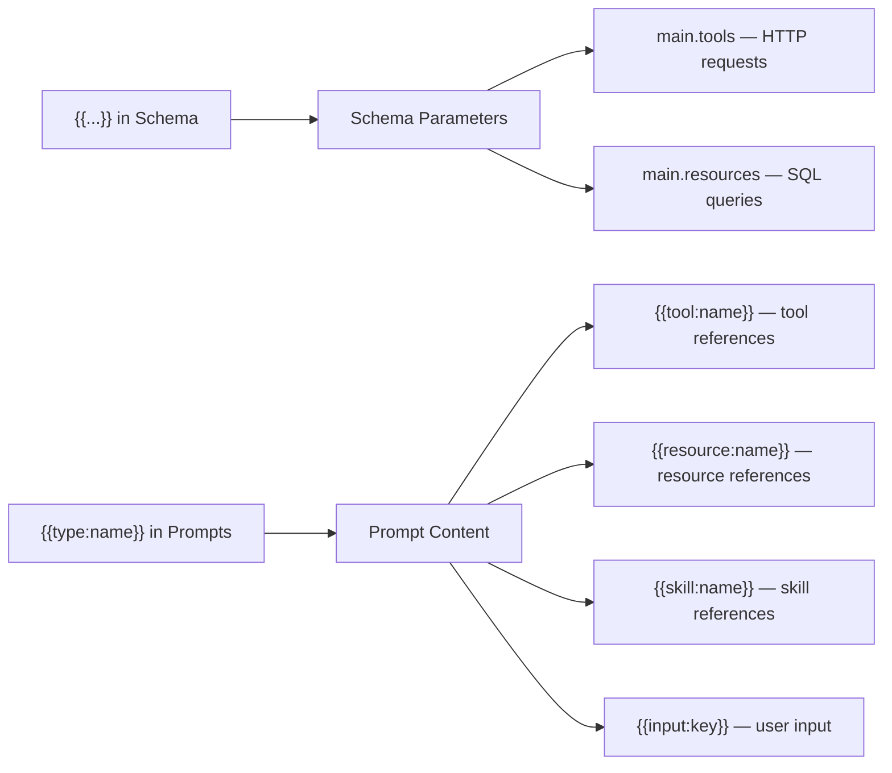

<aside class="edit-warning" role="note">
  <strong>Auto-generated:</strong> This file is auto-generated. Source: spec/v4.3.0/02-parameters.md.
</aside>

> Normative language (MUST/SHOULD/MAY) follows the conventions defined in [Conformance Language](/specification/overview/#conformance-language).

This document defines the parameter format for FlowMCP schema tools, resources, and skills. Each tool parameter describes where a value is placed in the API request (`position`) and how it is validated (`z`). Resource parameters use the same `position` + `z` system but without a `location` field. Skill input uses a simpler format.

---

## Parameter Structure

Each parameter is an object with two required blocks:

```javascript
{
    position: {
        key: 'address',
        value: '{{USER_PARAM}}',
        location: 'query'
    },
    z: {
        primitive: 'string()',
        options: [ 'min(42)', 'max(42)' ]
    }
}
```

- **`position`** defines where the value goes in the HTTP request.
- **`z`** defines how the value is validated before the request is made.

Both blocks are required. A parameter without `position` or `z` is invalid and rejected at load-time.

---

## Position Block

The `position` block controls where the parameter's value is placed in the constructed API request.

| Field | Type | Required | Description |
|-------|------|----------|-------------|
| `key` | `string` | Yes | Parameter name. For user-facing parameters, this is the input field name exposed to the AI client. |
| `value` | `string` | Yes | `{{USER_PARAM}}` for user input, `{{SERVER_PARAM:KEY_NAME}}` for server params, or a fixed string. |
| `location` | `string` | Yes | Where the value is placed: `insert`, `query`, or `body`. |

### Location Types

| Location | Description | URL Effect | Example |
|----------|-------------|------------|---------|
| `insert` | Inserted into the URL path at the `{{key}}` placeholder position | `root + path` with `{{key}}` replaced | `/api/v1/{{address}}/txs` becomes `/api/v1/0xABC.../txs` |
| `query` | Added as a URL query parameter | `?key=value` appended to the URL | `?address=0xABC...&module=contract` |
| `body` | Added to the JSON request body | `{ "key": "value" }` in the POST/PUT body | `{ "address": "0xABC..." }` |

### Location Rules

1. **`insert` parameters** require a matching `{{key}}` placeholder in the route's `path`. If no placeholder matches, the runtime raises a load-time error.

2. **`query` parameters** are appended to the URL in array order. Duplicate keys are allowed (for APIs that accept repeated query params like `?id=1&id=2`).

3. **`body` parameters** are only valid for `POST` and `PUT` routes. A `body` parameter on a `GET` or `DELETE` route causes a load-time validation error.

4. **Multiple locations** in the same route are valid. A route can have `insert`, `query`, and `body` parameters simultaneously (though `body` still requires `POST`/`PUT`).

### Value Types

| Value Pattern | Description | Visible to User |
|---------------|-------------|-----------------|
| `{{USER_PARAM}}` | Value provided by the user at call-time | Yes |
| `{{SERVER_PARAM:KEY_NAME}}` | Value injected from server environment | No |
| Any other string | Fixed value, sent automatically | No |

---

## Z Block (Validation)

The `z` block defines validation constraints that are enforced before the API request is made. The name `z` references Zod, the validation library used by the runtime.

| Field | Type | Required | Description |
|-------|------|----------|-------------|
| `primitive` | `string` | Yes | Base type declaration with optional inline values. |
| `options` | `string[]` | Yes | Array of validation constraints. Can be empty `[]`. |

### Primitive Types

| Primitive | Description | JS Equivalent | Example |
|-----------|-------------|---------------|---------|
| `string()` | Any string value | `z.string()` | `'string()'` |
| `number()` | Numeric value (integer or float) | `z.number()` | `'number()'` |
| `boolean()` | True or false | `z.boolean()` | `'boolean()'` |
| `enum(A,B,C)` | Exactly one of the listed values | `z.enum(['A','B','C'])` | `'enum(mainnet,testnet,devnet)'` |
| `array()` | Array of values | `z.array()` | `'array()'` |
| `object()` | Nested object | `z.object()` | `'object()'` |

#### Enum Specifics

Enum values are comma-separated inside the parentheses. No spaces around commas. Values are case-sensitive:

```javascript
// Valid
primitive: 'enum(GET,POST,PUT,DELETE)'
primitive: 'enum(mainnet,testnet)'
primitive: 'enum(1,5,137)'

// Invalid
primitive: 'enum(GET, POST)'    // no spaces after commas
primitive: 'enum()'             // at least one value required
```

### Validation Options

Options are applied in array order after the primitive type check.

| Option | Description | Applies To | Example |
|--------|-------------|------------|---------|
| `min(n)` | Minimum value (number) or minimum length (string) | `number`, `string` | `'min(1)'`, `'min(0)'` |
| `max(n)` | Maximum value (number) or maximum length (string) | `number`, `string` | `'max(100)'`, `'max(256)'` |
| `length(n)` | Exact length (string) or exact item count (array) | `string`, `array` | `'length(42)'` |
| `optional()` | Parameter is not required. Omitted parameters are excluded from the request. | all | `'optional()'` |
| `default(value)` | Default value used when the parameter is omitted. Implies `optional()`. | all | `'default(100)'`, `'default(desc)'` |

#### Option Rules

1. **`optional()` and `default()`** — A parameter with `default(value)` is implicitly optional. Specifying both `optional()` and `default()` is allowed but redundant.

2. **`min()` and `max()` semantics** — For `number()`, these constrain the numeric value. For `string()`, these constrain the string length. For other types, they are ignored.

3. **`length()` semantics** — For `string()`, this is character count. For `array()`, this is item count. For other types, it is ignored.

4. **Multiple options** — Options are combined with AND logic. `[ 'min(1)', 'max(100)' ]` means the value MUST be >= 1 AND <= 100.

> **Note:** Regular expressions are intentionally excluded from validation options. AI agents work poorly with regex patterns, and type-level validation combined with `min()`/`max()`/`length()` constraints covers the vast majority of use cases.

---

## Shared List Interpolation

When a parameter's enum values come from a shared list, use the `{{listName:fieldName}}` syntax inside the `enum()` primitive:

```javascript
{
    position: {
        key: 'chainName',
        value: '{{USER_PARAM}}',
        location: 'query'
    },
    z: {
        primitive: 'enum({{evmChains:etherscanAlias}})',
        options: []
    }
}
```

At load-time, the runtime resolves `{{evmChains:etherscanAlias}}` by:

1. Finding the shared list named `evmChains` (declared in `main.sharedLists`)
2. Applying any filter defined in the shared list reference
3. Extracting the `etherscanAlias` field from each entry
4. Replacing the interpolation placeholder with the comma-separated values

The result at runtime is equivalent to:

```javascript
primitive: 'enum(ETHEREUM_MAINNET,POLYGON_MAINNET,ARBITRUM_MAINNET,OPTIMISM_MAINNET)'
```

### Interpolation Rules

1. **`{{listName:fieldName}}` is only allowed inside `enum()`**. Using it in `string()`, `number()`, or any other primitive is a load-time error.

2. **The referenced list MUST be declared in `main.sharedLists`.** If a parameter references `{{evmChains:etherscanAlias}}` but `main.sharedLists` does not include an entry with `name: 'evmChains'`, the runtime rejects the schema.

3. **If the shared list reference has a `filter`, only matching entries are used.** A filter `{ field: 'hasEtherscan', value: true }` means only entries where `hasEtherscan === true` contribute values.

4. **The `fieldName` must exist in the list's `meta.fields`.** If the list does not define a field called `etherscanAlias`, the runtime raises a load-time error.

5. **Interpolation happens at load-time, not at call-time.** The enum values are resolved once when the schema is loaded. Shared list updates require a schema reload.

6. **Mixed static and interpolated values** are allowed:

    ```javascript
    primitive: 'enum(custom,{{evmChains:etherscanAlias}})'
    ```

    This prepends `custom` to the resolved list values.

---

## Fixed Parameters

Parameters with a fixed `value` (not `{{USER_PARAM}}` and not `{{SERVER_PARAM:...}}`) are invisible to the user. They are sent automatically with every request:

```javascript
{
    position: {
        key: 'module',
        value: 'contract',
        location: 'query'
    },
    z: {
        primitive: 'string()',
        options: []
    }
}
```

Fixed parameters are common for APIs that use query parameters for routing (like Etherscan's `module` and `action` parameters). They let a single `root` + `path` combination serve multiple routes differentiated by fixed query values.

### Fixed Parameter Rules

1. Fixed parameters are **not exposed to the AI client** in the tool's input schema.
2. The `z` block still applies — the fixed value MUST pass validation. This is checked at load-time.
3. Fixed parameters are processed in array order alongside user parameters.

---

## API Key Injection

API keys and other server-level secrets are injected via the `{{SERVER_PARAM:KEY_NAME}}` syntax:

```javascript
{
    position: {
        key: 'apikey',
        value: '{{SERVER_PARAM:ETHERSCAN_API_KEY}}',
        location: 'query'
    },
    z: {
        primitive: 'string()',
        options: []
    }
}
```

### Injection Rules

1. **The `KEY_NAME` must be declared in `main.requiredServerParams`.** If a parameter references `{{SERVER_PARAM:ETHERSCAN_API_KEY}}` but `requiredServerParams` does not include `'ETHERSCAN_API_KEY'`, the runtime raises a load-time error.

2. **Server parameters are invisible to the AI client.** They do not appear in the tool's input schema.

3. **The runtime resolves `{{SERVER_PARAM:KEY_NAME}}`** by reading the corresponding environment variable. If the variable is not set, the tool is not exposed (the schema loads but its tools are hidden).

4. **Server parameters are never logged.** The runtime MUST NOT include server parameter values in error messages, debug output, or response data.

---

## Parameter Ordering

Parameters are defined as an array, and the array order matters:

1. **`insert` parameters** are applied to the `path` template in array order. If a path has two placeholders (`/api/{{chainId}}/{{address}}`), the first `insert` parameter fills `{{chainId}}` and the second fills `{{address}}` — matched by `key`, not by position.

2. **`query` parameters** are appended to the URL in array order. While URL query parameter order is generally insignificant, consistent ordering aids debugging and cache behavior.

3. **`body` parameters** are assembled into a JSON object. Array order determines key order in the serialized JSON (though JSON key order is not semantically significant).

4. **Mixed locations** are processed in a single pass. The runtime iterates the array once, routing each parameter to its location.

---

## Prompt Placeholder Syntax

FlowMCP uses the `{{type:name}}` placeholder syntax for **prompt content** — it appears in skill content fields, Provider-Prompts, and Agent-Prompts to reference registered primitives and accept user input at runtime. The same `{{...}}` curly-brace syntax is used in schema parameters (see previous sections), but with different type prefixes that distinguish the two contexts.

In schema `main` blocks (`main.tools`, `main.resources`), the `{{...}}` syntax controls HTTP request construction and SQL parameter binding — using variants like `{{USER_PARAM}}`, `{{SERVER_PARAM:KEY}}`, and `{{listName:fieldName}}`. In prompt content, the `{{type:name}}` syntax references tools, resources, skills, and user input parameters.



The diagram shows that `{{...}}` in schema definitions uses `USER_PARAM`, `SERVER_PARAM`, and shared list interpolation variants, while `{{type:name}}` in prompt content uses typed prefixes (`tool:`, `resource:`, `skill:`, `input:`) to reference primitives and accept user input.

### Placeholder Types

The `type:` prefix determines what the placeholder references:

| Placeholder | Syntax | Resolves To | Example |
|-------------|--------|-------------|---------|
| Tool | `{{tool:name}}` | A tool in the same schema's `main.tools` | `{{tool:getContractAbi}}` |
| Resource | `{{resource:name}}` | A resource in the same schema's `main.resources` | `{{resource:chainList}}` |
| Skill | `{{skill:name}}` | Another skill registered in the current scope (`selection.skills`, `agent.skills`, or the active namespace's `providers/{ns}/skills/`). `main.skills` is forbidden in v4.0.0. | `{{skill:quick-check}}` |
| Input | `{{input:key}}` | An input parameter from the skill's `input` array | `{{input:address}}` |

### Tool References (`{{tool:name}}`)

A `{{tool:name}}` placeholder references a tool defined in the same schema's `main.tools`. The runtime resolves the reference and injects the tool's description or metadata into the rendered prompt content.

```
{{tool:getContractAbi}}           ← references a tool in the same schema
{{tool:getSourceCode}}            ← references another tool in the same schema
{{tool:simplePrice}}              ← references a tool by its camelCase name
```

When the runtime encounters a tool placeholder, it:

1. Looks up the tool name in the same schema's `main.tools`
2. Verifies the tool exists (validated at load time)
3. Injects the tool's description or metadata into the rendered content

### Input Parameters (`{{input:key}}`)

An `{{input:key}}` placeholder is a **user-input parameter**. The value is provided by the user when the prompt is invoked. Parameter keys follow camelCase conventions and MUST match an entry in the skill's `input` array.

```
{{input:chainId}}       ← user provides a chain identifier
{{input:address}}       ← user provides a contract address
{{input:token}}         ← user provides a token symbol
{{input:startDate}}     ← user provides a date
```

Parameters are runtime values — the prompt cannot render fully until the user supplies them. The MCP client collects parameter values and passes them to the runtime for substitution.

### Side-by-Side Comparison

```
Analyze the token {{input:token}} on chain {{input:chainId}}.

First, fetch the current price using {{tool:simplePrice}}.
Then retrieve the contract ABI via {{tool:getContractAbi}}.
Check the local data with {{resource:verifiedContracts}}.
```

In this example:
- `{{input:token}}` and `{{input:chainId}}` are **input parameters** — the user provides `"ETH"` and `"1"` at invocation
- `{{tool:simplePrice}}` and `{{tool:getContractAbi}}` are **tool references** — resolved to tools in the same schema
- `{{resource:verifiedContracts}}` is a **resource reference** — resolved to a resource in the same schema

### Composable References

Prompts can include content from other skills via `{{skill:name}}` placeholders and the `references[]` array. This enables prompt composition — one prompt can incorporate another prompt's content without duplication.

```javascript
{
    name: 'full-token-analysis',
    content: `
        Perform a complete token analysis for {{input:token}}.

        ## Price Data
        Use {{tool:simplePrice}} to fetch current pricing.

        ## On-Chain Metrics
        Use {{tool:getContractAbi}} to inspect the contract.

        ## Quick Summary
        For a brief version, follow {{skill:quick-summary}}.
    `,
    references: [
        'coingecko/prompt/price-guide',
        'etherscan/prompt/contract-patterns'
    ]
}
```

Referenced prompts are resolved by their ID using the ID Schema. The runtime loads each referenced prompt and makes its content available to the AI agent alongside the primary prompt. Referenced prompts are **not** inlined into the content — they are provided as additional context that the agent can draw from.

### Integration with Schema `{{...}}` Syntax

The two uses of `{{...}}` serve distinct layers:

| Aspect | Schema `{{...}}` | Prompt `{{type:name}}` |
|--------|------------------|------------------------|
| **Context** | Schema `main` blocks (`main.tools`, `main.resources`) | Prompt `content` fields |
| **Purpose** | HTTP request construction, SQL parameter binding, shared list interpolation | Tool/resource/skill references and user input in prompts |
| **Variants** | `{{USER_PARAM}}`, `{{SERVER_PARAM:KEY}}`, `{{listName:fieldName}}` | `{{tool:name}}`, `{{resource:name}}`, `{{skill:name}}`, `{{input:key}}` |
| **Resolution time** | Load-time (shared lists) or call-time (user/server params) | Prompt render time |
| **Appears in** | `position.value`, `z.primitive` | Skill and prompt `content` fields |

A schema author uses `{{USER_PARAM}}` and `{{SERVER_PARAM:KEY}}` when defining how a tool's parameters map to API requests. A prompt author uses `{{tool:name}}` and `{{input:key}}` when writing instructions that reference tools or accept user input.

### Validation Rules

| Code | Severity | Rule |
|------|----------|------|
| PH001 | error | `{{type:name}}` content MUST NOT be empty (e.g., `{{tool:}}` is invalid) |
| PH002 | error | Tool references (`{{tool:name}}`) must resolve to a tool in the same schema's `main.tools` |
| PH003 | error | Input parameter keys (`{{input:key}}`) must match `^[a-zA-Z][a-zA-Z0-9]*$` and exist in the skill's `input` array |
| PH004 | error | Prompt placeholders (`{{tool:...}}`, `{{resource:...}}`, `{{skill:...}}`, `{{input:...}}`) are only valid in prompt `content` fields, not in schema `main` blocks |
| VAL107 | error | When enum values correspond to a Shared List, `{{listName:alias}}` MUST be used. Hardcoded enum values that duplicate a Shared List are forbidden. |

#### Validation Examples

```
flowmcp validate prompt.mjs

  PH001 error   Empty placeholder {{tool:}} found at line 12
  PH003 error   Input parameter key "123abc" does not match ^[a-zA-Z][a-zA-Z0-9]*$

  2 errors, 0 warnings
```

```
flowmcp validate prompt.mjs

  PH002 error   Reference {{tool:nonExistent}} does not resolve to a registered tool

  1 error, 0 warnings
```

---

## Complete Examples

### Example 1: Simple Query Parameter with Length Validation

A parameter that accepts an Ethereum address and validates its length:

```javascript
{
    position: {
        key: 'contractAddress',
        value: '{{USER_PARAM}}',
        location: 'query'
    },
    z: {
        primitive: 'string()',
        options: [
            'min(42)',
            'max(42)'
        ]
    }
}
```

**Behavior:**
- The AI client sees an input field named `contractAddress` of type `string`.
- The user MUST provide a string of exactly 42 characters (e.g., `0x` followed by 40 hex characters).
- The value is appended as `?contractAddress=0x...` to the URL.
- If the length constraint fails, the runtime returns a validation error before making any HTTP request.

### Example 2: Enum Parameter with Shared List Interpolation

A parameter that lets the user select an EVM chain, with valid values pulled from a shared list:

```javascript
// In main.sharedLists:
// { name: 'evmChains', version: '1.0.0', filter: { field: 'hasEtherscan', value: true } }

{
    position: {
        key: 'chain',
        value: '{{USER_PARAM}}',
        location: 'query'
    },
    z: {
        primitive: 'enum({{evmChains:slug}})',
        options: [
            'default(ethereum)'
        ]
    }
}
```

**Behavior:**
- At load-time, `{{evmChains:slug}}` resolves to the `slug` field of all entries in the `evmChains` list where `hasEtherscan` is `true`.
- The effective primitive becomes something like `enum(ethereum,polygon,arbitrum,optimism,base)`.
- The AI client sees a dropdown/enum input with these chain names.
- If omitted, the default value `ethereum` is used.
- Invalid values (e.g. `solana`) are rejected with a validation error.

### Example 3: Body Parameter with Nested Object

A parameter for a POST endpoint that accepts a complex query object:

```javascript
// Route: method: 'POST', path: '/api/v1/query'

{
    position: {
        key: 'query',
        value: '{{USER_PARAM}}',
        location: 'body'
    },
    z: {
        primitive: 'object()',
        options: []
    }
}
```

Combined with fixed body parameters:

```javascript
// Full parameters array for the route
[
    {
        position: {
            key: 'version',
            value: '2',
            location: 'body'
        },
        z: {
            primitive: 'string()',
            options: []
        }
    },
    {
        position: {
            key: 'query',
            value: '{{USER_PARAM}}',
            location: 'body'
        },
        z: {
            primitive: 'object()',
            options: []
        }
    },
    {
        position: {
            key: 'limit',
            value: '{{USER_PARAM}}',
            location: 'body'
        },
        z: {
            primitive: 'number()',
            options: [
                'optional()',
                'default(100)',
                'min(1)',
                'max(1000)'
            ]
        }
    }
]
```

**Behavior:**
- The resulting request body is:
    ```json
    {
        "version": "2",
        "query": { "sql": "SELECT * FROM ..." },
        "limit": 100
    }
    ```
- `version` is fixed — the user never sees it.
- `query` is a user-provided object (the AI client passes it as JSON).
- `limit` is optional with a default of `100`, constrained between `1` and `1000`.
- Only `POST` and `PUT` tools can have `body` parameters.

---

## Parameter Visibility Summary

| Value Pattern | Visible to AI Client | Appears in Input Schema | Source |
|---------------|---------------------|------------------------|--------|
| `{{USER_PARAM}}` | Yes | Yes | User provides at call-time |
| `{{SERVER_PARAM:KEY}}` | No | No | Environment variable |
| Fixed string | No | No | Hardcoded in schema |

Only `{{USER_PARAM}}` parameters are exposed to the AI client. Fixed and server parameters are implementation details hidden from the tool consumer.

---

## Resource Parameters

Resource parameters use the same `position` + `z` system as tool parameters, with one key difference: **resource parameters have no `location` field**. Tool parameters need `location` (`query`, `body`, `insert`) because they are placed into HTTP requests. Resource parameters are bound to SQL `?` placeholders — their position is determined by array order, not by an HTTP request structure.

### Resource Parameter Structure

```javascript
{
    position: { key: 'symbol', value: '{{USER_PARAM}}' },
    z: { primitive: 'string()', options: [ 'min(1)' ] }
}
```

| Field | Type | Required | Description |
|-------|------|----------|-------------|
| `position.key` | `string` | Yes | Parameter name exposed to the AI client. |
| `position.value` | `string` | Yes | Must be `'{{USER_PARAM}}'` for user-provided values, or a fixed string. |
| `z.primitive` | `string` | Yes | Zod-based type declaration. Same primitives as tool parameters, except `array()` and `object()` are not supported. |
| `z.options` | `string[]` | Yes | Validation constraints. Same options as tool parameters. |

### Key Differences from Tool Parameters

| Aspect | Tool Parameters | Resource Parameters |
|--------|----------------|---------------------|
| `location` field | Required (`query`, `body`, `insert`) | Forbidden — no HTTP request |
| `{{SERVER_PARAM:...}}` | Supported | Not supported — no API keys needed |
| `array()` / `object()` | Supported | Not supported — SQL accepts scalars only |
| Binding order | Determined by `location` | Determined by array index (first param = first `?`) |

The number of parameters MUST match the number of `?` placeholders in the SQL statement. A mismatch is a validation error. See `13-resources.md` for the complete resource specification.

---

## Skill Input

Skills use a simpler input format than tool parameters. Skill input is an array of objects in the `skill.input` field of the `.mjs` skill file. Skill inputs are referenced in the skill's `content` via `{{input:key}}` placeholders.

### Skill Input Structure

```javascript
input: [
    { key: 'address', type: 'string', description: 'Ethereum contract address', required: true },
    { key: 'network', type: 'enum', description: 'Target network', required: true, values: [ 'ethereum', 'polygon' ] },
    { key: 'verbose', type: 'boolean', description: 'Include detailed breakdown', required: false }
]
```

### Skill Input Fields

| Field | Type | Required | Description |
|-------|------|----------|-------------|
| `key` | `string` | Yes | Parameter name. Must match `^[a-z][a-zA-Z0-9]*$` (camelCase). Referenced via `{{input:key}}` in content. |
| `type` | `string` | Yes | One of: `string`, `number`, `boolean`, `enum`. |
| `description` | `string` | Yes | What this parameter means. Must not be empty. |
| `required` | `boolean` | Yes | Whether the parameter is mandatory. |
| `values` | `string[]` | Conditional | Required when `type` is `enum`. Forbidden otherwise. |

### Key Differences from Tool and Resource Parameters

| Aspect | Tool Parameters | Resource Parameters | Skill Input |
|--------|----------------|---------------------|-------------|
| Format | `position` + `z` blocks | `position` + `z` blocks (no `location`) | `key` + `type` + `description` + `required` |
| Purpose | HTTP request construction | SQL parameter binding | AI agent context |
| Validation | Zod-based at runtime | Zod-based at runtime | Not runtime-validated (informational) |
| Types | Full Zod primitives | Scalar Zod primitives only | `string`, `number`, `boolean`, `enum` |
| Constraints | `min()`, `max()`, `length()`, `optional()`, `default()` | Same as tools | None (description only) |

See `14-skills.md` for the complete skill specification.

## Related

- **Depends on:** [00-overview.md](/specification/overview/), [01-schema-format.md](/specification/schema-format/)
- **Related:** [03-shared-lists.md](/specification/shared-lists/), [04-output-schema.md](/specification/output-schema/), [18-prefill.md](/specification/prefill/)

