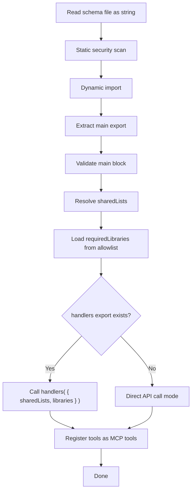

<aside class="edit-warning" role="note">
  <strong>Auto-generated:</strong> This file is auto-generated. Source: spec/v4.2.0/01-schema-format.md.
</aside>

> Normative language (MUST/SHOULD/MAY) follows the conventions defined in [Conformance Language](/specification/overview/#conformance-language).

This document defines the structure of a FlowMCP schema file, the two named exports (`main` and `handlers`), tool definitions, resource declarations, skill references, naming conventions, and constraints.

---

## Schema File Structure

A schema is a `.mjs` file with **two separate named exports**:

```javascript
// 1. Static, declarative, JSON-serializable — hashable without execution
export const main = {
    namespace: 'provider',
    name: 'SchemaName',
    description: 'What this schema does',
    version: '4.0.0',
    root: 'https://api.provider.com',
    tools: { /* ... */ },
    resources: { /* optional, see [13-resources](./13-resources.md) */ }
}

// 2. Factory function — receives injected dependencies, returns handler objects
export const handlers = ( { sharedLists, libraries } ) => ({
    routeName: {
        preRequest: async ( { struct, payload } ) => {
            return { struct, payload }
        },
        postRequest: async ( { response, struct, payload } ) => {
            return { response }
        }
    }
})
```

**`main`** is always required. It contains all declarative configuration — pure data, JSON-serializable, hashable for integrity verification without executing any code.

**`handlers`** is optional. It is a factory function that receives injected dependencies and returns handler objects for route-level pre- and post-processing. If a schema has no handlers, omit the export entirely:

```javascript
// Schema without handlers — only the main export
export const main = {
    namespace: 'coingecko',
    name: 'SimplePrice',
    description: 'Get current price of coins in any supported currency',
    version: '4.0.0',
    root: 'https://api.coingecko.com/api/v3',
    tools: { /* ... */ }
}
```

### Why Two Separate Exports

- **`main` can be hashed and validated without calling any function.** The runtime reads the static export, serializes it via `JSON.stringify()`, and computes its hash — no code execution required.
- **Handlers receive all dependencies through injection.** Schema files have zero `import` statements. The runtime resolves shared lists, loads approved libraries, and passes them into the `handlers()` factory function.
- **`requiredLibraries` declares what npm packages the schema needs.** The runtime loads them from a security allowlist and injects them — schemas never import packages directly.

---

## The `main` Export

All fields in `main` must be JSON-serializable. No functions, no dynamic values, no imports, no `Date` objects, no `undefined` values. The runtime serializes `main` via `JSON.stringify()` for hashing — anything that does not survive a `JSON.parse( JSON.stringify( main ) )` roundtrip is invalid.

### Required Fields

| Field | Type | Description |
|-------|------|-------------|
| `namespace` | `string` | Provider identifier, lowercase letters and hyphens (`/^[a-z][a-z0-9-]*$/`). Groups schemas by data source. |
| `name` | `string` | Human-readable schema name in PascalCase (e.g. `SmartContractExplorer`). |
| `description` | `string` | What this schema does, 1-2 sentences. Appears in tool discovery. |
| `version` | `string` | Must match pattern `4.\d+.\d+` (semver, major MUST be `4`). Version `3.\d+.\d+` is accepted during migration. **FlowMCP-Spec-Version** (frozen by Major). |
| `schemaVersion` | `string` | **NEW in v4.1.1.** Schema-Content-Version, must match pattern `\d+\.\d+\.\d+` (semver, free per schema). Bump rules defined in the grading specification. Initial value for migrated schemas: `1.0.0`. |
| `schemaHash` | `string` | **NEW in v4.1.1.** 8-character sha256-prefix (`[0-9a-f]{8}`) of canonical-JSON-serialised schema (excluding the `schemaHash` field itself). Used as stable identifier in `grading-data/schemas/<namespace>/<hash>--v<X.Y.Z>.mjs` snapshots. Automatically generated. |
| `root` | `string` | Base URL for all tools. Must start with `https://` (no trailing slash). Not required for resource-only schemas. |
| `tools` | `object` | Tool definitions. Keys are tool names in camelCase. Maximum 8 tools. May be empty `{}` if the schema defines resources or skills. |

#### Two Version Axes (v4.1.1+)

| Axis | Field | Range | Meaning |
|------|-------|-------|---------|
| Spec-Version | `version` | `4.\d+.\d+` (Major frozen) | FlowMCP-Spec-Version |
| Schema-Version | `schemaVersion` | `\d+.\d+.\d+` (semver, free) | Schema-Content-Version |

Example header (v4.1.1):

```javascript
export const main = {
    namespace: 'etherscan',
    name: 'GetContractEthereum',
    description: 'Fetch verified contract source by address',
    version: '4.0.0',
    schemaVersion: '1.0.0',
    schemaHash: 'a1b2c3d4',
    root: 'https://api.etherscan.io',
    tools: { /* ... */ }
}
```

### Optional Fields

| Field | Type | Default | Description |
|-------|------|---------|-------------|
| `docs` | `string[]` | `[]` | Documentation URLs for the API provider. Informational only. |
| `termsOfService` | `string \| null` | `null` | URL to the API provider's Terms of Services. **Informational only — FlowMCP does not classify or interpret ToS.** See `23-license-and-tos.md`. |
| `termsOfServiceCheckedAt` | `string \| null` | `null` | ISO-Date (YYYY-MM-DD) when `termsOfService` URL was last verified by FlowMCP authors. |
| `termsOfServiceLanguage` | `string \| null` | `null` | Two-letter language code of the ToS document (`'en'`, `'de'`, `'multi'`). |
| `dataLicense` | `string \| null` | `null` | URL to the data license of API responses (e.g. CC-BY, Public Domain), if separately published by provider. |
| `dataLicenseName` | `string \| null` | `null` | Human-readable name of the data license (e.g. `'CC-BY-SA-4.0'`, `'Public Domain'`). |
| `tags` | `string[]` | `[]` | Categorization tags for tool discovery (e.g. `['defi', 'tvl']`). |
| `requiredServerParams` | `string[]` | `[]` | Environment variable names needed at runtime (e.g. `['ETHERSCAN_API_KEY']`). |
| `requiredLibraries` | `string[]` | `[]` | npm packages needed by handlers. Must be on the runtime allowlist. See `05-security.md`. |
| `headers` | `object` | `{}` | Default HTTP headers applied to all routes. Route-level headers override these. |
| `sharedLists` | `object[]` | `[]` | Shared list references. See `03-shared-lists.md` for format. |
| `resources` | `object` | `{}` | Resource definitions. Keys are resource names in camelCase. Maximum 2 resources. See `13-resources.md`. |
| `meta` | `object` | — | **Required.** MCP integration metadata block for all tools. See `19-mcp-integration.md`. |

### Deprecated Fields

| Field | Status | Replacement | Notes |
|-------|--------|-------------|-------|
| `routes` | Deprecated in v3.0.0 | `tools` | Accepted as alias with deprecation warning. Will produce loud warning in v3.1.0 and error in v3.2.0. A schema defining BOTH `tools` and `routes` is a validation error. |

### Field Details

#### `namespace`

The namespace is the primary grouping mechanism. It identifies the API provider and is used in the fully qualified tool name (`namespace/schemaFile::routeName`). Lowercase ASCII letters, digits, and hyphens are allowed — no underscores or uppercase.

```javascript
// Valid
namespace: 'etherscan'
namespace: 'coingecko'
namespace: 'defillama'
namespace: 'coingecko-com'
namespace: 'etherscan-io'

// Invalid
namespace: 'CoinGecko'     // uppercase not allowed
namespace: 'web3_data'     // underscore not allowed
```

#### `root`

The base URL is prepended to every route's `path`. It must use HTTPS and MUST NOT end with a slash:

```javascript
// Valid
root: 'https://api.etherscan.io'
root: 'https://pro-api.coingecko.com/api/v3'

// Invalid
root: 'http://api.etherscan.io'     // must be HTTPS
root: 'https://api.etherscan.io/'   // no trailing slash
```

#### `requiredServerParams`

Declares environment variables that MUST be available at runtime. The runtime checks for their presence before exposing the schema's tools. Values are injected into parameters via the `{{SERVER_PARAM:KEY_NAME}}` syntax (see [02-parameters](./02-parameters.md)).

```javascript
requiredServerParams: [ 'ETHERSCAN_API_KEY' ]
```

#### `requiredLibraries`

Declares npm packages that handlers need. The runtime loads these from a security allowlist and injects them into the `handlers()` factory function. Schemas that declare unapproved libraries are rejected at load time.

```javascript
// Schema needs ethers.js for address checksumming
requiredLibraries: [ 'ethers' ]

// Schema needs no libraries
requiredLibraries: []
```

See `05-security.md` for the default allowlist and how to extend it.

#### `headers`

Default headers sent with every request from this schema. Common use cases include Accept headers or API versioning:

```javascript
headers: {
    'Accept': 'application/json',
    'X-API-Version': '2024-01'
}
```

#### `sharedLists`

References to shared lists that this schema uses. Each entry specifies the list reference, version, and optional filter:

```javascript
sharedLists: [
    {
        ref: 'evmChains',
        version: '1.0.0',
        filter: { key: 'etherscanAlias', exists: true }
    }
]
```

See `03-shared-lists.md` for the complete shared list specification.

---

## Tool Definition

Each key in `tools` is the tool name in camelCase. The tool name becomes part of the fully qualified MCP tool name.

```javascript
tools: {
    getContractAbi: {
        method: 'GET',
        path: '/api',
        description: 'Returns the ABI of a verified smart contract',
        parameters: [ /* see [02-parameters](./02-parameters.md) */ ],
        output: { /* see [04-output-schema](./04-output-schema.md) */ }
    },
    getSourceCode: {
        method: 'GET',
        path: '/api',
        description: 'Returns the source code of a verified smart contract',
        parameters: [ /* ... */ ]
    }
}
```

### Tool Fields

| Field | Type | Required | Description |
|-------|------|----------|-------------|
| `method` | `string` | Yes | HTTP method: `GET`, `POST`, `PUT`, `DELETE`. |
| `path` | `string` | Yes | URL path appended to `root`. May contain `{{key}}` placeholders for `insert` parameters. |
| `description` | `string` | Yes | What this tool does. Appears in tool description for the AI client. |
| `parameters` | `array` | Yes | Input parameter definitions. Can be empty `[]` for no-input tools. |
| `output` | `object` | No | Output schema declaring expected response shape. See `04-output-schema.md`. |
| `preload` | `object` | No | Cache configuration for static/slow-changing datasets. See `11-preload.md`. |
| `tests` | `array` | Yes | Executable test cases with real parameter values. At least 1 per tool. See `10-tests.md`. |

### Tool Field Details

#### `method`

Only four HTTP methods are supported. The method determines how parameters with `location: 'body'` are handled:

| Method | Body Allowed | Typical Use |
|--------|-------------|-------------|
| `GET` | No | Read operations, queries |
| `POST` | Yes | Create operations, complex queries |
| `PUT` | Yes | Update operations |
| `DELETE` | No | Delete operations |

If a `GET` or `DELETE` route has parameters with `location: 'body'`, the runtime raises a validation error at load-time.

#### `path`

The path is appended to `root` to form the complete URL. It may contain `{{key}}` placeholders that are replaced by `insert` parameters:

```javascript
// Static path
path: '/api'

// Path with insert placeholder
path: '/api/v1/{{address}}/transactions'

// Multiple placeholders
path: '/api/v1/{{chainId}}/address/{{address}}/balances'
```

Every `{{key}}` placeholder MUST have a corresponding parameter with `location: 'insert'`. The runtime validates this at load-time.

---

## The `handlers` Export

The `handlers` export is a factory function that receives injected dependencies and returns an object mapping tool names (and optionally resource names) to handler definitions:

```javascript
export const handlers = ( { sharedLists, libraries } ) => ({
    getContractAbi: {
        preRequest: async ( { struct, payload } ) => {
            const chain = sharedLists.evmChains
                .find( ( c ) => c.alias === payload.chainName )
            const updatedPayload = { ...payload, chainId: chain.chainId }

            return { struct, payload: updatedPayload }
        },
        postRequest: async ( { response, struct, payload } ) => {
            const { result } = response
            const parsed = JSON.parse( result )

            return { response: parsed }
        }
    }
})
```

### Injected Dependencies (Factory Parameters)

The runtime calls `handlers( { sharedLists, libraries } )` once at load time. The factory function receives:

| Parameter | Type | Description |
|-----------|------|-------------|
| `sharedLists` | `object` | Resolved shared list data, keyed by list name. Deep-frozen (read-only). Mutations throw a `TypeError`. |
| `libraries` | `object` | Loaded npm packages from `requiredLibraries`, keyed by package name. Only packages on the runtime allowlist are available. |

Example with both dependencies:

```javascript
export const main = {
    // ...
    requiredLibraries: [ 'ethers' ],
    sharedLists: [
        { ref: 'evmChains', version: '1.0.0', filter: { key: 'etherscanAlias', exists: true } }
    ],
    tools: { /* ... */ }
}

export const handlers = ( { sharedLists, libraries } ) => {
    const { ethers } = libraries

    return {
        getContractAbi: {
            preRequest: async ( { struct, payload } ) => {
                const checksummed = ethers.getAddress( payload.address )
                const chain = sharedLists.evmChains
                    .find( ( c ) => c.alias === payload.chainName )

                return { struct, payload: { ...payload, address: checksummed } }
            }
        }
    }
}
```

### Handler Types

| Handler | Purpose |
|---------|---------|
| `preRequest` | Transform request parameters before HTTP call |
| `executeRequest` | Replace standard HTTP fetch entirely |
| `postRequest` | Transform HTTP response after the call |

| Handler | When | Input | Must Return |
|---------|------|-------|-------------|
| `preRequest` | Before the API call | `{ struct, payload }` | `{ struct, payload }` |
| `executeRequest` | Replaces the HTTP call entirely | `{ struct, payload }` | `{ response }` |
| `postRequest` | After the API call (or after executeRequest) | `{ response, struct, payload }` | `{ response }` |

#### `executeRequest` Semantics

When `executeRequest` is defined for a tool, the runtime skips the standard HTTP fetch and calls the handler instead. The handler is responsible for producing a response. Common use cases include:

- **XML/TRIAS APIs** that cannot be parsed with the standard JSON pipeline
- **CSW/OGC endpoints** with non-standard response formats
- **SQLite-backed schemas** that resolve queries locally without HTTP
- **Composite calls** that MUST combine multiple upstream requests into one

```javascript
export const handlers = ( { sharedLists, libraries } ) => ({
    getXmlData: {
        executeRequest: async ( { struct, payload } ) => {
            const { xml2js } = libraries
            const rawResponse = await fetch( struct.url, { method: struct.method, headers: struct.headers } )
            const text = await rawResponse.text()
            const parsed = await xml2js.parseStringPromise( text )

            return { response: parsed }
        }
    }
})

### Handler Per-Call Parameters

Each handler invocation receives per-call data through its function parameters:

| Parameter | Type | Description |
|-----------|------|-------------|
| `struct` | `object` | The constructed URL, method, headers, and body. Mutable in `preRequest`. |
| `payload` | `object` | The user's validated input parameters as key-value pairs. |
| `response` | `object` | The parsed JSON response from the API. Only available in `postRequest`. |

Server parameters (`requiredServerParams`) are handled by the runtime during URL construction and are never exposed to handlers. The old `userParams` and `context` parameters are replaced by the factory function injection pattern.

### Handler Rules

1. **Handlers are optional.** Tools without handlers make direct API calls using the constructed URL and parameters. Most tools SHOULD NOT need handlers.

2. **Schema files MUST NOT contain import statements.** No `import`, no `require`, no dynamic `import()`. All dependencies are injected through the factory function. The security scanner rejects any schema containing import statements. See `05-security.md`.

3. **Handlers MUST NOT access restricted globals.** The following are forbidden: `fetch`, `fs`, `process`, `eval`, `Function`, `setTimeout`, `setInterval`, `XMLHttpRequest`, `WebSocket`. See `05-security.md` for the complete list.

4. **`sharedLists` provides resolved list data.** If a schema references shared lists in `main.sharedLists`, the resolved data is available inside the factory closure via `sharedLists['listName']` or `sharedLists.listName`. The data is deep-frozen — mutations throw.

5. **`libraries` provides approved npm packages.** If a schema declares `main.requiredLibraries`, the loaded modules are available inside the factory closure via `libraries['packageName']` or `libraries.packageName`.

6. **Handlers MUST be pure transformations.** They receive data, transform it, and return data. No side effects, no state mutations outside the return value, no logging.

7. **Return shape MUST match the handler type.** `preRequest` must return `{ struct, payload }`. `postRequest` must return `{ response }`. Missing keys cause a runtime error.

8. **Resource handlers are nested one level deeper.** Tool handlers are keyed by tool name, resource handlers are keyed by resource name then query name. See `13-resources.md` for details.

---

## Naming Conventions

| Element | Convention | Pattern | Example |
|---------|-----------|---------|---------|
| Namespace | Lowercase letters, digits, hyphens | `^[a-z][a-z0-9-]*$` | `etherscan`, `coingecko`, `coingecko-com` |
| Schema name | PascalCase | `^[A-Z][a-zA-Z0-9]*$` | `SmartContractExplorer` |
| Schema filename | PascalCase `.mjs` | `^[A-Z][a-zA-Z0-9]*\.mjs$` | `SmartContractExplorer.mjs` |
| Tool name | camelCase | `^[a-z][a-zA-Z0-9]*$` | `getContractAbi` |
| Resource name | camelCase | `^[a-z][a-zA-Z0-9]*$` | `tokenLookup` |
| Skill name | lowercase-hyphen | `^[a-z][a-z0-9-]{0,63}$` | `full-contract-audit` |
| Parameter key | camelCase | `^[a-z][a-zA-Z0-9]*$` | `contractAddress` |
| Shared list name | camelCase | `^[a-z][a-zA-Z0-9]*$` | `evmChains` |
| Tag | lowercase with hyphens | `^[a-z][a-z0-9-]*$` | `smart-contracts` |

---

## Constraints

| Constraint | Value | Rationale |
|------------|-------|-----------|
| Max tools per schema | 8 | Keeps schemas focused. Split large APIs into multiple schemas. |
| Max resources per schema | 2 | Keeps resource scope focused. See `13-resources.md`. |
| Version major | `4` | Must match `4.\d+.\d+`. Version `3.\d+.\d+` accepted during migration with warning. |
| `tools` + `routes` simultaneously | Forbidden | A schema MUST use `tools` or `routes`, never both. Using both is a validation error. |
| Namespace pattern | `^[a-z][a-z0-9-]*$` | Lowercase letters, digits, hyphens. No underscores or uppercase. |
| Tool name pattern | `^[a-z][a-zA-Z0-9]*$` | camelCase, starts with lowercase letter. |
| Root URL protocol | `https://` | HTTP is not allowed. All API calls go over TLS. |
| Root URL requirement | Conditional | Required when `tools` are defined. Optional for resource-only or skill-only schemas. |
| Root URL trailing slash | Forbidden | `root` MUST NOT end with `/`. |
| `main` export | JSON-serializable | Must survive `JSON.parse( JSON.stringify() )` roundtrip. |
| Schema file imports | Zero | Schema files MUST have no `import` statements. All dependencies are injected. |
| `requiredLibraries` | Allowlist only | Every entry MUST be on the runtime allowlist. See `05-security.md`. |

---

## Runtime Loading Sequence

The following diagram shows how the runtime loads a schema file, validates it, and registers its routes as MCP tools:



**Step-by-step:**

1. **Read file as string** — the raw source is read before any execution.
2. **Static security scan** — the string is scanned for forbidden patterns (`import`, `require`, `eval`, etc.). If any match, the file is rejected. See `05-security.md`.
3. **Dynamic import** — the file is imported via `import()`.
4. **Extract `main` export** — the named `main` export is read.
5. **Validate `main` block** — JSON-serializability, required fields, version format, namespace pattern, tool limits. If `main.routes` is found, it is treated as `main.tools` with a deprecation warning. If both `tools` and `routes` are present, the schema is rejected.
6. **Resolve `sharedLists`** — shared list references are resolved to data. Data is deep-frozen.
7. **Load `requiredLibraries`** — each library is checked against the allowlist and loaded via `import()`. Unapproved libraries reject the schema.
8. **Call `handlers()`** — if the `handlers` export exists, the factory function is called with `{ sharedLists, libraries }`. The returned handler objects are registered per tool (and per resource query, if applicable).
9. **Register tools** — each tool is exposed as an MCP tool. Tools with `executeRequest` handlers replace the HTTP call; tools with `preRequest`/`postRequest` handlers use pre/post processing; tools without handlers make direct API calls.

---

## Complete Example

A full schema for Etherscan with two tools, one handler using `sharedLists`, and no required libraries:

```javascript
export const main = {
    namespace: 'etherscan',
    name: 'SmartContractExplorer',
    description: 'Explore verified smart contracts on EVM-compatible chains via Etherscan APIs',
    version: '4.0.0',
    root: 'https://api.etherscan.io',
    docs: [
        'https://docs.etherscan.io/api-endpoints/contracts'
    ],
    tags: [ 'smart-contracts', 'evm', 'abi' ],
    requiredServerParams: [ 'ETHERSCAN_API_KEY' ],
    requiredLibraries: [],
    headers: {
        'Accept': 'application/json'
    },
    sharedLists: [
        {
            ref: 'evmChains',
            version: '1.0.0',
            filter: { key: 'etherscanAlias', exists: true }
        }
    ],
    tools: {
        getContractAbi: {
            method: 'GET',
            path: '/api',
            description: 'Returns the Contract ABI of a verified smart contract',
            parameters: [
                {
                    position: {
                        key: 'module',
                        value: 'contract',
                        location: 'query'
                    },
                    z: {
                        primitive: 'string()',
                        options: []
                    }
                },
                {
                    position: {
                        key: 'action',
                        value: 'getabi',
                        location: 'query'
                    },
                    z: {
                        primitive: 'string()',
                        options: []
                    }
                },
                {
                    position: {
                        key: 'address',
                        value: '{{USER_PARAM}}',
                        location: 'query'
                    },
                    z: {
                        primitive: 'string()',
                        options: [ 'min(42)', 'max(42)' ]
                    }
                },
                {
                    position: {
                        key: 'apikey',
                        value: '{{SERVER_PARAM:ETHERSCAN_API_KEY}}',
                        location: 'query'
                    },
                    z: {
                        primitive: 'string()',
                        options: []
                    }
                }
            ],
            output: {
                mimeType: 'application/json',
                schema: {
                    type: 'object',
                    properties: {
                        status: { type: 'string', description: 'API response status' },
                        message: { type: 'string', description: 'Status message' },
                        result: { type: 'string', description: 'Contract ABI as JSON string' }
                    }
                }
            }
        },
        getSourceCode: {
            method: 'GET',
            path: '/api',
            description: 'Returns the Solidity source code of a verified smart contract',
            parameters: [
                {
                    position: {
                        key: 'module',
                        value: 'contract',
                        location: 'query'
                    },
                    z: {
                        primitive: 'string()',
                        options: []
                    }
                },
                {
                    position: {
                        key: 'action',
                        value: 'getsourcecode',
                        location: 'query'
                    },
                    z: {
                        primitive: 'string()',
                        options: []
                    }
                },
                {
                    position: {
                        key: 'address',
                        value: '{{USER_PARAM}}',
                        location: 'query'
                    },
                    z: {
                        primitive: 'string()',
                        options: [ 'min(42)', 'max(42)' ]
                    }
                },
                {
                    position: {
                        key: 'apikey',
                        value: '{{SERVER_PARAM:ETHERSCAN_API_KEY}}',
                        location: 'query'
                    },
                    z: {
                        primitive: 'string()',
                        options: []
                    }
                }
            ]
        }
    }
}


export const handlers = ( { sharedLists } ) => ({
    getSourceCode: {
        postRequest: async ( { response, struct, payload } ) => {
            const { result } = response
            const [ first ] = result
            const { SourceCode, ABI, ContractName, CompilerVersion, OptimizationUsed } = first
            const simplified = {
                contractName: ContractName,
                compilerVersion: CompilerVersion,
                optimizationUsed: OptimizationUsed === '1',
                sourceCode: SourceCode,
                abi: ABI
            }

            return { response: simplified }
        }
    }
})
```

### What this example demonstrates

1. **Two separate exports** — `main` is a static data object, `handlers` is a factory function receiving `{ sharedLists }`.
2. **Two tools** (`getContractAbi`, `getSourceCode`) sharing the same `root` and `path` but differing by query parameters.
3. **Fixed parameters** (`module`, `action`) that are invisible to the user — they are sent automatically.
4. **User parameters** (`address`) with length validation for Ethereum addresses.
5. **Server parameters** (`apikey`) injected from the environment via `{{SERVER_PARAM:ETHERSCAN_API_KEY}}`.
6. **A shared list reference** (`evmChains`) filtered to chains that have an Etherscan alias.
7. **`requiredLibraries: []`** — this schema needs no external npm packages.
8. **A `postRequest` handler** on `getSourceCode` that flattens the nested API response into a cleaner object.
9. **No handler** on `getContractAbi` — the raw API response is returned directly.
10. **An output schema** on `getContractAbi` declaring the expected response shape.
11. **Zero import statements** — the schema file has no imports. Dependencies (`sharedLists`) are injected through the factory function.
